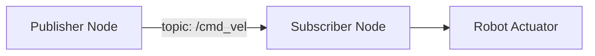
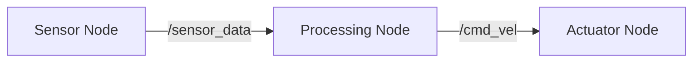

# Chapter Schema: Validation Contract

**Feature**: 002-textbook | **Date**: 2025-12-09
**Purpose**: Define validation rules for chapter markdown files to ensure consistency and quality

---

## Frontmatter Schema (YAML)

All chapters MUST include YAML frontmatter at the top of the file:

```yaml
---
title: string           # Required, 3-60 characters, chapter display name
sidebar_position: int   # Required, 1-21, unique across all chapters
---
```

### Validation Rules:
- `title`: Must not be empty, max 60 characters, should be descriptive (not "Chapter 1")
- `sidebar_position`: Must be integer 1-21, no duplicates across entire textbook
- Frontmatter must be first thing in file (no content before `---`)

---

## Section Structure (Markdown Headings)

Chapters MUST include these sections in order:

1. **Learning Objectives** (`## Learning Objectives`)
   - Bullet list, 3-5 items
   - Each starts with measurable action verb (implement, explain, configure, analyze, etc.)

2. **Prerequisites** (`## Prerequisites`)
   - Subsections: Knowledge Prerequisites, Software Prerequisites, Hardware Prerequisites (if applicable)
   - Links to prior chapters using absolute paths (`/docs/module-1-ros2/...`)
   - Software versions explicitly stated (ROS 2 Humble, Python 3.10+)

3. **Introduction** (`## Introduction`)
   - 2-3 paragraphs
   - Includes at least one analogy or real-world example
   - Sets context for why topic matters

4. **Theory** (`## Theory`)
   - 1+ subsections (`### Concept Name`)
   - Each concept explained with analogy
   - At least one Mermaid diagram embedded in this section

5. **Code Examples** (`## Code Examples`)
   - 1+ subsections (`### Example N: [Description]`)
   - Each contains:
     - Python code block (```python ... ```)
     - **Expected Output** immediately after code block

6. **Exercises** (`## Exercises`)
   - Numbered list, 2-3 items
   - Each has clear success criteria ("Expected output: ...")

7. **Summary** (`## Summary`)
   - 2-3 sentences recapping key learnings

8. **Next Steps** (`## Next Steps`) - Optional
   - Link to next chapter with preview

### Validation Rules:
- All sections except "Next Steps" are mandatory
- Sections must appear in specified order
- Headings must use exact capitalization and spelling
- No content before first `##` heading (after frontmatter)

---

## Content Validation Rules

### Word Count
- **Target**: 2000-3000 words
- **Exclusions**: Code blocks, YAML frontmatter, "Expected Output" sections, Mermaid syntax
- **Measurement**: Count only body text (paragraphs, bullet lists, headings)

### Learning Objectives
- **Count**: 3-5 items
- **Format**: Bullet list with `-` or `*`
- **Verb requirement**: First word must be action verb (implement, explain, configure, analyze, design, build, test, debug, deploy, etc.)
- **Specificity**: Must reference chapter topic (not generic "Learn about X")

**Valid Examples**:
- ✅ "Implement a ROS 2 publisher node using rclpy"
- ✅ "Explain the difference between topics and services in ROS 2"
- ✅ "Configure Gazebo physics parameters for realistic simulation"

**Invalid Examples**:
- ❌ "Learn about ROS 2 nodes" (not measurable verb)
- ❌ "Understand topics" (too vague, no specifics)
- ❌ "X" (not a complete sentence)

### Prerequisites
- **Knowledge**: Links must use `/docs/...` absolute paths, link text must match chapter title
- **Software**: Must include OS (Ubuntu 22.04), ROS version (Humble), Python version (3.10+)
- **Hardware**: Only if chapter requires specific hardware (NVIDIA GPU, etc.)
- **Verification**: Must include command learner can run to test setup

**Example**:
```markdown
## Prerequisites

### Knowledge Prerequisites
- [Chapter 2: ROS 2 Topics and Publishers/Subscribers](/docs/module-1-ros2/chapter-2-topics-pubsub)
- Basic Python (variables, functions, classes)

### Software Prerequisites
- **Operating System**: Ubuntu 22.04 LTS
- **ROS 2**: Humble Hawksbill
- **Python**: 3.10+
- **Packages**: `sudo apt install ros-humble-rclpy`

### Installation Verification
\`\`\`bash
python3 -c "import rclpy; print('ROS 2 ready!')"
\`\`\`
Expected output: `ROS 2 ready!`
```

### Code Examples
- **Language**: All code blocks must specify language (```python, not generic ```)
- **Completeness**: Code must be runnable as-is (includes imports, initialization, `if __name__ == '__main__':`)
- **PEP 8**: Must pass `black --check` and `flake8`
- **Line length**: Max 88 characters (black default)
- **Expected Output**: Required after every code block, either:
  - Terminal output in code block: ````Expected Output:\n```\n[output]\n```````
  - Or description: `Expected Output: Gazebo window opens showing robot with LiDAR`

### Mermaid Diagrams
- **Count**: At least 1 per chapter
- **Syntax**: Must be valid Mermaid (validates during Docusaurus build)
- **Placement**: Embedded in ```mermaid code fence
- **Complexity**: Max 12 nodes/participants (keep simple)
- **Alt text**: Use `%%{title: "Description"}%%` for accessibility

**Valid Diagram Types**:
- `graph LR` or `graph TD` - Flowcharts
- `sequenceDiagram` - Sequence diagrams
- `stateDiagram-v2` - State machines
- `classDiagram` - Class/entity relationships

**Example**:
````markdown

````

### Exercises
- **Count**: 2-3 items
- **Format**: Numbered list (1. , 2. , 3. )
- **Title**: Bold title followed by colon (`**Exercise 1: Modify Publisher**:`)
- **Instructions**: Clear, actionable steps
- **Success Criteria**: Must include "Expected output: ..." or "Success criteria: ..."

**Example**:
```markdown
## Exercises

1. **Modify Publisher Rate**: Change the MinimalPublisher to send messages every 0.5 seconds instead of 1.0 seconds. Expected output: Messages appear twice as fast in terminal.

2. **Add Counter Reset**: Modify the publisher to reset the counter to 0 every 10 messages. Success criteria: Console shows "Hello World: 0" after every 10 messages.
```

---

## File Naming Convention

Chapters MUST follow naming pattern: `module-{X}-{theme}/chapter-{Y}-{topic}.md`

- `{X}`: Module number (1, 2, 3, or 4)
- `{theme}`: Module theme (`ros2`, `simulation`, `isaac`, `vla`)
- `{Y}`: Chapter number within module (1, 2, 3, 4, or 5)
- `{topic}`: Kebab-case topic name (e.g., `nodes-architecture`, `topics-pubsub`)

**Valid Examples**:
- ✅ `module-1-ros2/chapter-1-nodes-architecture.md`
- ✅ `module-2-simulation/chapter-3-imu-integration.md`
- ✅ `module-4-vla/chapter-5-capstone-integration.md`

**Invalid Examples**:
- ❌ `chapter1.md` (no module directory)
- ❌ `Module_1/Chapter 1.md` (wrong casing, spaces)
- ❌ `ros2-nodes.md` (missing module-X prefix)

**Special Case: Introduction**:
- Filename: `intro.md` (in root `/docs/`)
- No module directory (standalone chapter)

---

## Automated Validation Checklist

Use this checklist for automated validation (CI/CD):

### Frontmatter Checks
- [ ] File starts with `---`
- [ ] Contains `title` field (3-60 chars)
- [ ] Contains `sidebar_position` field (1-21, unique)
- [ ] Frontmatter ends with `---`

### Section Checks
- [ ] Contains `## Learning Objectives`
- [ ] Contains `## Prerequisites`
- [ ] Contains `## Introduction`
- [ ] Contains `## Theory`
- [ ] Contains `## Code Examples`
- [ ] Contains `## Exercises`
- [ ] Contains `## Summary`
- [ ] Sections appear in correct order

### Content Checks
- [ ] Word count 2000-3000 (excluding code/frontmatter/output)
- [ ] Learning objectives: 3-5 items, start with action verbs
- [ ] Prerequisites: Include OS, ROS version, Python version
- [ ] Code examples: 1+, all have ```python language tag
- [ ] Expected output: Follows every code block
- [ ] Mermaid diagrams: 1+, valid syntax
- [ ] Exercises: 2-3 items, have success criteria

### Quality Checks
- [ ] No broken links (all `/docs/...` links point to existing files)
- [ ] All code blocks pass PEP 8 (black + flake8)
- [ ] Mermaid diagrams render without errors (Docusaurus build)
- [ ] Filename matches pattern `module-X-theme/chapter-Y-topic.md`

### Execution Checks (Docker Validation)
- [ ] All code examples execute without errors in Ubuntu 22.04 + ROS 2 Humble
- [ ] Actual output matches expected output (fuzzy match for timestamps/PIDs)
- [ ] Code completes within 30 seconds

---

## Non-Compliance Handling

### Warning (build succeeds, but flag for review):
- Word count 1-1999 or 3001-3200 (close to target)
- Only 2 learning objectives (minimum is 3)
- Code example >30 seconds but <60 seconds (slow but acceptable)

### Error (build fails, must fix):
- Missing mandatory section
- Word count <1 or >3200
- <2 learning objectives or >5
- Code examples fail to execute
- Mermaid syntax errors
- Broken internal links
- Duplicate `sidebar_position` values

---

## Example Valid Chapter (Minimal)

```markdown
---
title: "ROS 2 Nodes and Architecture"
sidebar_position: 2
---

# ROS 2 Nodes and Architecture

## Learning Objectives

- Explain the purpose of ROS 2 nodes in distributed robotics systems
- Implement a minimal ROS 2 node using rclpy
- Configure node parameters for runtime behavior modification

## Prerequisites

### Knowledge Prerequisites
- Basic Python (variables, functions, classes)

### Software Prerequisites
- **Operating System**: Ubuntu 22.04 LTS
- **ROS 2**: Humble Hawksbill
- **Python**: 3.10+

## Introduction

Think of a ROS 2 node like a worker in a factory. Each worker (node) has a specific job, and they communicate by passing messages on conveyor belts (topics). This chapter explores how to create and manage these "workers" in your robotic system.

## Theory

### What is a ROS 2 Node?

A node is a process that performs computation. Robots control many sensors and actuators; ROS 2 allows you to organize code into nodes that each handle specific tasks.



## Code Examples

### Example 1: Minimal ROS 2 Node

```python
import rclpy
from rclpy.node import Node

class MinimalNode(Node):
    def __init__(self):
        super().__init__('minimal_node')
        self.get_logger().info('Node started!')

def main(args=None):
    rclpy.init(args=args)
    node = MinimalNode()
    rclpy.spin(node)
    node.destroy_node()
    rclpy.shutdown()

if __name__ == '__main__':
    main()
```

**Expected Output**:
```
[INFO] [minimal_node]: Node started!
```

## Exercises

1. **Modify Node Name**: Change the node name from 'minimal_node' to 'my_first_node'. Expected output: Log message shows "[INFO] [my_first_node]: ..."

2. **Add Timer Callback**: Create a timer that prints "Hello" every second. Success criteria: Terminal shows "Hello" message every 1 second.

## Summary

ROS 2 nodes are the building blocks of robotic systems. Each node is a process that can communicate with other nodes via topics, services, and actions.

## Next Steps

[Chapter 2: ROS 2 Topics and Publishers/Subscribers](/docs/module-1-ros2/chapter-2-topics-pubsub) - Learn how nodes communicate asynchronously.
```

This chapter validates against all schema rules and represents the minimum viable structure.
