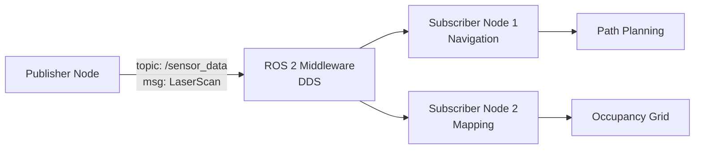

# Quickstart Guide: Creating Textbook Chapters

**Feature**: 002-textbook | **Date**: 2025-12-09
**Purpose**: Step-by-step guide for creating chapters that comply with the textbook schema

---

## Overview

This guide shows how to create a chapter for the "Physical AI & Humanoid Robotics" textbook. All 21 chapters must follow this template structure to ensure consistency and quality.

**Quick Stats**:
- **Word Count Target**: 2000-3000 words (excluding code blocks, frontmatter, expected output)
- **Code Examples**: 1+ complete Python examples with expected output
- **Mermaid Diagrams**: 1+ diagrams (flowchart, sequence, state, or class)
- **Learning Objectives**: 3-5 items starting with measurable action verbs
- **Exercises**: 2-3 items with clear success criteria

---

## Chapter Template

Copy this template to create a new chapter. Replace all `[PLACEHOLDER]` sections with actual content.

```markdown
---
title: "[Chapter Title - 3 to 60 characters]"
sidebar_position: [1-21, unique number]
---

# [Chapter Title]

## Learning Objectives

- [Action verb] [specific skill/concept related to chapter topic]
- [Action verb] [specific skill/concept related to chapter topic]
- [Action verb] [specific skill/concept related to chapter topic]
- [Optional: 4th objective]
- [Optional: 5th objective]

**Valid action verbs**: implement, explain, configure, analyze, design, build, test, debug, deploy, integrate, evaluate, compare, demonstrate, create, modify, troubleshoot

## Prerequisites

### Knowledge Prerequisites
- [Link to prior chapter: `/docs/module-X-topic/chapter-Y-title`]
- [Basic concept: e.g., "Basic Python (variables, functions, classes)"]

### Software Prerequisites
- **Operating System**: Ubuntu 22.04 LTS (physical, VM, or WSL2)
- **ROS 2**: Humble Hawksbill ([installation guide](https://docs.ros.org/en/humble/Installation.html))
- **Python**: 3.10+ (ships with Ubuntu 22.04)
- **Packages**: `sudo apt install [package-name]`

### Hardware Prerequisites
[Only include if chapter requires specific hardware]
- **For Module 3 (Isaac Sim)**: NVIDIA GPU with CUDA 11.8+ support
- **For Module 2 (Gazebo)**: Discrete GPU recommended

### Installation Verification
Run this command to verify setup:
```bash
[command to test installation]
```

Expected output: `[exact output text]`

## Introduction

[2-3 paragraphs setting context]

[Paragraph 1: Start with an analogy or real-world example connecting the technical concept to familiar systems]

[Paragraph 2: Explain why this topic matters in Physical AI and robotics applications]

[Paragraph 3 (optional): Preview what learners will build/understand by the end]

## Theory

### [Concept 1]

[Explanation paragraph 1: Define the concept clearly]

[Explanation paragraph 2: Include a practical analogy comparing to physical/familiar systems]

[Insert Mermaid diagram here - see examples below]

### [Concept 2]

[Repeat structure for additional concepts]

## Code Examples

### Example 1: [Brief Descriptive Title]

[1-2 sentences explaining what this code demonstrates]

```python
# Complete, runnable Python code
# Must include all imports, initialization, and execution
import rclpy
from rclpy.node import Node

class ExampleNode(Node):
    def __init__(self):
        super().__init__('example_node')
        # Implementation

def main(args=None):
    rclpy.init(args=args)
    node = ExampleNode()
    rclpy.spin(node)
    node.destroy_node()
    rclpy.shutdown()

if __name__ == '__main__':
    main()
```

**Expected Output**:
```
[Exact terminal output or description of visual result]
```

### Example 2: [Brief Descriptive Title] (if applicable)

[Additional code example following same structure]

## Exercises

1. **[Exercise Title]**: [Clear instructions]. Expected output: [description] or Success criteria: [measurable outcome]

2. **[Exercise Title]**: [Clear instructions]. Expected output: [description] or Success criteria: [measurable outcome]

3. **[Exercise Title - Optional]**: [Clear instructions]. Expected output: [description] or Success criteria: [measurable outcome]

## Summary

[2-3 sentences recapping the key learnings from this chapter]

## Next Steps

[Link to next chapter: `/docs/module-X-topic/chapter-Y-title`] - [Brief preview of next topic]
```

---

## Sample Chapter: ROS 2 Minimal Publisher

This is a complete example chapter demonstrating all required sections:

```markdown
---
title: "ROS 2 Topics and Publishers"
sidebar_position: 3
---

# ROS 2 Topics and Publishers

## Learning Objectives

- Explain the publish-subscribe pattern in ROS 2 distributed systems
- Implement a minimal publisher node using rclpy
- Configure topic names and message types for robot communication

## Prerequisites

### Knowledge Prerequisites
- [Chapter 1: ROS 2 Nodes and Architecture](/docs/module-1-ros2/chapter-1-nodes-architecture)
- Basic Python (variables, functions, classes)

### Software Prerequisites
- **Operating System**: Ubuntu 22.04 LTS
- **ROS 2**: Humble Hawksbill
- **Python**: 3.10+
- **Packages**: `sudo apt install ros-humble-rclpy ros-humble-std-msgs`

### Installation Verification
Run this command to verify setup:
```bash
source /opt/ros/humble/setup.bash && python3 -c "import rclpy; from std_msgs.msg import String; print('ROS 2 ready!')"
```

Expected output: `ROS 2 ready!`

## Introduction

Imagine a radio station broadcasting music to thousands of listeners. The station (publisher) sends audio signals over a specific frequency (topic), and anyone with a radio tuned to that frequency (subscribers) can listen. They don't need to know each other's identities—the radio waves carry the message to all listeners simultaneously.

ROS 2 topics work the same way. A publisher node broadcasts messages on a named topic, and any number of subscriber nodes can listen. This decoupling allows robot components to communicate without tight dependencies, making systems modular and scalable.

In this chapter, you'll create a publisher node that broadcasts messages, just like that radio station. By the end, you'll understand how robots coordinate sensor data, control commands, and status updates across distributed processes.

## Theory

### The Publish-Subscribe Pattern

ROS 2 uses the publish-subscribe pattern for asynchronous communication. Unlike direct function calls where a caller waits for a response, publishers send messages without knowing who (or if anyone) is listening.

**Key characteristics**:
- **Decoupling**: Publishers and subscribers don't need references to each other
- **Many-to-many**: One topic can have multiple publishers and multiple subscribers
- **Asynchronous**: Publishers send messages and continue executing; no blocking
- **Topic names**: Namespaced strings like `/sensor_data` or `/cmd_vel`



This diagram shows how one publisher (a LiDAR sensor) broadcasts data to multiple subscribers. The ROS 2 middleware (DDS) handles message routing automatically.

### Message Types

Every topic has a message type defining its data structure. ROS 2 includes standard types in the `std_msgs`, `geometry_msgs`, and `sensor_msgs` packages.

**Common message types**:
- `std_msgs/String`: Simple text messages
- `geometry_msgs/Twist`: Velocity commands (linear and angular)
- `sensor_msgs/LaserScan`: LiDAR distance measurements

Message types ensure publishers and subscribers agree on data format, preventing mismatched communication.

## Code Examples

### Example 1: Minimal Publisher

This example creates a publisher that sends incrementing messages every second:

```python
import rclpy
from rclpy.node import Node
from std_msgs.msg import String


class MinimalPublisher(Node):
    def __init__(self):
        super().__init__('minimal_publisher')
        self.publisher_ = self.create_publisher(String, 'topic', 10)
        self.timer = self.create_timer(1.0, self.timer_callback)
        self.count = 0

    def timer_callback(self):
        msg = String()
        msg.data = f'Hello World: {self.count}'
        self.publisher_.publish(msg)
        self.get_logger().info(f'Publishing: "{msg.data}"')
        self.count += 1


def main(args=None):
    rclpy.init(args=args)
    node = MinimalPublisher()
    try:
        rclpy.spin(node)
    except KeyboardInterrupt:
        pass
    finally:
        node.destroy_node()
        rclpy.shutdown()


if __name__ == '__main__':
    main()
```

**Expected Output**:
```
[INFO] [1638360123.456789] [minimal_publisher]: Publishing: "Hello World: 0"
[INFO] [1638360124.456789] [minimal_publisher]: Publishing: "Hello World: 1"
[INFO] [1638360125.456789] [minimal_publisher]: Publishing: "Hello World: 2"
^C
```

**Key components**:
- `create_publisher(String, 'topic', 10)`: Creates publisher for String messages on topic named 'topic', queue size 10
- `create_timer(1.0, callback)`: Calls `timer_callback` every 1.0 seconds
- `publish(msg)`: Sends message to all subscribers on this topic

## Exercises

1. **Modify Publisher Rate**: Change the MinimalPublisher to send messages every 0.5 seconds instead of 1.0 seconds. Expected output: Messages appear twice as fast in terminal (2 messages per second).

2. **Custom Message Content**: Modify the publisher to send your robot's name instead of "Hello World". Success criteria: Terminal shows "[INFO] [minimal_publisher]: Publishing: 'My Robot: 0'".

3. **Add Counter Reset**: Modify the publisher to reset the counter to 0 every 10 messages. Expected output: Console shows "Hello World: 0" after every 10 messages (at count 10, reset to 0).

## Summary

ROS 2 topics enable asynchronous, decoupled communication using the publish-subscribe pattern. Publishers broadcast messages on named topics without knowing their subscribers. This architecture allows modular robot systems where components communicate via well-defined message types. You've now created a publisher node that sends messages at regular intervals—the foundation for sensor data streaming and command broadcasting in robotics.

## Next Steps

[Chapter 4: ROS 2 Subscribers and Message Handling](/docs/module-1-ros2/chapter-4-subscribers) - Learn how to receive and process messages from publishers.
```

---

## Mermaid Diagram Examples

### 1. Flowchart (ROS 2 Node Communication)

Use for showing data flow, node topology, and pub/sub relationships:

```markdown
\`\`\`mermaid
%%{title: "ROS 2 Navigation Pipeline"}%%
graph LR
    A[LiDAR Sensor] -->|/scan| B[Costmap Generator]
    C[IMU Sensor] -->|/imu| B
    B -->|/costmap| D[Path Planner]
    D -->|/cmd_vel| E[Motor Controller]
    E --> F[Robot Wheels]
\`\`\`
```

### 2. Sequence Diagram (Service Calls & Timing)

Use for showing request-response patterns and temporal ordering:

```markdown
\`\`\`mermaid
%%{title: "ROS 2 Service Call Sequence"}%%
sequenceDiagram
    participant Client as Navigation Client
    participant Service as Add Two Ints Service
    Client->>Service: Request (a=5, b=3)
    Service->>Service: Compute sum
    Service-->>Client: Response (sum=8)
    Client->>Client: Use result in path planning
\`\`\`
```

### 3. State Diagram (Robot Behaviors)

Use for finite state machines, navigation modes, and behavior trees:

```markdown
\`\`\`mermaid
%%{title: "Robot Navigation State Machine"}%%
stateDiagram-v2
    [*] --> Idle
    Idle --> Navigating: Receive goal
    Navigating --> ObstacleDetected: LiDAR detects obstacle
    ObstacleDetected --> Navigating: Path clear
    ObstacleDetected --> Idle: Goal unreachable
    Navigating --> GoalReached: Position within threshold
    GoalReached --> Idle: Report success
\`\`\`
```

### 4. Class Diagram (URDF & Data Structures)

Use for showing entity relationships, robot descriptions, and message hierarchies:

```markdown
\`\`\`mermaid
%%{title: "URDF Robot Description Structure"}%%
classDiagram
    Robot "1" --> "*" Link: contains
    Robot "1" --> "*" Joint: contains
    Link: +string name
    Link: +Geometry visual
    Link: +Geometry collision
    Link: +Inertial inertia
    Joint: +string name
    Joint: +string type
    Joint: +Link parent
    Joint: +Link child
    Joint: +Axis axis
\`\`\`
```

**Best Practices**:
- Keep diagrams simple (max 10-12 nodes)
- Use clear, descriptive labels (avoid abbreviations)
- Add title with `%%{title: "Description"}%%` for accessibility
- Test during Docusaurus build (syntax errors will fail build)

---

## Code Validation Workflow

### Local Validation (Before Committing)

1. **Format with Black**:
```bash
# Extract Python code from chapter markdown
grep -A 999 '```python' chapter.md | grep -B 999 '```' | tail -n +2 | head -n -1 > code.py

# Format code (88 char line length)
black code.py

# Copy formatted code back to markdown manually
```

2. **Lint with Flake8**:
```bash
flake8 code.py
# Exit code 0 = pass, nonzero = violations
```

3. **Test Execution**:
```bash
# Source ROS 2 environment
source /opt/ros/humble/setup.bash

# Run extracted code
python3 code.py

# Verify output matches "Expected Output" section
```

### Docker Validation (CI/CD)

Create `.docker/textbook-validator/Dockerfile`:
```dockerfile
FROM ros:humble-ros-base-jammy

# Install Python dependencies
RUN apt-get update && apt-get install -y \
    python3-pip \
    python3-flake8 \
    && rm -rf /var/lib/apt/lists/*

RUN pip3 install black

# Copy validation script
COPY validate-chapter.sh /usr/local/bin/
RUN chmod +x /usr/local/bin/validate-chapter.sh

WORKDIR /workspace
```

Create `.docker/textbook-validator/validate-chapter.sh`:
```bash
#!/bin/bash
set -e

CHAPTER_FILE=$1

# Extract Python code blocks
grep -A 999 '```python' "$CHAPTER_FILE" | grep -B 999 '```' | tail -n +2 | head -n -1 > code.py

# Format check (don't modify, just verify)
black --check code.py
if [ $? -ne 0 ]; then
    echo "❌ Code formatting failed PEP 8 (black)"
    exit 1
fi

# Lint check
flake8 code.py
if [ $? -ne 0 ]; then
    echo "❌ Code linting failed (flake8)"
    exit 1
fi

# Execute code
source /opt/ros/humble/setup.bash
timeout 30s python3 code.py > output.txt 2>&1

echo "✅ Chapter validation passed"
```

**Run validation**:
```bash
docker build -t textbook-validator .docker/textbook-validator/
docker run --rm -v $(pwd):/workspace textbook-validator validate-chapter.sh docs/module-1-ros2/chapter-1.md
```

---

## Docusaurus Sidebar Configuration

Edit `website/sidebars.ts` to add textbook navigation:

```typescript
import type {SidebarsConfig} from '@docusaurus/plugin-content-docs';

const sidebars: SidebarsConfig = {
  textbookSidebar: [
    {
      type: 'doc',
      id: 'intro',
      label: 'Introduction',
    },
    {
      type: 'category',
      label: 'Module 1: The Robotic Nervous System (ROS 2)',
      collapsible: true,
      collapsed: false,
      items: [
        'module-1-ros2/chapter-1-nodes-architecture',
        'module-1-ros2/chapter-2-topics-pubsub',
        'module-1-ros2/chapter-3-services-clients',
        'module-1-ros2/chapter-4-rclpy-python-client',
        'module-1-ros2/chapter-5-urdf-robot-description',
      ],
    },
    {
      type: 'category',
      label: 'Module 2: The Digital Twin (Gazebo & Unity)',
      collapsible: true,
      collapsed: true,
      items: [
        'module-2-simulation/chapter-1-gazebo-physics-basics',
        'module-2-simulation/chapter-2-lidar-integration',
        'module-2-simulation/chapter-3-imu-integration',
        'module-2-simulation/chapter-4-depth-camera',
        'module-2-simulation/chapter-5-unity-environment',
      ],
    },
    {
      type: 'category',
      label: 'Module 3: The AI-Robot Brain (NVIDIA Isaac)',
      collapsible: true,
      collapsed: true,
      items: [
        'module-3-isaac/chapter-1-isaac-sim-intro',
        'module-3-isaac/chapter-2-vslam-mapping',
        'module-3-isaac/chapter-3-nav2-navigation',
        'module-3-isaac/chapter-4-sim-to-real-principles',
        'module-3-isaac/chapter-5-domain-randomization',
      ],
    },
    {
      type: 'category',
      label: 'Module 4: Vision-Language-Action (VLA)',
      collapsible: true,
      collapsed: true,
      items: [
        'module-4-vla/chapter-1-whisper-voice',
        'module-4-vla/chapter-2-llm-task-planning',
        'module-4-vla/chapter-3-nlp-to-ros-actions',
        'module-4-vla/chapter-4-multimodal-control',
        'module-4-vla/chapter-5-capstone-integration',
      ],
    },
  ],
};

export default sidebars;
```

**Key configuration notes**:
- `collapsed: false` for active module (expand by default)
- `collapsed: true` for inactive modules (collapse to reduce clutter)
- Document IDs match file paths without `.md` extension
- Categories create collapsible sections in sidebar

---

## File Naming Convention

Chapters MUST follow this pattern:
```
website/docs/module-{X}-{theme}/chapter-{Y}-{topic}.md
```

**Parameters**:
- `{X}`: Module number (1, 2, 3, or 4)
- `{theme}`: Module theme (`ros2`, `simulation`, `isaac`, `vla`)
- `{Y}`: Chapter number within module (1, 2, 3, 4, or 5)
- `{topic}`: Kebab-case topic name

**Valid Examples**:
- ✅ `module-1-ros2/chapter-1-nodes-architecture.md`
- ✅ `module-2-simulation/chapter-3-imu-integration.md`
- ✅ `module-4-vla/chapter-5-capstone-integration.md`

**Invalid Examples**:
- ❌ `chapter1.md` (no module directory)
- ❌ `Module_1/Chapter 1.md` (wrong casing, spaces)
- ❌ `ros2-nodes.md` (missing module-X prefix)

**Special Case**: Introduction uses `intro.md` at root level (`website/docs/intro.md`)

---

## Quality Checklist

Before submitting a chapter for review, verify:

### Content Quality
- [ ] Word count -3000 (excluding code blocks, frontmatter, expected output)
- [ ] Introduction includes at least one analogy to familiar system
- [ ] Theory explains "why" (not just "what")
- [ ] All technical terms defined on first use

### Structure Compliance
- [ ] Frontmatter includes `title` (3-60 chars) and `sidebar_position` (1-21, unique)
- [ ] All 8 mandatory sections present and in correct order
- [ ] Learning objectives: 3-5 items, start with action verbs
- [ ] Prerequisites: Links to prior chapters, software versions stated
- [ ] Code examples: 1+, all have \`\`\`python language tag
- [ ] Expected output follows every code block
- [ ] Mermaid diagrams: 1+, includes title for accessibility
- [ ] Exercises: 2-3 items, have success criteria

### Code Quality
- [ ] All code examples run without errors on Ubuntu 22.04 + ROS 2 Humble
- [ ] Code passes `black --check` (PEP 8 formatting)
- [ ] Code passes `flake8` (no linting violations)
- [ ] Actual output matches expected output section
- [ ] Code completes within 30 seconds

### Technical Accuracy
- [ ] No broken links (all `/docs/...` paths point to existing files)
- [ ] Mermaid diagrams render without errors (test with `npm run build`)
- [ ] Prerequisites match actual dependencies (can reader follow along?)
- [ ] Exercises are solvable with chapter content (not requiring external knowledge)

### Accessibility
- [ ] Mermaid diagrams include `%%{title: "..."}%%`
- [ ] Heading hierarchy correct (h2 for sections, h3 for subsections)
- [ ] Code blocks specify language (no generic \`\`\`)
- [ ] Alt text or descriptions for complex diagrams

---

## Common Pitfalls

### 1. Generic Learning Objectives
**❌ Bad**: "Learn about ROS 2 topics"
**✅ Good**: "Implement a ROS 2 publisher node using rclpy to broadcast sensor data"

### 2. Incomplete Code Examples
**❌ Bad**: Code snippet without imports or main()
**✅ Good**: Complete, runnable script with all necessary imports, initialization, and execution

### 3. Missing Expected Output
**❌ Bad**: Code block with no output section
**✅ Good**: Every code block followed by "**Expected Output**:" with exact terminal output

### 4. Vague Prerequisites
**❌ Bad**: "Knowledge of ROS 2"
**✅ Good**: "[Chapter 2: ROS 2 Topics](/docs/module-1-ros2/chapter-2-topics-pubsub) - Understanding of pub/sub pattern"

### 5. Complex Mermaid Diagrams
**❌ Bad**: 20-node flowchart with crossing arrows
**✅ Good**: 8-node diagram with clear left-to-right or top-to-bottom flow

### 6. Exercises Without Success Criteria
**❌ Bad**: "Modify the publisher node"
**✅ Good**: "Modify the publisher to send 10 messages instead of 5. Expected output: Terminal shows 'Hello World: 9' as final message"

---

## Next Steps

After creating your chapter:

1. **Validate locally**: Run black, flake8, and execute code examples
2. **Test Docusaurus build**: `cd website && npm run build` (checks Mermaid syntax)
3. **Run Docker validation**: Ensure code runs in clean Ubuntu 22.04 + ROS 2 Humble environment
4. **Peer review**: Have another contributor review for clarity and accuracy
5. **Create PR**: Submit chapter for merge into main branch

**Reference Documents**:
- [spec.md](spec.md) - Feature requirements
- [data-model.md](data-model.md) - Entity schemas
- [contracts/chapter-schema.md](contracts/chapter-schema.md) - Validation rules
- [research.md](research.md) - Technical decisions and best practices
