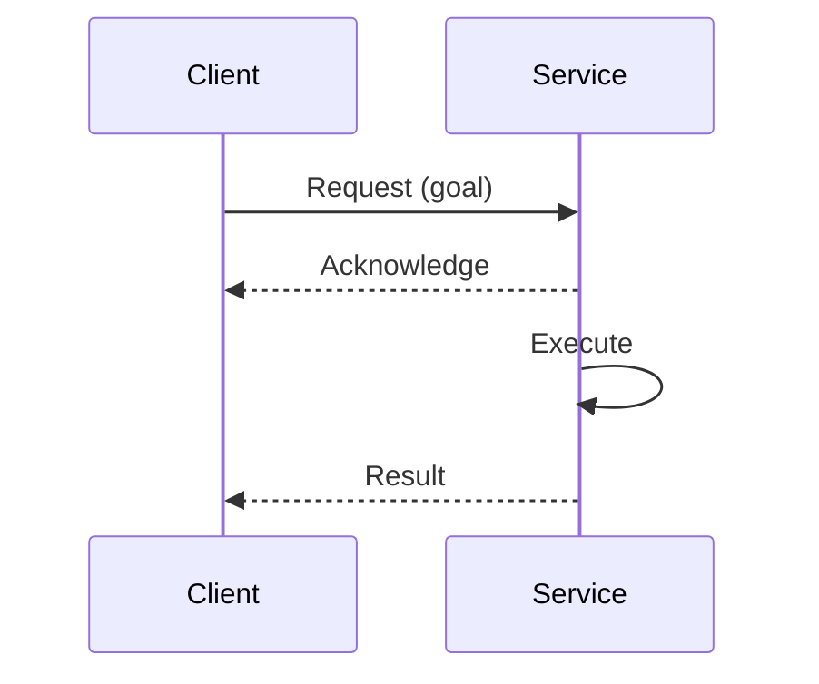
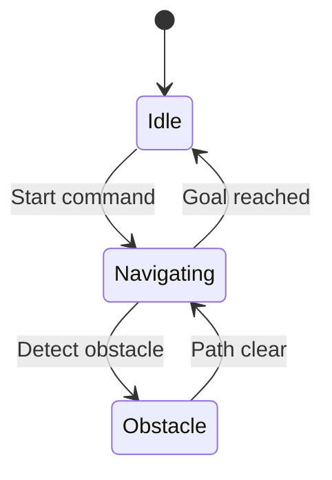
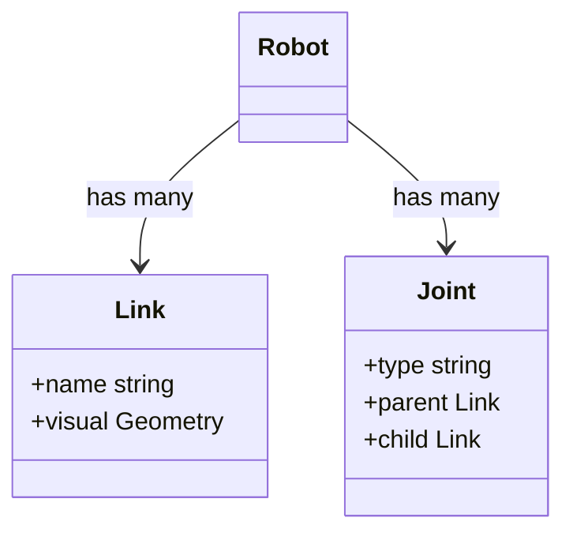

# Research: AI-Native Textbook — Physical AI & Humanoid Robotics

**Feature**: 002-textbook | **Date**: 2025-12-09
**Purpose**: Document technical decisions, best practices, and alternatives for creating 21-chapter educational content

---

## Decision 1: Chapter Template Structure

**Decision**: Use standardized YAML frontmatter + 8-section markdown template for all 21 chapters

**Rationale**:
- **Consistency**: Learners know what to expect in every chapter (objectives → theory → code → exercises)
- **Maintainability**: Template changes propagate across all chapters
- **Validation**: Automated checks can verify all sections present
- **Accessibility**: Predictable structure aids navigation for screen readers

**Alternatives Considered**:
1. **Free-form markdown** - Rejected because inconsistency confuses learners and breaks automated validation
2. **MDX with React components** - Rejected due to complexity; markdown is simpler for content authors
3. **Jupyter notebooks** - Rejected per spec (Out of Scope: "interactive code execution")

**Template Structure**:
```markdown
---
title: "[Chapter Title]"
sidebar_position: [number]
---

# [Chapter Title]

## Learning Objectives

- Objective 1 (measurable verb: implement, explain, configure)
- Objective 2
- Objective 3

## Prerequisites

- [Link to prior chapter or concept]
- Software: ROS 2 Humble, Python 3.10+
- Hardware: [if applicable, e.g., NVIDIA GPU for Isaac Sim]

## Introduction

[2-3 paragraphs setting context with analogy]

## Theory

### [Concept 1]

[Explanation with practical analogy]

```mermaid
[Diagram illustrating concept]
```

### [Concept 2]

[Explanation]

## Code Examples

### Example 1: [Description]

```python
# Complete, runnable Python code
import rclpy
# ...
```

**Expected Output**:
```
[Exact terminal output or description of visual result]
```

## Exercises

1. **[Exercise Title]**: [Clear instructions with success criteria]
2. **[Exercise Title]**: [Instructions]

## Summary

[2-3 sentences recapping key learnings]

## Next Steps

[Link to next chapter with preview]
```

**Best Practices**:
- **Word count**: Aim for 2500 words (middle of 800-1000 range) excluding code
- **Headings**: Use `##` for major sections, `###` for subsections (h1 is chapter title)
- **Code blocks**: Always include language hint (```python), never use generic ```
- **Mermaid**: Place diagrams immediately after concept explanation, not at end of section
- **Prerequisites**: Link to specific prior chapters, not just "knowledge of X"

---

## Decision 2: Mermaid Diagram Patterns for Robotics

**Decision**: Use 4 primary Mermaid diagram types, each for specific robotics concepts

**Rationale**:
- **Visual learning**: Complex robotics architectures are easier to understand with diagrams
- **Version control**: Mermaid source is text, trackable in Git (vs binary images)
- **Maintenance**: Diagrams update alongside code/text changes
- **Accessibility**: Mermaid supports alt text via title attribute

**Diagram Types**:

### 1. Flowchart - ROS 2 Node Communication

**Use case**: Show pub/sub topology, node graphs


### 2. Sequence Diagram - Service Calls & Actions

**Use case**: Illustrate request/response patterns


### 3. State Diagram - Robot Behaviors

**Use case**: Finite state machines for navigation, manipulation


### 4. Class Diagram - URDF & Data Structures

**Use case**: Robot descriptions, message types


**Alternatives Considered**:
1. **Static PNG/SVG images** - Rejected per Principle IV (Mermaid exclusively)
2. **Draw.io diagrams** - Rejected because not version-controllable as text
3. **ASCII art** - Rejected due to poor mobile rendering and accessibility

**Best Practices**:
- **Simplicity**: Max 10-12 nodes per diagram (split complex architectures)
- **Labels**: Use clear, concise labels (`Publisher Node` not `node_1`)
- **Colors**: Avoid manual coloring (let Docusaurus theme handle it for dark/light mode)
- **Alt text**: Add `title` attribute for accessibility: `%%{title: "ROS 2 pub/sub architecture"}%%`
- **Testing**: Validate all Mermaid syntax during Docusaurus build (fails on syntax errors)

---

## Decision 3: Code Validation Strategy (Docker-Based)

**Decision**: Extract Python code blocks from markdown, execute in Ubuntu 22.04 + ROS 2 Humble Docker container

**Rationale**:
- **Reproducibility**: Clean container ensures code works on learner's Ubuntu 22.04 system
- **Isolation**: Each chapter's code runs in isolated environment (no cross-contamination)
- **Automation**: CI/CD can run validation on every commit
- **Spec compliance**: Ensures 100% executable code (Success Criteria SC-003)

**Alternatives Considered**:
1. **Manual testing**: Author runs code locally - Rejected due to human error, no CI integration
2. **Jupyter notebooks**: Code cells auto-execute - Rejected (Out of Scope: "interactive code execution")
3. **GitHub Actions only**: No local validation - Rejected because authors need fast feedback before commit

**Validation Workflow**:

1. **Extract code blocks** from chapter markdown:
   ```bash
   # Finds all ```python blocks, preserves line numbers
   grep -A 999 '```python' chapter.md | grep -B 999 '```' > extracted_code.py
   ```

2. **Dockerfile** (Ubuntu 22.04 + ROS 2 Humble):
   ```dockerfile
   FROM ros:humble-ros-base-jammy
   RUN apt-get update && apt-get install -y python3-pip
   COPY requirements.txt .
   RUN pip3 install -r requirements.txt
   COPY validate-chapter.sh /usr/local/bin/
   ```

3. **Validation script**:
   ```bash
   #!/bin/bash
   # validate-chapter.sh
   source /opt/ros/humble/setup.bash
   python3 extracted_code.py
   # Captures exit code and stdout/stderr
   ```

4. **Expected output check**:
   - Compare actual output with "Expected Output" section in markdown
   - Fuzzy match (allow timestamp differences, process IDs)
   - Fail if exit code ≠ 0 or output significantly differs

**Best Practices**:
- **Code completeness**: Every code block must be self-contained (imports, initialization, execution)
- **Setup/teardown**: Include `rclpy.init()` and `rclpy.shutdown()` in examples
- **Timeouts**: Kill code if runs >30 seconds (performance goal)
- **Error handling**: Chapters show both success and error cases (e.g., "What if no ROS master?")
- **PEP 8**: Run `black` and `flake8` on extracted code before validation

**Files to Create**:
- `.docker/textbook-validator/Dockerfile`
- `.docker/textbook-validator/validate-chapter.sh`
- `.docker/textbook-validator/requirements.txt` (rclpy, numpy, etc.)

---

## Decision 4: Docusaurus Sidebar Configuration

**Decision**: Use category-based sidebar with collapsible modules

**Rationale**:
- **Navigation**: Learners see entire textbook structure at a glance
- **Progress tracking**: Visual indication of current chapter
- **Module grouping**: Collapsible categories prevent overwhelming sidebar
- **Deep linking**: Each chapter has stable URL (`/docs/module-1-ros2/chapter-1-nodes`)

**Alternatives Considered**:
1. **Flat list** (all 21 chapters at root level) - Rejected because overwhelming, no module organization
2. **Auto-generated from frontmatter only** - Rejected because less control over order/nesting
3. **Separate sidebar per module** - Rejected because users can't see cross-module connections

**Configuration** (`website/sidebars.ts`):
```typescript
const sidebars = {
  textbookSidebar: [
    'intro',  // Introduction (standalone)
    {
      type: 'category',
      label: 'Module 1: The Robotic Nervous System (ROS 2)',
      collapsible: true,
      collapsed: false,  // Expand by default for active module
      items: [
        'module-1-ros2/chapter-1-nodes-architecture',
        'module-1-ros2/chapter-2-topics-pubsub',
        'module-1-ros2/chapter-3-services-clients',
        'module-1-ros2/chapter-4-rclpy-python-client',
        'module-1-ros2/chapter-5-urdf-robot-description',
      ],
    },
    {
      type: 'category',
      label: 'Module 2: The Digital Twin (Gazebo & Unity)',
      collapsible: true,
      collapsed: true,  // Collapse inactive modules
      items: [
        'module-2-simulation/chapter-1-gazebo-physics-basics',
        'module-2-simulation/chapter-2-lidar-integration',
        'module-2-simulation/chapter-3-imu-integration',
        'module-2-simulation/chapter-4-depth-camera',
        'module-2-simulation/chapter-5-unity-environment',
      ],
    },
    // Modules 3 and 4 follow same pattern
  ],
};
```

**Best Practices**:
- **Sidebar position**: Use frontmatter `sidebar_position` to override auto-sort if needed
- **Labels**: Match module names from constitution (e.g., "Module 1: The Robotic Nervous System")
- **URLs**: Use kebab-case for directories and filenames (`module-1-ros2/chapter-1-nodes-architecture.md`)
- **Breadcrumbs**: Docusaurus auto-generates breadcrumbs from sidebar structure

---

## Decision 5: Content Writing Guidelines (Analogies & Exercises)

**Decision**: Use domain-appropriate analogies (physical systems) and progressive exercises (guided → open-ended)

**Rationale**:
- **Analogies**: Abstract concepts (like ROS 2 topics) become concrete when compared to familiar systems (like radio broadcasts)
- **Exercises**: Guided exercises build confidence; open-ended challenges test mastery
- **Engagement**: Interactive learning beats passive reading (Principle I: Educational Quality)

**Analogy Examples**:

| Concept | Analogy |
|---------|---------|
| ROS 2 Topics (pub/sub) | Radio station (publisher) broadcasts to many radios (subscribers) on same frequency (topic) |
| ROS 2 Services (req/res) | Restaurant: customer (client) orders food (request), waiter (service) brings meal (response) |
| URDF (robot description) | Blueprint for building: links are rooms, joints are doors connecting them |
| Gazebo Physics Simulation | Movie special effects: digital stunt double tests dangerous actions before real actor |
| VSLAM (visual odometry) | Hiker creates map while walking: camera sees landmarks, estimates position by tracking them |

**Exercise Progression** (per module):

1. **Guided (Chapters 1-2)**: Step-by-step instructions with code scaffolding
   - *Example*: "Modify the provided publisher node to send 10 messages instead of 5. Expected output: [...]"

2. **Semi-guided (Chapters 3-4)**: Clear goal, some hints, no complete solution
   - *Example*: "Create a service that takes two integers and returns their sum. Hint: Use `example_interfaces/srv/AddTwoInts`"

3. **Open-ended (Chapter 5)**: Problem statement only, learner designs solution
   - *Example*: "Design a URDF for a mobile robot with 2 wheels and 1 LiDAR sensor. Test in Gazebo."

**Best Practices**:
- **Analogies**: Use at least one per chapter; place near concept introduction (not buried in theory)
- **Exercises**: 2-3 per chapter, balanced between discussion and coding
- **Solutions**: Provide in separate `solutions/` directory or appendix (Assumption 10)
- **Success criteria**: Every exercise must have clear "how do I know I'm done?" answer

---

## Decision 6: Prerequisites & Dependency Management

**Decision**: Explicit prerequisites at chapter top with version-pinned dependencies

**Rationale**:
- **Clarity**: Learners know exactly what to install before starting (reduces frustration)
- **Reproducibility**: Version pins ensure code works years later (e.g., ROS 2 Humble, not "latest")
- **Modular learning**: Prerequisites link to specific prior chapters, enabling non-linear paths

**Alternatives Considered**:
1. **Generic "ROS 2 knowledge required"** - Rejected because vague, no actionable links
2. **Auto-detect environment** - Rejected (too complex, better to state explicitly)
3. **No prerequisites section** - Rejected per FR-012 (mandatory section)

**Format**:

```markdown
## Prerequisites

### Knowledge Prerequisites
- [Chapter 2: ROS 2 Topics](/docs/module-1-ros2/chapter-2-topics-pubsub) - Understanding of pub/sub pattern
- Basic Python (variables, functions, classes)

### Software Prerequisites
- **Operating System**: Ubuntu 22.04 LTS (physical, VM, or WSL2)
- **ROS 2**: Humble Hawksbill ([installation guide](https://docs.ros.org/en/humble/Installation.html))
- **Python**: 3.10+ (ships with Ubuntu 22.04)
- **Packages**: `sudo apt install ros-humble-rclpy python3-pip`

### Hardware Prerequisites *(if applicable)*
- **For Module 3 (Isaac Sim)**: NVIDIA GPU with CUDA 11.8+ support
- **For Module 2 (Gazebo)**: Discrete GPU recommended (Intel UHD graphics may be slow)

### Installation Verification
Run this command to verify setup:
\`\`\`bash
source /opt/ros/humble/setup.bash && python3 -c "import rclpy; print('ROS 2 Humble ready!')"
\`\`\`

Expected output: `ROS 2 Humble ready!`
```

**Best Practices**:
- **Link to prior chapters**: Use relative paths (`/docs/module-1-ros2/...`)
- **Version specificity**: Always state versions (ROS 2 Humble, Python 3.10+, Ubuntu 22.04)
- **Verification command**: Include command learner can run to test setup
- **Troubleshooting**: Link to common issues (e.g., "ROS 2 not found" → check `.bashrc`)

---

## Decision 7: PEP 8 Compliance & Code Formatting

**Decision**: Use `black` formatter (line length 88) and `flake8` linter on all Python code examples

**Rationale**:
- **Readability**: Consistent formatting makes code easier to scan (Principle III: Code Correctness)
- **Teaching**: Shows learners professional Python practices
- **Automation**: CI/CD can reject non-compliant code
- **Standard**: Black is de facto Python formatter (used by major projects)

**Alternatives Considered**:
1. **Manual formatting** - Rejected due to inconsistency and human error
2. **autopep8** - Rejected because less opinionated than black (more configuration needed)
3. **No formatting standard** - Rejected per FR-003 (PEP 8 compliance required)

**Configuration**:

```toml
# pyproject.toml (for black)
[tool.black]
line-length = 88
target-version = ['py310']
exclude = '''
/(
    \.git
  | \.venv
  | build
  | dist
)/
'''

# .flake8
[flake8]
max-line-length = 88
extend-ignore = E203, W503  # Black compatibility
exclude = .git,__pycache__,build,dist
```

**Validation Workflow**:
```bash
# Extract all Python code from chapter
python3 extract_code.py chapter.md > code.py

# Format with black
black code.py

# Lint with flake8
flake8 code.py
# Exit code 0 = pass, nonzero = violations
```

**Best Practices**:
- **Docstrings**: Use for module-level and function-level documentation
- **Type hints**: Optional but encouraged for complex functions
- **Comments**: Explain WHY, not WHAT (code should be self-explanatory)
- **Imports**: Group stdlib → third-party → local, sorted alphabetically
- **Line length**: 88 chars (black default), break long lines intelligently

---

## Summary of Key Decisions

| # | Decision | Technology/Approach | Rationale |
|---|----------|---------------------|-----------|
| 1 | Chapter Template | YAML frontmatter + 8-section markdown | Consistency, validation, accessibility |
| 2 | Diagrams | 4 Mermaid types (flowchart, sequence, state, class) | Version control, robotics patterns, accessibility |
| 3 | Code Validation | Docker (Ubuntu 22.04 + ROS 2 Humble) | Reproducibility, CI/CD, spec compliance (SC-003) |
| 4 | Sidebar | Category-based with collapsible modules | Navigation, progress tracking, module grouping |
| 5 | Writing Style | Domain analogies + progressive exercises | Engagement, learning progression, mastery |
| 6 | Prerequisites | Version-pinned with verification commands | Clarity, reproducibility, frustration reduction |
| 7 | Code Formatting | Black (88 char) + Flake8 | Readability, professional practices, automation |

**All research decisions align with**:
- ✅ Principle I: Educational Quality First
- ✅ Principle II: Structured Content Architecture
- ✅ Principle III: Code Correctness & Testability
- ✅ Principle IV: Visual Learning Through Diagrams

**No unresolved NEEDS CLARIFICATION items** - All technical decisions finalized.

**Ready for Phase 1**: data-model.md (Chapter structure), contracts/ (chapter schema), quickstart.md (chapter template)
