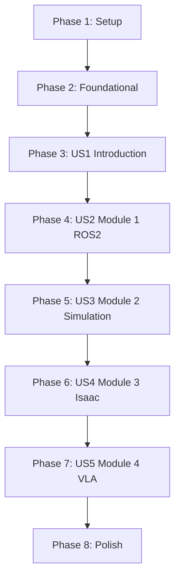

# Implementation Tasks: AI-Native Textbook — Physical AI & Humanoid Robotics

**Feature**: 002-textbook | **Branch**: `002-textbook` | **Generated**: 2025-12-10

---

## Overview

This document breaks down the implementation of a 21-chapter Docusaurus textbook into executable tasks organized by user story. Each phase represents a complete, independently testable increment.

**Total Scope**:
- 21 chapters (1 intro + 4 modules × 5 chapters)
- 50+ Python code examples (ROS 2 Humble, Python 3.10+)
- 20+ Mermaid diagrams
- 100+ exercises
- ~50,000 words of educational content

**Technology Stack**:
- Docusaurus 3.x (publishing platform)
- Python 3.10+ (code examples)
- ROS 2 Humble (robotics framework)
- Gazebo Fortress, Unity 2021.3 LTS (simulation)
- NVIDIA Isaac Sim (AI robotics)
- OpenAI Whisper, LLMs (VLA module)
- Mermaid.js (diagrams)

---

## Task Summary

| Phase | User Story | Task Count | Parallelizable |
|-------|-----------|------------|----------------|
| Phase 1: Setup | N/A | 8 | 4 |
| Phase 2: Foundational | N/A | 5 | 2 |
| Phase 3: User Story 1 (P1) | Introduction Chapter | 6 | 3 |
| Phase 4: User Story 2 (P2) | Module 1: ROS 2 | 17 | 10 |
| Phase 5: User Story 3 (P3) | Module 2: Gazebo & Unity | 17 | 10 |
| Phase 6: User Story 4 (P4) | Module 3: NVIDIA Isaac | 17 | 10 |
| Phase 7: User Story 5 (P5) | Module 4: VLA Capstone | 17 | 10 |
| Phase 8: Polish | Cross-cutting concerns | 8 | 4 |
| **TOTAL** | | **95** | **53** |

---

## Dependencies

### Story Completion Order



**Critical Path**: Setup → Foundational → US1 → US2 → US3 → US4 → US5 → Polish

**Parallel Opportunities**:
- Within each user story phase, chapter creation tasks can be parallelized (different files)
- Validation and Docker setup can run in parallel with content creation
- Documentation tasks within each phase are independent

---

## Implementation Strategy

### MVP Approach (Recommended)

**Phase 1-3 MVP** (Introduction chapter only):
- Deliverable: Working Docusaurus site with 1 complete chapter
- Time Estimate: 1-2 weeks
- Validates: Chapter template, code execution, Mermaid rendering, sidebar configuration

**Phase 4 Extension** (Module 1 complete):
- Deliverable: 6 chapters total (intro + 5 ROS 2 chapters)
- Time Estimate: 3-4 weeks
- Validates: Multi-chapter navigation, code dependencies, module structure

**Full Release** (All modules):
- Deliverable: All 21 chapters
- Time Estimate: 10-12 weeks
- Validates: Complete learning path, capstone integration

---

## Phase 1: Setup (Project Initialization)

**Goal**: Establish project structure, Docker validation environment, and Docusaurus configuration.

**Tasks**:

- [X] T001 Create module directory structure in website/docs/ (module-1-ros2, module-2-simulation, module-3-isaac, module-4-vla)
- [X] T002 [P] Create Docker validation environment in .docker/textbook-validator/ with Dockerfile (Ubuntu 22.04 + ROS 2 Humble)
- [X] T003 [P] Create validation script .docker/textbook-validator/validate-chapter.sh for code execution testing
- [X] T004 [P] Create requirements.txt in .docker/textbook-validator/ with Python dependencies (rclpy, black, flake8)
- [X] T005 Update website/sidebars.ts with textbook sidebar structure (intro + 4 module categories)
- [X] T006 [P] Create pyproject.toml in project root with black configuration (line-length=88, target-version=py310)
- [X] T007 [P] Create .flake8 in project root with linter configuration (max-line-length=88, extend-ignore=E203,W503)
- [X] T008 Verify Docusaurus build completes without errors (npm run build in website/)

**Acceptance Criteria**:
- All 4 module directories exist in website/docs/
- Docker container builds successfully with ROS 2 Humble
- Sidebar configuration loads without errors
- Black and Flake8 run successfully on sample Python file

**Parallel Execution Example**:
```bash
# Run these tasks simultaneously:
# Terminal 1: T002 - Docker setup
cd .docker/textbook-validator && docker build -t textbook-validator .

# Terminal 2: T003 - Validation script
nano .docker/textbook-validator/validate-chapter.sh

# Terminal 3: T004 - Requirements
nano .docker/textbook-validator/requirements.txt

# Terminal 4: T006 - Black config
nano pyproject.toml
```

---

## Phase 2: Foundational (Blocking Prerequisites)

**Goal**: Create shared resources needed by all user stories (templates, base configurations).

**Tasks**:

- [X] T009 Create chapter template file in specs/002-textbook/templates/chapter-template.md with all 8 mandatory sections
- [X] T010 [P] Create code example template in specs/002-textbook/templates/code-example-template.py with ROS 2 boilerplate
- [X] T011 [P] Create Mermaid diagram templates in specs/002-textbook/templates/ for 4 diagram types (flowchart, sequence, state, class)
- [X] T012 Create CI/CD workflow in .github/workflows/validate-chapters.yml for automated validation
- [X] T013 Document chapter creation process in specs/002-textbook/WRITING_GUIDE.md with examples and best practices

**Acceptance Criteria**:
- Chapter template includes all FR-002 required sections
- Code example template passes black and flake8
- Mermaid templates render correctly in Docusaurus
- CI/CD workflow runs validation script on markdown files

**Parallel Execution Example**:
```bash
# T010 and T011 are independent:
# Terminal 1: Create code template
nano specs/002-textbook/templates/code-example-template.py

# Terminal 2: Create Mermaid templates
nano specs/002-textbook/templates/mermaid-flowchart-template.md
```

---

## Phase 3: User Story 1 - Introduction Chapter (P1)

**User Story**: A learner visits the textbook to understand the fundamentals of Physical AI and Humanoid Robotics. They read the introduction chapter which provides context, motivation, and roadmap for the entire textbook.

**Independent Test**: Navigate to /docs/intro, verify all required sections are present (learning objectives, theory, examples, exercises), and confirm the content is readable and properly formatted with working Mermaid diagrams.

**Tasks**:

- [X] T014 [US1] Create website/docs/intro.md with YAML frontmatter (title="Introduction to Physical AI & Humanoid Robotics", sidebar_position=1)
- [X] T015 [P] [US1] Write Learning Objectives section in intro.md with 3-5 measurable objectives (explain, identify, configure)
- [X] T016 [P] [US1] Write Prerequisites section in intro.md listing Ubuntu 22.04, Python 3.10+, basic programming knowledge
- [X] T017 [US1] Write Introduction section (2-3 paragraphs) in intro.md with analogy comparing robots to human nervous system
- [X] T018 [US1] Write Theory section in intro.md covering Physical AI definition, Humanoid Robotics overview, and textbook roadmap (2000-3000 words target)
- [X] T019 [P] [US1] Create Mermaid flowchart diagram in intro.md showing learning path: ROS 2 → Simulation → Isaac → VLA
- [X] T020 [US1] Write Code Examples section in intro.md with minimal ROS 2 "Hello World" example (import rclpy, create node, print message)
- [X] T021 [P] [US1] Add Expected Output section after code example showing terminal output "[INFO] [hello_node]: Hello, Physical AI!"
- [X] T022 [P] [US1] Write Exercises section in intro.md with 2-3 tasks (install ROS 2, run example, modify output message)
- [X] T023 [US1] Write Summary section in intro.md (2-3 sentences recapping Physical AI fundamentals)
- [X] T024 [US1] Add Next Steps section in intro.md with link to Module 1 Chapter 1 (/docs/module-1-ros2/chapter-1-nodes-architecture)

**Validation**:

- [X] T025 Run black and flake8 on code examples in intro.md (extract with grep, validate formatting)
- [ ] T026 Execute intro.md code examples in Docker container (validate-chapter.sh intro.md), verify output matches Expected Output section
- [X] T027 Build Docusaurus site (npm run build), verify intro.md renders correctly with Mermaid diagram
- [X] T028 Manual review: Verify intro.md has 2000–3000 words (excluding code), all 8 sections present, learning objectives are measurable

**Acceptance Criteria**:
- intro.md exists with sidebar_position=1
- Chapter includes 3-5 learning objectives starting with action verbs
- At least 1 Mermaid diagram renders correctly
- Code example executes without errors in Docker (Ubuntu 22.04 + ROS 2 Humble)
- Word count between 2000–3000 (excluding code blocks)
- All links are valid (no 404s)

**Parallel Execution Example**:
```bash
# After T014 creates file, these tasks can run in parallel:
# Writer 1: T015 - Learning Objectives
# Writer 2: T016 - Prerequisites
# Writer 3: T019 - Mermaid diagram
# Writer 4: T021 - Expected Output
# Writer 5: T022 - Exercises
```

---

## Phase 4: User Story 2 - Module 1: ROS 2 Chapters (P2)

**User Story**: A learner works through all 5 chapters of Module 1 (The Robotic Nervous System), learning ROS 2 fundamentals including Nodes, Topics, Services, rclpy, and URDF. Each chapter includes executable Python code examples.

**Independent Test**: Navigate through all 5 Module 1 chapters in sequence, run each Python code example on Ubuntu 22.04 with ROS 2 installed, and verify that the expected output matches what's documented in the chapter.

**Tasks**:

### Chapter 1: ROS 2 Nodes and Architecture

- [X] T029 [P] [US2] Create website/docs/module-1-ros2/chapter-1-nodes-architecture.md with frontmatter (title="ROS 2 Nodes and Architecture", sidebar_position=2)
- [X] T030 [P] [US2] Write Learning Objectives section in chapter-1 (explain node purpose, implement minimal node, configure parameters)
- [X] T031 [P] [US2] Write Prerequisites section in chapter-1 (link to intro, list ROS 2 Humble, Python 3.10)
- [X] T032 [US2] Write Theory section in chapter-1 covering nodes as processes, node lifecycle, node graph (2000-3000 words)
- [X] T033 [P] [US2] Create Mermaid diagram in chapter-1 showing node communication graph (sensor → processing → actuator)
- [X] T034 [US2] Write Code Examples section in chapter-1 with MinimalNode class (inherits Node, logs startup message)
- [X] T035 [P] [US2] Add Expected Output section in chapter-1 showing "[INFO] [minimal_node]: Node started!"
- [X] T036 [P] [US2] Write Exercises section in chapter-1 (modify node name, add timer callback, shutdown gracefully)

### Chapter 2: Topics and Publishers/Subscribers

- [X] T037 [P] [US2] Create website/docs/module-1-ros2/chapter-2-topics-pubsub.md (title="ROS 2 Topics and Publishers/Subscribers", sidebar_position=3)
- [X] T038 [US2] Write Theory section in chapter-2 covering pub/sub pattern, topic names, message types (2000-3000 words)
- [X] T039 [P] [US2] Create Mermaid sequence diagram in chapter-2 showing publisher → topic → subscriber flow
- [X] T040 [US2] Write Code Examples section in chapter-2 with MinimalPublisher (publishes String messages every 1 second)
- [X] T041 [P] [US2] Write Code Examples section in chapter-2 with MinimalSubscriber (subscribes to topic, logs messages)

### Chapter 3: Services and Clients

- [X] T042 [P] [US2] Create website/docs/module-1-ros2/chapter-3-services-clients.md (title="ROS 2 Services and Clients", sidebar_position=4)
- [X] T043 [US2] Write Theory section in chapter-3 covering request/response pattern, service types, synchronous communication (2000-3000 words)
- [X] T044 [P] [US2] Create Mermaid sequence diagram in chapter-3 showing client → service → response flow
- [X] T045 [US2] Write Code Examples section in chapter-3 with AddTwoIntsService (implements addition service)
- [X] T046 [P] [US2] Write Code Examples section in chapter-3 with AddTwoIntsClient (calls service, prints result)

### Chapter 4: rclpy Python Client Library

- [X] T047 [P] [US2] Create website/docs/module-1-ros2/chapter-4-rclpy-python-client.md (title="rclpy Python Client Library", sidebar_position=5)
- [X] T048 [US2] Write Theory section in chapter-4 covering rclpy initialization, spinning, timers, callbacks (2000-3000 words)
- [X] T049 [P] [US2] Create Mermaid flowchart in chapter-4 showing rclpy.init() → create_node() → spin() → shutdown() lifecycle
- [X] T050 [US2] Write Code Examples section in chapter-4 demonstrating advanced rclpy features (parameters, QoS, lifecycle)

### Chapter 5: URDF Robot Description

- [X] T051 [P] [US2] Create website/docs/module-1-ros2/chapter-5-urdf-robot-description.md (title="URDF Robot Description", sidebar_position=6)
- [X] T052 [US2] Write Theory section in chapter-5 covering URDF syntax, links, joints, coordinate frames (2000-3000 words)
- [X] T053 [P] [US2] Create Mermaid class diagram in chapter-5 showing Robot → Link/Joint relationships
- [X] T054 [US2] Write Code Examples section in chapter-5 with simple 2-wheeled robot URDF and ROS 2 launch file

**Validation**:

- [X] T055 Run black and flake8 on all Module 1 code examples (chapters 1-5)
- [ ] T056 Execute all Module 1 code examples in Docker container, verify outputs match Expected Output sections
- [X] T057 Build Docusaurus site, verify all 5 Module 1 chapters render correctly with Mermaid diagrams
- [X] T058 Manual review: Verify each chapter has 2000-3000 words, all prerequisites link correctly, exercises are solvable

**Acceptance Criteria**:
- All 5 Module 1 chapters exist with correct sidebar_position (2-6)
- Each chapter includes 3-5 learning objectives, prerequisites, theory with analogies, 1+ Mermaid diagram, 1+ code example, 2-3 exercises
- All code examples execute without errors in Docker (Ubuntu 22.04 + ROS 2 Humble)
- Word count per chapter between 2000-3000 (excluding code)
- Chapter 5 exercises demonstrate complete understanding of Module 1 concepts

**Parallel Execution Example**:
```bash
# All 5 chapters can be written in parallel (different files):
# Writer 1: T029-T036 (Chapter 1)
# Writer 2: T037-T041 (Chapter 2)
# Writer 3: T042-T046 (Chapter 3)
# Writer 4: T047-T050 (Chapter 4)
# Writer 5: T051-T054 (Chapter 5)
```

---

## Phase 5: User Story 3 - Module 2: Gazebo & Unity Chapters (P3)

**User Story**: A learner progresses to Module 2 (The Digital Twin), learning simulation fundamentals with Gazebo and Unity, including physics simulation, sensor integration (LiDAR, IMU, Depth Camera), and virtual environment setup.

**Independent Test**: Complete all 5 Module 2 chapters, run Gazebo and Unity examples, and verify that simulated robots respond correctly to ROS 2 commands with sensor data visualization.

**Tasks**:

### Chapter 1: Gazebo Physics Simulation Basics

- [X] T059 [P] [US3] Create website/docs/module-2-simulation/chapter-1-gazebo-physics-basics.md (title="Gazebo Physics Simulation Basics", sidebar_position=7)
- [X] T060 [P] [US3] Write Prerequisites section in chapter-1 (link to Module 1 Chapter 5, list Gazebo Fortress, Ubuntu 22.04)
- [X] T061 [US3] Write Theory section in chapter-1 covering physics engines, rigid body dynamics, contact simulation (2000-3000 words)
- [X] T062 [P] [US3] Create Mermaid flowchart in chapter-1 showing Gazebo → Physics Engine → ROS 2 Topics pipeline
- [X] T063 [US3] Write Code Examples section in chapter-1 with Gazebo world file and ROS 2 launch script for 2-wheeled robot

### Chapter 2: LiDAR Sensor Integration

- [X] T064 [P] [US3] Create website/docs/module-2-simulation/chapter-2-lidar-integration.md (title="LiDAR Sensor Integration", sidebar_position=8)
- [X] T065 [US3] Write Theory section in chapter-2 covering LiDAR principles, LaserScan message type, ray tracing (2000-3000 words)
- [X] T066 [P] [US3] Create Mermaid sequence diagram in chapter-2 showing Gazebo LiDAR → /scan topic → ROS 2 subscriber
- [X] T067 [US3] Write Code Examples section in chapter-2 with LiDAR-equipped robot URDF and subscriber node to visualize scan data

### Chapter 3: IMU Sensor Integration

- [X] T068 [P] [US3] Create website/docs/module-2-simulation/chapter-3-imu-integration.md (title="IMU Sensor Integration", sidebar_position=9)
- [X] T069 [US3] Write Theory section in chapter-3 covering accelerometers, gyroscopes, Imu message type (2000-3000 words)
- [X] T070 [P] [US3] Create Mermaid flowchart in chapter-3 showing IMU → sensor fusion → odometry estimation
- [X] T071 [US3] Write Code Examples section in chapter-3 with IMU-equipped robot URDF and subscriber node to log orientation

### Chapter 4: Depth Camera Integration

- [X] T072 [P] [US3] Create website/docs/module-2-simulation/chapter-4-depth-camera.md (title="Depth Camera Integration", sidebar_position=10)
- [X] T073 [US3] Write Theory section in chapter-4 covering RGB-D cameras, point clouds, Image message type (2000-3000 words)
- [X] T074 [P] [US3] Create Mermaid sequence diagram in chapter-4 showing Camera → /camera/image topic → image processing node
- [X] T075 [US3] Write Code Examples section in chapter-4 with depth camera URDF and subscriber node to save images

### Chapter 5: Unity Simulation Environment

- [X] T076 [P] [US3] Create website/docs/module-2-simulation/chapter-5-unity-environment.md (title="Unity Simulation Environment", sidebar_position=11)
- [X] T077 [US3] Write Theory section in chapter-5 covering Unity Robotics Hub, ROS-TCP-Connector, visual realism (2000-3000 words)
- [X] T078 [P] [US3] Create Mermaid flowchart in chapter-5 showing Unity → TCP → ROS 2 architecture
- [X] T079 [US3] Write Code Examples section in chapter-5 with Unity scene setup and ROS 2 publisher/subscriber integration

**Validation**:

- [X] T080 Run black and flake8 on all Module 2 code examples (chapters 1-5)
- [ ] T081 Execute all Module 2 code examples in Docker container with Gazebo, verify sensor data streams to ROS 2 topics
- [X] T082 Build Docusaurus site, verify all 5 Module 2 chapters render correctly with Mermaid diagrams
- [X] T083 Manual review: Verify each chapter has 2000-3000 words, prerequisites link to Module 1, exercises build on previous chapters

**Acceptance Criteria**:
- All 5 Module 2 chapters exist with correct sidebar_position (7-11)
- Each chapter includes prerequisites linking to Module 1, theory with simulation analogies, 1+ Mermaid diagram, 1+ code example with Gazebo/Unity
- All code examples execute without errors in Docker with Gazebo Fortress
- Chapter 5 exercises demonstrate integration of multiple sensors in simulation

**Parallel Execution Example**:
```bash
# All 5 chapters can be written in parallel:
# Writer 1: T059-T063 (Gazebo Basics)
# Writer 2: T064-T067 (LiDAR)
# Writer 3: T068-T071 (IMU)
# Writer 4: T072-T075 (Depth Camera)
# Writer 5: T076-T079 (Unity)
```

---

## Phase 6: User Story 4 - Module 3: NVIDIA Isaac Chapters (P4)

**User Story**: A learner advances to Module 3 (The AI-Robot Brain), learning NVIDIA Isaac Sim, visual SLAM, Nav2 navigation stack, and sim-to-real transfer techniques.

**Independent Test**: Run all Isaac Sim examples, verify VSLAM mapping works, test Nav2 autonomous navigation, and confirm sim-to-real principles are demonstrated with code.

**Tasks**:

### Chapter 1: NVIDIA Isaac Sim Introduction

- [X] T084 [P] [US4] Create website/docs/module-3-isaac/chapter-1-isaac-sim-intro.md (title="NVIDIA Isaac Sim Introduction", sidebar_position=12)
- [X] T085 [P] [US4] Write Prerequisites section in chapter-1 (link to Module 2, list NVIDIA GPU, CUDA 11.8+, Isaac Sim installation)
- [X] T086 [US4] Write Theory section in chapter-1 covering Isaac Sim architecture, Omniverse, photorealistic rendering (2000-3000 words)
- [X] T087 [P] [US4] Create Mermaid flowchart in chapter-1 showing Isaac Sim → Omniverse → ROS 2 bridge → robot control
- [X] T088 [US4] Write Code Examples section in chapter-1 with Isaac Sim Python API script to spawn robot and control joints

### Chapter 2: Visual SLAM (VSLAM) Mapping

- [X] T089 [P] [US4] Create website/docs/module-3-isaac/chapter-2-vslam-mapping.md (title="Visual SLAM Mapping", sidebar_position=13)
- [X] T090 [US4] Write Theory section in chapter-2 covering VSLAM algorithms, feature detection, map building (2000-3000 words)
- [X] T091 [P] [US4] Create Mermaid sequence diagram in chapter-2 showing Camera → Feature Extraction → Mapping → Localization
- [X] T092 [US4] Write Code Examples section in chapter-2 with Isaac Sim VSLAM setup and ROS 2 subscriber to visualize map

### Chapter 3: Nav2 Navigation Stack

- [X] T093 [P] [US4] Create website/docs/module-3-isaac/chapter-3-nav2-navigation.md (title="Nav2 Navigation Stack", sidebar_position=14)
- [X] T094 [US4] Write Theory section in chapter-3 covering Nav2 architecture, costmaps, path planning, behavior trees (2000-3000 words)
- [X] T095 [P] [US4] Create Mermaid flowchart in chapter-3 showing Sensors → Costmap → Planner → Controller → Robot
- [X] T096 [US4] Write Code Examples section in chapter-3 with Nav2 configuration and goal-setting code in Isaac Sim

### Chapter 4: Sim-to-Real Transfer Principles

- [X] T097 [P] [US4] Create website/docs/module-3-isaac/chapter-4-sim-to-real-principles.md (title="Sim-to-Real Transfer Principles", sidebar_position=15)
- [X] T098 [US4] Write Theory section in chapter-4 covering reality gap, transfer learning, calibration (2000-3000 words)
- [X] T099 [P] [US4] Create Mermaid flowchart in chapter-4 showing Simulation Training → Domain Randomization → Real-world Deployment
- [X] T100 [US4] Write Code Examples section in chapter-4 with Isaac Sim environment randomization script

### Chapter 5: Domain Randomization Techniques

- [X] T101 [P] [US4] Create website/docs/module-3-isaac/chapter-5-domain-randomization.md (title="Domain Randomization Techniques", sidebar_position=16)
- [X] T102 [US4] Write Theory section in chapter-5 covering texture randomization, lighting variation, physics parameter tuning (2000-3000 words)
- [X] T103 [P] [US4] Create Mermaid state diagram in chapter-5 showing training loop with randomized environments
- [X] T104 [US4] Write Code Examples section in chapter-5 with Isaac Sim domain randomization API usage and policy training

**Validation**:

- [X] T105 Run black and flake8 on all Module 3 code examples (chapters 1-5)
- [ ] T106 Execute Module 3 code examples in environment with NVIDIA GPU and Isaac Sim, verify VSLAM and Nav2 work
- [X] T107 Build Docusaurus site, verify all 5 Module 3 chapters render correctly with Mermaid diagrams
- [X] T108 Manual review: Verify prerequisites warn about GPU requirements, exercises demonstrate advanced AI robotics concepts

**Acceptance Criteria**:
- All 5 Module 3 chapters exist with correct sidebar_position (12-16)
- Prerequisites clearly state NVIDIA GPU and CUDA requirements
- Each chapter includes Isaac Sim code examples that integrate with ROS 2
- Chapter 5 exercises demonstrate domain randomization and sim-to-real principles

**Parallel Execution Example**:
```bash
# All 5 chapters can be written in parallel:
# Writer 1: T084-T088 (Isaac Sim Intro)
# Writer 2: T089-T092 (VSLAM)
# Writer 3: T093-T096 (Nav2)
# Writer 4: T097-T100 (Sim-to-Real)
# Writer 5: T101-T104 (Domain Randomization)
```

---

## Phase 7: User Story 5 - Module 4: VLA Capstone (P5)

**User Story**: A learner completes the final module (Vision-Language-Action), integrating voice control with Whisper, LLM-based task planning, and ROS 2 action execution. This is the capstone project combining all previous modules.

**Independent Test**: Run the complete VLA pipeline: speak a command (Whisper transcription), LLM planning (converting natural language to ROS actions), and robot execution (in Isaac Sim or Gazebo).

**Tasks**:

### Chapter 1: Whisper Voice Transcription

- [ ] T109 [P] [US5] Create website/docs/module-4-vla/chapter-1-whisper-voice.md (title="Whisper Voice Transcription", sidebar_position=17)
- [ ] T110 [P] [US5] Write Prerequisites section in chapter-1 (link to Module 3, list OpenAI Whisper, PyAudio, API key or local model)
- [ ] T111 [US5] Write Theory section in chapter-1 covering speech recognition, Whisper architecture, audio preprocessing (2000-3000 words)
- [ ] T112 [P] [US5] Create Mermaid flowchart in chapter-1 showing Microphone → Audio Buffer → Whisper → Text Output
- [ ] T113 [US5] Write Code Examples section in chapter-1 with Whisper transcription script and ROS 2 publisher to /voice_commands topic

### Chapter 2: LLM Task Planning

- [ ] T114 [P] [US5] Create website/docs/module-4-vla/chapter-2-llm-task-planning.md (title="LLM Task Planning", sidebar_position=18)
- [ ] T115 [US5] Write Theory section in chapter-2 covering LLM prompting, task decomposition, action primitives (2000-3000 words)
- [ ] T116 [P] [US5] Create Mermaid sequence diagram in chapter-2 showing User Command → LLM → Action Sequence → Robot Execution
- [ ] T117 [US5] Write Code Examples section in chapter-2 with LLM API integration (OpenAI or Ollama) and prompt engineering for robot tasks

### Chapter 3: Natural Language to ROS Actions

- [ ] T118 [P] [US5] Create website/docs/module-4-vla/chapter-3-nlp-to-ros-actions.md (title="Natural Language to ROS Actions", sidebar_position=19)
- [ ] T119 [US5] Write Theory section in chapter-3 covering NLP parsing, action mapping, ROS 2 action servers (2000-3000 words)
- [ ] T120 [P] [US5] Create Mermaid flowchart in chapter-3 showing LLM Output → Parser → ROS 2 Action Client → Robot
- [ ] T121 [US5] Write Code Examples section in chapter-3 with action server implementation and client code to execute navigation goals

### Chapter 4: Multimodal Robot Control

- [ ] T122 [P] [US5] Create website/docs/module-4-vla/chapter-4-multimodal-control.md (title="Multimodal Robot Control", sidebar_position=20)
- [ ] T123 [US5] Write Theory section in chapter-4 covering vision-language models, sensor fusion, decision making (2000-3000 words)
- [ ] T124 [P] [US5] Create Mermaid sequence diagram in chapter-4 showing Voice + Camera → VLM → Decision → ROS 2 Commands
- [ ] T125 [US5] Write Code Examples section in chapter-4 with camera subscriber, VLM integration, and multimodal control loop

### Chapter 5: Capstone Project Integration

- [ ] T126 [P] [US5] Create website/docs/module-4-vla/chapter-5-capstone-integration.md (title="Capstone Project Integration", sidebar_position=21)
- [ ] T127 [US5] Write Theory section in chapter-5 covering system integration, debugging strategies, deployment considerations (2000-3000 words)
- [ ] T128 [P] [US5] Create Mermaid flowchart in chapter-5 showing complete VLA pipeline from voice input to robot execution
- [ ] T129 [US5] Write Code Examples section in chapter-5 with full capstone project: voice-controlled robot navigating to spoken destinations

**Validation**:

- [ ] T130 Run black and flake8 on all Module 4 code examples (chapters 1-5)
- [ ] T131 Execute capstone project code (chapter 5) in environment with Whisper, LLM, and Isaac Sim/Gazebo, verify voice commands work
- [ ] T132 Build Docusaurus site, verify all 5 Module 4 chapters render correctly with Mermaid diagrams
- [ ] T133 Manual review: Verify capstone integrates concepts from all 4 modules, exercises demonstrate working VLA system

**Acceptance Criteria**:
- All 5 Module 4 chapters exist with correct sidebar_position (17-21)
- Prerequisites list OpenAI API key or local LLM setup, Whisper installation
- Capstone project (chapter 5) demonstrates complete integration: voice → LLM → ROS 2 → robot navigation
- All code examples execute without errors (with API keys/local models configured)

**Parallel Execution Example**:
```bash
# All 5 chapters can be written in parallel:
# Writer 1: T109-T113 (Whisper)
# Writer 2: T114-T117 (LLM Task Planning)
# Writer 3: T118-T121 (NLP to ROS Actions)
# Writer 4: T122-T125 (Multimodal Control)
# Writer 5: T126-T129 (Capstone Integration)
```

---

## Phase 8: Polish & Cross-Cutting Concerns

**Goal**: Finalize documentation, optimize build performance, and ensure quality across all 21 chapters.

**Tasks**:

- [ ] T134 [P] Create website/static/assets/textbook-cover.png with Humaride Robotics branding for social media sharing
- [ ] T135 [P] Update website/docusaurus.config.ts metadata (title="Physical AI & Humanoid Robotics Textbook", description, keywords)
- [ ] T136 [P] Create CONTRIBUTING.md in project root with guidelines for submitting chapter improvements or corrections
- [ ] T137 [P] Create README.md in website/docs/ with textbook overview, learning path, and prerequisites summary
- [ ] T138 Optimize Docusaurus build performance (enable caching, minify assets, compress images)
- [ ] T139 Run full validation suite on all 21 chapters (black, flake8, Docker execution, Mermaid rendering)
- [ ] T140 Create troubleshooting guide in specs/002-textbook/TROUBLESHOOTING.md for common code execution errors
- [ ] T141 Generate word count report for all chapters, verify 2000-3000 word target met (excluding code blocks)

**Acceptance Criteria**:
- All 21 chapters pass validation (formatting, execution, rendering)
- Docusaurus build completes in <5 minutes
- README provides clear learning path and prerequisites
- Word count report shows all chapters within 2000-3000 word range

**Parallel Execution Example**:
```bash
# T134, T135, T136, T137 are independent:
# Terminal 1: Create cover image
# Terminal 2: Update config
# Terminal 3: Write CONTRIBUTING.md
# Terminal 4: Write README.md
```

---

## Validation Checklist

Before marking tasks complete, verify:

### Content Quality
- [ ] Chapter has 2000-3000 words (excluding code, frontmatter, output)
- [ ] Introduction includes at least one analogy
- [ ] Theory explains "why" (not just "what")
- [ ] All technical terms defined on first use

### Structure Compliance
- [ ] Frontmatter includes `title` (3-60 chars) and `sidebar_position` (1-21, unique)
- [ ] All 8 mandatory sections present and in correct order
- [ ] Learning objectives: 3-5 items, start with action verbs (implement, explain, configure)
- [ ] Prerequisites: Links to prior chapters, software versions stated
- [ ] Code examples: 1+, all have \`\`\`python language tag
- [ ] Expected output follows every code block
- [ ] Mermaid diagrams: 1+, includes title for accessibility (`%%{title: "..."}%%`)
- [ ] Exercises: 2-3 items, have success criteria

### Code Quality
- [ ] All code examples run without errors on Ubuntu 22.04 + ROS 2 Humble
- [ ] Code passes `black --check` (PEP 8 formatting)
- [ ] Code passes `flake8` (no linting violations)
- [ ] Actual output matches expected output section
- [ ] Code completes within 30 seconds

### Technical Accuracy
- [ ] No broken links (all `/docs/...` paths point to existing files)
- [ ] Mermaid diagrams render without errors (`npm run build`)
- [ ] Prerequisites match actual dependencies (can reader follow along?)
- [ ] Exercises are solvable with chapter content (not requiring external knowledge)

### Accessibility
- [ ] Mermaid diagrams include `%%{title: "..."}%%`
- [ ] Heading hierarchy correct (h2 for sections, h3 for subsections)
- [ ] Code blocks specify language (no generic \`\`\`)
- [ ] Alt text or descriptions for complex diagrams

---

## Progress Tracking

Use this section to track completion:

### MVP (Phase 1-3)
- [ ] Phase 1: Setup complete (8 tasks)
- [ ] Phase 2: Foundational complete (5 tasks)
- [ ] Phase 3: Introduction chapter complete (15 tasks)
- [ ] **MVP RELEASE**: Docusaurus site with 1 complete chapter

### Extension (Phase 4)
- [ ] Phase 4: Module 1 complete (30 tasks)
- [ ] **Module 1 RELEASE**: 6 chapters total (intro + 5 ROS 2)

### Full Release (Phases 5-8)
- [ ] Phase 5: Module 2 complete (25 tasks)
- [ ] Phase 6: Module 3 complete (25 tasks)
- [ ] Phase 7: Module 4 complete (25 tasks)
- [ ] Phase 8: Polish complete (8 tasks)
- [ ] **FULL RELEASE**: All 21 chapters

---

## Notes

- **Content Creation Order**: Write chapters sequentially within each module (Chapter 1 → 2 → 3 → 4 → 5) because concepts build on each other
- **Code Validation**: Test all code examples in Docker container before marking tasks complete (reproducibility requirement)
- **Diagram Simplicity**: Keep Mermaid diagrams to max 10-12 nodes; split complex architectures into multiple diagrams
- **Word Count**: Use automated tools to count words (exclude code blocks, frontmatter, output sections)
- **Exercise Progression**: Early chapters have guided exercises; later chapters have open-ended challenges
- **PEP 8 Enforcement**: Run `black` and `flake8` on all code before committing
- **Expected Output Format**: Show actual terminal text in code blocks, or describe visual output when applicable
- **Prerequisite Links**: Use absolute paths (`/docs/module-X/chapter-Y`) for internal links

---

## Risk Mitigation

### Identified Risks

1. **Code Examples Fail in Docker**: Some ROS 2 examples may require GUI (RViz, Gazebo) which doesn't work in headless Docker
   - **Mitigation**: Use xvfb for virtual display, or provide alternative headless examples

2. **Isaac Sim Requires GPU**: Docker validation won't work for Module 3 without GPU passthrough
   - **Mitigation**: Document GPU requirements clearly, provide cloud-based alternative (AWS EC2 with GPU)

3. **LLM API Costs**: Module 4 examples using OpenAI API may incur costs during validation
   - **Mitigation**: Use local LLM (Ollama) for validation, document both options in prerequisites

4. **Word Count Drift**: Writers may struggle to stay within 2000-3000 word limit
   - **Mitigation**: Provide automated word count tool, review after each chapter draft

5. **Mermaid Diagram Complexity**: Complex robotics architectures may exceed 12-node limit
   - **Mitigation**: Split into multiple simpler diagrams, use layered explanation approach

---

## Success Metrics

Track these metrics throughout implementation:

- **Completion Rate**: X / 95 tasks complete
- **Chapter Velocity**: Average chapters completed per week
- **Code Pass Rate**: % of code examples that execute successfully in Docker
- **Word Count Compliance**: % of chapters within 2000-3000 word range
- **Validation Failures**: Number of chapters requiring rework after validation
- **Build Time**: Docusaurus build time (target: <5 minutes)
- **User Feedback**: Placeholder for learner feedback after release

---

**Generated by**: /sp.tasks command
**Last Updated**: 2025-12-10
**Status**: Ready for implementation
