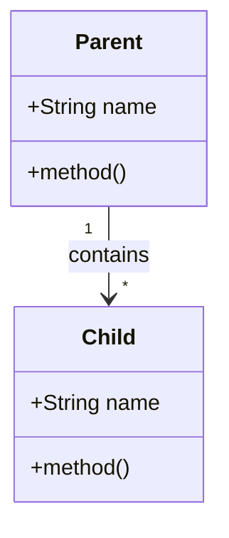
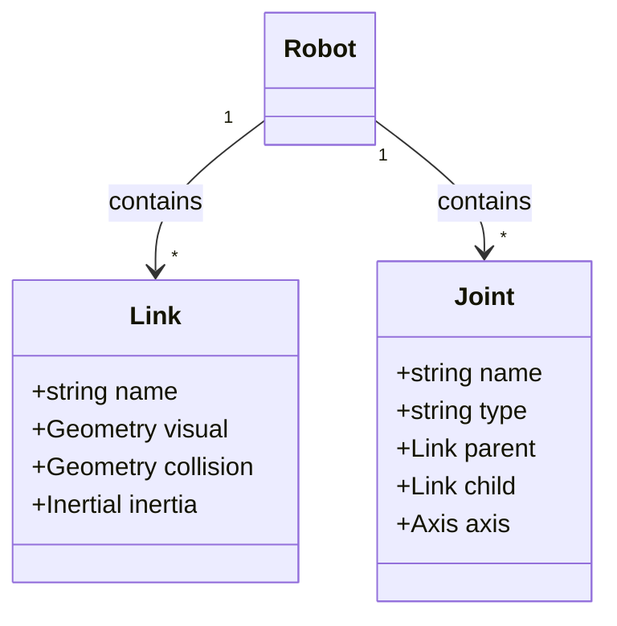

# Mermaid Class Diagram Template

Use this template for showing URDF structures, data models, and entity relationships.

## Basic Structure

## URDF Robot Description Example

## Best Practices

- **Relationships**: Show cardinality ("1", "*", "0..1")
- **Attributes**: Use `+` for public, `-` for private
- **Methods**: Include if relevant to understanding
- **Add title**: Always include `%%{title: "..."}%%`
- **Keep focused**: Max 6-8 classes per diagram
- **Clear labels**: Use descriptive class and attribute names
