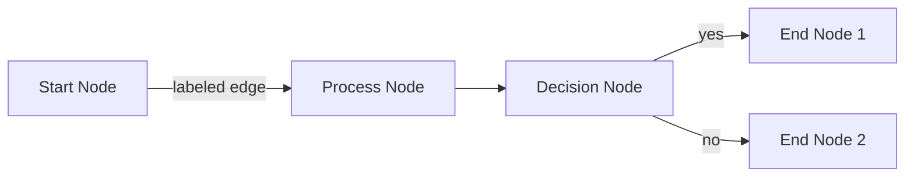
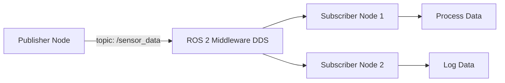

# Mermaid Flowchart Template

Use this template for showing data flow, node communication, and system architecture.

## Basic Structure

## ROS 2 Node Communication Example

## Best Practices

- **Max 10-12 nodes**: Keep diagrams simple
- **Clear labels**: Use descriptive names (not "node1", "node2")
- **Add title**: Always include `%%{title: "..."}%%` for accessibility
- **Direction**: Use `graph LR` (left-to-right) or `graph TD` (top-to-down)
- **Test rendering**: Verify in Docusaurus build before committing
