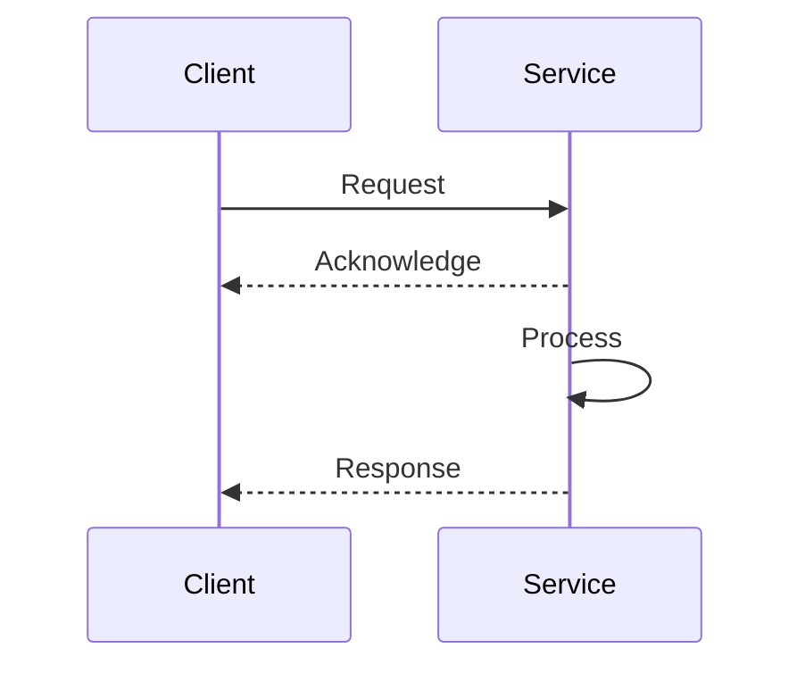
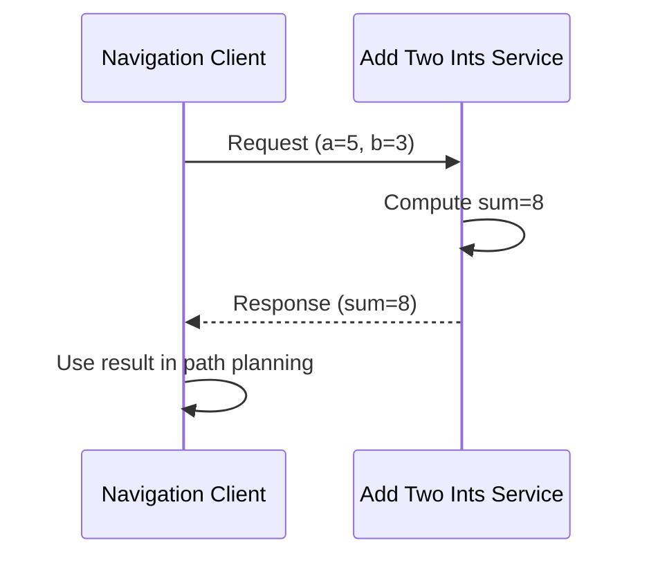

# Mermaid Sequence Diagram Template

Use this template for showing request-response patterns, service calls, and temporal ordering.

## Basic Structure

## ROS 2 Service Call Example

## Best Practices

- **Participants**: Define key actors/systems at top
- **Arrow types**:
  - `->>` : Solid arrow (synchronous call)
  - `-->>` : Dashed arrow (async response)
- **Self-calls**: Show internal processing with `Service->>Service`
- **Add title**: Always include `%%{title: "..."}%%`
- **Keep simple**: Max 6-8 interactions
