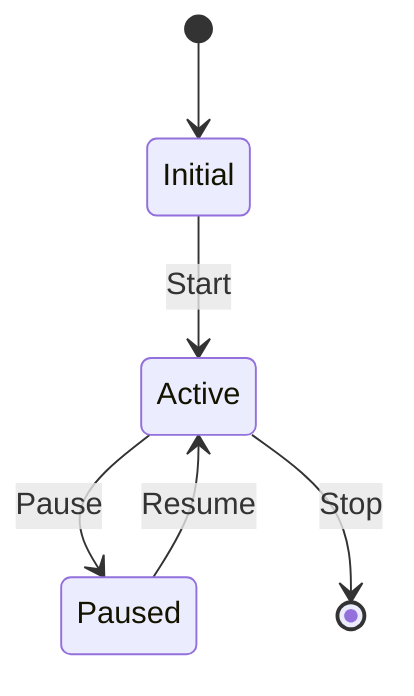
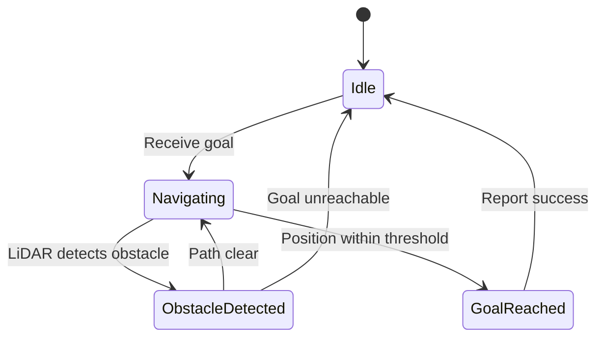

# Mermaid State Diagram Template

Use this template for showing robot behaviors, finite state machines, and mode transitions.

## Basic Structure

## Robot Navigation State Machine Example

## Best Practices

- **Start/End**: Use `[*]` for initial and final states
- **Transitions**: Label with triggering event or condition
- **Clear names**: Use descriptive state names (not "S1", "S2")
- **Add title**: Always include `%%{title: "..."}%%`
- **Keep manageable**: Max 8-10 states
- **Version**: Always use `stateDiagram-v2` (not v1)
