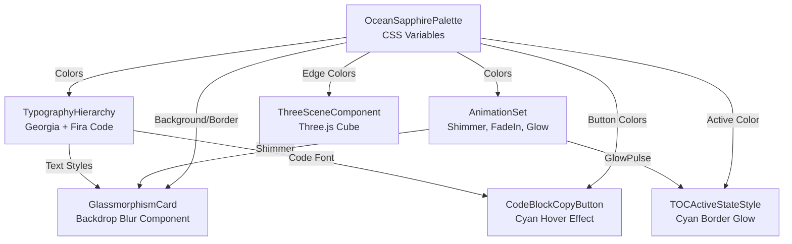

# Data Model: Ocean Sapphire Design System Entities

**Feature**: 003-ocean-sapphire-theme | **Date**: 2025-12-10
**Purpose**: Define CSS entities, component specifications, and design system primitives for Ocean Sapphire theme

---

## Entity 1: OceanSapphirePalette (CSS Variables)

**Description**: Core color palette defining all Ocean Sapphire hues used across the textbook site

**Attributes**:

| Variable Name | Value | Purpose | WCAG Contrast |
|---------------|-------|---------|---------------|
| `--ocean-primary-deep` | `#001529` | Primary background, deepest blue | Base for 8.2:1 contrast |
| `--ocean-mid-blue` | `#002140` | Gradient midpoint | Gradient transition |
| `--ocean-light-blue` | `#003a6d` | Gradient endpoint | Gradient transition |
| `--ocean-accent-cyan` | `#0096ff` | Interactive elements, borders | 7.5:1 on dark blue |
| `--ocean-soft-cyan` | `#00d4ff` | Active states, highlights | 8.1:1 on dark blue |
| `--ocean-text-white` | `#ffffff` | Headings (H1-H3) | 14.5:1 (AAA) |
| `--ocean-text-pale` | `#b8d4ff` | Body text | 8.2:1 (AAA) |
| `--ocean-text-caption` | `#8bb3e0` | Captions, metadata | 4.8:1 (AA) |
| `--ocean-card-bg` | `rgba(0, 50, 100, 0.3)` | Glassmorphism cards | Semi-transparent |
| `--ocean-card-bg-fallback` | `rgba(0, 50, 100, 0.7)` | Solid fallback | For no-blur browsers |
| `--ocean-border-glow` | `rgba(0, 150, 255, 0.3)` | Card borders, glows | Decorative |

**Lifecycle**:
- Defined once in `website/src/css/custom.css` `:root` block
- Loaded on page initialization
- Immutable during runtime (no dynamic theme switching)

**Validation Rules**:
- All colors must pass WCAG AAA (7:1) for normal text on dark blue backgrounds
- Headings must pass WCAG AAA (4.5:1) for large text
- Interactive elements must have 3:1 contrast for UI component requirements

**Relationships**:
- Used by: TypographyHierarchy, GlassmorphismCard, AnimationSet
- Extends: None (root-level design tokens)

---

## Entity 2: TypographyHierarchy

**Description**: Georgia serif font system with defined sizing, weights, and spacing for all text elements

**Attributes**:

| Element | Font Family | Size | Weight | Letter Spacing | Line Height | Color Variable |
|---------|-------------|------|--------|----------------|-------------|----------------|
| H1 | Georgia, serif | 4.5em | 300 | 8px | 1.2 | `--ocean-text-white` |
| H2 | Georgia, serif | 2.8em | 300 | 2px | 1.3 | `--ocean-text-white` |
| H3 | Georgia, serif | 1.8em | 400 | 0px | 1.4 | `--ocean-text-white` |
| Body | Georgia, serif | 1.1em | 400 | 0px | 2.0 | `--ocean-text-pale` |
| Caption | Georgia, serif (italic) | 0.9em | 400 | 0px | 1.6 | `--ocean-text-caption` |
| Code | 'Fira Code', 'Courier New', Consolas, monospace | 0.95em | 400 | 0px | 1.6 | `--ocean-text-pale` |

**CSS Variables**:
```css
--ocean-font-heading: Georgia, serif;
--ocean-font-body: Georgia, serif;
--ocean-font-code: 'Fira Code', 'Courier New', Consolas, monospace;
```

**Lifecycle**:
- Fonts loaded at page initialization
- Georgia: System font (instant availability)
- Fira Code: CDN loaded with `font-display: swap` (fallback to Courier New)

**Validation Rules**:
- All text must maintain line-height ≥1.5 for WCAG compliance
- Body text 16-18px minimum for readability
- Code blocks use monospace stack with reliable fallbacks

**Relationships**:
- Uses: OceanSapphirePalette for text colors
- Applied to: All Docusaurus markdown content, React components

---

## Entity 3: AnimationSet

**Description**: GPU-accelerated keyframe animations for Ocean Sapphire interactions

**Animations**:

### Shimmer Animation
**Purpose**: Gradient sweep effect on glassmorphism cards (hover state)

**Specification**:
```css
@keyframes shimmer {
  0% {
    background-position: -200% center;
  }
  100% {
    background-position: 200% center;
  }
}
```

**Properties**:
- Duration: 3s
- Timing: linear
- Iteration: infinite
- Trigger: `:hover` on `.ocean-card`
- GPU-Accelerated: Uses `background-position` (transform-like optimization)

---

### Fade-In Animation
**Purpose**: Page transition effect for chapter content

**Specification**:
```css
@keyframes fadeIn {
  from {
    opacity: 0;
    transform: translateY(20px);
  }
  to {
    opacity: 1;
    transform: translateY(0);
  }
}
```

**Properties**:
- Duration: 0.6s
- Timing: ease-out
- Iteration: once
- Trigger: Page load, scroll reveal
- GPU-Accelerated: Uses `transform` (compositor layer)

---

### Glow Pulse Animation
**Purpose**: Subtle cyan glow on active TOC item

**Specification**:
```css
@keyframes glowPulse {
  0%, 100% {
    box-shadow: 0 0 15px rgba(0, 150, 255, 0.3);
  }
  50% {
    box-shadow: 0 0 25px rgba(0, 150, 255, 0.5);
  }
}
```

**Properties**:
- Duration: 2s
- Timing: ease-in-out
- Iteration: infinite
- Trigger: `.table-of-contents__link--active`
- GPU-Accelerated: `box-shadow` with `will-change: box-shadow`

---

**Accessibility Override**:
```css
@media (prefers-reduced-motion: reduce) {
  *,
  *::before,
  *::after {
    animation-duration: 0.01ms !important;
    animation-iteration-count: 1 !important;
    transition-duration: 0.01ms !important;
  }
}
```

**CSS Variables**:
```css
--ocean-transition-fast: 0.3s;
--ocean-transition-medium: 0.6s;
--ocean-shimmer-duration: 3s;
```

**Lifecycle**:
- Defined in `website/src/css/animations.css`
- Loaded with main CSS bundle
- Applied via CSS classes (`.ocean-shimmer`, `.ocean-fade-in`, `.ocean-glow-pulse`)

**Validation Rules**:
- All animations must have `@media (prefers-reduced-motion)` overrides
- Frame rate target: 60fps (use `transform`/`opacity` only for smooth performance)
- No layout-triggering properties (`width`, `height`, `top`) in animations

**Relationships**:
- Uses: OceanSapphirePalette for glow colors
- Applied to: GlassmorphismCard, TOC component, page transitions

---

## Entity 4: GlassmorphismCard

**Description**: Reusable card component with `backdrop-filter: blur(10px)` and Ocean Sapphire styling

**Attributes**:

| Property | Value | Fallback (no `backdrop-filter`) |
|----------|-------|--------------------------------|
| Background | `rgba(0, 50, 100, 0.3)` | `rgba(0, 50, 100, 0.7)` |
| Backdrop Filter | `blur(10px)` | None (solid background) |
| Border | `1px solid rgba(0, 150, 255, 0.3)` | Same |
| Border Radius | `12px` | Same |
| Box Shadow | `0 10px 40px rgba(0, 0, 0, 0.5)` | Same |
| Padding | `2rem` | Same |

**States**:

### Default State
```css
.ocean-card {
  background: rgba(0, 50, 100, 0.7); /* Fallback */
  border: 1px solid rgba(0, 150, 255, 0.3);
  border-radius: 12px;
  padding: 2rem;
  box-shadow: 0 10px 40px rgba(0, 0, 0, 0.5);
  transition: all 0.3s ease;
}

@supports (backdrop-filter: blur(10px)) {
  .ocean-card {
    background: rgba(0, 50, 100, 0.3); /* Less opaque with blur */
    backdrop-filter: blur(10px);
    -webkit-backdrop-filter: blur(10px);
  }
}
```

### Hover State
```css
.ocean-card:hover {
  box-shadow: 0 10px 50px rgba(0, 150, 255, 0.3);
  transform: translateY(-5px);
  animation: shimmer 3s linear infinite;
  background: linear-gradient(
    90deg,
    rgba(0, 50, 100, 0.3) 0%,
    rgba(0, 150, 255, 0.2) 50%,
    rgba(0, 50, 100, 0.3) 100%
  );
  background-size: 200% 100%;
}
```

**Component Variants**:

1. **Stats Card** (Landing page)
   - Content: Number (2.5em cyan) + Label (0.9em caption)
   - Size: 200×150px
   - Layout: Flexbox, column, center-aligned

2. **Chapter Card** (Book reader)
   - Content: Chapter title + badges + description
   - Size: Full-width, auto-height
   - Layout: Flexbox, row, space-between

3. **Highlight Box** (Markdown content)
   - Content: 💎 icon + text content
   - Size: Full-width, auto-height
   - Layout: Grid with icon column + text column
   - Border-left: `4px solid #0096ff` (replaces standard border)

**Lifecycle**:
- React component: `website/src/components/OceanCard.tsx`
- CSS class: `.ocean-card` in `custom.css`
- Instantiated: Per user story requirements (4 stats cards on landing page, N chapter cards in docs)

**Validation Rules**:
- Must have fallback background with ≥0.7 opacity for browsers without `backdrop-filter`
- Interactive cards must have `:hover` and `:focus` states with WCAG-compliant contrast
- Must work on mobile (touch-friendly, no hover-only interactions)

**Relationships**:
- Uses: OceanSapphirePalette, AnimationSet (shimmer)
- Parent: LandingPage, BookReaderPage

---

## Entity 5: ThreeSceneComponent

**Description**: Three.js animated cube/sphere with Ocean Sapphire gradient edges for landing page

**Attributes**:

| Property | Value | Description |
|----------|-------|-------------|
| Geometry | BoxGeometry (1×1×1) | Simple cube (upgradable to IcosahedronGeometry) |
| Material | MeshBasicMaterial (wireframe) | Blue gradient edges |
| Edge Color Start | `#0096ff` | Ocean Sapphire accent cyan |
| Edge Color End | `#00d4ff` | Ocean Sapphire soft cyan |
| Rotation Speed | 0.01 rad/frame | Smooth 60fps animation |
| Camera Position | `z: 5` | Distance from cube |
| Scene Background | `transparent` | Blends with page gradient |
| Canvas Size | 50% viewport width × 400px height | Responsive on desktop |

**Component Structure**:
```typescript
interface ThreeSceneProps {
  width?: number;  // Default: container width
  height?: number; // Default: 400px
  rotationSpeed?: number; // Default: 0.01
  wireframe?: boolean; // Default: true
}
```

**Lifecycle**:
1. **Mount**: Initialize Three.js scene, camera, renderer
2. **Animate Loop**: `requestAnimationFrame` for 60fps
3. **Unmount**: Dispose renderer, remove canvas from DOM

**SSR Safety**:
- Wrapped in Docusaurus `<BrowserOnly>` component
- Only loaded after React hydration in browser
- Fallback: `<div>Loading 3D scene...</div>` during SSR

**Performance Optimization**:
- Use `THREE.WebGLRenderer({ alpha: true, antialias: true })` for transparency
- Limit to single geometry (no complex meshes)
- Dispose resources on unmount to prevent memory leaks

**Validation Rules**:
- Must maintain 60fps on mid-range devices (tested on iPhone 12, Galaxy S21)
- Fallback gracefully if WebGL unavailable (display static image or skip scene)
- Must not block page load (<3 second total landing page load time)

**Relationships**:
- Uses: OceanSapphirePalette for edge colors
- Parent: LandingPage component
- Rendered in: 50% left panel of landing page layout

---

## Entity 6: TOCActiveSateStyle

**Description**: Table of Contents active chapter styling with cyan left border and glow

**Attributes**:

| Property | Active State | Inactive State |
|----------|-------------|----------------|
| Border-Left | `3px solid #0096ff` | `0px` |
| Padding-Left | `1rem` | `0.5rem` |
| Box-Shadow | `0 0 15px rgba(0, 150, 255, 0.3)` | `none` |
| Color | `#00d4ff` (soft cyan) | `#b8d4ff` (pale blue) |
| Font-Weight | `500` (medium) | `400` (normal) |
| Animation | `glowPulse 2s infinite` | None |

**Swizzled Component**:
- Location: `website/src/theme/TOC/index.tsx`
- Mode: Wrap (minimal customization)
- CSS Class: `.ocean-toc-wrapper .table-of-contents__link--active`

**Lifecycle**:
- Applied: When user scrolls to section, Docusaurus adds `.table-of-contents__link--active` class
- Removed: When user scrolls to different section

**Validation Rules**:
- Active state must have WCAG AAA contrast (soft cyan on dark background = 8.1:1)
- Transition duration: 0.3s ease for smooth state changes
- Glow animation respects `prefers-reduced-motion`

**Relationships**:
- Uses: OceanSapphirePalette, AnimationSet (glowPulse)
- Applied to: Docusaurus TOC component (swizzled)

---

## Entity 7: CodeBlockCopyButton

**Description**: Copy-to-clipboard button in code blocks with Ocean Sapphire cyan hover effect

**Attributes**:

| Property | Default | Hover | Copied |
|----------|---------|-------|--------|
| Background | `rgba(0, 50, 100, 0.3)` | `rgba(0, 150, 255, 0.2)` | `rgba(0, 150, 255, 0.3)` |
| Border | `1px solid #0096ff` | Same | `1px solid #00d4ff` |
| Color | `#b8d4ff` | `#00d4ff` | `#ffffff` |
| Box-Shadow | None | `0 0 20px rgba(0, 150, 255, 0.5)` | None |
| Icon | Copy icon (Docusaurus default) | Same | Checkmark icon |

**Swizzled Component**:
- Location: `website/src/theme/CodeBlock/Content/index.tsx`
- Mode: Wrap (CSS-only customization)
- CSS Class: `.ocean-code-block button[class*="copyButton"]`

**Lifecycle**:
- Rendered: On every code block in markdown
- Click: Copies code to clipboard, transitions to "Copied" state for 2 seconds
- Reset: Returns to default state after 2 seconds

**Validation Rules**:
- Button must be keyboard-accessible (tab + enter)
- Hover and focus states must be visually distinct
- Copied state must provide visual feedback (color change + icon change)

**Relationships**:
- Uses: OceanSapphirePalette
- Applied to: Docusaurus CodeBlock component (swizzled)

---

## Entity Relationships Diagram



---

## Summary

**Total Entities**: 7

1. **OceanSapphirePalette**: 11 CSS variables (colors)
2. **TypographyHierarchy**: 6 text styles (Georgia serif system)
3. **AnimationSet**: 3 keyframe animations (shimmer, fadeIn, glowPulse)
4. **GlassmorphismCard**: 3 variants (stats, chapter, highlight)
5. **ThreeSceneComponent**: 1 React component (Three.js cube)
6. **TOCActiveStateStyle**: 1 swizzled component (TOC wrapper)
7. **CodeBlockCopyButton**: 1 swizzled component (CodeBlock wrapper)

**All entities align with**:
- ✅ FR-001 to FR-019 (Functional Requirements)
- ✅ Constitution v1.1.0 (Ocean Sapphire specifications)
- ✅ WCAG AAA (Contrast ratios, reduced motion support)
- ✅ Browser Compatibility (Fallback strategies for all advanced CSS)

**Ready for**: Contract generation (`contracts/` directory) and implementation tasks (`tasks.md`)
