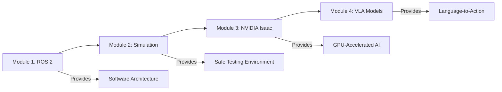
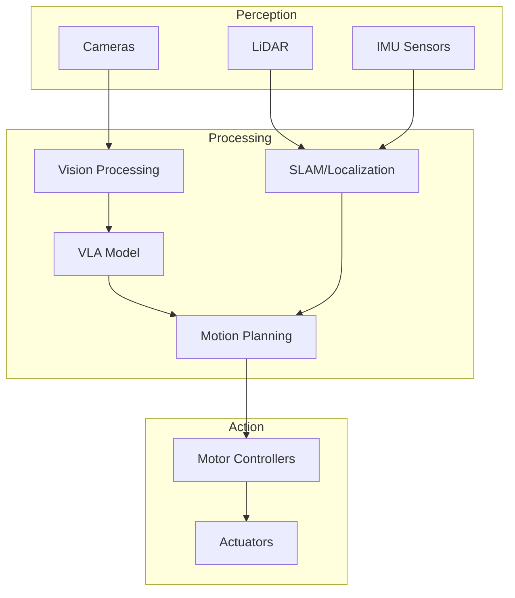

# Introduction to Physical AI & Humanoid Robotics

## Learning Objectives

By the end of this chapter, you will be able to:

- Explain the core principles of Physical AI and how it differs from traditional software AI
- Identify the key components of humanoid robotics systems and their interactions
- Implement a basic ROS 2 node to understand robot software architecture
- Describe the learning path from ROS 2 fundamentals through advanced Vision-Language-Action models
- Evaluate the role of simulation in accelerating robotics development

## Prerequisites

### Knowledge Prerequisites

- **Programming**: Basic Python proficiency (variables, functions, classes, imports)
- **Command Line**: Familiarity with terminal/bash commands
- **Math**: High school algebra and basic trigonometry (for understanding coordinate systems)

### Software Prerequisites

- **Operating System**: Ubuntu 22.04 LTS (recommended) or Ubuntu 20.04 LTS
- **Python**: Version 3.10 or higher
- **Terminal**: Bash shell access

### Installation Verification

To verify your Python installation:

```bash
python3 --version
```

Expected output: `Python 3.10.x` or higher

No ROS 2 installation is required yet—we'll guide you through that in Module 1.

## Introduction

Imagine your body's nervous system: your brain sends signals through nerves to muscles, sensors in your skin send feedback about temperature and pressure, and your eyes continuously stream visual data for processing. This intricate network allows you to navigate the world, manipulate objects, and respond to your environment in real-time. Now imagine building this same capability—but for a robot.

Physical AI represents the convergence of artificial intelligence and physical robotics. Unlike traditional AI that exists purely in software—analyzing text, generating images, or playing chess—Physical AI must interact with the real world. It must perceive its environment through sensors, reason about physical constraints like gravity and friction, and execute actions through motors and actuators. When we add the complexity of humanoid form factors—robots designed to operate in human environments and interact using human-like motions—the engineering challenge becomes immense.

This textbook will guide you through the complete stack of Physical AI for humanoid robotics. You'll start with ROS 2 (Robot Operating System 2), the industry-standard framework for robot software. You'll learn simulation with Gazebo and Unity to safely test algorithms before deploying to real hardware. You'll explore NVIDIA Isaac, a GPU-accelerated platform for AI-powered robotics. Finally, you'll work with Vision-Language-Action (VLA) models—the cutting edge of robotics AI that allows robots to understand natural language instructions and translate them into physical actions. By the end, you'll have the foundational knowledge to build intelligent robots that can see, understand, and act in the physical world.

## Theory

### What is Physical AI?

Physical AI refers to artificial intelligence systems that interact with and manipulate the physical world through robotic embodiment. Unlike purely digital AI (language models, recommendation systems, image classifiers), Physical AI must:

1. **Perceive the environment** through sensors (cameras, LiDAR, IMUs, force sensors)
2. **Reason about physics** including forces, torques, collision dynamics, and material properties
3. **Plan and execute actions** through actuators (motors, grippers, wheels)
4. **Operate in real-time** with latency constraints measured in milliseconds
5. **Handle uncertainty** from noisy sensors, unpredictable environments, and mechanical imprecision

Think of a chess-playing AI versus a robot that can physically move chess pieces. The former only needs to compute valid moves in an abstract game tree. The latter must visually identify pieces, plan a collision-free arm trajectory, grasp with appropriate force (not too weak or it drops the piece, not too strong or it crushes it), and place the piece precisely. The physical world introduces constraints that don't exist in pure software.

The challenge of Physical AI extends beyond traditional robotics. Modern Physical AI systems combine:

- **Classical robotics**: Kinematics, dynamics, control theory, and motion planning
- **Computer vision**: Object detection, pose estimation, semantic segmentation, and depth perception
- **Machine learning**: Reinforcement learning for policy optimization, imitation learning from demonstrations, and transfer learning across tasks
- **Natural language processing**: Understanding instructions, grounding language in physical actions, and reasoning about spatial relationships

This integration creates systems that can learn from experience, generalize to new situations, and adapt to changing environments—capabilities that were impossible with hand-coded robotics systems of the past. For example, a traditional industrial robot arm requires precise programming for each task and fails if objects are misaligned by even a few millimeters. A Physical AI system can learn to grasp novel objects, adjust to variations in placement, and recover from errors—all through learned behaviors rather than explicit programming.

The field has accelerated dramatically in recent years due to three key enablers:

1. **Simulation at scale**: Physics engines like NVIDIA Isaac and MuJoCo allow training millions of hours of robot experience in days, solving the data scarcity problem that plagued earlier approaches.

2. **GPU-accelerated training**: Parallel processing on GPUs enables reinforcement learning algorithms to iterate through millions of trial-and-error cycles, discovering optimal control policies without human intervention.

3. **Foundation models**: Large vision-language models pre-trained on internet-scale data provide robots with rich semantic understanding of objects, scenes, and instructions—knowledge that would take decades to manually encode.

### Humanoid Robotics: Why Human Form?

Humanoid robots—robots with human-like body structures including head, torso, arms, and legs—are designed to operate in environments built for humans. Consider:

- **Staircases** are designed for bipedal locomotion
- **Door handles** assume a grasping hand at ~1 meter height
- **Kitchen counters** are optimized for human arm reach
- **Tools** (hammers, screwdrivers, keyboards) are designed for human hands

Rather than redesigning the entire world for robots, humanoid form factors allow robots to use existing infrastructure. This makes them ideal for:

- Domestic assistance (cooking, cleaning, elder care)
- Manufacturing in human-scale workspaces
- Disaster response where wheeled robots can't navigate debris
- Social interaction where human-like appearance aids communication

The engineering challenges of humanoid robotics are immense. Bipedal locomotion—walking on two legs—is a control problem orders of magnitude harder than wheeled mobility. Humans unconsciously make thousands of micro-adjustments per second to maintain balance, using feedback from our vestibular system, proprioception, and vision. Replicating this in robots requires sophisticated sensor fusion, real-time control algorithms, and powerful actuators that can react within milliseconds.

Consider the complexity of a simple task like walking across a room:

- **Perception**: Cameras and depth sensors map the environment, identifying obstacles, floor texture, and changes in elevation.
- **Planning**: The robot computes a collision-free path from current position to goal, accounting for its kinematic constraints (how far it can step, how high it can lift its leg).
- **Control**: At each timestep (typically 100-1000 Hz), the robot computes joint torques to execute the planned motion while maintaining balance. This requires solving inverse kinematics equations and implementing stabilization controllers.
- **Adaptation**: If the robot steps on an unexpected surface (slippery floor, uneven tile), it must detect the perturbation and adjust its gait in real-time to avoid falling.

This multi-layered control stack—perception, planning, control, and adaptation—runs continuously, making humanoid robotics one of the most computationally demanding applications in Physical AI. Modern humanoid robots like Boston Dynamics' Atlas or Tesla's Optimus contain dozens of actuators, hundreds of sensors, and onboard computers that process gigabytes of data per second.

### The Four-Module Learning Path

This textbook follows a structured progression from fundamentals to advanced AI:



**Module 1: ROS 2 Fundamentals**
ROS 2 (Robot Operating System 2) is the middleware that connects robot components. You'll learn:
- Nodes (independent processes that perform computations)
- Topics (publish-subscribe messaging for sensor data)
- Services (request-response patterns for actions)
- Parameters (configuration management)

Think of ROS 2 as the nervous system: it routes messages between the "brain" (planning algorithms) and the "limbs" (motor controllers).

**Module 2: Gazebo & Unity Simulation**
Simulation allows you to test algorithms without expensive hardware or safety risks. You'll learn:
- Gazebo (physics-accurate simulation for robotics)
- Unity (high-fidelity graphics for vision systems)
- URDF (robot description format)
- Sensor simulation (cameras, LiDAR, IMUs)

Simulation accelerates development by 10-100x compared to hardware-only testing. A single real robot can test perhaps 10-20 scenarios per day due to setup time, battery life, and mechanical wear. In simulation, you can run thousands of scenarios in parallel, testing edge cases that would be dangerous or impossible in the real world (e.g., falling down stairs, colliding with objects). Simulation also enables "sim-to-real transfer"—training policies in simulation and deploying them on physical robots with minimal fine-tuning.

**Module 3: NVIDIA Isaac**
Isaac provides GPU-accelerated tools for AI-powered robotics:
- Isaac Sim (high-fidelity simulation with RTX ray tracing)
- Isaac Gym (massively parallel reinforcement learning)
- Perception AI (object detection, pose estimation, segmentation)

GPU acceleration allows training policies in hours instead of weeks. Traditional reinforcement learning on CPUs might train one robot instance at a time, requiring months of wall-clock time to gather sufficient experience. Isaac Gym can simulate thousands of robots in parallel on a single GPU, compressing months of learning into hours. This massive parallelization enables learning complex behaviors like dexterous manipulation, where a robot must coordinate 20+ joints to grasp fragile objects without crushing them. The platform also provides physically-based rendering for generating synthetic training data—millions of labeled images for computer vision models without manual annotation.

**Module 4: Vision-Language-Action (VLA) Models**
VLA models bridge natural language and physical actions:
- Vision encoders (understand scenes from camera images)
- Language models (parse instructions like "pick up the red mug")
- Action decoders (translate intent to motor commands)

This enables robots to understand open-ended human instructions rather than pre-programmed tasks. Traditional robots require explicit programming for each task: "move to position X, Y, Z; close gripper with force F; return to home." VLA models allow natural instructions: "clear the table and put the dishes in the sink." The model must understand the semantic meaning of "table," "dishes," and "sink," visually identify these objects in the scene, decompose the instruction into subtasks (grasp dish → navigate to sink → release), and execute the motion—all learned from data rather than hand-coded.

Recent breakthroughs like Google's RT-2 and Physical Intelligence's π0 demonstrate that robots can learn generalizable skills from diverse datasets, transferring knowledge across tasks. A model trained on "pick up a cup" can generalize to "pick up a wrench" because it has learned the abstract concept of grasping, not just a specific motion sequence. This paradigm shift—from programming robots to teaching them through data—is transforming Physical AI from a specialized engineering discipline to one accessible through machine learning techniques.

### System Architecture Overview

A typical Physical AI system has this architecture:



- **Perception Layer**: Sensors collect raw data about the environment
- **Processing Layer**: AI algorithms interpret data and make decisions
- **Action Layer**: Commands are sent to motors to execute physical motions

ROS 2 acts as the middleware connecting these layers with low-latency message passing.

## Code Examples

To get a taste of ROS 2, here's the simplest possible node—a "Hello World" for robotics. Don't worry if you don't understand every line yet; Module 1 will explain in detail.

```python
import rclpy
from rclpy.node import Node


class MinimalNode(Node):
    """
    Minimal ROS 2 node demonstrating basic structure.
    """

    def __init__(self):
        super().__init__("minimal_node")
        self.get_logger().info("Physical AI Node: Initialized")
        self.create_timer(1.0, self.timer_callback)
        self.count = 0

    def timer_callback(self):
        """Called every 1.0 seconds."""
        self.count += 1
        self.get_logger().info(f"Heartbeat {self.count}: System operational")


def main(args=None):
    """Main entry point for the ROS 2 node."""
    rclpy.init(args=args)
    node = MinimalNode()

    try:
        rclpy.spin(node)
    except KeyboardInterrupt:
        pass
    finally:
        node.destroy_node()
        rclpy.shutdown()


if __name__ == "__main__":
    main()
```

**Expected Output:**

```
[INFO] [minimal_node]: Physical AI Node: Initialized
[INFO] [minimal_node]: Heartbeat 1: System operational
[INFO] [minimal_node]: Heartbeat 2: System operational
[INFO] [minimal_node]: Heartbeat 3: System operational
^C
```

This demonstrates the core ROS 2 pattern:
1. **Create a Node** (line 6): Nodes are the fundamental computation unit
2. **Initialize** (line 10-13): Set up loggers and timers
3. **Callback** (line 15-18): Periodic execution (like a robot control loop)
4. **Spin** (line 26): Keep the node running until shutdown

## Exercises

### Exercise 1: Explore Your Environment

**Task**: Verify your system meets the prerequisites for this textbook.

**Steps**:
1. Check Python version: `python3 --version`
2. Check Ubuntu version: `lsb_release -a`
3. Check available disk space: `df -h ~`

**Success Criteria**:
- Python 3.10 or higher
- Ubuntu 22.04 or 20.04
- At least 20GB free disk space (needed for ROS 2 and simulation tools)

### Exercise 2: Conceptual Mapping

**Task**: For each of the following robot capabilities, identify which module(s) from the learning path would be most relevant:

1. Making a robot navigate around obstacles to reach a goal position
2. Training a robot to grasp objects of unknown shapes
3. Enabling a robot to understand the instruction "bring me a coffee"
4. Testing a new motion planning algorithm without risking hardware damage

**Success Criteria**: Write 1-2 sentences for each, explaining your reasoning. (Hint: Review the "Four-Module Learning Path" section.)

### Exercise 3: Research Physical AI Applications

**Task**: Find one real-world example of a Physical AI system (commercial product, research project, or open-source robot). Answer:

1. What sensors does it use for perception?
2. What actuators does it use for action?
3. What is its primary task or capability?
4. Does it use any AI/ML models? If so, for what purpose?

**Success Criteria**: Provide the name/source of the system and answer all four questions with specific details.

## Summary

Physical AI represents the next frontier of artificial intelligence—systems that can perceive, reason, and act in the physical world. Unlike purely digital AI, Physical AI must handle real-time sensor data, physics constraints, and uncertainty. Humanoid robotics applies these principles to human-shaped robots capable of operating in environments designed for people.

This textbook provides a structured path from ROS 2 fundamentals (the software backbone) through simulation tools (Gazebo, Unity), GPU-accelerated AI (NVIDIA Isaac), and finally to Vision-Language-Action models that enable natural language control. Each module builds on the previous, culminating in the skills needed to develop intelligent, physically-capable robots.

## Next Steps

Ready to dive into the technical details? The journey begins with **Module 1: ROS 2 Fundamentals**.

In Module 1, you'll learn how ROS 2 organizes robot software into modular nodes, how nodes communicate via topics and services, and how to create your first publisher-subscriber system. You'll explore the rclpy Python client library and learn to describe robots using URDF (Unified Robot Description Format).

This foundation in ROS 2 will prepare you for the simulation environments in Module 2, where you'll test your algorithms in virtual worlds before deploying to real hardware.
