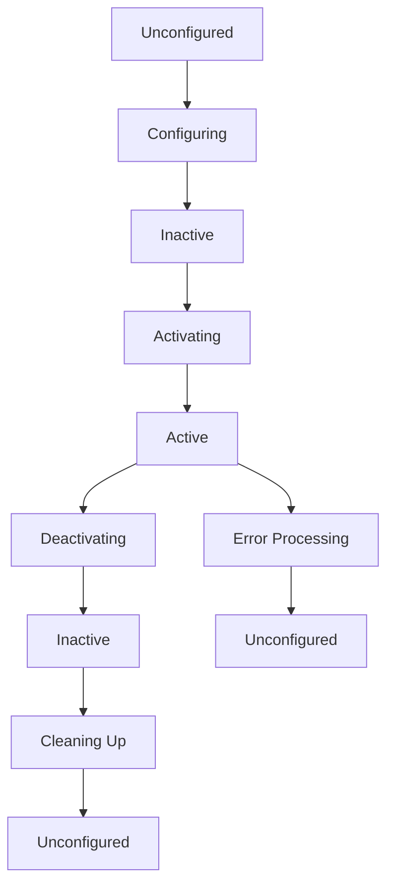
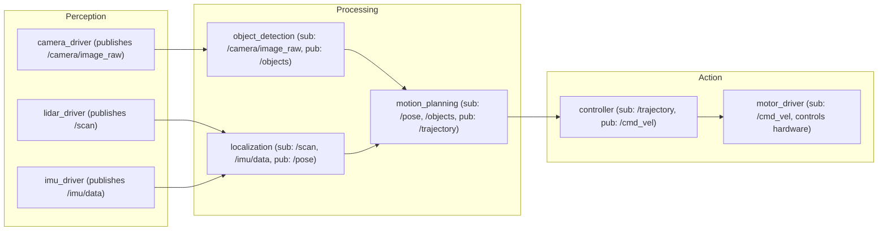

# ROS 2 Nodes and Architecture

## Learning Objectives

By the end of this chapter, you will be able to:

- Explain the purpose and role of nodes in ROS 2 architecture
- Implement a minimal ROS 2 node using the rclpy Python client library
- Configure node parameters and understand the node lifecycle
- Describe the relationship between nodes, topics, services, and actions
- Analyze a node graph to understand system architecture

## Prerequisites

### Knowledge Prerequisites

- **Python Programming**: Basic understanding of classes, methods, and imports (covered in intro.md)
- **Command Line**: Familiarity with terminal/bash commands for running ROS 2 nodes
- **Physical AI Concepts**: Understanding of Physical AI fundamentals from Chapter 0 (intro.md)

### Software Prerequisites

- **Operating System**: Ubuntu 22.04 LTS with ROS 2 Humble Hawksbill installed
- **Python**: Version 3.10 or higher (verified in intro.md)
- **Terminal**: Bash shell access

### Installation Verification

Verify your ROS 2 installation:

```bash
source /opt/ros/humble/setup.bash
ros2 --version
```

Expected output: `ros2 version X.X.X` (where X.X.X is the current version)

## Introduction

In the previous chapter, we explored Physical AI as a field that bridges artificial intelligence and physical robotics. We learned that Physical AI systems must perceive their environment, reason about physics, plan and execute actions, operate in real-time, and handle uncertainty. Now we begin our journey into the technical implementation with ROS 2 (Robot Operating System 2), the middleware that connects all components of a Physical AI system.

Think of your body's nervous system again: your brain communicates with your limbs through neural pathways, sending motor commands and receiving sensory feedback. In robotics, ROS 2 serves as the "nervous system"—it routes messages between different software components (nodes) that handle perception, planning, control, and action. Just as your nervous system allows your brain to control your arms without needing to understand the complex biomechanics of muscle fibers, ROS 2 allows high-level planning algorithms to control robot behavior without needing to understand the low-level hardware details.

ROS 2 nodes are the fundamental building blocks of robot software. Each node is an independent process that performs a specific computation: one node might process camera images to detect objects, another might plan robot motions, and a third might control the robot's motors. Nodes communicate with each other through topics (publish-subscribe messaging), services (request-response patterns), and actions (goal-oriented communication with feedback). This modular architecture allows complex robot behaviors to emerge from simple, reusable components.

In this chapter, we'll explore the foundational concept of ROS 2 nodes and understand how they form the backbone of any Physical AI system. We'll implement our first ROS 2 node, examine its internal structure, and learn how to configure and run it.

## Theory

### What is a ROS 2 Node?

A ROS 2 node is an independent process that performs computation in a robot system. Nodes are the fundamental building blocks of ROS 2 architecture and serve as containers for:

- **Publishers**: Send messages to topics
- **Subscribers**: Receive messages from topics
- **Services**: Provide request-response functionality
- **Actions**: Implement goal-oriented communication
- **Parameters**: Store configuration values
- **Timers**: Execute callbacks at specific intervals
- **TF broadcasters/listeners**: Handle coordinate frame transformations

Nodes are designed to be modular and reusable. A node that processes camera images can be used with any robot that has a camera. A node that controls a differential drive base can be used with any wheeled robot. This modularity allows robot systems to be built by connecting pre-built nodes like LEGO blocks.

### Node Architecture and Lifecycle

Each ROS 2 node follows a specific lifecycle pattern:



In practice, most simple nodes skip the full lifecycle and remain in the "Active" state throughout their execution. The lifecycle provides a way to manage resources and ensure proper initialization and shutdown, which is critical for safety in Physical AI systems.

### Node Communication Patterns

ROS 2 nodes communicate through three primary patterns:

1. **Topics (Publish-Subscribe)**: Asynchronous, one-to-many communication
   - Publishers send messages to topics without knowing who receives them
   - Subscribers receive messages from topics without knowing who sent them
   - Example: Camera node publishes images to `/camera/image_raw` topic

2. **Services (Request-Response)**: Synchronous, one-to-one communication
   - Client sends a request and waits for a response
   - Server processes the request and sends a response
   - Example: Navigation node requests a path from a path-planning service

3. **Actions (Goal-Feedback-Result)**: Asynchronous, goal-oriented communication
   - Client sends a goal and receives feedback during execution
   - Server executes the goal and sends final result
   - Example: Move robot to a specific location with progress feedback

### The Node Graph

The collection of all nodes and their communication relationships forms the "node graph." A typical Physical AI system might have this structure:



This architecture allows each component to focus on its specific task while communicating with other components through well-defined interfaces. The modularity makes the system easier to debug, test, and maintain.

### Why Nodes Matter for Physical AI

Nodes are particularly important for Physical AI systems because they:

1. **Enable parallel processing**: Different computational tasks can run in parallel on different nodes
2. **Provide fault isolation**: If one node fails, others can continue operating
3. **Support distributed computing**: Nodes can run on different computers and still communicate
4. **Allow resource management**: Different nodes can be assigned different priorities and resources
5. **Facilitate testing**: Individual nodes can be tested in isolation before integration

## Code Examples

Let's implement our first ROS 2 node. This minimal node will demonstrate the basic structure and initialization pattern:

```python
import rclpy
from rclpy.node import Node


class MinimalNode(Node):
    """
    Minimal ROS 2 node demonstrating basic structure.
    This node initializes and logs a startup message.
    """

    def __init__(self):
        # Initialize the parent Node class with a node name
        super().__init__("minimal_node")

        # Log a message to indicate successful initialization
        self.get_logger().info("Minimal node initialized successfully")

        # Store a simple counter for demonstration
        self.counter = 0

        # Create a timer that calls a callback every 1.0 seconds
        self.timer = self.create_timer(1.0, self.timer_callback)

        self.get_logger().info("Timer created, node ready to execute callbacks")

    def timer_callback(self):
        """Callback function called by the timer every 1.0 seconds."""
        self.counter += 1
        self.get_logger().info(f"Callback executed {self.counter} times")


def main(args=None):
    """
    Main entry point for the ROS 2 node.
    Initializes ROS 2, creates the node, and starts spinning.
    """
    # Initialize the ROS 2 client library
    rclpy.init(args=args)

    # Create an instance of our node
    minimal_node = MinimalNode()

    # Log that the node is ready to execute
    minimal_node.get_logger().info("Starting node execution...")

    try:
        # Start the spinning loop - this keeps the node running
        # and processes callbacks, messages, and services
        rclpy.spin(minimal_node)
    except KeyboardInterrupt:
        # Handle graceful shutdown when Ctrl+C is pressed
        minimal_node.get_logger().info("Interrupt received, shutting down...")
    finally:
        # Clean up resources when exiting
        minimal_node.destroy_node()
        rclpy.shutdown()


if __name__ == "__main__":
    main()
```

**Expected Output:**

```
[INFO] [minimal_node]: Minimal node initialized successfully
[INFO] [minimal_node]: Timer created, node ready to execute callbacks
[INFO] [minimal_node]: Starting node execution...
[INFO] [minimal_node]: Callback executed 1 times
[INFO] [minimal_node]: Callback executed 2 times
[INFO] [minimal_node]: Callback executed 3 times
[INFO] [minimal_node]: Callback executed 4 times
^C[INFO] [minimal_node]: Interrupt received, shutting down...
```

### Running the Node

To run this node, save it as `minimal_node.py` and execute:

```bash
# Source ROS 2 setup
source /opt/ros/humble/setup.bash

# Run the node
python3 minimal_node.py
```

### Understanding the Structure

1. **Node Class**: Inherits from `rclpy.node.Node` to get ROS 2 functionality
2. **Initialization**: `super().__init__('minimal_node')` registers the node with ROS 2
3. **Logging**: `self.get_logger().info()` provides debug information
4. **Timer**: `self.create_timer()` creates a periodic callback execution
5. **Main Function**: Handles ROS 2 initialization, node creation, and spinning
6. **Graceful Shutdown**: Try-finally block ensures proper cleanup

## Exercises

### Exercise 1: Node Customization

**Task**: Modify the minimal node to include a parameter for the timer interval.

**Steps**:
1. Add a parameter declaration in the `__init__` method: `self.declare_parameter('timer_period', 1.0)`
2. Use the parameter value instead of the hardcoded 1.0 seconds: `self.get_parameter('timer_period').value`
3. Run the node with a custom parameter: `ros2 run my_package minimal_node --ros-args -p timer_period:=2.0`

**Success Criteria**:
- Node accepts a timer_period parameter
- Timer executes at the specified interval
- Default value is 1.0 seconds if parameter not provided

### Exercise 2: Node Graph Visualization

**Task**: Create and run multiple instances of the minimal node to understand how nodes appear in the ROS 2 graph.

**Steps**:
1. Create two separate Python files with nodes having different names
2. Run both nodes simultaneously in different terminals
3. In a third terminal, run: `ros2 node list` to see all active nodes
4. Run: `ros2 run rqt_graph rqt_graph` to visualize the node graph

**Success Criteria**:
- Multiple nodes appear in the node list
- rqt_graph shows the node relationships
- You can distinguish between different node instances

### Exercise 3: Parameter Configuration

**Task**: Create a node that accepts multiple parameters for customization.

**Steps**:
1. Declare parameters for node name prefix, timer interval, and message content
2. Use these parameters to customize the node's behavior
3. Create a YAML configuration file with parameter values
4. Launch the node with the configuration file

**Success Criteria**:
- Node behavior changes based on parameters
- Configuration file successfully loads parameter values
- Node operates correctly with different parameter sets

## Summary

ROS 2 nodes form the foundation of any Physical AI system. They provide a modular, distributed architecture that enables complex robot behaviors through the interaction of simple, focused components. Each node performs a specific computational task and communicates with other nodes through topics, services, and actions.

We've learned that nodes follow a specific lifecycle, can be configured with parameters, and form a graph structure when multiple nodes interact. The minimal node example demonstrated the essential structure: inheriting from Node, initializing with a name, creating timers or subscribers, and implementing the main execution loop with rclpy.spin().

Understanding nodes is crucial because they provide the structure for all other ROS 2 concepts: topics, services, actions, parameters, and TF transforms all exist within the context of nodes. The modular architecture of nodes enables Physical AI systems to scale from simple single-robot applications to complex multi-robot systems.

## Next Steps

Now that you understand the fundamental concept of ROS 2 nodes, the next chapter explores the publish-subscribe communication pattern through topics. You'll learn how nodes communicate by publishing data to topics and subscribing to receive data from topics, enabling the distributed sensing and control that Physical AI systems require.

**Next Chapter**: [Module 1, Chapter 2: Topics and Publishers/Subscribers](/docs/module-1-ros2/chapter-2-topics-pubsub)