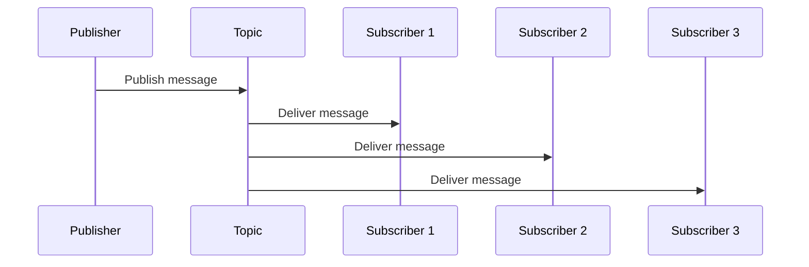

# ROS 2 Topics and Publishers/Subscribers

## Learning Objectives

By the end of this chapter, you will be able to:

- Explain the publish-subscribe communication pattern in ROS 2
- Implement a publisher node that sends messages to topics
- Implement a subscriber node that receives messages from topics
- Describe the relationship between topics, message types, and data flow
- Analyze topic communication in a running ROS 2 system

## Prerequisites

### Knowledge Prerequisites

- **ROS 2 Nodes**: Understanding of ROS 2 node structure and lifecycle (Chapter 1)
- **Python Programming**: Basic understanding of classes, methods, and imports
- **Physical AI Concepts**: Understanding of Physical AI fundamentals from Chapter 0 (intro.md)

### Software Prerequisites

- **Operating System**: Ubuntu 22.04 LTS with ROS 2 Humble Hawksbill installed
- **Python**: Version 3.10 or higher
- **Terminal**: Bash shell access

### Installation Verification

Verify your ROS 2 installation:

```bash
source /opt/ros/humble/setup.bash
ros2 topic --help
```

Expected output: Help text for the ros2 topic command.

## Introduction

In the previous chapter, we learned that ROS 2 nodes are the fundamental building blocks of robot software, each performing specific computations. However, nodes don't operate in isolation—they must communicate with each other to coordinate complex robot behaviors. The publish-subscribe pattern, implemented through topics in ROS 2, provides the primary mechanism for asynchronous, decoupled communication between nodes.

Think of a radio broadcast system: the radio station (publisher) continuously transmits music or news to the airwaves, and any number of radios (subscribers) can tune in to receive the same signal. Similarly, in ROS 2, a publisher node sends data to a topic, and any number of subscriber nodes can receive that same data. The publisher doesn't need to know who is listening, and subscribers don't need to know where the data comes from—this loose coupling makes the system flexible and robust.

In Physical AI systems, topics enable critical data flows: camera drivers publish image data, sensor nodes broadcast sensor readings, localization systems share robot position estimates, and control systems distribute motor commands. This distributed approach allows different components to operate independently while still coordinating effectively.

In this chapter, we'll explore the publish-subscribe pattern in depth, implement both publisher and subscriber nodes, and understand how topics enable the distributed sensing and control that Physical AI systems require.

## Theory

### The Publish-Subscribe Pattern

The publish-subscribe (pub/sub) pattern is a messaging paradigm where senders (publishers) broadcast messages to receivers (subscribers) through an intermediary (the topic). Key characteristics include:

1. **Asynchronous Communication**: Publishers send messages without waiting for responses
2. **Loose Coupling**: Publishers and subscribers don't need to know about each other
3. **Broadcasting**: One message can reach multiple subscribers simultaneously
4. **Decoupling in Time**: Subscribers can join or leave at any time
5. **Decoupling in Space**: Publishers and subscribers can run on different machines

This pattern is ideal for sensor data distribution, where one sensor node might publish camera images that are simultaneously consumed by object detection, SLAM, and visualization nodes.

### Topics and Message Types

In ROS 2, topics are named channels through which messages flow. Each topic has a specific message type that defines the structure and content of messages sent to that topic. For example:

- `/camera/image_raw` might use the `sensor_msgs/Image` message type
- `/cmd_vel` typically uses the `geometry_msgs/Twist` message type
- `/scan` commonly uses the `sensor_msgs/LaserScan` message type

Message types are defined using `.msg` files and contain fields with specific data types (integers, floats, strings, arrays, nested messages). The message type ensures that publishers and subscribers agree on the data format.

### Publisher-Subscriber Architecture

The typical architecture involves three components:



When a publisher sends a message to a topic, the ROS 2 middleware delivers that message to all active subscribers of that topic. This enables one-to-many communication patterns essential for Physical AI systems.

### Quality of Service (QoS)

ROS 2 provides Quality of Service settings that control how messages are delivered:

- **Reliability**: Reliable (all messages delivered) vs Best Effort (some messages may be dropped)
- **Durability**: Transient Local (late-joining subscribers get last message) vs Volatile (no historical messages)
- **History**: Keep All (store all messages) vs Keep Last (store only recent messages)
- **Depth**: Maximum number of messages to store when using Keep Last

QoS settings are crucial for Physical AI systems where some data (like sensor readings) must be delivered reliably while other data (like debug information) can be dropped if the system is overloaded.

### Topic Commands

ROS 2 provides command-line tools for inspecting topics:

```bash
# List all active topics
ros2 topic list

# Show message type of a topic
ros2 topic type /topic_name

# Echo messages from a topic
ros2 topic echo /topic_name

# Show topic statistics
ros2 topic info /topic_name
```

These tools are invaluable for debugging and understanding data flows in Physical AI systems.

## Code Examples

Let's implement both a publisher and subscriber to demonstrate the publish-subscribe pattern:

### Publisher Node

```python
import rclpy
from rclpy.node import Node
from std_msgs.msg import String


class MinimalPublisher(Node):
    """
    Publisher node that sends messages to a topic.
    Demonstrates the basic pattern of creating a publisher and sending messages.
    """

    def __init__(self):
        super().__init__("minimal_publisher")

        # Create a publisher for the 'topic' topic with String message type
        self.publisher = self.create_publisher(String, "topic", 10)

        # Create a timer to send messages at regular intervals
        timer_period = 0.5  # seconds
        self.timer = self.create_timer(timer_period, self.timer_callback)

        # Counter to track message number
        self.i = 0

        self.get_logger().info("Publisher node initialized")

    def timer_callback(self):
        """Callback function called by the timer to publish messages."""
        msg = String()
        msg.data = f"Hello World: {self.i}"

        # Publish the message
        self.publisher.publish(msg)

        # Log that a message was sent
        self.get_logger().info(f'Publishing: "{msg.data}"')
        self.i += 1


def main(args=None):
    """Main function to run the publisher node."""
    rclpy.init(args=args)

    minimal_publisher = MinimalPublisher()

    try:
        rclpy.spin(minimal_publisher)
    except KeyboardInterrupt:
        minimal_publisher.get_logger().info("Interrupt received, shutting down...")
    finally:
        minimal_publisher.destroy_node()
        rclpy.shutdown()


if __name__ == "__main__":
    main()
```

### Subscriber Node

```python
import rclpy
from rclpy.node import Node
from std_msgs.msg import String


class MinimalSubscriber(Node):
    """
    Subscriber node that receives messages from a topic.
    Demonstrates the basic pattern of creating a subscriber and handling messages.
    """

    def __init__(self):
        super().__init__("minimal_subscriber")

        # Create a subscription to the 'topic' topic with String message type
        self.subscription = self.create_subscription(
            String, "topic", self.listener_callback, 10
        )  # QoS history depth

        # Don't allow this subscription to be serialized on multiple threads
        self.subscription  # prevent unused variable warning
        self.get_logger().info("Subscriber node initialized")

    def listener_callback(self, msg):
        """Callback function called when a message is received."""
        # Log the received message
        self.get_logger().info(f'I heard: "{msg.data}"')


def main(args=None):
    """Main function to run the subscriber node."""
    rclpy.init(args=args)

    minimal_subscriber = MinimalSubscriber()

    try:
        rclpy.spin(minimal_subscriber)
    except KeyboardInterrupt:
        minimal_subscriber.get_logger().info("Interrupt received, shutting down...")
    finally:
        minimal_subscriber.destroy_node()
        rclpy.shutdown()


if __name__ == "__main__":
    main()
```

**Expected Output (Publisher):**

```
[INFO] [minimal_publisher]: Publisher node initialized
[INFO] [minimal_publisher]: Publishing: "Hello World: 0"
[INFO] [minimal_publisher]: Publishing: "Hello World: 1"
[INFO] [minimal_publisher]: Publishing: "Hello World: 2"
^C[INFO] [minimal_publisher]: Interrupt received, shutting down...
```

**Expected Output (Subscriber):**

```
[INFO] [minimal_subscriber]: Subscriber node initialized
[INFO] [minimal_subscriber]: I heard: "Hello World: 0"
[INFO] [minimal_subscriber]: I heard: "Hello World: 1"
[INFO] [minimal_subscriber]: I heard: "Hello World: 2"
^C[INFO] [minimal_subscriber]: Interrupt received, shutting down...
```

### Running the Example

To run this example, save the publisher code as `publisher_node.py` and the subscriber code as `subscriber_node.py`, then execute:

```bash
# Terminal 1: Run the publisher
source /opt/ros/humble/setup.bash
python3 publisher_node.py

# Terminal 2: Run the subscriber
source /opt/ros/humble/setup.bash
python3 subscriber_node.py
```

The publisher will send messages every 0.5 seconds, and the subscriber will receive and display them.

## Exercises

### Exercise 1: Topic Customization

**Task**: Modify the publisher to send a custom message type with multiple fields.

**Steps**:
1. Create a custom message file `CustomMessage.msg` with fields like `string name`, `int32 value`, and `float64 timestamp`
2. Update the publisher to use your custom message type
3. Update the subscriber to receive and process your custom message
4. Test that the custom message is properly transmitted between nodes

**Success Criteria**:
- Custom message type is properly defined
- Publisher sends custom messages with all fields populated
- Subscriber receives and displays all fields from the custom message
- Messages are transmitted successfully between nodes

### Exercise 2: Multiple Subscribers

**Task**: Run multiple subscriber nodes to demonstrate one-to-many communication.

**Steps**:
1. Run the publisher node in one terminal
2. Run two or more subscriber nodes in separate terminals
3. Observe that all subscribers receive the same messages from the publisher
4. Stop and start subscribers to see how late-joining subscribers behave

**Success Criteria**:
- Multiple subscribers receive identical messages from one publisher
- Adding/removing subscribers doesn't affect the publisher
- All subscribers receive messages as long as they are active

### Exercise 3: QoS Configuration

**Task**: Experiment with different Quality of Service settings.

**Steps**:
1. Configure the publisher with different QoS settings (e.g., best effort reliability)
2. Configure the subscriber with matching QoS settings
3. Test the behavior under different network conditions
4. Observe how QoS settings affect message delivery

**Success Criteria**:
- QoS settings are properly configured for both publisher and subscriber
- Behavior changes as expected with different QoS settings
- Understanding of when to use different QoS profiles

## Summary

The publish-subscribe pattern implemented through topics is fundamental to ROS 2's distributed architecture. It enables loose coupling between nodes, allowing Physical AI systems to scale from simple single-robot applications to complex multi-robot systems. Publishers broadcast data to topics without knowing who receives it, while subscribers receive data without knowing the source—this decoupling makes systems more flexible and robust.

We've implemented both publisher and subscriber nodes, demonstrating the core concepts of creating publishers/subscribers, defining message types, and handling callbacks. The example showed how one publisher can send messages to multiple subscribers simultaneously, enabling the distributed sensing and control that Physical AI systems require.

Understanding topics is crucial because they form the backbone of data flow in ROS 2 systems. Whether it's sensor data from cameras and LiDAR, robot state information, or control commands, most communication in Physical AI systems happens through topics using the publish-subscribe pattern.

## Next Steps

Now that you understand how nodes communicate through topics, the next chapter explores services and clients for request-response communication. You'll learn how to implement synchronous communication patterns that are essential for tasks requiring immediate responses, such as requesting a path from a planner or asking a sensor for its current configuration.

**Next Chapter**: [Module 1, Chapter 3: Services and Clients](/docs/module-1-ros2/chapter-3-services-clients)