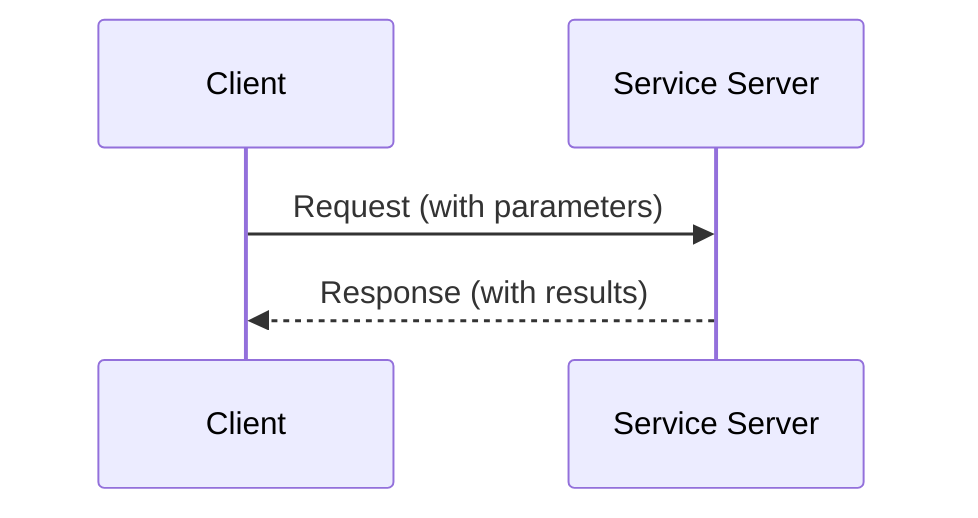

# ROS 2 Services and Clients

## Learning Objectives

By the end of this chapter, you will be able to:

- Explain the request-response communication pattern in ROS 2 services
- Implement a service server that responds to requests
- Implement a client that sends requests to services
- Compare and contrast services with topics for different use cases
- Analyze service communication in a running ROS 2 system

## Prerequisites

### Knowledge Prerequisites

- **ROS 2 Nodes**: Understanding of ROS 2 node structure and lifecycle (Chapter 1)
- **Python Programming**: Basic understanding of classes, methods, and imports
- **Topics & Publishers/Subscribers**: Understanding of pub/sub pattern (Chapter 2)
- **Physical AI Concepts**: Understanding of Physical AI fundamentals from Chapter 0 (intro.md)

### Software Prerequisites

- **Operating System**: Ubuntu 22.04 LTS with ROS 2 Humble Hawksbill installed
- **Python**: Version 3.10 or higher
- **Terminal**: Bash shell access

### Installation Verification

Verify your ROS 2 installation:

```bash
source /opt/ros/humble/setup.bash
ros2 service --help
```

Expected output: Help text for the ros2 service command.

## Introduction

In the previous chapters, we explored nodes (Chapter 1) and the publish-subscribe pattern for asynchronous communication (Chapter 2). While topics excel at broadcasting sensor data and distributing information to multiple subscribers, many robot operations require synchronous request-response interactions. This is where ROS 2 services come into play.

Consider asking a friend for directions: you ask a specific question ("How do I get to the library?"), they process your request, and they provide a specific response. This is fundamentally different from a radio broadcast where the station continuously sends information without expecting individual responses. Services in ROS 2 provide this request-response communication pattern, enabling synchronous interactions between nodes.

In Physical AI systems, services are essential for operations that require immediate responses or have specific outcomes: requesting a robot to move to a specific location and waiting for confirmation, asking a sensor for its current configuration, or commanding a gripper to open or close. Unlike topics, which are asynchronous and broadcast to all subscribers, services provide synchronous, point-to-point communication with guaranteed responses.

In this chapter, we'll explore the service-client pattern, implement both service servers and clients, and understand when to use services versus topics in Physical AI systems.

## Theory

### The Request-Response Pattern

The request-response pattern is a synchronous communication paradigm where:

1. **Client** sends a request to a service
2. **Service** processes the request and generates a response
3. **Client** receives the response and continues execution

This pattern is characterized by:

- **Synchronous**: Client waits for response before continuing
- **Point-to-point**: Direct communication between client and service
- **Guaranteed response**: Every request receives exactly one response
- **Request-response coupling**: Request and response types are predefined

### Services vs. Topics

| Aspect | Topics (Publish-Subscribe) | Services (Request-Response) |
|--------|---------------------------|----------------------------|
| **Timing** | Asynchronous | Synchronous |
| **Coupling** | Loose (publisher doesn't know subscribers) | Tight (client knows service) |
| **Response** | No response guaranteed | Response guaranteed |
| **Use Case** | Sensor data, status updates | Actions, queries, commands |
| **Scalability** | Many-to-many | One-to-one |

### Service Architecture

The service architecture involves two main components:



When a client sends a request to a service, it waits for the service to process the request and return a response. This synchronous behavior is essential for operations that must complete before the client can proceed.

### Service Types and Message Structure

Services use `.srv` files to define the interface between request and response. A service definition has two parts:

- **Request**: Parameters sent from client to service
- **Response**: Results sent from service to client

For example, the standard `AddTwoInts` service is defined as:

```
# Request
int64 a
int64 b
---
# Response
int64 sum
```

This defines a service that accepts two integers and returns their sum.

### Service Commands

ROS 2 provides command-line tools for inspecting services:

```bash
# List all active services
ros2 service list

# Show service type
ros2 service type /service_name

# Call a service from command line
ros2 service call /service_name service_type "{request: parameters}"

# Show service information
ros2 service info /service_name
```

These tools are valuable for debugging and understanding service interactions in Physical AI systems.

## Code Examples

Let's implement both a service server and client to demonstrate the request-response pattern:

### Service Server

```python
import rclpy
from rclpy.node import Node
from example_interfaces.srv import AddTwoInts


class MinimalService(Node):
    """
    Service server that responds to requests to add two integers.
    Demonstrates the basic pattern of creating a service and handling requests.
    """

    def __init__(self):
        super().__init__('minimal_service')

        # Create a service that adds two integers
        self.srv = self.create_service(
            AddTwoInts,
            'add_two_ints',
            self.add_two_ints_callback
        )

        self.get_logger().info('Service server initialized')

    def add_two_ints_callback(self, request, response):
        """
        Callback function called when a request is received.
        Processes the request and returns a response.
        """
        # Perform the addition
        response.sum = request.a + request.b

        # Log the operation
        self.get_logger().info(
            f'Incoming request: {request.a} + {request.b} = {response.sum}'
        )

        # Return the response
        return response


def main(args=None):
    """Main function to run the service server."""
    rclpy.init(args=args)

    minimal_service = MinimalService()

    try:
        rclpy.spin(minimal_service)
    except KeyboardInterrupt:
        minimal_service.get_logger().info('Interrupt received, shutting down...')
    finally:
        minimal_service.destroy_node()
        rclpy.shutdown()


if __name__ == '__main__':
    main()
```

### Service Client

```python
import sys
import rclpy
from rclpy.node import Node
from example_interfaces.srv import AddTwoInts


class MinimalClient(Node):
    """
    Service client that sends requests to the add_two_ints service.
    Demonstrates the basic pattern of creating a client and sending requests.
    """

    def __init__(self):
        super().__init__('minimal_client')

        # Create a client for the 'add_two_ints' service
        self.cli = self.create_client(AddTwoInts, 'add_two_ints')

        # Wait for the service to be available
        while not self.cli.wait_for_service(timeout_sec=1.0):
            self.get_logger().info('Service not available, waiting again...')

        self.get_logger().info('Client initialized and connected to service')

    def send_request(self, a, b):
        """
        Send a request to add two integers and return the future.
        """
        # Create a request object
        request = AddTwoInts.Request()
        request.a = a
        request.b = b

        # Call the service asynchronously
        self.get_logger().info(f'Sending request: {a} + {b}')
        future = self.cli.call_async(request)
        return future


def main(args=None):
    """Main function to run the client and send requests."""
    rclpy.init(args=args)

    minimal_client = MinimalClient()

    # Check if command line arguments are provided
    if len(sys.argv) != 3:
        print('Usage: python3 client.py <int1> <int2>')
        return

    # Parse command line arguments
    try:
        a = int(sys.argv[1])
        b = int(sys.argv[2])
    except ValueError:
        print('Please provide two integers as arguments')
        return

    # Send the request
    future = minimal_client.send_request(a, b)

    try:
        # Spin until the future is complete
        rclpy.spin_until_future_complete(minimal_client, future)

        # Get the response
        response = future.result()

        # Print the result
        print(f'Result of {a} + {b} = {response.sum}')

    except KeyboardInterrupt:
        minimal_client.get_logger().info('Interrupt received, shutting down...')
    finally:
        minimal_client.destroy_node()
        rclpy.shutdown()


if __name__ == '__main__':
    main()
```

**Expected Output (Service Server):**

```
[INFO] [minimal_service]: Service server initialized
[INFO] [minimal_service]: Incoming request: 2 + 3 = 5
[INFO] [minimal_service]: Incoming request: 10 + 5 = 15
^C[INFO] [minimal_service]: Interrupt received, shutting down...
```

**Expected Output (Service Client):**

```
[INFO] [minimal_client]: Service not available, waiting again...
[INFO] [minimal_client]: Client initialized and connected to service
[INFO] [minimal_client]: Sending request: 2 + 3
Result of 2 + 3 = 5
```

### Running the Example

To run this example, save the service code as `service_server.py` and the client code as `service_client.py`, then execute:

```bash
# Terminal 1: Run the service server
source /opt/ros/humble/setup.bash
python3 service_server.py

# Terminal 2: Run the client (while server is running)
source /opt/ros/humble/setup.bash
python3 service_client.py 2 3
```

The client will send a request to add 2 and 3, the service will process it, and the client will receive and display the result.

## Exercises

### Exercise 1: Custom Service

**Task**: Create a custom service to control a robot's LED.

**Steps**:
1. Define a custom service message `SetLED.srv` with fields for LED ID and brightness (0-100)
2. Implement a service server that simulates controlling an LED
3. Implement a client that sends requests to change LED brightness
4. Test the service with different brightness values

**Success Criteria**:
- Custom service message is properly defined
- Service server processes LED control requests
- Client successfully sends requests and receives responses
- Service operates correctly with different brightness values

### Exercise 2: Service Integration

**Task**: Integrate services with the publisher/subscriber pattern from Chapter 2.

**Steps**:
1. Create a publisher that sends sensor data to a topic
2. Create a service that processes the latest sensor data when requested
3. Create a client that requests processed data from the service
4. Demonstrate how services can complement topics in a system

**Success Criteria**:
- Publisher continuously sends sensor data
- Service responds to requests with processed data
- Client receives and displays processed results
- System demonstrates both communication patterns working together

### Exercise 3: Error Handling

**Task**: Implement robust error handling in service communication.

**Steps**:
1. Add timeout handling to the client when waiting for service responses
2. Implement error responses in the service server for invalid inputs
3. Test behavior when the service is not available
4. Handle service call failures gracefully

**Success Criteria**:
- Client handles service timeouts appropriately
- Service returns error responses for invalid inputs
- System behaves predictably when services are unavailable
- Error conditions are properly logged and handled

## Summary

Services provide the request-response communication pattern essential for synchronous interactions in ROS 2 systems. Unlike topics, which enable asynchronous broadcasting, services guarantee responses and enable direct client-service communication. This makes them ideal for operations requiring immediate results, such as robot commands, sensor queries, and action execution.

We've implemented both service servers and clients, demonstrating the core concepts of creating services, handling requests, and sending responses. The example showed how clients send requests and wait for responses, creating synchronous interactions between nodes.

Understanding when to use services versus topics is crucial for Physical AI system design. Use services for operations that require immediate responses or have specific outcomes, and use topics for continuous data distribution like sensor readings or status updates.

## Next Steps

Now that you understand both publish-subscribe and request-response communication patterns, the next chapter explores the rclpy Python client library in depth. You'll learn advanced features like parameters, quality of service settings, and lifecycle nodes that provide additional control over ROS 2 node behavior.

**Next Chapter**: [Module 1, Chapter 4: rclpy Python Client Library](/docs/module-1-ros2/chapter-4-rclpy-python-client)