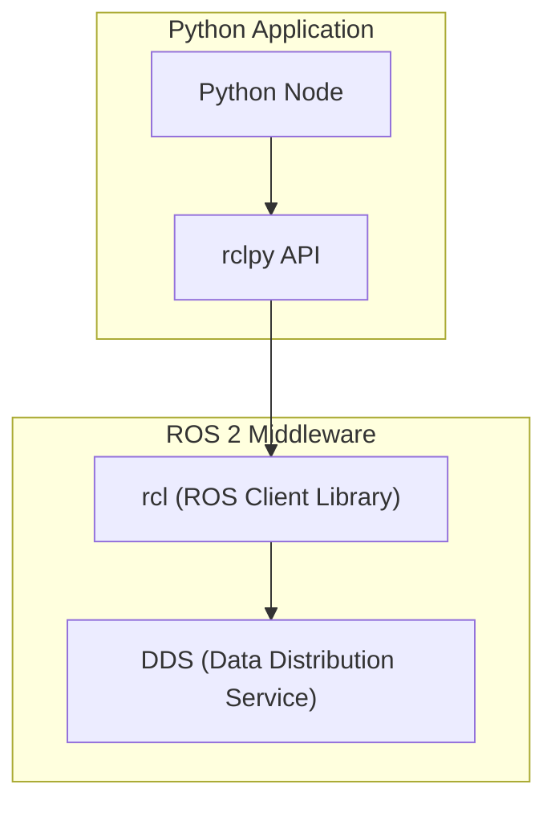

# rclpy Python Client Library

## Learning Objectives

By the end of this chapter, you will be able to:

- Explain the rclpy library architecture and its role in ROS 2 Python development
- Implement advanced node features using rclpy parameters, timers, and callbacks
- Configure Quality of Service (QoS) settings for robust communication
- Utilize lifecycle nodes for complex robot state management
- Apply rclpy best practices for Physical AI applications

## Prerequisites

### Knowledge Prerequisites

- **ROS 2 Nodes**: Understanding of ROS 2 node structure and lifecycle (Chapter 1)
- **Topics & Publishers/Subscribers**: Understanding of pub/sub pattern (Chapter 2)
- **Services & Clients**: Understanding of request/response pattern (Chapter 3)
- **Python Programming**: Intermediate understanding of classes, methods, and imports
- **Physical AI Concepts**: Understanding of Physical AI fundamentals from Chapter 0 (intro.md)

### Software Prerequisites

- **Operating System**: Ubuntu 22.04 LTS with ROS 2 Humble Hawksbill installed
- **Python**: Version 3.10 or higher
- **Terminal**: Bash shell access

### Installation Verification

Verify your rclpy installation:

```bash
source /opt/ros/humble/setup.bash
python3 -c "import rclpy; print('rclpy version:', rclpy.__version__)"
```

Expected output: rclpy version information.

## Introduction

In the previous chapters, we explored the fundamental communication patterns in ROS 2: nodes (Chapter 1), topics (Chapter 2), and services (Chapter 3). We've been using the rclpy Python client library throughout, but we've only scratched the surface of its capabilities. The rclpy library is the Python binding for the ROS 2 Client Library (rcl), providing Python developers with access to all ROS 2 features.

Think of rclpy as the bridge between Python and the ROS 2 middleware. Just as a translation service allows speakers of different languages to communicate effectively, rclpy translates Python code into ROS 2 operations, enabling Python-based nodes to participate fully in ROS 2 systems. This is particularly important for Physical AI systems, where Python's rich ecosystem of machine learning and computer vision libraries (NumPy, OpenCV, PyTorch, TensorFlow) can be seamlessly integrated with ROS 2's distributed architecture.

In Physical AI applications, rclpy enables developers to leverage Python's strengths in data processing, machine learning, and rapid prototyping while maintaining the robust communication patterns that ROS 2 provides. Whether you're implementing computer vision algorithms, machine learning models, or complex control systems, rclpy provides the tools to integrate them into a ROS 2 ecosystem.

In this chapter, we'll dive deep into rclpy's advanced features, exploring parameters, Quality of Service settings, and lifecycle management that are essential for production-ready Physical AI systems.

## Theory

### rclpy Architecture

The rclpy library sits between Python applications and the ROS 2 middleware:



rclpy provides Pythonic interfaces to ROS 2 concepts while maintaining the performance and reliability of the underlying C-based ROS Client Library (rcl).

### Parameters System

Parameters in ROS 2 provide a way to configure nodes at runtime without recompiling. The parameters system offers:

- **Dynamic reconfiguration**: Parameters can be changed while nodes are running
- **Hierarchical organization**: Parameters can be organized in namespaces
- **Type safety**: Parameters have strict type definitions
- **Default values**: Parameters can have default values specified at declaration
- **Validation**: Parameter values can be validated before acceptance

Parameters are crucial for Physical AI systems where operational parameters (sensor thresholds, control gains, safety limits) may need adjustment during deployment.

### Quality of Service (QoS) Profiles

QoS profiles control how messages are delivered in ROS 2 systems:

- **Reliability**: Reliable (all messages delivered) vs Best Effort (some messages may be dropped)
- **Durability**: Transient Local (late-joining subscribers get last message) vs Volatile (no historical messages)
- **History**: Keep All (store all messages) vs Keep Last (store only recent messages)
- **Depth**: Maximum number of messages to store when using Keep Last

QoS settings are essential for Physical AI systems where different data types have different requirements: sensor data might require reliable delivery while debug information can tolerate best-effort delivery.

### Lifecycle Nodes

Lifecycle nodes provide a structured approach to node state management with well-defined transitions:

- **Unconfigured**: Node created but not configured
- **Inactive**: Node configured but not active
- **Active**: Node running and processing data
- **Finalized**: Node cleaned up and ready for destruction

This state machine approach is important for Physical AI systems that need to manage complex initialization sequences, safety states, and graceful shutdown procedures.

### Threading and Concurrency

rclpy handles threading and concurrency through:

- **Single-threaded executor**: Processes callbacks sequentially
- **Multi-threaded executor**: Processes callbacks in parallel
- **Callback groups**: Organize callbacks for execution control
- **Mutual exclusion**: Prevent race conditions in node state

Proper concurrency management is critical for Physical AI systems that must handle multiple sensor streams and control outputs simultaneously.

## Code Examples

Let's implement a comprehensive example that demonstrates advanced rclpy features:

```python
import rclpy
from rclpy.node import Node
from rclpy.executors import MultiThreadedExecutor
from rclpy.callback_groups import MutuallyExclusiveCallbackGroup
from rclpy.qos import QoSProfile, ReliabilityPolicy, HistoryPolicy
from std_msgs.msg import String
from sensor_msgs.msg import LaserScan
from geometry_msgs.msg import Twist
import time


class AdvancedNode(Node):
    """
    Advanced ROS 2 node demonstrating rclpy features:
    - Parameters with validation
    - Quality of Service settings
    - Threading and callback groups
    - Advanced publisher/subscriber patterns
    """

    def __init__(self):
        super().__init__('advanced_node')

        # 1. Parameters with validation
        self.declare_parameter('robot_name', 'physical_ai_robot')
        self.declare_parameter('max_velocity', 1.0)
        self.declare_parameter('safety_distance', 0.5)
        self.declare_parameter('sensor_timeout', 1.0)

        # Access parameters
        self.robot_name = self.get_parameter('robot_name').value
        self.max_velocity = self.get_parameter('max_velocity').value
        self.safety_distance = self.get_parameter('safety_distance').value
        self.sensor_timeout = self.get_parameter('sensor_timeout').value

        self.get_logger().info(f'Node initialized for robot: {self.robot_name}')

        # 2. Create callback groups for threading control
        self.sensor_callback_group = MutuallyExclusiveCallbackGroup()
        self.control_callback_group = MutuallyExclusiveCallbackGroup()

        # 3. Quality of Service profiles
        sensor_qos = QoSProfile(
            depth=10,
            reliability=ReliabilityPolicy.RELIABLE,
            history=HistoryPolicy.KEEP_LAST
        )

        control_qos = QoSProfile(
            depth=1,
            reliability=ReliabilityPolicy.BEST_EFFORT,
            history=HistoryPolicy.KEEP_LAST
        )

        # 4. Publishers with QoS settings
        self.cmd_vel_publisher = self.create_publisher(
            Twist,
            'cmd_vel',
            control_qos
        )

        self.status_publisher = self.create_publisher(
            String,
            'status',
            sensor_qos
        )

        # 5. Subscribers with QoS settings and callback groups
        self.scan_subscription = self.create_subscription(
            LaserScan,
            'scan',
            self.scan_callback,
            sensor_qos,
            callback_group=self.sensor_callback_group
        )

        # 6. Timers with different periods
        self.status_timer = self.create_timer(
            1.0,  # 1 second
            self.status_timer_callback,
            callback_group=self.control_callback_group
        )

        self.control_timer = self.create_timer(
            0.1,  # 100ms - more frequent for control
            self.control_timer_callback,
            callback_group=self.control_callback_group
        )

        # 7. Node state variables
        self.latest_scan = None
        self.safety_mode = False
        self.last_scan_time = time.time()

        self.get_logger().info('Advanced node initialized with all features')

    def scan_callback(self, msg):
        """Callback for laser scan messages with safety checks."""
        self.latest_scan = msg
        self.last_scan_time = time.time()

        # Check for obstacles
        if self.has_obstacle_ahead(msg):
            self.safety_mode = True
            self.get_logger().warn('Obstacle detected! Entering safety mode.')
        else:
            self.safety_mode = False

    def has_obstacle_ahead(self, scan_msg):
        """Check if there's an obstacle in the forward direction."""
        # Check the middle portion of the scan (forward direction)
        num_readings = len(scan_msg.ranges)
        forward_start = num_readings // 2 - num_readings // 10
        forward_end = num_readings // 2 + num_readings // 10

        for i in range(forward_start, forward_end):
            if 0 < scan_msg.ranges[i] < self.safety_distance:
                return True
        return False

    def status_timer_callback(self):
        """Periodic status update."""
        status_msg = String()
        status_msg.data = (
            f'Robot: {self.robot_name}, Safety: {self.safety_mode}, Time: {time.time()}'
        )
        self.status_publisher.publish(status_msg)

    def control_timer_callback(self):
        """Periodic control loop."""
        # Check sensor timeout
        if time.time() - self.last_scan_time > self.sensor_timeout:
            self.get_logger().error('Sensor timeout! Stopping robot.')
            self.stop_robot()
            return

        # Generate control command based on safety state
        cmd = Twist()
        if self.safety_mode:
            # Stop the robot if obstacle detected
            cmd.linear.x = 0.0
            cmd.angular.z = 0.0
        else:
            # Move forward at safe speed
            cmd.linear.x = min(self.max_velocity, 0.5)
            cmd.angular.z = 0.0

        self.cmd_vel_publisher.publish(cmd)

    def stop_robot(self):
        """Emergency stop function."""
        cmd = Twist()
        cmd.linear.x = 0.0
        cmd.angular.z = 0.0
        self.cmd_vel_publisher.publish(cmd)


def main(args=None):
    """Main function with multi-threaded executor."""
    rclpy.init(args=args)

    # Create the advanced node
    advanced_node = AdvancedNode()

    # Use multi-threaded executor to handle callbacks in parallel
    executor = MultiThreadedExecutor(num_threads=4)
    executor.add_node(advanced_node)

    try:
        # Spin with the multi-threaded executor
        advanced_node.get_logger().info(
            'Starting advanced node with multi-threaded executor...'
        )
        executor.spin()
    except KeyboardInterrupt:
        advanced_node.get_logger().info('Interrupt received, shutting down...')
    finally:
        # Cleanup
        advanced_node.destroy_node()
        rclpy.shutdown()
        executor.shutdown()


if __name__ == '__main__':
    main()
```

**Expected Output:**

```
[INFO] [advanced_node]: Node initialized for robot: physical_ai_robot
[INFO] [advanced_node]: Advanced node initialized with all features
[INFO] [advanced_node]: Starting advanced node with multi-threaded executor...
[WARN] [advanced_node]: Obstacle detected! Entering safety mode.
[INFO] [advanced_node]: Robot: physical_ai_robot, Safety: False, Time: 1234567890.123
^C[INFO] [advanced_node]: Interrupt received, shutting down...
```

### Running the Example

To run this example, save it as `advanced_node.py` and execute:

```bash
# Source ROS 2 setup
source /opt/ros/humble/setup.bash

# Run with custom parameters
python3 advanced_node.py --ros-args -p robot_name:=my_robot -p max_velocity:=0.8
```

### Parameter Configuration File

You can also create a YAML configuration file to set parameters:

```yaml
# config/advanced_node_params.yaml
advanced_node:
  ros__parameters:
    robot_name: 'configured_robot'
    max_velocity: 0.75
    safety_distance: 0.6
    sensor_timeout: 1.5
```

Then run with the configuration file:

```bash
ros2 run my_package advanced_node --ros-args --params-file config/advanced_node_params.yaml
```

## Exercises

### Exercise 1: Parameter Validation

**Task**: Add parameter validation to the advanced node.

**Steps**:
1. Implement custom parameter validation callbacks
2. Validate that max_velocity is within safe limits (e.g., 0.0 to 2.0 m/s)
3. Validate that safety_distance is positive
4. Test parameter changes at runtime using ros2 param commands

**Success Criteria**:
- Parameter validation prevents invalid values
- Node continues operating with valid parameters
- Validation errors are properly logged

### Exercise 2: QoS Experimentation

**Task**: Experiment with different Quality of Service profiles.

**Steps**:
1. Create publishers with different QoS settings
2. Test behavior under network stress
3. Observe how reliability and durability affect message delivery
4. Document when to use different QoS profiles

**Success Criteria**:
- Different QoS profiles are properly configured
- Behavior changes as expected under different conditions
- Understanding of QoS impact on system performance

### Exercise 3: Lifecycle Node Implementation

**Task**: Convert the advanced node to use the lifecycle node pattern.

**Steps**:
1. Inherit from LifecycleNode instead of Node
2. Implement the required lifecycle callbacks (on_configure, on_activate, etc.)
3. Test the state transitions
4. Compare with the regular node implementation

**Success Criteria**:
- Lifecycle node properly implements state transitions
- Node behaves correctly in each state
- State changes are properly logged and managed

## Summary

The rclpy Python client library provides comprehensive access to ROS 2 features, enabling Python developers to build sophisticated Physical AI systems. We've explored advanced features including parameters for runtime configuration, Quality of Service settings for robust communication, callback groups for threading control, and multi-threaded execution for concurrent processing.

Parameters enable runtime configuration of Physical AI systems without code changes, while QoS profiles ensure appropriate handling of different data types. The threading and callback group system allows for efficient processing of multiple data streams simultaneously, which is essential for real-time Physical AI applications.

Understanding rclpy's advanced features is crucial for building production-ready Physical AI systems that can handle the complexity and real-time requirements of physical robotics applications.

## Next Steps

Now that you understand the core ROS 2 concepts and the rclpy library, the next chapter explores URDF (Unified Robot Description Format), which is essential for describing robot geometry and kinematics. You'll learn how to define robot models that ROS 2 systems can use for simulation, visualization, and control.

**Next Chapter**: [Module 1, Chapter 5: URDF Robot Description](/docs/module-1-ros2/chapter-5-urdf-robot-description)