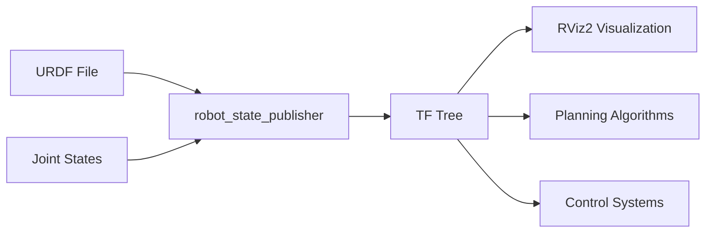

# URDF Robot Description

## Learning Objectives

By the end of this chapter, you will be able to:

- Explain the purpose and structure of URDF (Unified Robot Description Format) files
- Create URDF models for simple robots with links, joints, and visual elements
- Integrate URDF models with ROS 2 for visualization and simulation
- Understand the relationship between URDF and robot kinematics
- Apply URDF best practices for Physical AI applications

## Prerequisites

### Knowledge Prerequisites

- **ROS 2 Nodes**: Understanding of ROS 2 node structure and lifecycle (Chapter 1)
- **Topics & Publishers/Subscribers**: Understanding of pub/sub pattern (Chapter 2)
- **Services & Clients**: Understanding of request/response pattern (Chapter 3)
- **rclpy Python Client Library**: Understanding of advanced rclpy features (Chapter 4)
- **Physical AI Concepts**: Understanding of Physical AI fundamentals from Chapter 0 (intro.md)

### Software Prerequisites

- **Operating System**: Ubuntu 22.04 LTS with ROS 2 Humble Hawksbill installed
- **Python**: Version 3.10 or higher
- **Additional Tools**: RViz2 for visualization, xacro for XML macros
- **Terminal**: Bash shell access

### Installation Verification

Verify your URDF tools installation:

```bash
source /opt/ros/humble/setup.bash
ros2 pkg executables urdf
ros2 pkg executables xacro
```

Expected output: Lists of available URDF and xacro tools.

## Introduction

In the previous chapters, we've built a solid foundation in ROS 2 concepts: nodes for computation, topics for asynchronous communication, services for synchronous requests, and the rclpy library for Python development. However, to create Physical AI systems, we need to represent actual robots with their physical properties, geometry, and kinematic relationships. This is where URDF (Unified Robot Description Format) comes into play.

Think of URDF as the "blueprint" for a robot. Just as architects create detailed plans for buildings that specify dimensions, materials, and structural relationships, URDF files describe robots with their links (rigid bodies), joints (connections between links), visual properties, and kinematic relationships. Without a proper robot description, Physical AI systems would have no way to understand the geometry of the robot they're controlling or the spatial relationships between different parts.

URDF is an XML-based format that defines a robot as a tree structure of links connected by joints. Each link represents a rigid body with properties like mass, inertia, and visual appearance. Each joint defines how two links move relative to each other, such as rotational or prismatic motion. This description enables ROS 2 tools to visualize robots in RViz2, simulate them in Gazebo, perform kinematic calculations, and generate robot state publishers.

In Physical AI systems, URDF is fundamental for tasks like motion planning (where algorithms need to know the robot's geometry to avoid collisions), control (where controllers need to know joint relationships), and perception (where algorithms need to understand how sensors are mounted on the robot).

In this chapter, we'll explore URDF's structure, create robot models, and integrate them with ROS 2 systems for visualization and simulation.

## Theory

### URDF Structure and Elements

URDF defines a robot as a tree structure of links connected by joints. The key elements include:

- **Links**: Rigid bodies that make up the robot structure
  - Visual: How the link appears in visualization
  - Collision: How the link interacts in simulation
  - Inertial: Mass, center of mass, and inertia properties

- **Joints**: Connections between links that define motion
  - Fixed: No motion between links
  - Revolute: Rotational motion around an axis
  - Continuous: Unlimited rotational motion
  - Prismatic: Linear sliding motion
  - Floating: 6-DOF motion (rarely used)

- **Materials**: Visual properties like color and texture
- **Transmissions**: How actuators connect to joints
- **Gazebo elements**: Simulation-specific properties

### Robot State Publishing

URDF models work with ROS 2's robot state publishing system:



The `robot_state_publisher` node reads the URDF and joint state information to publish the complete robot state as TF (Transform) frames, which other ROS 2 nodes can use for spatial reasoning.

### Coordinate Frames and TF

URDF defines a robot's kinematic chain, which becomes a tree of coordinate frames in ROS 2's TF system:

- Each link gets a coordinate frame
- Joint transformations define relationships between frames
- TF enables spatial reasoning across the entire robot
- Enables tasks like "where is the camera relative to the base?"

### Xacro for Complex Models

Xacro (XML Macros) extends URDF with features like:
- Variables and constants
- Macros for repeated elements
- Mathematical expressions
- File inclusion

Xacro makes complex robot models more maintainable and less error-prone.

### URDF Best Practices

- Use consistent naming conventions
- Include proper inertial properties for simulation
- Define collision geometry separate from visual geometry
- Use xacro for complex robots
- Organize URDF files in the `urdf/` directory of ROS 2 packages

## Code Examples

Let's create a complete URDF model for a simple differential drive robot and integrate it with ROS 2:

### URDF Robot Model (simple_robot.urdf.xacro)

```xml
<?xml version="1.0"?>
<robot xmlns:xacro="http://www.ros.org/wiki/xacro" name="simple_robot">

  <!-- Constants -->
  <xacro:property name="M_PI" value="3.1415926535897931" />

  <!-- Robot base properties -->
  <xacro:property name="base_width" value="0.4" />
  <xacro:property name="base_length" value="0.6" />
  <xacro:property name="base_height" value="0.2" />
  <xacro:property name="base_mass" value="10.0" />

  <!-- Wheel properties -->
  <xacro:property name="wheel_radius" value="0.1" />
  <xacro:property name="wheel_width" value="0.05" />
  <xacro:property name="wheel_mass" value="1.0" />
  <xacro:property name="wheel_offset_x" value="0.2" />
  <xacro:property name="wheel_offset_y" value="0.25" />
  <xacro:property name="wheel_offset_z" value="-0.05" />

  <!-- Base link -->
  <link name="base_link">
    <visual>
      <origin xyz="0 0 0" rpy="0 0 0"/>
      <geometry>
        <box size="${base_length} ${base_width} ${base_height}"/>
      </geometry>
      <material name="blue">
        <color rgba="0 0 1 0.8"/>
      </material>
    </visual>
    <collision>
      <origin xyz="0 0 0" rpy="0 0 0"/>
      <geometry>
        <box size="${base_length} ${base_width} ${base_height}"/>
      </geometry>
    </collision>
    <inertial>
      <origin xyz="0 0 0" rpy="0 0 0"/>
      <mass value="${base_mass}"/>
      <inertia
        ixx="${base_mass/12.0 * (base_width*base_width + base_height*base_height)}"
        ixy="0.0"
        ixz="0.0"
        iyy="${base_mass/12.0 * (base_length*base_length + base_height*base_height)}"
        iyz="0.0"
        izz="${base_mass/12.0 * (base_length*base_length + base_width*base_width)}" />
    </inertial>
  </link>

  <!-- Left wheel macro -->
  <xacro:macro name="wheel" params="prefix reflect_x reflect_y">
    <link name="${prefix}_wheel">
      <visual>
        <origin xyz="0 0 0" rpy="${M_PI/2} 0 0"/>
        <geometry>
          <cylinder radius="${wheel_radius}" length="${wheel_width}"/>
        </geometry>
        <material name="black">
          <color rgba="0 0 0 1"/>
        </material>
      </visual>
      <collision>
        <origin xyz="0 0 0" rpy="${M_PI/2} 0 0"/>
        <geometry>
          <cylinder radius="${wheel_radius}" length="${wheel_width}"/>
        </geometry>
      </collision>
      <inertial>
        <origin xyz="0 0 0" rpy="0 0 0"/>
        <mass value="${wheel_mass}"/>
        <inertia
          ixx="${wheel_mass/12.0 * (3*wheel_radius*wheel_radius + wheel_width*wheel_width)}"
          ixy="0.0"
          ixz="0.0"
          iyy="${wheel_mass/12.0 * (3*wheel_radius*wheel_radius + wheel_width*wheel_width)}"
          iyz="0.0"
          izz="${wheel_mass/2.0 * wheel_radius*wheel_radius}" />
      </inertial>
    </link>

    <joint name="${prefix}_wheel_joint" type="continuous">
      <origin xyz="${reflect_x * wheel_offset_x} ${reflect_y * wheel_offset_y} ${wheel_offset_z}" rpy="0 0 0"/>
      <parent link="base_link"/>
      <child link="${prefix}_wheel"/>
      <axis xyz="0 1 0"/>
    </joint>
  </xacro:macro>

  <!-- Instantiate wheels -->
  <xacro:wheel prefix="left" reflect_x="1" reflect_y="1"/>
  <xacro:wheel prefix="right" reflect_x="1" reflect_y="-1"/>

  <!-- Inertial measurement unit (IMU) -->
  <link name="imu_link">
    <visual>
      <origin xyz="0 0 0" rpy="0 0 0"/>
      <geometry>
        <box size="0.05 0.05 0.02"/>
      </geometry>
      <material name="red">
        <color rgba="1 0 0 1"/>
      </material>
    </visual>
  </link>

  <joint name="imu_joint" type="fixed">
    <origin xyz="0 0 ${base_height/2 + 0.01}" rpy="0 0 0"/>
    <parent link="base_link"/>
    <child link="imu_link"/>
  </joint>

</robot>
```

### ROS 2 Launch File (simple_robot.launch.py)

```python
import os
from launch import LaunchDescription
from launch.actions import DeclareLaunchArgument
from launch.substitutions import LaunchConfiguration
from launch_ros.actions import Node
from launch.substitutions import Command
from ament_index_python.packages import get_package_share_directory


def generate_launch_description():
    # Get the package share directory
    pkg_share = get_package_share_directory('simple_robot_description')

    # Declare launch arguments
    use_sim_time = LaunchConfiguration('use_sim_time')

    # URDF path
    urdf_path = os.path.join(pkg_share, 'urdf', 'simple_robot.urdf.xacro')

    # Robot state publisher node
    robot_state_publisher_node = Node(
        package='robot_state_publisher',
        executable='robot_state_publisher',
        name='robot_state_publisher',
        output='screen',
        parameters=[
            {'use_sim_time': use_sim_time},
            {'robot_description': Command(['xacro ', urdf_path])}
        ]
    )

    # Joint state publisher (for visualization)
    joint_state_publisher_node = Node(
        package='joint_state_publisher',
        executable='joint_state_publisher',
        name='joint_state_publisher',
        parameters=[
            {'use_sim_time': use_sim_time}
        ]
    )

    # Joint state publisher GUI (optional, for manual joint control)
    joint_state_publisher_gui_node = Node(
        package='joint_state_publisher_gui',
        executable='joint_state_publisher_gui',
        name='joint_state_publisher_gui'
        # Note: condition requires additional imports that are typically in separate launch files
    )

    # RViz2 node
    rviz_node = Node(
        package='rviz2',
        executable='rviz2',
        name='rviz2',
        arguments=['-d', os.path.join(pkg_share, 'rviz', 'simple_robot.rviz')],
        parameters=[
            {'use_sim_time': use_sim_time}
        ]
    )

    return LaunchDescription([
        DeclareLaunchArgument(
            'use_sim_time',
            default_value='false',
            description='Use simulation (Gazebo) clock if true'),
        DeclareLaunchArgument(
            'gui',
            default_value='true',
            description='Use GUI for joint state publisher'),
        robot_state_publisher_node,
        joint_state_publisher_node,
        joint_state_publisher_gui_node,
        rviz_node
    ])
```

### Python Node to Publish Joint States

```python
import rclpy
from rclpy.node import Node
from sensor_msgs.msg import JointState
from std_msgs.msg import Header
import math


class JointStatePublisher(Node):
    """
    Node that publishes joint states for the simple robot.
    This simulates joint position values for visualization.
    """

    def __init__(self):
        super().__init__('joint_state_publisher')

        # Create publisher for joint states
        self.joint_pub = self.create_publisher(JointState, 'joint_states', 10)

        # Create timer to publish joint states at 30 Hz
        self.timer = self.create_timer(1.0/30.0, self.publish_joint_states)

        # Initialize joint positions
        self.time = 0.0

        self.get_logger().info('Joint state publisher initialized')

    def publish_joint_states(self):
        # Create joint state message
        msg = JointState()
        msg.name = ['left_wheel_joint', 'right_wheel_joint']
        msg.position = [0.0, 0.0]  # For a differential drive, we often set to 0
        msg.velocity = [0.0, 0.0]
        msg.effort = [0.0, 0.0]

        # Add timestamp
        msg.header = Header()
        msg.header.stamp = self.get_clock().now().to_msg()
        msg.header.frame_id = 'base_link'

        # Publish the message
        self.joint_pub.publish(msg)


def main(args=None):
    rclpy.init(args=args)

    joint_publisher = JointStatePublisher()

    try:
        rclpy.spin(joint_publisher)
    except KeyboardInterrupt:
        joint_publisher.get_logger().info('Interrupt received, shutting down...')
    finally:
        joint_publisher.destroy_node()
        rclpy.shutdown()


if __name__ == '__main__':
    main()
```

### Expected URDF Validation Output

To validate the URDF file, you can use:

```bash
# Convert xacro to URDF
ros2 run xacro xacro --inorder simple_robot.urdf.xacro > simple_robot.urdf

# Check for XML syntax errors
xmllint --noout simple_robot.urdf

# Visualize in RViz2
ros2 launch simple_robot_description simple_robot.launch.py
```

## Exercises

### Exercise 1: URDF Extension

**Task**: Extend the simple robot URDF with additional components.

**Steps**:
1. Add a camera sensor to the robot model
2. Add a LiDAR sensor to the robot model
3. Update the launch file to include sensor configurations
4. Test the extended model in RViz2

**Success Criteria**:
- Camera and LiDAR are properly added to the URDF
- Sensors appear correctly in RViz2
- Coordinate frames are properly defined
- URDF validates without errors

### Exercise 2: Kinematic Chain

**Task**: Create a robot arm URDF model with multiple joints.

**Steps**:
1. Design a simple 3-DOF robot arm with base, shoulder, and elbow joints
2. Define proper kinematic relationships between links
3. Test the model with joint state publisher
4. Visualize the arm in RViz2 and verify kinematic structure

**Success Criteria**:
- Robot arm has proper kinematic chain structure
- All joints function correctly in simulation
- Model visualizes properly in RViz2
- URDF follows proper kinematic tree structure (no loops)

### Exercise 3: Xacro Macros

**Task**: Refactor the URDF using advanced xacro features.

**Steps**:
1. Create xacro macros for repeated elements (like wheels)
2. Add mathematical expressions for calculating inertial properties
3. Use xacro properties for robot dimensions and parameters
4. Test that the refactored URDF produces the same result

**Success Criteria**:
- Xacro macros properly abstract repeated elements
- Mathematical expressions calculate correct values
- Refactored URDF produces identical robot model
- Code is more maintainable and readable

## Summary

URDF (Unified Robot Description Format) is essential for representing robots in ROS 2 systems. It defines the physical structure of robots through links (rigid bodies) and joints (connections), enabling visualization, simulation, and kinematic calculations. We've explored URDF's structure, created a complete robot model using xacro, and integrated it with ROS 2's robot state publishing system.

The robot state publisher transforms URDF descriptions into TF (Transform) trees that enable spatial reasoning across the robot. This is crucial for Physical AI systems that need to understand the relationship between different robot parts, sensors, and the environment.

Understanding URDF is fundamental for Physical AI development as it bridges the gap between abstract control algorithms and physical robot hardware. Proper URDF models enable motion planning, control, and perception systems to work effectively with real robots.

## Next Steps

With Module 1 complete, you now have a comprehensive understanding of ROS 2 fundamentals: nodes, topics, services, the rclpy library, and robot description with URDF. These concepts form the foundation for all Physical AI systems.

**Next Module**: Module 2: Gazebo & Unity Simulation

In Module 2, you'll learn how to simulate robots in virtual environments, test algorithms safely, and prepare for deployment on real hardware. You'll explore both physics-accurate simulation with Gazebo and high-fidelity graphics with Unity.