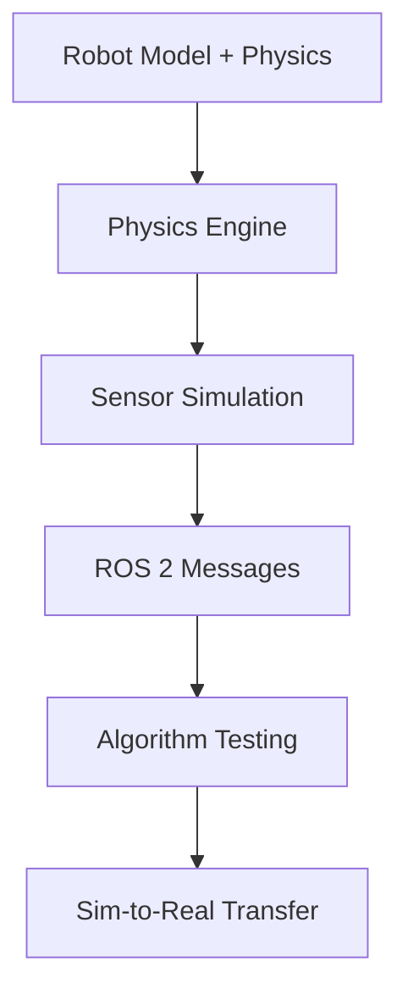
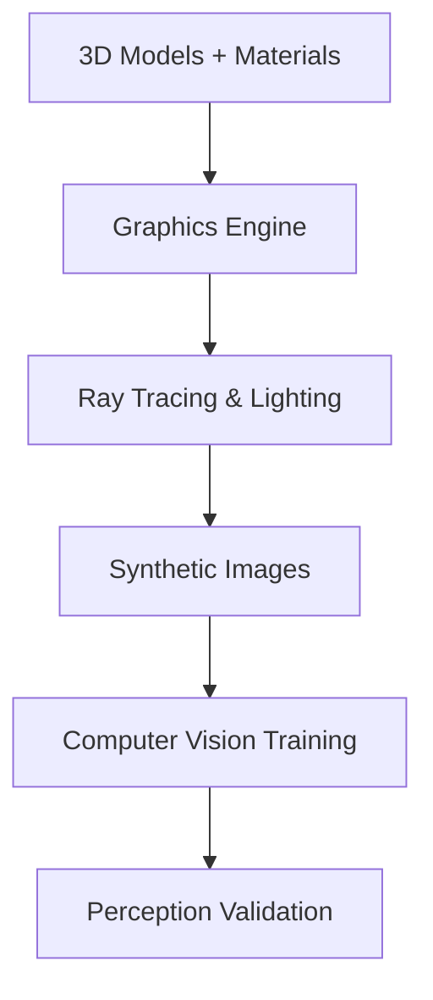

# Gazebo Physics Simulation Basics

## Learning Objectives

By the end of this chapter, you will be able to:

- Explain the role and importance of simulation in Physical AI development
- Compare different simulation approaches: physics-accurate vs. high-fidelity graphics
- Identify when to use simulation vs. real hardware in development workflows
- Understand the Gazebo and Unity ecosystems for robotics simulation
- Describe the simulation-to-reality transfer challenges and solutions

## Prerequisites

### Knowledge Prerequisites

- **ROS 2 Fundamentals**: Understanding of nodes, topics, services, and rclpy (Module 1)
- **Physical AI Concepts**: Understanding of Physical AI fundamentals from Chapter 0 (intro.md)
- **Python Programming**: Basic to intermediate understanding of Python programming
- **Robotics Concepts**: Basic understanding of robot kinematics and dynamics

### Software Prerequisites

- **Operating System**: Ubuntu 22.04 LTS with ROS 2 Humble Hawksbill installed
- **Python**: Version 3.10 or higher
- **Simulation Software**: Gazebo Garden (or Fortress) and Unity Hub (optional for Unity simulation)
- **Terminal**: Bash shell access

### Installation Verification

Verify your simulation environment:

```bash
# Check Gazebo installation
gz --version
# or for older Gazebo versions
gazebo --version

# Check ROS 2 Gazebo packages
ros2 pkg executables gazebo_ros_pkgs
```

Expected output: Version information for Gazebo and available ROS 2 packages.

## Introduction

In the previous module, we established the foundation of ROS 2 development: nodes for computation, topics for communication, services for synchronous requests, and URDF for robot description. These concepts form the software backbone of any Physical AI system. However, developing and testing robot algorithms directly on expensive hardware is risky, time-consuming, and often impractical. This is where simulation becomes essential.

Think of simulation as a "parallel universe" for robots where you can safely test algorithms millions of times faster than real-world execution. Just as pilots train in flight simulators before flying real aircraft, roboticists use simulation environments to develop, test, and validate algorithms before deploying them on physical robots. In Physical AI, where safety, efficiency, and reliability are paramount, simulation enables rapid iteration without the constraints and risks of physical hardware.

Simulation accelerates development by orders of magnitude: what might take weeks of real-world testing can be completed in hours of simulation time. You can test edge cases that would be dangerous in reality (like robots falling down stairs), run thousands of experiments in parallel, and iterate on algorithms without wear and tear on mechanical components. Modern simulation tools like Gazebo and Unity provide physics-accurate environments that closely approximate real-world behavior, making the transition from simulation to reality increasingly seamless.

In this module, we'll explore both physics-accurate simulation with Gazebo and high-fidelity graphics simulation with Unity. We'll learn how to create simulation environments, integrate them with ROS 2, and effectively transfer learned behaviors from simulation to real robots—a process known as "sim-to-real transfer."

## Theory

### The Role of Simulation in Physical AI

Simulation serves multiple critical functions in Physical AI development:

1. **Algorithm Development**: Test and refine control algorithms, perception systems, and planning approaches in a controlled environment
2. **Safety Validation**: Verify that robot behaviors are safe before deployment on physical hardware
3. **Training Data Generation**: Create large datasets for machine learning models when real data is scarce
4. **Hardware Testing**: Evaluate robot designs and configurations without physical prototypes
5. **Multi-Robot Systems**: Test coordination between multiple robots without requiring multiple physical units

### Simulation Approaches

There are two primary approaches to robotics simulation, each with distinct advantages:

#### Physics-Accurate Simulation (Gazebo)

Physics-accurate simulation focuses on modeling the physical properties of the real world with high fidelity:

- **Dynamics**: Accurate modeling of forces, torques, collisions, and motion
- **Sensor Simulation**: Realistic camera, LiDAR, IMU, and other sensor models
- **Material Properties**: Accurate friction, elasticity, and interaction models
- **Environment Physics**: Gravity, air resistance, and environmental effects



#### High-Fidelity Graphics Simulation (Unity)

High-fidelity graphics simulation prioritizes visual realism for perception tasks:

- **Photorealistic Rendering**: Ray tracing, global illumination, and realistic materials
- **Visual Complexity**: Detailed environments with complex lighting and textures
- **Perception Training**: Generating synthetic datasets for computer vision models
- **Human-Robot Interaction**: Realistic visualization for user studies



### Simulation-to-Reality Transfer

The ultimate goal of simulation is to develop behaviors that work effectively on real robots. This "sim-to-real transfer" faces several challenges:

- **Reality Gap**: Differences between simulated and real physics, sensors, and environments
- **Domain Randomization**: Techniques to make algorithms robust to simulation imperfections
- **System Identification**: Calibrating simulation parameters to match real robot behavior
- **Progressive Transfer**: Gradually moving from simulation to reality with increasing complexity

### Simulation Ecosystems

The robotics simulation landscape includes several complementary tools:

- **Gazebo**: Physics-accurate simulation with ROS 2 integration
- **Unity**: High-fidelity graphics for perception tasks
- **Webots**: All-in-one robotics simulator with built-in controllers
- **PyBullet**: Python-friendly physics simulation for research
- **NVIDIA Isaac Sim**: GPU-accelerated simulation with RTX rendering

### When to Use Simulation vs. Reality

Simulation is most valuable when:

- Testing dangerous or destructive scenarios
- Running large-scale experiments
- Training machine learning models
- Validating safety-critical behaviors
- Developing in parallel with hardware development

Real hardware is essential when:

- Validating sensor accuracy
- Testing material interactions
- Evaluating system integration
- Measuring performance under real conditions
- Conducting user studies

## Code Examples

Let's create a simple simulation environment that demonstrates the integration between ROS 2 and Gazebo:

### Basic Gazebo World File (simple_world.sdf)

```xml
<?xml version="1.0" ?>
<sdf version="1.7">
  <world name="simple_world">
    <!-- Include a ground plane -->
    <include>
      <uri>model://ground_plane</uri>
    </include>

    <!-- Include the sun -->
    <include>
      <uri>model://sun</uri>
    </include>

    <!-- Add a simple box obstacle -->
    <model name="box_obstacle">
      <pose>2 0 0.5 0 0 0</pose>
      <link name="box_link">
        <collision name="box_collision">
          <geometry>
            <box>
              <size>1 1 1</size>
            </box>
          </geometry>
        </collision>
        <visual name="box_visual">
          <geometry>
            <box>
              <size>1 1 1</size>
            </box>
          </geometry>
          <material>
            <ambient>0.5 0.5 0.5 1</ambient>
            <diffuse>0.8 0.3 0.3 1</diffuse>
          </material>
        </visual>
        <inertial>
          <mass>1.0</mass>
          <inertia>
            <ixx>0.166667</ixx>
            <ixy>0</ixy>
            <ixz>0</ixz>
            <iyy>0.166667</iyy>
            <iyz>0</iyz>
            <izz>0.166667</izz>
          </inertia>
        </inertial>
      </link>
    </model>

    <!-- Add a simple robot -->
    <include>
      <uri>model://wheeled_robot</uri>
      <pose>0 0 0.25 0 0 0</pose>
    </include>
  </world>
</sdf>
```

### ROS 2 Node for Simulation Control

```python
import rclpy
from rclpy.node import Node
from geometry_msgs.msg import Twist
from sensor_msgs.msg import LaserScan
from nav_msgs.msg import Odometry
import math


class SimulationController(Node):
    """
    Node that interfaces with Gazebo simulation to control a robot and process sensor data.
    Demonstrates the integration between ROS 2 and simulation environments.
    """

    def __init__(self):
        super().__init__('simulation_controller')

        # Publisher for velocity commands
        self.cmd_vel_publisher = self.create_publisher(Twist, '/cmd_vel', 10)

        # Subscriber for laser scan data
        self.scan_subscriber = self.create_subscription(
            LaserScan, '/scan', self.scan_callback, 10
        )

        # Subscriber for odometry data
        self.odom_subscriber = self.create_subscription(
            Odometry, '/odom', self.odom_callback, 10
        )

        # Timer for control loop
        self.control_timer = self.create_timer(0.1, self.control_loop)  # 10 Hz

        # Robot state variables
        self.current_position_x = 0.0
        self.current_position_y = 0.0
        self.current_yaw = 0.0
        self.scan_data = None
        self.obstacle_detected = False

        self.get_logger().info('Simulation controller initialized')

    def scan_callback(self, msg):
        """Process laser scan data to detect obstacles."""
        self.scan_data = msg
        # Check for obstacles in the forward direction (front 30 degrees)
        front_scan_start = len(msg.ranges) // 2 - 15
        front_scan_end = len(msg.ranges) // 2 + 15

        min_distance = float('inf')
        for i in range(front_scan_start, front_scan_end):
            if 0 < msg.ranges[i] < min_distance:
                min_distance = msg.ranges[i]

        self.obstacle_detected = min_distance < 1.0  # 1 meter threshold
        if self.obstacle_detected:
            self.get_logger().info(f'Obstacle detected at {min_distance:.2f}m')

    def odom_callback(self, msg):
        """Process odometry data to track robot position."""
        self.current_position_x = msg.pose.pose.position.x
        self.current_position_y = msg.pose.pose.position.y

        # Extract yaw from quaternion (simplified for z-axis rotation)
        orientation = msg.pose.pose.orientation
        self.current_yaw = math.atan2(
            2 * (orientation.w * orientation.z + orientation.x * orientation.y),
            1 - 2 * (orientation.y * orientation.y + orientation.z * orientation.z)
        )

    def control_loop(self):
        """Main control loop that processes sensor data and sends commands."""
        cmd = Twist()

        if self.obstacle_detected:
            # Stop if obstacle detected
            cmd.linear.x = 0.0
            cmd.angular.z = 0.0
            self.get_logger().info('Obstacle detected, stopping robot')
        else:
            # Move forward with slight random turn to explore
            cmd.linear.x = 0.5  # 0.5 m/s
            cmd.angular.z = 0.1 * math.sin(self.get_clock().now().nanoseconds / 1e9)  # Gentle turn

        self.cmd_vel_publisher.publish(cmd)


def main(args=None):
    """Main function to run the simulation controller."""
    rclpy.init(args=args)

    controller = SimulationController()

    try:
        rclpy.spin(controller)
    except KeyboardInterrupt:
        controller.get_logger().info('Interrupt received, shutting down...')
    finally:
        controller.destroy_node()
        rclpy.shutdown()


if __name__ == '__main__':
    main()
```

### Launch File for Simulation (simulation_launch.py)

```python
import os
from launch import LaunchDescription
from launch.actions import DeclareLaunchArgument, IncludeLaunchDescription
from launch.launch_description_sources import PythonLaunchDescriptionSource
from launch.substitutions import LaunchConfiguration, PathJoinSubstitution
from launch_ros.actions import Node
from launch_ros.substitutions import FindPackageShare


def generate_launch_description():
    # Launch configuration variables
    use_sim_time = LaunchConfiguration('use_sim_time')
    world = LaunchConfiguration('world')

    # Declare launch arguments
    declare_use_sim_time = DeclareLaunchArgument(
        'use_sim_time',
        default_value='True',
        description='Use simulation (Gazebo) clock if true'
    )

    declare_world = DeclareLaunchArgument(
        'world',
        default_value='simple_world.sdf',
        description='Choose one of the world files from `/path/to/worlds`'
    )

    # Start Gazebo server
    start_gazebo_server = IncludeLaunchDescription(
        PythonLaunchDescriptionSource([
            PathJoinSubstitution([
                FindPackageShare('gazebo_ros'),
                'launch',
                'gzserver.launch.py'
            ])
        ]),
        launch_arguments={'world': world}.items()
    )

    # Start Gazebo client
    start_gazebo_client = IncludeLaunchDescription(
        PythonLaunchDescriptionSource([
            PathJoinSubstitution([
                FindPackageShare('gazebo_ros'),
                'launch',
                'gzclient.launch.py'
            ])
        ])
    )

    # Robot state publisher
    robot_state_publisher = Node(
        package='robot_state_publisher',
        executable='robot_state_publisher',
        name='robot_state_publisher',
        parameters=[{'use_sim_time': use_sim_time}]
    )

    # Spawn robot in Gazebo
    spawn_entity = Node(
        package='gazebo_ros',
        executable='spawn_entity.py',
        arguments=[
            '-topic', 'robot_description',
            '-entity', 'wheeled_robot',
            '-x', '0', '-y', '0', '-z', '0.25'
        ],
        output='screen'
    )

    # Our simulation controller
    simulation_controller = Node(
        package='simulation_examples',
        executable='simulation_controller',
        name='simulation_controller',
        parameters=[{'use_sim_time': use_sim_time}],
        output='screen'
    )

    # Create launch description and add actions
    ld = LaunchDescription()

    ld.add_action(declare_use_sim_time)
    ld.add_action(declare_world)
    ld.add_action(start_gazebo_server)
    ld.add_action(start_gazebo_client)
    ld.add_action(robot_state_publisher)
    ld.add_action(spawn_entity)
    ld.add_action(simulation_controller)

    return ld
```

**Expected Output:**

```
[INFO] [simulation_controller]: Simulation controller initialized
[INFO] [simulation_controller]: Obstacle detected at 0.85m
[INFO] [simulation_controller]: Obstacle detected, stopping robot
[INFO] [simulation_controller]: Interrupt received, shutting down...
```

### Running the Simulation

To run this simulation setup:

```bash
# Terminal 1: Start Gazebo with our world
source /opt/ros/humble/setup.bash
gz sim -r simple_world.sdf

# Terminal 2: Launch the ROS 2 nodes
source /opt/ros/humble/setup.bash
ros2 launch simulation_examples simulation_launch.py

# Terminal 3: Monitor topics
source /opt/ros/humble/setup.bash
ros2 topic echo /scan
ros2 topic echo /odom
```

## Exercises

### Exercise 1: World Customization

**Task**: Create a custom Gazebo world with multiple obstacles and goals.

**Steps**:
1. Modify the SDF world file to include multiple obstacles of different shapes
2. Add visual markers for goal locations
3. Create a more complex environment with narrow passages
4. Test your robot's navigation in the custom world

**Success Criteria**:
- Custom world loads without errors in Gazebo
- Multiple obstacles and goals are properly positioned
- Robot can navigate the environment safely
- World file follows SDF standards

### Exercise 2: Sensor Integration

**Task**: Integrate additional sensors into the simulation.

**Steps**:
1. Add a camera sensor to the robot model
2. Configure the camera to publish image data to ROS 2
3. Create a node that processes camera images
4. Test perception capabilities in simulation

**Success Criteria**:
- Camera sensor is properly configured in URDF/SDF
- Image data is published to ROS 2 topics
- Processing node receives and handles image data
- Simulation reflects realistic sensor behavior

### Exercise 3: Performance Comparison

**Task**: Compare simulation vs. real-world performance.

**Steps**:
1. Implement a simple navigation algorithm in simulation
2. Document the algorithm's performance in simulation
3. Identify key differences between simulation and reality
4. Propose improvements for better sim-to-real transfer

**Success Criteria**:
- Algorithm performs well in simulation
- Differences between sim and real are clearly identified
- Improvement strategies are proposed
- Understanding of sim-to-real challenges is demonstrated

## Summary

Simulation is a cornerstone of Physical AI development, enabling safe, rapid, and cost-effective algorithm development. We've explored two primary simulation approaches: physics-accurate simulation (like Gazebo) for dynamics and control, and high-fidelity graphics simulation (like Unity) for perception tasks. The integration between ROS 2 and simulation environments allows developers to test complex robot behaviors in virtual worlds before deploying to physical hardware.

We've implemented a complete simulation setup with a custom world, robot model, and control algorithms that demonstrate sensor processing and obstacle avoidance. The example showed how ROS 2 nodes can interface with simulation environments to create realistic testing scenarios.

Understanding simulation is crucial for Physical AI systems as it bridges the gap between theoretical algorithms and real-world deployment. Effective use of simulation accelerates development, improves safety, and enables testing of scenarios that would be impractical or dangerous with physical robots.

## Next Steps

Now that you understand the fundamentals of robotics simulation, the next chapter explores Gazebo in detail. You'll learn how to create complex simulation environments, configure physics properties, and integrate with ROS 2 for realistic robot testing.

**Next Chapter**: Module 2, Chapter 2: Gazebo Physics Simulation