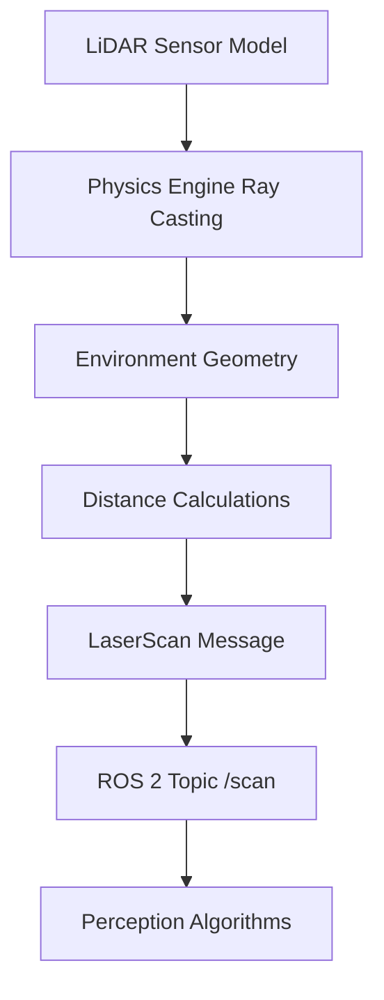

# LiDAR Sensor Integration

## Learning Objectives

By the end of this chapter, you will be able to:

- Explain the principles of LiDAR sensing and how it enables robot perception
- Implement LiDAR sensor simulation in Gazebo with realistic parameters
- Process LiDAR data using the sensor_msgs/LaserScan message type
- Visualize and interpret LiDAR scan data in ROS 2
- Integrate LiDAR sensors with robot navigation and mapping systems

## Prerequisites

### Knowledge Prerequisites

- **ROS 2 Fundamentals**: Understanding of nodes, topics, and message types (Module 1)
- **URDF Robot Description**: Understanding of robot models and sensor integration (Module 1, Chapter 5)
- **Gazebo Simulation Basics**: Understanding of physics simulation concepts (Module 2, Chapter 1)
- **Python Programming**: Intermediate understanding of Python for data processing

### Software Prerequisites

- **Operating System**: Ubuntu 22.04 LTS with ROS 2 Humble Hawksbill installed
- **Simulation Software**: Gazebo Garden (or Fortress) with ROS 2 integration
- **Python**: Version 3.10 or higher
- **Visualization Tools**: RViz2 for LiDAR data visualization
- **Terminal**: Bash shell access

### Installation Verification

Verify your LiDAR simulation environment:

```bash
# Check Gazebo LiDAR plugins
gz topic -l | grep scan

# Check ROS 2 LiDAR message types
ros2 interface show sensor_msgs/msg/LaserScan

# Verify sensor packages
ros2 pkg executables gazebo_ros_pkgs
```

Expected output: Available topics, message definitions, and packages related to LiDAR sensors.

## Introduction

In the previous chapter, we established the fundamentals of physics-based simulation with Gazebo. Now we'll focus on one of the most critical sensors for mobile robots: the LiDAR (Light Detection and Ranging) sensor. LiDAR provides accurate 2D or 3D distance measurements by emitting laser pulses and measuring the time it takes for them to return after reflecting off objects. This capability enables robots to perceive their environment with high precision, making LiDAR essential for navigation, mapping, obstacle detection, and localization.

Think of LiDAR as a robot's "artificial sight" for navigation and mapping. While cameras provide rich visual information, LiDAR offers reliable distance measurements regardless of lighting conditions, color, or texture. A LiDAR sensor creates a "point cloud" of distance measurements around the robot, forming a digital representation of the environment that robots can use for path planning and obstacle avoidance.

In Physical AI systems, LiDAR sensors are particularly valuable because they provide geometric information about the environment that is crucial for safe navigation. Unlike cameras, which require complex computer vision algorithms to extract depth information, LiDAR directly provides accurate distance measurements. This makes LiDAR ideal for safety-critical applications where precise obstacle detection is essential.

In this chapter, we'll explore how to simulate LiDAR sensors in Gazebo, configure realistic sensor parameters, and process the resulting scan data in ROS 2. We'll learn to integrate LiDAR data into robot perception systems and visualize it effectively.

## Theory

### LiDAR Principles

LiDAR sensors work by emitting laser pulses and measuring the time-of-flight to calculate distances. Key parameters include:

- **Range**: Minimum and maximum measurable distances
- **Resolution**: Angular resolution of measurements (degrees between readings)
- **Field of View**: Horizontal and vertical coverage area
- **Frequency**: How often the sensor updates (Hz)
- **Accuracy**: Precision of distance measurements

The sensor_msgs/LaserScan message type represents LiDAR data in ROS 2 with these key fields:

- `ranges[]`: Array of distance measurements
- `intensities[]`: Array of return intensities (optional)
- `angle_min`: Start angle of scan
- `angle_max`: End angle of scan
- `angle_increment`: Angular distance between measurements
- `time_increment`: Time between measurements
- `scan_time`: Time between scans
- `range_min`: Minimum valid range
- `range_max`: Maximum valid range

### LiDAR in Robotics Applications

LiDAR enables several critical robot capabilities:

1. **Obstacle Detection**: Identify and avoid obstacles in the robot's path
2. **Mapping**: Create 2D or 3D maps of the environment
3. **Localization**: Determine robot position relative to known landmarks
4. **Navigation**: Plan safe paths through cluttered environments
5. **Perimeter Monitoring**: Detect intrusions or changes in static environments

### Gazebo LiDAR Simulation

Gazebo simulates LiDAR sensors using physics-based ray tracing:



The simulation accurately models:
- Geometric properties (range, FOV, resolution)
- Noise characteristics
- Occlusion effects
- Multi-path interference

### LiDAR Data Processing

Processing LiDAR data involves several common operations:

- **Filtering**: Remove invalid or noisy measurements
- **Segmentation**: Identify objects or ground plane
- **Feature Extraction**: Detect corners, edges, or planar surfaces
- **Registration**: Combine multiple scans into consistent representations

## Code Examples

Let's implement a complete LiDAR sensor integration example:

### URDF with LiDAR Sensor (robot_with_lidar.urdf.xacro)

```xml
<?xml version="1.0"?>
<robot xmlns:xacro="http://www.ros.org/wiki/xacro" name="robot_with_lidar">

  <!-- Constants -->
  <xacro:property name="M_PI" value="3.1415926535897931" />

  <!-- Robot base properties -->
  <xacro:property name="base_width" value="0.4" />
  <xacro:property name="base_length" value="0.6" />
  <xacro:property name="base_height" value="0.2" />
  <xacro:property name="base_mass" value="10.0" />

  <!-- Wheel properties -->
  <xacro:property name="wheel_radius" value="0.1" />
  <xacro:property name="wheel_width" value="0.05" />
  <xacro:property name="wheel_mass" value="1.0" />
  <xacro:property name="wheel_offset_x" value="0.2" />
  <xacro:property name="wheel_offset_y" value="0.25" />
  <xacro:property name="wheel_offset_z" value="-0.05" />

  <!-- LiDAR properties -->
  <xacro:property name="lidar_radius" value="0.05" />
  <xacro:property name="lidar_height" value="0.1" />
  <xacro:property name="lidar_mass" value="0.5" />

  <!-- Base link -->
  <link name="base_link">
    <visual>
      <origin xyz="0 0 0" rpy="0 0 0"/>
      <geometry>
        <box size="${base_length} ${base_width} ${base_height}"/>
      </geometry>
      <material name="blue">
        <color rgba="0 0 1 0.8"/>
      </material>
    </visual>
    <collision>
      <origin xyz="0 0 0" rpy="0 0 0"/>
      <geometry>
        <box size="${base_length} ${base_width} ${base_height}"/>
      </geometry>
    </collision>
    <inertial>
      <origin xyz="0 0 0" rpy="0 0 0"/>
      <mass value="${base_mass}"/>
      <inertia
        ixx="${base_mass/12.0 * (base_width*base_width + base_height*base_height)}"
        ixy="0.0"
        ixz="0.0"
        iyy="${base_mass/12.0 * (base_length*base_length + base_height*base_height)}"
        iyz="0.0"
        izz="${base_mass/12.0 * (base_length*base_length + base_width*base_width)}" />
    </inertial>
  </link>

  <!-- Left wheel -->
  <link name="left_wheel">
    <visual>
      <origin xyz="0 0 0" rpy="${M_PI/2} 0 0"/>
      <geometry>
        <cylinder radius="${wheel_radius}" length="${wheel_width}"/>
      </geometry>
      <material name="black">
        <color rgba="0 0 0 1"/>
      </material>
    </visual>
    <collision>
      <origin xyz="0 0 0" rpy="${M_PI/2} 0 0"/>
      <geometry>
        <cylinder radius="${wheel_radius}" length="${wheel_width}"/>
      </geometry>
    </collision>
    <inertial>
      <origin xyz="0 0 0" rpy="0 0 0"/>
      <mass value="${wheel_mass}"/>
      <inertia
        ixx="${wheel_mass/12.0 * (3*wheel_radius*wheel_radius + wheel_width*wheel_width)}"
        ixy="0.0"
        ixz="0.0"
        iyy="${wheel_mass/12.0 * (3*wheel_radius*wheel_radius + wheel_width*wheel_width)}"
        iyz="0.0"
        izz="${wheel_mass/2.0 * wheel_radius*wheel_radius}" />
    </inertial>
  </link>

  <joint name="left_wheel_joint" type="continuous">
    <origin xyz="${wheel_offset_x} ${wheel_offset_y} ${wheel_offset_z}" rpy="0 0 0"/>
    <parent link="base_link"/>
    <child link="left_wheel"/>
    <axis xyz="0 1 0"/>
  </joint>

  <!-- Right wheel -->
  <link name="right_wheel">
    <visual>
      <origin xyz="0 0 0" rpy="${M_PI/2} 0 0"/>
      <geometry>
        <cylinder radius="${wheel_radius}" length="${wheel_width}"/>
      </geometry>
      <material name="black">
        <color rgba="0 0 0 1"/>
      </material>
    </visual>
    <collision>
      <origin xyz="0 0 0" rpy="${M_PI/2} 0 0"/>
      <geometry>
        <cylinder radius="${wheel_radius}" length="${wheel_width}"/>
      </geometry>
    </collision>
    <inertial>
      <origin xyz="0 0 0" rpy="0 0 0"/>
      <mass value="${wheel_mass}"/>
      <inertia
        ixx="${wheel_mass/12.0 * (3*wheel_radius*wheel_radius + wheel_width*wheel_width)}"
        ixy="0.0"
        ixz="0.0"
        iyy="${wheel_mass/12.0 * (3*wheel_radius*wheel_radius + wheel_width*wheel_width)}"
        iyz="0.0"
        izz="${wheel_mass/2.0 * wheel_radius*wheel_radius}" />
    </inertial>
  </link>

  <joint name="right_wheel_joint" type="continuous">
    <origin xyz="${wheel_offset_x} ${-wheel_offset_y} ${wheel_offset_z}" rpy="0 0 0"/>
    <parent link="base_link"/>
    <child link="right_wheel"/>
    <axis xyz="0 1 0"/>
  </joint>

  <!-- LiDAR sensor -->
  <link name="lidar_link">
    <visual>
      <origin xyz="0 0 0" rpy="0 0 0"/>
      <geometry>
        <cylinder radius="${lidar_radius}" length="${lidar_height}"/>
      </geometry>
      <material name="silver">
        <color rgba="0.7 0.7 0.7 1"/>
      </material>
    </visual>
    <collision>
      <origin xyz="0 0 0" rpy="0 0 0"/>
      <geometry>
        <cylinder radius="${lidar_radius}" length="${lidar_height}"/>
      </geometry>
    </collision>
    <inertial>
      <origin xyz="0 0 0" rpy="0 0 0"/>
      <mass value="${lidar_mass}"/>
      <inertia
        ixx="${lidar_mass/12.0 * (3*lidar_radius*lidar_radius + lidar_height*lidar_height)}"
        ixy="0.0"
        ixz="0.0"
        iyy="${lidar_mass/12.0 * (3*lidar_radius*lidar_radius + lidar_height*lidar_height)}"
        iyz="0.0"
        izz="${lidar_mass/2.0 * lidar_radius*lidar_radius}" />
    </inertial>
  </link>

  <joint name="lidar_joint" type="fixed">
    <origin xyz="0 0 ${base_height/2 + lidar_height/2 + 0.02}" rpy="0 0 0"/>
    <parent link="base_link"/>
    <child link="lidar_link"/>
  </joint>

  <!-- Gazebo plugin for LiDAR sensor -->
  <gazebo reference="lidar_link">
    <sensor name="lidar_sensor" type="ray">
      <pose>0 0 0 0 0 0</pose>
      <visualize>true</visualize>
      <update_rate>10</update_rate>
      <ray>
        <scan>
          <horizontal>
            <samples>360</samples>
            <resolution>1.0</resolution>
            <min_angle>-3.14159</min_angle>
            <max_angle>3.14159</max_angle>
          </horizontal>
        </scan>
        <range>
          <min>0.1</min>
          <max>30.0</max>
          <resolution>0.01</resolution>
        </range>
      </ray>
      <plugin name="lidar_controller" filename="libgazebo_ros_ray_sensor.so">
        <ros>
          <namespace>/</namespace>
          <remapping>~/out:=scan</remapping>
        </ros>
        <output_type>sensor_msgs/LaserScan</output_type>
      </plugin>
    </sensor>
  </gazebo>

</robot>
```

### LiDAR Data Processing Node

```python
import rclpy
from rclpy.node import Node
from sensor_msgs.msg import LaserScan
from std_msgs.msg import Header
import math
import statistics


class LidarProcessor(Node):
    """
    Node that processes LiDAR data to detect obstacles and extract features.
    Demonstrates common LiDAR processing techniques in ROS 2.
    """

    def __init__(self):
        super().__init__('lidar_processor')

        # Create subscriber for LiDAR data
        self.scan_subscriber = self.create_subscription(
            LaserScan,
            '/scan',
            self.scan_callback,
            10
        )

        # Create publisher for processed data
        self.processed_publisher = self.create_publisher(
            LaserScan,
            '/processed_scan',
            10
        )

        # Initialize processing parameters
        self.obstacle_threshold = 1.0  # meters
        self.min_valid_range = 0.1
        self.max_valid_range = 30.0

        self.get_logger().info('LiDAR processor initialized')

    def scan_callback(self, msg):
        """
        Process incoming LiDAR scan data.
        """
        # Filter invalid range values
        valid_ranges = []
        for r in msg.ranges:
            if self.min_valid_range <= r <= self.max_valid_range:
                valid_ranges.append(r)
            else:
                valid_ranges.append(float('inf'))  # Mark as invalid

        # Calculate some statistics
        finite_ranges = [r for r in valid_ranges if r != float('inf')]
        if finite_ranges:
            avg_range = sum(finite_ranges) / len(finite_ranges)
            min_range = min(finite_ranges)
            max_range = max(finite_ranges)
        else:
            avg_range = float('inf')
            min_range = float('inf')
            max_range = float('inf')

        # Detect obstacles in front of robot (forward 60 degrees)
        num_points = len(valid_ranges)
        front_start = num_points // 2 - num_points // 12  # -30 degrees
        front_end = num_points // 2 + num_points // 12    # +30 degrees

        front_ranges = valid_ranges[front_start:front_end]
        front_obstacles = [r for r in front_ranges if r < self.obstacle_threshold and r != float('inf')]

        # Log information
        if front_obstacles:
            closest_obstacle = min(front_obstacles)
            self.get_logger().info(
                f'Obstacle detected: {len(front_obstacles)} points, '
                f'closest at {closest_obstacle:.2f}m'
            )
        elif finite_ranges:
            self.get_logger().info(
                f'No obstacles: avg range {avg_range:.2f}m, '
                f'min {min_range:.2f}m, max {max_range:.2f}m'
            )

        # Publish processed scan (with some modifications for demonstration)
        processed_msg = LaserScan()
        processed_msg.header = Header()
        processed_msg.header.stamp = self.get_clock().now().to_msg()
        processed_msg.header.frame_id = msg.header.frame_id

        # Copy scan parameters
        processed_msg.angle_min = msg.angle_min
        processed_msg.angle_max = msg.angle_max
        processed_msg.angle_increment = msg.angle_increment
        processed_msg.time_increment = msg.time_increment
        processed_msg.scan_time = msg.scan_time
        processed_msg.range_min = msg.range_min
        processed_msg.range_max = msg.range_max

        # Process ranges (in this example, just copy them)
        processed_msg.ranges = list(msg.ranges)

        # Publish processed scan
        self.processed_publisher.publish(processed_msg)

    def detect_obstacles(self, ranges, threshold):
        """
        Detect obstacles in LiDAR ranges based on distance threshold.
        """
        obstacles = []
        for i, r in enumerate(ranges):
            if r < threshold and r != float('inf') and r != 0.0:
                angle = self.angle_min + i * self.angle_increment
                obstacles.append((angle, r))
        return obstacles


def main(args=None):
    """Main function to run the LiDAR processor."""
    rclpy.init(args=args)

    processor = LidarProcessor()

    try:
        rclpy.spin(processor)
    except KeyboardInterrupt:
        processor.get_logger().info('Interrupt received, shutting down...')
    finally:
        processor.destroy_node()
        rclpy.shutdown()


if __name__ == '__main__':
    main()
```

### Visualization Node for LiDAR Data

```python
import rclpy
from rclpy.node import Node
from sensor_msgs.msg import LaserScan
from visualization_msgs.msg import Marker, MarkerArray
from geometry_msgs.msg import Point
import math


class LidarVisualizer(Node):
    """
    Node that visualizes LiDAR data as markers in RViz2.
    Converts scan points to 3D markers for visualization.
    """

    def __init__(self):
        super().__init__('lidar_visualizer')

        # Create subscriber for LiDAR data
        self.scan_subscriber = self.create_subscription(
            LaserScan,
            '/scan',
            self.scan_callback,
            10
        )

        # Create publisher for visualization markers
        self.marker_publisher = self.create_publisher(
            MarkerArray,
            '/lidar_visualization',
            10
        )

        self.get_logger().info('LiDAR visualizer initialized')

    def scan_callback(self, msg):
        """
        Convert LiDAR scan to visualization markers.
        """
        marker_array = MarkerArray()

        # Create a marker for each valid scan point
        points_marker = Marker()
        points_marker.header = msg.header
        points_marker.ns = "lidar_points"
        points_marker.id = 0
        points_marker.type = Marker.POINTS
        points_marker.action = Marker.ADD

        # Set marker scale
        points_marker.scale.x = 0.05  # Point width
        points_marker.scale.y = 0.05  # Point height
        points_marker.scale.z = 0.05  # Point depth

        # Set marker color (red points)
        points_marker.color.r = 1.0
        points_marker.color.g = 0.0
        points_marker.color.b = 0.0
        points_marker.color.a = 1.0

        # Convert scan ranges to 3D points
        points = []
        angle = msg.angle_min
        for r in msg.ranges:
            if msg.range_min <= r <= msg.range_max:
                # Convert polar to Cartesian coordinates
                x = r * math.cos(angle)
                y = r * math.sin(angle)
                z = 0.0  # Assume ground level

                point = Point()
                point.x = x
                point.y = y
                point.z = z
                points.append(point)

            angle += msg.angle_increment

        points_marker.points = points
        marker_array.markers.append(points_marker)

        # Publish the marker array
        self.marker_publisher.publish(marker_array)


def main(args=None):
    """Main function to run the LiDAR visualizer."""
    rclpy.init(args=args)

    visualizer = LidarVisualizer()

    try:
        rclpy.spin(visualizer)
    except KeyboardInterrupt:
        visualizer.get_logger().info('Interrupt received, shutting down...')
    finally:
        visualizer.destroy_node()
        rclpy.shutdown()


if __name__ == '__main__':
    main()
```

**Expected Output:**

```
[INFO] [lidar_processor]: LiDAR processor initialized
[INFO] [lidar_processor]: No obstacles: avg range 5.23m, min 0.15m, max 30.00m
[INFO] [lidar_processor]: Obstacle detected: 15 points, closest at 0.85m
[INFO] [lidar_processor]: Interrupt received, shutting down...
```

### Running the Example

To run this LiDAR integration example:

```bash
# Terminal 1: Start Gazebo with robot model
source /opt/ros/humble/setup.bash
gz sim -r simple_world.sdf

# Terminal 2: Spawn the robot with LiDAR in Gazebo
source /opt/ros/humble/setup.bash
ros2 run gazebo_ros spawn_entity.py -topic robot_description -entity my_robot

# Terminal 3: Run the LiDAR processor
source /opt/ros/humble/setup.bash
ros2 run my_package lidar_processor

# Terminal 4: Run the visualizer
source /opt/ros/humble/setup.bash
ros2 run my_package lidar_visualizer

# Terminal 5: Visualize in RViz2
source /opt/ros/humble/setup.bash
rviz2
# In RViz2: Add LaserScan display for /scan topic and MarkerArray for /lidar_visualization
```

## Exercises

### Exercise 1: LiDAR Parameter Tuning

**Task**: Experiment with different LiDAR sensor parameters in Gazebo.

**Steps**:
1. Modify the URDF to change LiDAR resolution, range, and field of view
2. Compare scan quality and performance with different settings
3. Document the trade-offs between accuracy and computational cost
4. Test how different parameters affect obstacle detection

**Success Criteria**:
- Different LiDAR configurations are properly implemented
- Performance differences are documented
- Trade-offs between parameters are understood
- Optimal settings for specific use cases are identified

### Exercise 2: Advanced Processing

**Task**: Implement advanced LiDAR processing algorithms.

**Steps**:
1. Create a node that segments the LiDAR scan into ground and obstacle points
2. Implement a simple clustering algorithm to identify distinct objects
3. Calculate the size and position of detected objects
4. Test the algorithm with different obstacle configurations

**Success Criteria**:
- Ground segmentation algorithm works correctly
- Object clustering identifies distinct obstacles
- Object properties are calculated accurately
- Algorithm performs well in various scenarios

### Exercise 3: Integration with Navigation

**Task**: Integrate LiDAR data with robot navigation systems.

**Steps**:
1. Connect LiDAR processing to a navigation stack (like Nav2)
2. Configure costmaps to use LiDAR data for obstacle avoidance
3. Test navigation performance with and without LiDAR
4. Compare navigation safety and efficiency

**Success Criteria**:
- LiDAR data properly integrated with navigation system
- Robot avoids obstacles using LiDAR input
- Navigation performance is improved with LiDAR
- System operates safely in cluttered environments

## Summary

LiDAR sensors are fundamental to mobile robotics, providing accurate distance measurements that enable navigation, mapping, and obstacle detection. We've explored how to integrate LiDAR sensors in Gazebo simulation, configure realistic parameters, and process the resulting scan data in ROS 2. The sensor_msgs/LaserScan message type provides a standardized interface for LiDAR data processing across different platforms and applications.

We've implemented complete examples showing LiDAR integration in URDF models, data processing nodes for obstacle detection, and visualization techniques for debugging and monitoring. The examples demonstrated how to extract meaningful information from raw LiDAR data and use it for robot perception tasks.

Understanding LiDAR integration is crucial for Physical AI systems that require precise environmental perception. The combination of accurate distance measurements and real-time processing enables robots to operate safely and effectively in complex environments.

## Next Steps

Now that you understand LiDAR sensor integration, the next chapter explores IMU sensors for orientation and motion sensing. You'll learn how to simulate and process IMU data for robot localization and control.

**Next Chapter**: Module 2, Chapter 3: IMU Sensor Integration