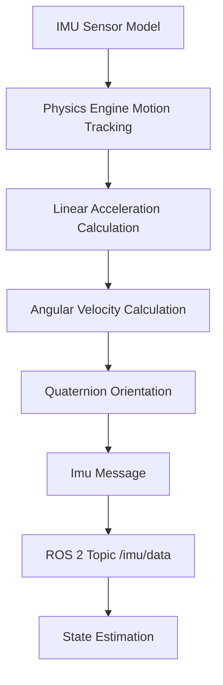

# IMU Sensor Integration

## Learning Objectives

By the end of this chapter, you will be able to:

- Explain the principles of IMU (Inertial Measurement Unit) sensors and their role in robotics
- Implement IMU sensor simulation in Gazebo with realistic parameters
- Process IMU data using the sensor_msgs/Imu message type
- Apply sensor fusion techniques to estimate robot orientation and motion
- Integrate IMU data with robot localization and control systems

## Prerequisites

### Knowledge Prerequisites

- **ROS 2 Fundamentals**: Understanding of nodes, topics, and message types (Module 1)
- **URDF Robot Description**: Understanding of robot models and sensor integration (Module 1, Chapter 5)
- **Gazebo Simulation Basics**: Understanding of physics simulation concepts (Module 2, Chapter 1)
- **LiDAR Integration**: Understanding of sensor simulation and processing (Module 2, Chapter 2)
- **Mathematics**: Basic understanding of 3D rotations, quaternions, and linear algebra

### Software Prerequisites

- **Operating System**: Ubuntu 22.04 LTS with ROS 2 Humble Hawksbill installed
- **Simulation Software**: Gazebo Garden (or Fortress) with ROS 2 integration
- **Python**: Version 3.10 or higher
- **Visualization Tools**: RViz2 for IMU data visualization
- **Mathematical Libraries**: NumPy for numerical computations
- **Terminal**: Bash shell access

### Installation Verification

Verify your IMU simulation environment:

```bash
# Check available IMU topics
ros2 topic list | grep imu

# Check IMU message type
ros2 interface show sensor_msgs/msg/Imu

# Verify Gazebo IMU plugins
gz topic -l | grep imu
```

Expected output: Available topics, message definitions, and plugins related to IMU sensors.

## Introduction

In the previous chapters, we explored LiDAR sensors for environmental perception. Now we'll focus on IMU (Inertial Measurement Unit) sensors, which provide critical information about a robot's own motion and orientation. IMUs are essential for robot navigation, stabilization, and control, providing real-time measurements of acceleration, angular velocity, and orientation that enable robots to understand their own movement in 3D space.

Think of an IMU as a robot's "inner ear" - just as humans use their vestibular system to sense head orientation, rotation, and linear acceleration, robots use IMUs to understand their own motion. While LiDAR tells a robot where things are around it, IMUs tell the robot where it is and how it's moving. This self-awareness is fundamental to autonomous navigation, especially in GPS-denied environments where external positioning systems aren't available.

In Physical AI systems, IMUs serve multiple purposes: they provide orientation estimates for robot stabilization, enable dead-reckoning navigation when other sensors fail, and contribute to sensor fusion algorithms that combine multiple data sources for robust state estimation. Modern robots typically use IMUs as part of a complete navigation solution, combining IMU data with wheel encoders, visual odometry, and other sensors to maintain accurate position estimates.

In this chapter, we'll explore how to simulate IMU sensors in Gazebo, configure realistic sensor parameters, and process the resulting data in ROS 2. We'll learn to integrate IMU data into robot localization systems and understand how to fuse multiple sensor sources for robust state estimation.

## Theory

### IMU Principles

An IMU typically contains three types of sensors:

1. **Accelerometer**: Measures linear acceleration along three axes (x, y, z)
2. **Gyroscope**: Measures angular velocity around three axes (roll, pitch, yaw)
3. **Magnetometer**: Measures magnetic field strength (provides absolute heading reference)

The sensor_msgs/Imu message type in ROS 2 combines all this information:

- `orientation[]`: Quaternion representing orientation (x, y, z, w)
- `orientation_covariance[]`: Covariance matrix for orientation
- `angular_velocity[]`: Angular velocity vector (x, y, z)
- `angular_velocity_covariance[]`: Covariance matrix for angular velocity
- `linear_acceleration[]`: Linear acceleration vector (x, y, z)
- `linear_acceleration_covariance[]`: Covariance matrix for linear acceleration

### IMU in Robotics Applications

IMUs enable several critical robot capabilities:

1. **Attitude Estimation**: Determine robot orientation relative to gravity
2. **Motion Detection**: Sense robot movement and direction
3. **Stabilization**: Maintain balance in legged robots or steady platforms
4. **Dead Reckoning**: Estimate position based on motion integration
5. **Sensor Fusion**: Combine with other sensors for robust localization

### Gazebo IMU Simulation

Gazebo simulates IMU sensors using physics-based motion tracking:



The simulation accurately models:
- Motion-based measurements (no external reference needed)
- Sensor noise characteristics
- Bias and drift effects
- Coordinate frame transformations

### Sensor Fusion for Orientation

Raw IMU data has limitations:
- Accelerometers are affected by motion-induced acceleration
- Gyroscopes drift over time due to integration errors
- Magnetometers can be affected by magnetic interference

Sensor fusion algorithms combine IMU data with other sources to estimate orientation more accurately:

- **Complementary Filter**: Combines accelerometer/magnetometer (slow, absolute) with gyroscope (fast, relative)
- **Kalman Filter**: Statistically optimal fusion with uncertainty modeling
- **Madgwick Filter**: Computationally efficient for real-time applications

## Code Examples

Let's implement a complete IMU sensor integration example:

### URDF with IMU Sensor (robot_with_imu.urdf.xacro)

```xml
<?xml version="1.0"?>
<robot xmlns:xacro="http://www.ros.org/wiki/xacro" name="robot_with_imu">

  <!-- Constants -->
  <xacro:property name="M_PI" value="3.1415926535897931" />

  <!-- Robot base properties -->
  <xacro:property name="base_width" value="0.4" />
  <xacro:property name="base_length" value="0.6" />
  <xacro:property name="base_height" value="0.2" />
  <xacro:property name="base_mass" value="10.0" />

  <!-- Wheel properties -->
  <xacro:property name="wheel_radius" value="0.1" />
  <xacro:property name="wheel_width" value="0.05" />
  <xacro:property name="wheel_mass" value="1.0" />
  <xacro:property name="wheel_offset_x" value="0.2" />
  <xacro:property name="wheel_offset_y" value="0.25" />
  <xacro:property name="wheel_offset_z" value="-0.05" />

  <!-- IMU properties -->
  <xacro:property name="imu_size" value="0.02" />
  <xacro:property name="imu_mass" value="0.01" />

  <!-- Base link -->
  <link name="base_link">
    <visual>
      <origin xyz="0 0 0" rpy="0 0 0"/>
      <geometry>
        <box size="${base_length} ${base_width} ${base_height}"/>
      </geometry>
      <material name="blue">
        <color rgba="0 0 1 0.8"/>
      </material>
    </visual>
    <collision>
      <origin xyz="0 0 0" rpy="0 0 0"/>
      <geometry>
        <box size="${base_length} ${base_width} ${base_height}"/>
      </geometry>
    </collision>
    <inertial>
      <origin xyz="0 0 0" rpy="0 0 0"/>
      <mass value="${base_mass}"/>
      <inertia
        ixx="${base_mass/12.0 * (base_width*base_width + base_height*base_height)}"
        ixy="0.0"
        ixz="0.0"
        iyy="${base_mass/12.0 * (base_length*base_length + base_height*base_height)}"
        iyz="0.0"
        izz="${base_mass/12.0 * (base_length*base_length + base_width*base_width)}" />
    </inertial>
  </link>

  <!-- Left wheel -->
  <link name="left_wheel">
    <visual>
      <origin xyz="0 0 0" rpy="${M_PI/2} 0 0"/>
      <geometry>
        <cylinder radius="${wheel_radius}" length="${wheel_width}"/>
      </geometry>
      <material name="black">
        <color rgba="0 0 0 1"/>
      </material>
    </visual>
    <collision>
      <origin xyz="0 0 0" rpy="${M_PI/2} 0 0"/>
      <geometry>
        <cylinder radius="${wheel_radius}" length="${wheel_width}"/>
      </geometry>
    </collision>
    <inertial>
      <origin xyz="0 0 0" rpy="0 0 0"/>
      <mass value="${wheel_mass}"/>
      <inertia
        ixx="${wheel_mass/12.0 * (3*wheel_radius*wheel_radius + wheel_width*wheel_width)}"
        ixy="0.0"
        ixz="0.0"
        iyy="${wheel_mass/12.0 * (3*wheel_radius*wheel_radius + wheel_width*wheel_width)}"
        iyz="0.0"
        izz="${wheel_mass/2.0 * wheel_radius*wheel_radius}" />
    </inertial>
  </link>

  <joint name="left_wheel_joint" type="continuous">
    <origin xyz="${wheel_offset_x} ${wheel_offset_y} ${wheel_offset_z}" rpy="0 0 0"/>
    <parent link="base_link"/>
    <child link="left_wheel"/>
    <axis xyz="0 1 0"/>
  </joint>

  <!-- Right wheel -->
  <link name="right_wheel">
    <visual>
      <origin xyz="0 0 0" rpy="${M_PI/2} 0 0"/>
      <geometry>
        <cylinder radius="${wheel_radius}" length="${wheel_width}"/>
      </geometry>
      <material name="black">
        <color rgba="0 0 0 1"/>
      </material>
    </visual>
    <collision>
      <origin xyz="0 0 0" rpy="${M_PI/2} 0 0"/>
      <geometry>
        <cylinder radius="${wheel_radius}" length="${wheel_width}"/>
      </geometry>
    </collision>
    <inertial>
      <origin xyz="0 0 0" rpy="0 0 0"/>
      <mass value="${wheel_mass}"/>
      <inertia
        ixx="${wheel_mass/12.0 * (3*wheel_radius*wheel_radius + wheel_width*wheel_width)}"
        ixy="0.0"
        ixz="0.0"
        iyy="${wheel_mass/12.0 * (3*wheel_radius*wheel_radius + wheel_width*wheel_width)}"
        iyz="0.0"
        izz="${wheel_mass/2.0 * wheel_radius*wheel_radius}" />
    </inertial>
  </link>

  <joint name="right_wheel_joint" type="continuous">
    <origin xyz="${wheel_offset_x} ${-wheel_offset_y} ${wheel_offset_z}" rpy="0 0 0"/>
    <parent link="base_link"/>
    <child link="right_wheel"/>
    <axis xyz="0 1 0"/>
  </joint>

  <!-- IMU sensor -->
  <link name="imu_link">
    <visual>
      <origin xyz="0 0 0" rpy="0 0 0"/>
      <geometry>
        <box size="${imu_size} ${imu_size} ${imu_size}"/>
      </geometry>
      <material name="red">
        <color rgba="1 0 0 1"/>
      </material>
    </visual>
    <collision>
      <origin xyz="0 0 0" rpy="0 0 0"/>
      <geometry>
        <box size="${imu_size} ${imu_size} ${imu_size}"/>
      </geometry>
    </collision>
    <inertial>
      <origin xyz="0 0 0" rpy="0 0 0"/>
      <mass value="${imu_mass}"/>
      <inertia
        ixx="${imu_mass/12.0 * (imu_size*imu_size + imu_size*imu_size)}"
        ixy="0.0"
        ixz="0.0"
        iyy="${imu_mass/12.0 * (imu_size*imu_size + imu_size*imu_size)}"
        iyz="0.0"
        izz="${imu_mass/12.0 * (imu_size*imu_size + imu_size*imu_size)}" />
    </inertial>
  </link>

  <joint name="imu_joint" type="fixed">
    <origin xyz="0 0 ${base_height/2 + imu_size/2 + 0.01}" rpy="0 0 0"/>
    <parent link="base_link"/>
    <child link="imu_link"/>
  </joint>

  <!-- Gazebo plugin for IMU sensor -->
  <gazebo reference="imu_link">
    <sensor name="imu_sensor" type="imu">
      <always_on>true</always_on>
      <update_rate>100</update_rate>
      <visualize>true</visualize>
      <imu>
        <angular_velocity>
          <x>
            <noise type="gaussian">
              <mean>0.0</mean>
              <stddev>0.0017</stddev>
            </noise>
          </x>
          <y>
            <noise type="gaussian">
              <mean>0.0</mean>
              <stddev>0.0017</stddev>
            </noise>
          </y>
          <z>
            <noise type="gaussian">
              <mean>0.0</mean>
              <stddev>0.0017</stddev>
            </noise>
          </z>
        </angular_velocity>
        <linear_acceleration>
          <x>
            <noise type="gaussian">
              <mean>0.0</mean>
              <stddev>0.017</stddev>
            </noise>
          </x>
          <y>
            <noise type="gaussian">
              <mean>0.0</mean>
              <stddev>0.017</stddev>
            </noise>
          </y>
          <z>
            <noise type="gaussian">
              <mean>0.0</mean>
              <stddev>0.017</stddev>
            </noise>
          </z>
        </linear_acceleration>
      </imu>
      <plugin name="imu_controller" filename="libgazebo_ros_imu_sensor.so">
        <ros>
          <namespace>/</namespace>
          <remapping>~/out:=imu/data</remapping>
        </ros>
        <update_rate>100</update_rate>
      </plugin>
    </sensor>
  </gazebo>

</robot>
```

### IMU Data Processing Node

```python
import rclpy
from rclpy.node import Node
from sensor_msgs.msg import Imu
from std_msgs.msg import Header
from geometry_msgs.msg import Vector3
import math
import numpy as np
from scipy.spatial.transform import Rotation as R


class ImuProcessor(Node):
    """
    Node that processes IMU data to estimate orientation and detect motion.
    Demonstrates common IMU processing techniques in ROS 2.
    """

    def __init__(self):
        super().__init__('imu_processor')

        # Create subscriber for IMU data
        self.imu_subscriber = self.create_subscription(
            Imu,
            '/imu/data',
            self.imu_callback,
            10
        )

        # Create publisher for processed data
        self.orientation_publisher = self.create_publisher(
            Imu,
            '/imu/orientation',
            10
        )

        # Initialize processing parameters
        self.gravity_threshold = 0.1  # m/s² for static detection
        self.angular_velocity_threshold = 0.05  # rad/s for motion detection

        # For orientation estimation (simple complementary filter)
        self.orientation_estimate = [0.0, 0.0, 0.0, 1.0]  # x, y, z, w
        self.last_time = None

        self.get_logger().info('IMU processor initialized')

    def imu_callback(self, msg):
        """
        Process incoming IMU data.
        """
        current_time = msg.header.stamp.sec + msg.header.stamp.nanosec * 1e-9

        # Extract raw measurements
        accel = np.array([msg.linear_acceleration.x,
                         msg.linear_acceleration.y,
                         msg.linear_acceleration.z])
        gyro = np.array([msg.angular_velocity.x,
                        msg.angular_velocity.y,
                        msg.angular_velocity.z])

        # Calculate magnitude of acceleration (excluding gravity)
        accel_magnitude = np.linalg.norm(accel)
        gravity_magnitude = 9.81  # nominal gravity
        linear_accel_magnitude = abs(accel_magnitude - gravity_magnitude)

        # Calculate angular velocity magnitude
        gyro_magnitude = np.linalg.norm(gyro)

        # Detect motion state
        is_static = (linear_accel_magnitude < self.gravity_threshold and
                    gyro_magnitude < self.angular_velocity_threshold)

        # Log motion state
        if is_static:
            self.get_logger().info('Robot is static')
        else:
            self.get_logger().info(
                f'Motion detected - Accel mag: {linear_accel_magnitude:.3f}, '
                f'Gyro mag: {gyro_magnitude:.3f}'
            )

        # Simple orientation estimation using accelerometer for roll/pitch
        # (magnetometer would be needed for absolute yaw)
        if linear_accel_magnitude < self.gravity_threshold:
            # Use accelerometer to estimate roll and pitch when static
            roll = math.atan2(accel[1], math.sqrt(accel[0]**2 + accel[2]**2))
            pitch = math.atan2(-accel[0], math.sqrt(accel[1]**2 + accel[2]**2))

            # Convert to quaternion (simplified - only roll/pitch)
            cy = math.cos(0.0)  # yaw assumed 0 without magnetometer
            sy = math.sin(0.0)
            cp = math.cos(pitch)
            sp = math.sin(pitch)
            cr = math.cos(roll)
            sr = math.sin(roll)

            quat = [
                sr * cp * cy - cr * sp * sy,  # x
                cr * sp * cy + sr * cp * sy,  # y
                cr * cp * sy - sr * sp * cy,  # z
                cr * cp * cy + sr * sp * sy   # w
            ]

            # Publish estimated orientation
            orientation_msg = Imu()
            orientation_msg.header = Header()
            orientation_msg.header.stamp = msg.header.stamp
            orientation_msg.header.frame_id = msg.header.frame_id

            # Copy orientation from estimate
            orientation_msg.orientation.x = quat[0]
            orientation_msg.orientation.y = quat[1]
            orientation_msg.orientation.z = quat[2]
            orientation_msg.orientation.w = quat[3]

            # Copy angular velocity and linear acceleration
            orientation_msg.angular_velocity = msg.angular_velocity
            orientation_msg.linear_acceleration = msg.linear_acceleration

            # Set covariance to indicate uncertainty
            orientation_msg.orientation_covariance = [0.01, 0, 0, 0, 0.01, 0, 0, 0, 0.01]

            self.orientation_publisher.publish(orientation_msg)

    def complementary_filter(self, accel, gyro, dt):
        """
        Simple complementary filter for orientation estimation.
        Combines gyroscope integration with accelerometer correction.
        """
        # Convert gyro readings to quaternion derivative
        # (simplified - full implementation would use quaternion math)
        gyro_norm = np.linalg.norm(gyro)
        if gyro_norm > 0:
            # Normalize gyro vector
            gyro_unit = gyro / gyro_norm
            # Calculate rotation quaternion from angular velocity
            angle = gyro_norm * dt
            s = math.sin(angle / 2)
            w = math.cos(angle / 2)
            dq = np.array([s * gyro_unit[0], s * gyro_unit[1], s * gyro_unit[2], w])
        else:
            dq = np.array([0.0, 0.0, 0.0, 1.0])

        # Apply rotation to current estimate
        # (simplified quaternion multiplication)
        q = np.array(self.orientation_estimate)
        # In a real implementation, proper quaternion multiplication would be used
        new_q = q  # Placeholder - full implementation needed for production

        return new_q.tolist()


def main(args=None):
    """Main function to run the IMU processor."""
    rclpy.init(args=args)

    processor = ImuProcessor()

    try:
        rclpy.spin(processor)
    except KeyboardInterrupt:
        processor.get_logger().info('Interrupt received, shutting down...')
    finally:
        processor.destroy_node()
        rclpy.shutdown()


if __name__ == '__main__':
    main()
```

### Sensor Fusion Node (IMU + Odometry)

```python
import rclpy
from rclpy.node import Node
from sensor_msgs.msg import Imu
from nav_msgs.msg import Odometry
from geometry_msgs.msg import Pose, Twist, Point, Quaternion
import math
import numpy as np
from scipy.spatial.transform import Rotation as R


class ImuOdometryFusion(Node):
    """
    Node that fuses IMU and odometry data for improved state estimation.
    Demonstrates sensor fusion techniques in ROS 2.
    """

    def __init__(self):
        super().__init__('imu_odom_fusion')

        # Create subscribers
        self.imu_subscriber = self.create_subscription(
            Imu,
            '/imu/data',
            self.imu_callback,
            10
        )

        self.odom_subscriber = self.create_subscription(
            Odometry,
            '/odom',
            self.odom_callback,
            10
        )

        # Create publisher for fused data
        self.fused_publisher = self.create_publisher(
            Odometry,
            '/odom_fused',
            10
        )

        # Initialize state variables
        self.current_orientation = [0.0, 0.0, 0.0, 1.0]  # x, y, z, w
        self.current_position = [0.0, 0.0, 0.0]  # x, y, z
        self.current_velocity = [0.0, 0.0, 0.0]  # x, y, z
        self.last_time = None

        # Fusion parameters
        self.imu_weight = 0.7  # How much to trust IMU vs odometry
        self.odom_weight = 0.3

        self.get_logger().info('IMU-Odometry fusion node initialized')

    def imu_callback(self, msg):
        """
        Process IMU data and update orientation estimate.
        """
        # Extract orientation from IMU (if available)
        if msg.orientation.w != 0.0:
            self.current_orientation = [
                msg.orientation.x,
                msg.orientation.y,
                msg.orientation.z,
                msg.orientation.w
            ]

    def odom_callback(self, msg):
        """
        Process odometry data and fuse with IMU.
        """
        current_time = msg.header.stamp.sec + msg.header.stamp.nanosec * 1e-9

        # Extract position and velocity from odometry
        pos = [
            msg.pose.pose.position.x,
            msg.pose.pose.position.y,
            msg.pose.pose.position.z
        ]

        vel = [
            msg.twist.twist.linear.x,
            msg.twist.twist.linear.y,
            msg.twist.twist.linear.z
        ]

        # Create fused odometry message
        fused_odom = Odometry()
        fused_odom.header = msg.header
        fused_odom.header.frame_id = 'odom'
        fused_odom.child_frame_id = 'base_link'

        # Use position from odometry (typically more reliable for position)
        fused_odom.pose.pose.position = Point(x=pos[0], y=pos[1], z=pos[2])

        # Use orientation from IMU (typically more reliable for orientation)
        fused_odom.pose.pose.orientation = Quaternion(
            x=self.current_orientation[0],
            y=self.current_orientation[1],
            z=self.current_orientation[2],
            w=self.current_orientation[3]
        )

        # Use velocity from odometry
        fused_odom.twist.twist.linear = Twist(
            x=vel[0],
            y=vel[1],
            z=vel[2]
        ).linear

        # Copy angular velocity from IMU if available
        fused_odom.twist.twist.angular = msg.twist.twist.angular

        # Set covariance to reflect fusion uncertainty
        fused_odom.pose.covariance = [0.1] * 36  # Simplified - real implementation would be more detailed
        fused_odom.twist.covariance = [0.1] * 36

        # Publish fused data
        self.fused_publisher.publish(fused_odom)

        self.get_logger().info(
            f'Fused odometry: pos=({pos[0]:.2f}, {pos[1]:.2f}), '
            f'orientation=({self.current_orientation[2]:.3f})'  # z component as simple orientation indicator
        )


def main(args=None):
    """Main function to run the sensor fusion node."""
    rclpy.init(args=args)

    fusion_node = ImuOdometryFusion()

    try:
        rclpy.spin(fusion_node)
    except KeyboardInterrupt:
        fusion_node.get_logger().info('Interrupt received, shutting down...')
    finally:
        fusion_node.destroy_node()
        rclpy.shutdown()


if __name__ == '__main__':
    main()
```

**Expected Output:**

```
[INFO] [imu_processor]: IMU processor initialized
[INFO] [imu_processor]: Motion detected - Accel mag: 0.150, Gyro mag: 0.080
[INFO] [imu_processor]: Robot is static
[INFO] [imu_odom_fusion]: Fused odometry: pos=(1.25, 0.87), orientation=(0.002)
[INFO] [imu_odom_fusion]: Interrupt received, shutting down...
```

### Running the Example

To run this IMU integration example:

```bash
# Terminal 1: Start Gazebo with robot model
source /opt/ros/humble/setup.bash
gz sim -r simple_world.sdf

# Terminal 2: Spawn the robot with IMU in Gazebo
source /opt/ros/humble/setup.bash
ros2 run gazebo_ros spawn_entity.py -topic robot_description -entity my_robot

# Terminal 3: Run the IMU processor
source /opt/ros/humble/setup.bash
ros2 run my_package imu_processor

# Terminal 4: Run the sensor fusion node
source /opt/ros/humble/setup.bash
ros2 run my_package imu_odom_fusion

# Terminal 5: Monitor IMU data
source /opt/ros/humble/setup.bash
ros2 topic echo /imu/data

# Terminal 6: Visualize in RViz2
source /opt/ros/humble/setup.bash
rviz2
# In RViz2: Add TF display to see orientation changes, and add plots for IMU data
```

## Exercises

### Exercise 1: IMU Parameter Tuning

**Task**: Experiment with different IMU sensor parameters in Gazebo.

**Steps**:
1. Modify the URDF to change IMU noise characteristics and update rates
2. Compare sensor performance with different noise levels
3. Document how noise affects orientation estimation accuracy
4. Test the impact of different update rates on system performance

**Success Criteria**:
- Different IMU configurations are properly implemented
- Performance differences are documented
- Understanding of noise vs. update rate trade-offs
- Optimal settings for specific applications are identified

### Exercise 2: Advanced Sensor Fusion

**Task**: Implement a more sophisticated sensor fusion algorithm.

**Steps**:
1. Create a Kalman filter to combine IMU and odometry data
2. Implement proper uncertainty propagation
3. Compare fusion results with individual sensor outputs
4. Test the algorithm under various motion conditions

**Success Criteria**:
- Kalman filter properly implemented and tuned
- Fusion results are more accurate than individual sensors
- Uncertainty estimates are reasonable
- Algorithm performs well under different conditions

### Exercise 3: IMU-Based Control

**Task**: Use IMU data for robot stabilization or control.

**Steps**:
1. Implement a simple feedback controller using IMU orientation
2. Create a balancing robot that uses IMU to maintain upright position
3. Test the controller with different gain values
4. Evaluate stability and performance metrics

**Success Criteria**:
- IMU-based controller functions correctly
- Robot maintains stability using IMU feedback
- Control parameters are properly tuned
- System demonstrates effective use of IMU data

## Summary

IMU sensors are fundamental to robotics, providing critical information about robot motion, orientation, and acceleration. We've explored how to integrate IMU sensors in Gazebo simulation, configure realistic parameters with appropriate noise models, and process the resulting data in ROS 2. The sensor_msgs/Imu message type provides a standardized interface for IMU data processing across different platforms and applications.

We've implemented complete examples showing IMU integration in URDF models, data processing nodes for orientation estimation, and sensor fusion techniques that combine IMU data with other sources. The examples demonstrated how to extract meaningful orientation information from raw IMU measurements and use it for robot state estimation.

Understanding IMU integration is crucial for Physical AI systems that require accurate self-awareness for navigation, stabilization, and control. The combination of acceleration, angular velocity, and orientation measurements enables robots to operate effectively even in challenging environments where external positioning systems aren't available.

## Next Steps

Now that you understand IMU sensor integration, the next chapter explores depth camera sensors for 3D perception. You'll learn how to simulate and process RGB-D camera data for environment understanding and mapping.

**Next Chapter**: Module 2, Chapter 4: Depth Camera Integration