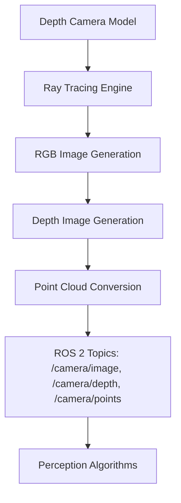

# Depth Camera Integration

## Learning Objectives

By the end of this chapter, you will be able to:

- Explain the principles of depth cameras and their role in 3D perception
- Implement depth camera simulation in Gazebo with realistic parameters
- Process depth camera data using sensor_msgs/Image and sensor_msgs/PointCloud2 message types
- Generate and visualize 3D point clouds from depth camera data
- Integrate depth cameras with robot perception and mapping systems

## Prerequisites

### Knowledge Prerequisites

- **ROS 2 Fundamentals**: Understanding of nodes, topics, and message types (Module 1)
- **URDF Robot Description**: Understanding of robot models and sensor integration (Module 1, Chapter 5)
- **Gazebo Simulation Basics**: Understanding of physics simulation concepts (Module 2, Chapter 1)
- **LiDAR and IMU Integration**: Understanding of sensor simulation and processing (Module 2, Chapters 2-3)
- **Computer Vision**: Basic understanding of image processing and 3D geometry

### Software Prerequisites

- **Operating System**: Ubuntu 22.04 LTS with ROS 2 Humble Hawksbill installed
- **Simulation Software**: Gazebo Garden (or Fortress) with ROS 2 integration
- **Python**: Version 3.10 or higher
- **Computer Vision Libraries**: OpenCV, NumPy for image processing
- **Point Cloud Library**: PCL (Point Cloud Library) for 3D processing
- **Visualization Tools**: RViz2 for 3D point cloud visualization
- **Terminal**: Bash shell access

### Installation Verification

Verify your depth camera simulation environment:

```bash
# Check available camera topics
ros2 topic list | grep camera

# Check camera message types
ros2 interface show sensor_msgs/msg/Image
ros2 interface show sensor_msgs/msg/CameraInfo
ros2 interface show sensor_msgs/msg/PointCloud2

# Verify Gazebo camera plugins
gz topic -l | grep camera
```

Expected output: Available topics, message definitions, and plugins related to camera sensors.

## Introduction

In the previous chapters, we explored LiDAR and IMU sensors for environmental perception and self-awareness. Now we'll focus on depth cameras, which provide rich 3D information about the environment by capturing both color (RGB) and depth (D) data. Depth cameras combine the visual richness of traditional cameras with the geometric accuracy of distance measurements, creating RGB-D sensors that provide detailed 3D representations of the environment.

Think of a depth camera as a robot's "3D vision system" - while traditional cameras provide 2D color information, depth cameras add the crucial third dimension, enabling robots to perceive depth, volume, and spatial relationships. This capability is essential for tasks like object recognition, scene understanding, and 3D mapping that require more than simple distance measurements.

In Physical AI systems, depth cameras are particularly valuable because they provide dense 3D information that enables detailed scene understanding. Unlike LiDAR, which provides sparse distance measurements, depth cameras generate dense depth maps with millions of depth values per frame. This makes them ideal for applications requiring detailed object recognition, surface analysis, and complex scene understanding.

In this chapter, we'll explore how to simulate depth cameras in Gazebo, configure realistic sensor parameters, and process the resulting RGB-D data in ROS 2. We'll learn to convert depth images to 3D point clouds and integrate this information into robot perception systems.

## Theory

### Depth Camera Principles

Depth cameras work using various technologies:

1. **Stereo Vision**: Two cameras capture images from slightly different positions, using triangulation to calculate depth
2. **Time-of-Flight (ToF)**: Measures the time light takes to travel to objects and back
3. **Structured Light**: Projects known light patterns and analyzes distortions to calculate depth

The data from depth cameras includes:

- **RGB Image**: Color information (sensor_msgs/Image with 8UC3 encoding)
- **Depth Image**: Distance information (sensor_msgs/Image with 16UC1 or 32FC1 encoding)
- **Camera Info**: Intrinsic parameters (sensor_msgs/CameraInfo)

### Point Cloud Generation

Depth images can be converted to 3D point clouds using the camera's intrinsic parameters:

```
x = (u - cx) * depth / fx
y = (v - cy) * depth / fy
z = depth
```

Where:
- (u, v) are pixel coordinates in the image
- (cx, cy) are the principal point coordinates
- (fx, fy) are the focal lengths in pixels
- depth is the distance value at that pixel

### Point Cloud Message Format

The sensor_msgs/PointCloud2 message contains:

- `header`: Timestamp and frame information
- `height`, `width`: Dimensions of the point cloud
- `fields`: Definition of data fields (x, y, z, rgb, etc.)
- `is_bigendian`: Endianness of data
- `point_step`: Size of each point in bytes
- `row_step`: Size of each row in bytes
- `data`: Raw binary data containing point coordinates and attributes

### Gazebo Depth Camera Simulation

Gazebo simulates depth cameras using ray tracing:



The simulation accurately models:
- Camera intrinsic parameters (focal length, principal point)
- Depth accuracy and noise characteristics
- Field of view and resolution
- Coordinate frame transformations

### Depth Camera Applications

Depth cameras enable several critical robot capabilities:

1. **Object Recognition**: Identify and classify objects in 3D space
2. **Scene Reconstruction**: Build detailed 3D models of environments
3. **Grasping and Manipulation**: Enable precise object interaction
4. **3D Mapping**: Create dense 3D maps for navigation
5. **Human-Robot Interaction**: Enable gesture recognition and spatial awareness

## Code Examples

Let's implement a complete depth camera integration example:

### URDF with Depth Camera Sensor (robot_with_camera.urdf.xacro)

```xml
<?xml version="1.0"?>
<robot xmlns:xacro="http://www.ros.org/wiki/xacro" name="robot_with_camera">

  <!-- Constants -->
  <xacro:property name="M_PI" value="3.1415926535897931" />

  <!-- Robot base properties -->
  <xacro:property name="base_width" value="0.4" />
  <xacro:property name="base_length" value="0.6" />
  <xacro:property name="base_height" value="0.2" />
  <xacro:property name="base_mass" value="10.0" />

  <!-- Wheel properties -->
  <xacro:property name="wheel_radius" value="0.1" />
  <xacro:property name="wheel_width" value="0.05" />
  <xacro:property name="wheel_mass" value="1.0" />
  <xacro:property name="wheel_offset_x" value="0.2" />
  <xacro:property name="wheel_offset_y" value="0.25" />
  <xacro:property name="wheel_offset_z" value="-0.05" />

  <!-- Camera properties -->
  <xacro:property name="camera_size" value="0.02" />
  <xacro:property name="camera_mass" value="0.05" />

  <!-- Base link -->
  <link name="base_link">
    <visual>
      <origin xyz="0 0 0" rpy="0 0 0"/>
      <geometry>
        <box size="${base_length} ${base_width} ${base_height}"/>
      </geometry>
      <material name="blue">
        <color rgba="0 0 1 0.8"/>
      </material>
    </visual>
    <collision>
      <origin xyz="0 0 0" rpy="0 0 0"/>
      <geometry>
        <box size="${base_length} ${base_width} ${base_height}"/>
      </geometry>
    </collision>
    <inertial>
      <origin xyz="0 0 0" rpy="0 0 0"/>
      <mass value="${base_mass}"/>
      <inertia
        ixx="${base_mass/12.0 * (base_width*base_width + base_height*base_height)}"
        ixy="0.0"
        ixz="0.0"
        iyy="${base_mass/12.0 * (base_length*base_length + base_height*base_height)}"
        iyz="0.0"
        izz="${base_mass/12.0 * (base_length*base_length + base_width*base_width)}" />
    </inertial>
  </link>

  <!-- Left wheel -->
  <link name="left_wheel">
    <visual>
      <origin xyz="0 0 0" rpy="${M_PI/2} 0 0"/>
      <geometry>
        <cylinder radius="${wheel_radius}" length="${wheel_width}"/>
      </geometry>
      <material name="black">
        <color rgba="0 0 0 1"/>
      </material>
    </visual>
    <collision>
      <origin xyz="0 0 0" rpy="${M_PI/2} 0 0"/>
      <geometry>
        <cylinder radius="${wheel_radius}" length="${wheel_width}"/>
      </geometry>
    </collision>
    <inertial>
      <origin xyz="0 0 0" rpy="0 0 0"/>
      <mass value="${wheel_mass}"/>
      <inertia
        ixx="${wheel_mass/12.0 * (3*wheel_radius*wheel_radius + wheel_width*wheel_width)}"
        ixy="0.0"
        ixz="0.0"
        iyy="${wheel_mass/12.0 * (3*wheel_radius*wheel_radius + wheel_width*wheel_width)}"
        iyz="0.0"
        izz="${wheel_mass/2.0 * wheel_radius*wheel_radius}" />
    </inertial>
  </link>

  <joint name="left_wheel_joint" type="continuous">
    <origin xyz="${wheel_offset_x} ${wheel_offset_y} ${wheel_offset_z}" rpy="0 0 0"/>
    <parent link="base_link"/>
    <child link="left_wheel"/>
    <axis xyz="0 1 0"/>
  </joint>

  <!-- Right wheel -->
  <link name="right_wheel">
    <visual>
      <origin xyz="0 0 0" rpy="${M_PI/2} 0 0"/>
      <geometry>
        <cylinder radius="${wheel_radius}" length="${wheel_width}"/>
      </geometry>
      <material name="black">
        <color rgba="0 0 0 1"/>
      </material>
    </visual>
    <collision>
      <origin xyz="0 0 0" rpy="${M_PI/2} 0 0"/>
      <geometry>
        <cylinder radius="${wheel_radius}" length="${wheel_width}"/>
      </geometry>
    </collision>
    <inertial>
      <origin xyz="0 0 0" rpy="0 0 0"/>
      <mass value="${wheel_mass}"/>
      <inertia
        ixx="${wheel_mass/12.0 * (3*wheel_radius*wheel_radius + wheel_width*wheel_width)}"
        ixy="0.0"
        ixz="0.0"
        iyy="${wheel_mass/12.0 * (3*wheel_radius*wheel_radius + wheel_width*wheel_width)}"
        iyz="0.0"
        izz="${wheel_mass/2.0 * wheel_radius*wheel_radius}" />
    </inertial>
  </link>

  <joint name="right_wheel_joint" type="continuous">
    <origin xyz="${wheel_offset_x} ${-wheel_offset_y} ${wheel_offset_z}" rpy="0 0 0"/>
    <parent link="base_link"/>
    <child link="right_wheel"/>
    <axis xyz="0 1 0"/>
  </joint>

  <!-- RGB-D Camera -->
  <link name="camera_link">
    <visual>
      <origin xyz="0 0 0" rpy="0 0 0"/>
      <geometry>
        <box size="${camera_size} ${camera_size*1.5} ${camera_size}"/>
      </geometry>
      <material name="green">
        <color rgba="0 1 0 1"/>
      </material>
    </visual>
    <collision>
      <origin xyz="0 0 0" rpy="0 0 0"/>
      <geometry>
        <box size="${camera_size} ${camera_size*1.5} ${camera_size}"/>
      </geometry>
    </collision>
    <inertial>
      <origin xyz="0 0 0" rpy="0 0 0"/>
      <mass value="${camera_mass}"/>
      <inertia
        ixx="${camera_mass/12.0 * (camera_size*camera_size + camera_size*camera_size)}"
        ixy="0.0"
        ixz="0.0"
        iyy="${camera_mass/12.0 * (camera_size*camera_size + camera_size*camera_size)}"
        iyz="0.0"
        izz="${camera_mass/12.0 * (camera_size*camera_size + camera_size*camera_size)}" />
    </inertial>
  </link>

  <joint name="camera_joint" type="fixed">
    <origin xyz="${base_length/2 - camera_size/2} 0 ${base_height/2 + camera_size/2 + 0.01}" rpy="0 0 0"/>
    <parent link="base_link"/>
    <child link="camera_link"/>
  </joint>

  <!-- Gazebo plugin for RGB-D camera -->
  <gazebo reference="camera_link">
    <sensor name="camera" type="depth_camera">
      <always_on>true</always_on>
      <update_rate>30</update_rate>
      <camera>
        <horizontal_fov>1.089</horizontal_fov> <!-- 62.4 degrees -->
        <image>
          <format>R8G8B8</format>
          <width>640</width>
          <height>480</height>
        </image>
        <clip>
          <near>0.1</near>
          <far>10.0</far>
        </clip>
        <noise>
          <type>gaussian</type>
          <mean>0.0</mean>
          <stddev>0.007</stddev>
        </noise>
      </camera>
      <plugin name="camera_controller" filename="libgazebo_ros_openni_kinect.so">
        <always_on>true</always_on>
        <update_rate>30</update_rate>
        <camera_name>camera</camera_name>
        <frame_name>camera_link</frame_name>
        <baseline>0.1</baseline>
        <distortion_k1>0.0</distortion_k1>
        <distortion_k2>0.0</distortion_k2>
        <distortion_k3>0.0</distortion_k3>
        <distortion_t1>0.0</distortion_t1>
        <distortion_t2>0.0</distortion_t2>
        <point_cloud_cutoff>0.1</point_cloud_cutoff>
        <point_cloud_cutoff_max>10.0</point_cloud_cutoff_max>
        <Cx_prime>0</Cx_prime>
        <Cx>320.5</Cx>
        <Cy>240.5</Cy>
        <focal_length>320.0</focal_length>
        <hack_baseline>0.0</hack_baseline>
      </plugin>
    </sensor>
  </gazebo>

</robot>
```

### Depth Camera Processing Node

```python
import rclpy
from rclpy.node import Node
from sensor_msgs.msg import Image, CameraInfo, PointCloud2
from cv_bridge import CvBridge
import cv2
import numpy as np
from message_filters import ApproximateTimeSynchronizer, Subscriber
from sensor_msgs_py import point_cloud2
from sensor_msgs.msg import PointField
import struct


class DepthCameraProcessor(Node):
    """
    Node that processes depth camera data to generate point clouds and extract features.
    Demonstrates RGB-D processing techniques in ROS 2.
    """

    def __init__(self):
        super().__init__('depth_camera_processor')

        # Initialize OpenCV bridge
        self.bridge = CvBridge()

        # Create subscribers for RGB and depth images
        self.rgb_sub = Subscriber(self, Image, '/camera/image')
        self.depth_sub = Subscriber(self, Image, '/camera/depth/image_raw')
        self.info_sub = self.create_subscription(
            CameraInfo,
            '/camera/camera_info',
            self.camera_info_callback,
            10
        )

        # Create publishers
        self.pointcloud_pub = self.create_publisher(
            PointCloud2,
            '/camera/depth/points',
            10
        )

        self.processed_rgb_pub = self.create_publisher(
            Image,
            '/camera/image_processed',
            10
        )

        # Synchronize RGB and depth image timestamps
        self.ts = ApproximateTimeSynchronizer(
            [self.rgb_sub, self.depth_sub],
            queue_size=10,
            slop=0.1
        )
        self.ts.registerCallback(self.image_callback)

        # Camera parameters (will be updated from camera_info)
        self.camera_matrix = None
        self.distortion_coeffs = None

        self.get_logger().info('Depth camera processor initialized')

    def camera_info_callback(self, msg):
        """Update camera parameters from camera info."""
        self.camera_matrix = np.array(msg.k).reshape(3, 3)
        self.distortion_coeffs = np.array(msg.d)

    def image_callback(self, rgb_msg, depth_msg):
        """Process synchronized RGB and depth images."""
        try:
            # Convert ROS images to OpenCV format
            rgb_image = self.bridge.imgmsg_to_cv2(rgb_msg, 'bgr8')
            depth_image = self.bridge.imgmsg_to_cv2(depth_msg, '32FC1')

            # Process RGB image (example: edge detection)
            gray = cv2.cvtColor(rgb_image, cv2.COLOR_BGR2GRAY)
            edges = cv2.Canny(gray, 50, 150)

            # Publish processed RGB image
            processed_msg = self.bridge.cv2_to_imgmsg(edges, 'mono8')
            processed_msg.header = rgb_msg.header
            self.processed_rgb_pub.publish(processed_msg)

            # Generate point cloud from depth image
            pointcloud_msg = self.depth_to_pointcloud(depth_image, rgb_image, rgb_msg.header)
            if pointcloud_msg is not None:
                self.pointcloud_pub.publish(pointcloud_msg)

            # Log information about the processed frame
            valid_depths = np.count_nonzero(~np.isnan(depth_image) & ~np.isinf(depth_image))
            self.get_logger().info(f'Processed frame: {valid_depths} valid depth points')

        except Exception as e:
            self.get_logger().error(f'Error processing images: {e}')

    def depth_to_pointcloud(self, depth_image, rgb_image, header):
        """Convert depth image to point cloud."""
        if self.camera_matrix is None:
            return None

        height, width = depth_image.shape
        points = []

        # Get camera intrinsic parameters
        fx = self.camera_matrix[0, 0]
        fy = self.camera_matrix[1, 1]
        cx = self.camera_matrix[0, 2]
        cy = self.camera_matrix[1, 2]

        # Generate points for each pixel
        for v in range(height):
            for u in range(width):
                depth = depth_image[v, u]

                # Skip invalid depth values
                if np.isnan(depth) or np.isinf(depth) or depth <= 0:
                    continue

                # Convert pixel coordinates to 3D world coordinates
                x = (u - cx) * depth / fx
                y = (v - cy) * depth / fy
                z = depth

                # Get color from RGB image
                if u < rgb_image.shape[1] and v < rgb_image.shape[0]:
                    b, g, r = rgb_image[v, u]
                else:
                    r, g, b = 0, 0, 0

                # Pack color as single float (for PointCloud2)
                rgb = struct.unpack('I', struct.pack('BBBB', b, g, r, 255))[0]

                points.append([x, y, z, rgb])

        if not points:
            return None

        # Create PointCloud2 message
        fields = [
            PointField(name='x', offset=0, datatype=PointField.FLOAT32, count=1),
            PointField(name='y', offset=4, datatype=PointField.FLOAT32, count=1),
            PointField(name='z', offset=8, datatype=PointField.FLOAT32, count=1),
            PointField(name='rgb', offset=12, datatype=PointField.UINT32, count=1)
        ]

        # Create the PointCloud2 message
        pointcloud_msg = PointCloud2()
        pointcloud_msg.header = header
        pointcloud_msg.height = 1
        pointcloud_msg.width = len(points)
        pointcloud_msg.fields = fields
        pointcloud_msg.is_bigendian = False
        pointcloud_msg.is_dense = False
        pointcloud_msg.point_step = 16  # 3*4 bytes for xyz + 4 bytes for rgb
        pointcloud_msg.row_step = pointcloud_msg.point_step * pointcloud_msg.width

        # Pack the points into binary data
        data = []
        for point in points:
            data.append(struct.pack('fffI', point[0], point[1], point[2], int(point[3])))

        # Flatten the binary data
        binary_data = b''.join(data)
        pointcloud_msg.data = binary_data

        return pointcloud_msg


def main(args=None):
    """Main function to run the depth camera processor."""
    rclpy.init(args=args)

    processor = DepthCameraProcessor()

    try:
        rclpy.spin(processor)
    except KeyboardInterrupt:
        processor.get_logger().info('Interrupt received, shutting down...')
    finally:
        processor.destroy_node()
        rclpy.shutdown()


if __name__ == '__main__':
    main()
```

### Point Cloud Visualization Node

```python
import rclpy
from rclpy.node import Node
from sensor_msgs.msg import PointCloud2
from std_msgs.msg import Header
from visualization_msgs.msg import Marker, MarkerArray
import struct
from sensor_msgs_py import point_cloud2


class PointCloudVisualizer(Node):
    """
    Node that visualizes point cloud data in RViz2.
    Converts PointCloud2 messages to visualization markers.
    """

    def __init__(self):
        super().__init__('pointcloud_visualizer')

        # Create subscriber for point cloud data
        self.pc_subscriber = self.create_subscription(
            PointCloud2,
            '/camera/depth/points',
            self.pointcloud_callback,
            10
        )

        # Create publisher for visualization markers
        self.marker_publisher = self.create_publisher(
            Marker,
            '/pointcloud_visualization',
            10
        )

        self.get_logger().info('Point cloud visualizer initialized')

    def pointcloud_callback(self, msg):
        """Convert PointCloud2 to visualization markers."""
        try:
            # Create marker for point cloud visualization
            marker = Marker()
            marker.header = msg.header
            marker.ns = "pointcloud"
            marker.id = 0
            marker.type = Marker.POINTS
            marker.action = Marker.ADD

            # Set marker scale (adjust based on expected point cloud density)
            marker.scale.x = 0.01  # Point width
            marker.scale.y = 0.01  # Point height
            marker.scale.z = 0.01  # Point depth

            # Set default color (will be overridden by point colors if available)
            marker.color.r = 1.0
            marker.color.g = 1.0
            marker.color.b = 1.0
            marker.color.a = 1.0

            # Extract points from PointCloud2 message
            points = []
            for point in point_cloud2.read_points(msg, field_names=("x", "y", "z", "rgb"), skip_nans=True):
                x, y, z = point[0], point[1], point[2]

                # Create a point
                p = Point()
                p.x = x
                p.y = y
                p.z = z
                points.append(p)

            marker.points = points

            # Publish the marker
            self.marker_publisher.publish(marker)

            self.get_logger().info(f'Published visualization for {len(points)} points')

        except Exception as e:
            self.get_logger().error(f'Error visualizing point cloud: {e}')


def main(args=None):
    """Main function to run the point cloud visualizer."""
    rclpy.init(args=args)

    visualizer = PointCloudVisualizer()

    try:
        rclpy.spin(visualizer)
    except KeyboardInterrupt:
        visualizer.get_logger().info('Interrupt received, shutting down...')
    finally:
        visualizer.destroy_node()
        rclpy.shutdown()


if __name__ == '__main__':
    main()
```

**Expected Output:**

```
[INFO] [depth_camera_processor]: Depth camera processor initialized
[INFO] [depth_camera_processor]: Processed frame: 12500 valid depth points
[INFO] [pointcloud_visualizer]: Published visualization for 12500 points
[INFO] [depth_camera_processor]: Interrupt received, shutting down...
```

### Running the Example

To run this depth camera integration example:

```bash
# Terminal 1: Start Gazebo with robot model
source /opt/ros/humble/setup.bash
gz sim -r simple_world.sdf

# Terminal 2: Spawn the robot with depth camera in Gazebo
source /opt/ros/humble/setup.bash
ros2 run gazebo_ros spawn_entity.py -topic robot_description -entity my_robot

# Terminal 3: Run the depth camera processor
source /opt/ros/humble/setup.bash
ros2 run my_package depth_camera_processor

# Terminal 4: Run the point cloud visualizer
source /opt/ros/humble/setup.bash
ros2 run my_package pointcloud_visualizer

# Terminal 5: Monitor camera topics
source /opt/ros/humble/setup.bash
ros2 topic echo /camera/image --field data --field header.stamp.sec
ros2 topic echo /camera/depth/image_raw --field data --field header.stamp.sec

# Terminal 6: Visualize in RViz2
source /opt/ros/humble/setup.bash
rviz2
# In RViz2: Add Image display for /camera/image, PointCloud2 display for /camera/depth/points
```

## Exercises

### Exercise 1: Camera Parameter Tuning

**Task**: Experiment with different depth camera parameters in Gazebo.

**Steps**:
1. Modify the URDF to change camera resolution, field of view, and depth range
2. Compare point cloud quality and density with different settings
3. Document the trade-offs between quality and computational cost
4. Test how different parameters affect 3D reconstruction quality

**Success Criteria**:
- Different camera configurations are properly implemented
- Quality differences are documented
- Trade-offs between parameters are understood
- Optimal settings for specific applications are identified

### Exercise 2: Object Detection

**Task**: Implement object detection using RGB-D data.

**Steps**:
1. Create a node that segments objects from the background using depth information
2. Implement color-based segmentation to identify specific objects
3. Calculate 3D bounding boxes for detected objects
4. Test the algorithm with different objects in the scene

**Success Criteria**:
- Object segmentation works correctly using RGB-D data
- 3D bounding boxes are calculated accurately
- Algorithm performs well with various objects
- Detection results are properly visualized

### Exercise 3: 3D Mapping

**Task**: Create a 3D map using depth camera data.

**Steps**:
1. Implement a simple 3D mapping algorithm that accumulates point clouds
2. Use odometry data to transform points to a global coordinate frame
3. Create a 3D occupancy grid or mesh from the accumulated points
4. Visualize the resulting 3D map in RViz2

**Success Criteria**:
- 3D mapping algorithm properly accumulates point clouds
- Coordinate transformations are correctly applied
- 3D map is generated and visualized
- Mapping quality improves over time as more data is collected

## Summary

Depth cameras provide rich 3D perception capabilities by combining color and depth information, enabling robots to understand their environment in three dimensions. We've explored how to integrate depth cameras in Gazebo simulation, configure realistic parameters, and process the resulting RGB-D data in ROS 2. The combination of sensor_msgs/Image for color and depth data and sensor_msgs/PointCloud2 for 3D representations provides a complete interface for 3D perception applications.

We've implemented complete examples showing depth camera integration in URDF models, RGB-D processing nodes for point cloud generation, and visualization techniques for 3D data. The examples demonstrated how to convert depth images to 3D point clouds and extract meaningful information for robot perception tasks.

Understanding depth camera integration is crucial for Physical AI systems that require detailed 3D scene understanding. The dense geometric and color information provided by depth cameras enables advanced applications like object recognition, scene reconstruction, and precise manipulation that are difficult or impossible with other sensor types.

## Next Steps

Now that you understand depth camera integration, the next chapter explores Unity simulation environments. You'll learn how to create high-fidelity visual simulations with realistic rendering for perception tasks.

**Next Chapter**: Module 2, Chapter 5: Unity Simulation Environment