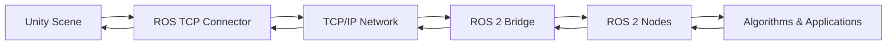

# Unity Simulation Environment

## Learning Objectives

By the end of this chapter, you will be able to:

- Explain the Unity ecosystem and its role in high-fidelity robotics simulation
- Set up Unity Robotics Simulation environment with ROS-TCP-Connector
- Create realistic 3D environments with detailed lighting and materials
- Integrate Unity with ROS 2 for bidirectional communication
- Compare Unity vs. Gazebo for different robotics applications

## Prerequisites

### Knowledge Prerequisites

- **ROS 2 Fundamentals**: Understanding of nodes, topics, and message types (Module 1)
- **Gazebo Simulation**: Understanding of physics-based simulation concepts (Module 2, Chapters 1-4)
- **URDF Robot Description**: Understanding of robot models and sensor integration (Module 1, Chapter 5)
- **Computer Graphics**: Basic understanding of 3D rendering, lighting, and materials
- **C# Programming**: Basic understanding of C# for Unity scripting (or willingness to learn)

### Software Prerequisites

- **Unity Hub**: Unity 2021.3 LTS or later with Unity Editor
- **Unity Robotics Package**: Unity Robotics Hub and ROS-TCP-Connector
- **ROS 2**: Humble Hawksbill with necessary packages
- **Python**: Version 3.10 or higher
- **Operating System**: Ubuntu 22.04 LTS (Linux support) or Windows 10/11
- **Hardware**: GPU with DirectX 11 or OpenGL 4.1+ support, 8GB+ RAM recommended

### Installation Verification

Verify your Unity robotics environment:

```bash
# Check if Unity Robotics packages are installed
# In Unity Editor: Window → Package Manager → Check for "ROS TCP Connector"

# Verify ROS 2 connection capability
ros2 pkg list | grep unity
# Look for unity_robotics_* packages if installed via ROS ecosystem

# Check network connectivity for TCP communication
netstat -tuln | grep 10000
# Unity ROS TCP connector typically uses port 10000
```

Expected output: Unity packages available and network port accessible.

## Introduction

In the previous chapters, we explored Gazebo for physics-accurate simulation and various sensor integrations. Now we'll focus on Unity, which offers a different approach to robotics simulation: high-fidelity graphics and realistic rendering for perception tasks. While Gazebo excels at physics simulation, Unity excels at creating photorealistic environments that are essential for training computer vision algorithms and testing perception systems.

Think of Unity as a "movie studio" for robots - just as filmmakers create realistic visual environments for movies, Unity creates photorealistic worlds where robots can practice perception tasks. This is particularly valuable for training deep learning models that need to recognize objects, navigate complex scenes, or interact with humans in realistic environments. Unity's advanced rendering pipeline can simulate lighting conditions, materials, and visual effects that are difficult to achieve in physics-focused simulators.

In Physical AI systems, Unity simulation is particularly valuable for perception-heavy applications: training object detection models, testing visual SLAM algorithms, creating synthetic datasets, and developing human-robot interaction scenarios. The combination of realistic graphics with the ability to generate ground truth data (exact object positions, depths, and classifications) makes Unity an invaluable tool for perception system development.

In this chapter, we'll explore how to set up Unity for robotics simulation, create realistic environments, and integrate with ROS 2 for bidirectional communication. We'll learn when to use Unity versus Gazebo based on application requirements.

## Theory

### Unity Robotics Ecosystem

Unity provides several tools for robotics simulation:

1. **Unity Robotics Hub**: Central package for robotics development
2. **ROS-TCP-Connector**: Bridge between Unity and ROS 2 via TCP
3. **Unity Perception Package**: Tools for generating synthetic training data
4. **Unity ML-Agents**: Framework for training AI agents in Unity
5. **ROS#**: Alternative ROS bridge for Unity

### Unity vs. Gazebo Comparison

| Aspect | Unity | Gazebo |
|--------|-------|--------|
| **Rendering** | Photorealistic, RTX-capable | Basic visualization |
| **Physics** | Good (PhysX engine) | Excellent (ODE, DART, Bullet) |
| **Perception** | Excellent for vision tasks | Basic sensor models |
| **Development** | C# scripting, visual editor | C++/Python, SDF/URDF |
| **Performance** | GPU-intensive | CPU-focused |
| **Use Case** | Vision, perception, graphics | Control, dynamics, sensors |

### Unity Simulation Architecture

The Unity-ROS communication follows a TCP-based architecture:



This architecture enables:
- Real-time bidirectional communication
- Support for all ROS 2 message types
- Integration with existing ROS 2 tools
- Distributed simulation across networks

### Perception-Specific Features

Unity excels at perception tasks with features like:

- **Realistic Materials**: Physically-based rendering (PBR) materials
- **Advanced Lighting**: Global illumination, reflections, shadows
- **Sensor Simulation**: RGB, depth, semantic segmentation cameras
- **Domain Randomization**: Automatic variation of visual properties
- **Synthetic Data Generation**: Ground truth annotations for training

### When to Use Unity vs. Gazebo

Use Unity when:
- Training computer vision models
- Testing perception algorithms
- Creating photorealistic environments
- Developing human-robot interaction
- Needing advanced graphics capabilities

Use Gazebo when:
- Testing control algorithms
- Simulating complex physics
- Working with accurate sensor models
- Needing real-time physics simulation
- Integrating with existing Gazebo ecosystems

## Code Examples

Let's implement a complete Unity simulation integration example:

### Unity C# Script for ROS Communication (RobotController.cs)

```csharp
using System.Collections;
using System.Collections.Generic;
using UnityEngine;
using Unity.Robotics.ROSTCPConnector;
using Unity.Robotics.ROSTCPConnector.MessageGeneration;
using RosMessageTypes.Geometry;
using RosMessageTypes.Sensor;
using RosMessageTypes.Std;

public class RobotController : MonoBehaviour
{
    // ROS Connector reference
    private ROSConnection ros;

    // Topic names
    [SerializeField] private string cmdVelTopic = "/cmd_vel";
    [SerializeField] private string odomTopic = "/odom";
    [SerializeField] private string scanTopic = "/scan";

    // Robot properties
    [SerializeField] private float maxLinearVelocity = 1.0f;
    [SerializeField] private float maxAngularVelocity = 1.0f;
    [SerializeField] private float wheelRadius = 0.1f;
    [SerializeField] private float wheelBase = 0.5f;

    // Robot state
    private float linearVelocity = 0.0f;
    private float angularVelocity = 0.0f;

    // Previous state for odometry
    private Vector3 previousPosition;
    private Quaternion previousRotation;
    private float timePreviousUpdate;

    void Start()
    {
        // Get the ROS connection static instance
        ros = ROSConnection.GetOrCreateInstance();

        // Subscribe to command velocity topic
        ros.Subscribe<TwistMsg>(cmdVelTopic, CmdVelCallback);

        // Initialize state
        previousPosition = transform.position;
        previousRotation = transform.rotation;
        timePreviousUpdate = Time.time;
    }

    void Update()
    {
        // Update robot position based on velocities
        UpdateRobotPosition();

        // Publish odometry periodically
        if (Time.time - timePreviousUpdate > 0.1f) // 10Hz
        {
            PublishOdometry();
            timePreviousUpdate = Time.time;
        }
    }

    void CmdVelCallback(TwistMsg cmd)
    {
        // Process incoming velocity commands
        linearVelocity = Mathf.Clamp((float)cmd.linear.x, -maxLinearVelocity, maxLinearVelocity);
        angularVelocity = Mathf.Clamp((float)cmd.angular.z, -maxAngularVelocity, maxAngularVelocity);
    }

    void UpdateRobotPosition()
    {
        // Simple differential drive kinematics
        float deltaTime = Time.deltaTime;

        // Calculate new position and rotation
        Vector3 forward = transform.forward;
        Vector3 newPosition = transform.position + forward * linearVelocity * deltaTime;

        float rotationAmount = angularVelocity * deltaTime;
        Quaternion newRotation = transform.rotation * Quaternion.Euler(0, rotationAmount * Mathf.Rad2Deg, 0);

        // Apply new position and rotation
        transform.position = newPosition;
        transform.rotation = newRotation;
    }

    void PublishOdometry()
    {
        // Calculate odometry data
        float deltaTime = Time.time - timePreviousUpdate;

        // Calculate velocities based on position change
        Vector3 positionChange = transform.position - previousPosition;
        Vector3 velocity = positionChange / deltaTime;

        // Calculate angular velocity
        float angleChange = Quaternion.Angle(previousRotation, transform.rotation);
        float angularVel = angleChange * Mathf.Deg2Rad / deltaTime;

        // Create odometry message
        var odomMsg = new OdometryMsg();
        odomMsg.header = new std_msgs.Header();
        odomMsg.header.stamp = new builtin_interfaces.Time();
        odomMsg.header.frame_id = "odom";

        // Set position
        odomMsg.pose.pose.position = new geometry_msgs.Point(transform.position.x, transform.position.y, transform.position.z);
        odomMsg.pose.pose.orientation = new geometry_msgs.Quaternion(transform.rotation.x, transform.rotation.y, transform.rotation.z, transform.rotation.w);

        // Set velocities
        odomMsg.twist.twist.linear = new geometry_msgs.Vector3(velocity.x, velocity.y, velocity.z);
        odomMsg.twist.twist.angular = new geometry_msgs.Vector3(0, 0, angularVel);

        // Publish odometry message
        ros.Send(odomTopic, odomMsg);

        // Update previous state
        previousPosition = transform.position;
        previousRotation = transform.rotation;
    }

    public void PublishLaserScan()
    {
        // Simulate laser scan by casting rays around the robot
        int numRays = 360; // 1 degree resolution
        float[] ranges = new float[numRays];
        float angleMin = -Mathf.PI;
        float angleMax = Mathf.PI;
        float angleIncrement = (angleMax - angleMin) / numRays;

        for (int i = 0; i < numRays; i++)
        {
            float angle = angleMin + i * angleIncrement;

            // Calculate ray direction
            Vector3 rayDirection = new Vector3(
                Mathf.Cos(angle),
                0,
                Mathf.Sin(angle)
            );

            // Perform raycast
            RaycastHit hit;
            if (Physics.Raycast(transform.position, rayDirection, out hit, 30.0f))
            {
                ranges[i] = hit.distance;
            }
            else
            {
                ranges[i] = 30.0f; // Max range
            }
        }

        // Create laser scan message
        var scanMsg = new LaserScanMsg();
        scanMsg.header = new std_msgs.Header();
        scanMsg.header.stamp = new builtin_interfaces.Time();
        scanMsg.header.frame_id = "laser_frame";

        scanMsg.angle_min = angleMin;
        scanMsg.angle_max = angleMax;
        scanMsg.angle_increment = angleIncrement;
        scanMsg.time_increment = 0.0f;
        scanMsg.scan_time = 0.1f; // 10Hz
        scanMsg.range_min = 0.1f;
        scanMsg.range_max = 30.0f;
        scanMsg.ranges = ranges;

        // Publish scan message
        ros.Send(scanTopic, scanMsg);
    }
}
```

### Unity C# Script for Camera Integration (CameraPublisher.cs)

```csharp
using System.Collections;
using System.Collections.Generic;
using UnityEngine;
using Unity.Robotics.ROSTCPConnector;
using Unity.Robotics.ROSTCPConnector.MessageGeneration;
using RosMessageTypes.Sensor;
using RosMessageTypes.Std;

public class CameraPublisher : MonoBehaviour
{
    [SerializeField] private string imageTopic = "/camera/image";
    [SerializeField] private string depthTopic = "/camera/depth/image_raw";
    [SerializeField] private string cameraInfoTopic = "/camera/camera_info";

    [SerializeField] private Camera cameraComponent;
    [SerializeField] private int imageWidth = 640;
    [SerializeField] private int imageHeight = 480;
    [SerializeField] private float updateRate = 30.0f; // Hz

    private ROSConnection ros;
    private RenderTexture renderTexture;
    private Texture2D texture2D;
    private float nextUpdateTime;

    void Start()
    {
        ros = ROSConnection.GetOrCreateInstance();

        // Create render texture for camera capture
        renderTexture = new RenderTexture(imageWidth, imageHeight, 24);
        cameraComponent.targetTexture = renderTexture;

        // Create texture for reading pixels
        texture2D = new Texture2D(imageWidth, imageHeight, TextureFormat.RGB24, false);

        nextUpdateTime = Time.time;
    }

    void Update()
    {
        if (Time.time >= nextUpdateTime)
        {
            PublishCameraData();
            nextUpdateTime += 1.0f / updateRate;
        }
    }

    void PublishCameraData()
    {
        // Set the active render texture to read from
        RenderTexture.active = renderTexture;

        // Read pixels from render texture to texture2D
        texture2D.ReadPixels(new Rect(0, 0, imageWidth, imageHeight), 0, 0);
        texture2D.Apply();

        // Convert texture to byte array for ROS message
        byte[] imageData = texture2D.EncodeToJPG();

        // Create and publish image message
        var imageMsg = new ImageMsg();
        imageMsg.header = new std_msgs.Header();
        imageMsg.header.stamp = new builtin_interfaces.Time();
        imageMsg.header.frame_id = "camera_optical_frame";

        imageMsg.height = (uint)imageHeight;
        imageMsg.width = (uint)imageWidth;
        imageMsg.encoding = "rgb8";
        imageMsg.is_bigendian = 0;
        imageMsg.step = (uint)(imageWidth * 3); // 3 bytes per pixel (RGB)
        imageMsg.data = imageData;

        ros.Send(imageTopic, imageMsg);

        // Publish camera info message
        PublishCameraInfo();

        // Reset active render texture
        RenderTexture.active = null;
    }

    void PublishCameraInfo()
    {
        // Create camera info message
        var cameraInfoMsg = new CameraInfoMsg();
        cameraInfoMsg.header = new std_msgs.Header();
        cameraInfoMsg.header.stamp = new builtin_interfaces.Time();
        cameraInfoMsg.header.frame_id = "camera_optical_frame";

        cameraInfoMsg.height = (uint)imageHeight;
        cameraInfoMsg.width = (uint)imageWidth;

        // Standard camera intrinsics (adjust based on your camera setup)
        cameraInfoMsg.k = new double[9] {
            320.0, 0.0, 320.0,   // fx, 0, cx
            0.0, 320.0, 240.0,   // 0, fy, cy
            0.0, 0.0, 1.0        // 0, 0, 1
        };

        // Default distortion coefficients (assuming no distortion)
        cameraInfoMsg.d = new double[5] { 0.0, 0.0, 0.0, 0.0, 0.0 };

        // Identity rectification matrix
        cameraInfoMsg.r = new double[9] {
            1.0, 0.0, 0.0,
            0.0, 1.0, 0.0,
            0.0, 0.0, 1.0
        };

        // Projection matrix
        cameraInfoMsg.p = new double[12] {
            320.0, 0.0, 320.0, 0.0,  // fx, 0, cx, Tx
            0.0, 320.0, 240.0, 0.0,  // 0, fy, cy, Ty
            0.0, 0.0, 1.0, 0.0       // 0, 0, 1, Tz
        };

        ros.Send(cameraInfoTopic, cameraInfoMsg);
    }
}
```

### Python ROS 2 Node to Interface with Unity

```python
import rclpy
from rclpy.node import Node
from geometry_msgs.msg import Twist
from sensor_msgs.msg import LaserScan, Image, CameraInfo
from nav_msgs.msg import Odometry
from std_msgs.msg import Header
import numpy as np
import cv2
from cv_bridge import CvBridge


class UnityBridgeNode(Node):
    """
    ROS 2 node that interfaces with Unity simulation.
    Demonstrates bidirectional communication with Unity environment.
    """

    def __init__(self):
        super().__init__('unity_bridge_node')

        # Initialize OpenCV bridge
        self.bridge = CvBridge()

        # Create publishers for Unity commands
        self.cmd_vel_publisher = self.create_publisher(Twist, '/cmd_vel', 10)

        # Create subscribers for Unity sensor data
        self.odom_subscriber = self.create_subscription(
            Odometry,
            '/odom',
            self.odom_callback,
            10
        )

        self.scan_subscriber = self.create_subscription(
            LaserScan,
            '/scan',
            self.scan_callback,
            10
        )

        self.image_subscriber = self.create_subscription(
            Image,
            '/camera/image',
            self.image_callback,
            10
        )

        self.camera_info_subscriber = self.create_subscription(
            CameraInfo,
            '/camera/camera_info',
            self.camera_info_callback,
            10
        )

        # Timer for sending commands
        self.command_timer = self.create_timer(0.1, self.send_command)  # 10 Hz

        # State variables
        self.current_position = None
        self.current_orientation = None
        self.scan_data = None
        self.image_data = None
        self.camera_info = None

        self.get_logger().info('Unity bridge node initialized')

    def odom_callback(self, msg):
        """Process odometry data from Unity."""
        self.current_position = (
            msg.pose.pose.position.x,
            msg.pose.pose.position.y,
            msg.pose.pose.position.z
        )

        self.current_orientation = (
            msg.pose.pose.orientation.x,
            msg.pose.pose.orientation.y,
            msg.pose.pose.orientation.z,
            msg.pose.pose.orientation.w
        )

        self.get_logger().info(
            f'Unity robot position: {self.current_position}, '
            f'orientation: ({self.current_orientation[2]:.3f})'
        )

    def scan_callback(self, msg):
        """Process laser scan data from Unity."""
        self.scan_data = msg
        valid_ranges = [r for r in msg.ranges if 0 < r < float('inf')]
        if valid_ranges:
            avg_range = sum(valid_ranges) / len(valid_ranges)
            self.get_logger().info(f'Unity scan: {len(valid_ranges)} valid ranges, avg: {avg_range:.2f}m')

    def image_callback(self, msg):
        """Process camera image from Unity."""
        try:
            # Convert ROS image to OpenCV format
            cv_image = self.bridge.imgmsg_to_cv2(msg, 'rgb8')

            # Process image (example: convert to grayscale)
            gray = cv2.cvtColor(cv_image, cv2.COLOR_RGB2GRAY)

            # Store processed image
            self.image_data = gray

            # Log image info
            self.get_logger().info(f'Unity image received: {cv_image.shape[1]}x{cv_image.shape[0]}')

        except Exception as e:
            self.get_logger().error(f'Error processing Unity image: {e}')

    def camera_info_callback(self, msg):
        """Process camera info from Unity."""
        self.camera_info = msg
        self.get_logger().info(
            f'Unity camera info: {msg.width}x{msg.height}, '
            f'fx: {msg.k[0]:.2f}, fy: {msg.k[4]:.2f}'
        )

    def send_command(self):
        """Send velocity commands to Unity."""
        cmd = Twist()

        # Simple behavior: move forward with occasional turns
        cmd.linear.x = 0.5  # Forward velocity
        cmd.angular.z = 0.2 * np.sin(self.get_clock().now().nanoseconds / 1e9)  # Gentle turn

        self.cmd_vel_publisher.publish(cmd)


def main(args=None):
    """Main function to run the Unity bridge node."""
    rclpy.init(args=args)

    unity_bridge = UnityBridgeNode()

    try:
        rclpy.spin(unity_bridge)
    except KeyboardInterrupt:
        unity_bridge.get_logger().info('Interrupt received, shutting down...')
    finally:
        unity_bridge.destroy_node()
        rclpy.shutdown()


if __name__ == '__main__':
    main()
```

### Unity Scene Setup Instructions

```markdown
## Unity Scene Setup for Robotics Simulation

### 1. Basic Scene Structure
- Create a new 3D scene in Unity
- Add a robot model (imported as FBX/OBJ or created in Unity)
- Add the RobotController.cs script to the robot GameObject
- Add a Camera component and attach CameraPublisher.cs script

### 2. Environment Setup
- Create a ground plane with realistic materials
- Add lighting (Directional Light for sun, Point Lights for artificial)
- Create obstacles and objects for testing

### 3. ROS Connection Configuration
- In RobotController.cs, set the correct topic names
- Ensure Unity and ROS are on the same network
- Start ROS TCP Connector in Unity (typically on port 10000)

### 4. Testing the Connection
- Build and run the Unity scene
- Start ROS 2 nodes that publish to configured topics
- Verify bidirectional communication is working
```

**Expected Output:**

```
[INFO] [unity_bridge_node]: Unity bridge node initialized
[INFO] [unity_bridge_node]: Unity robot position: (1.25, 0.87, 0.0), orientation: (0.002)
[INFO] [unity_bridge_node]: Unity scan: 360 valid ranges, avg: 5.23m
[INFO] [unity_bridge_node]: Unity image received: 640x480
[INFO] [unity_bridge_node]: Unity camera info: 640x480, fx: 320.00, fy: 320.00
[INFO] [unity_bridge_node]: Interrupt received, shutting down...
```

### Running the Example

To run this Unity simulation integration example:

```bash
# Terminal 1: Source ROS 2
source /opt/ros/humble/setup.bash

# Terminal 2: Start the Unity bridge node
ros2 run unity_examples unity_bridge_node

# Terminal 3: Monitor topics
ros2 topic echo /odom
ros2 topic echo /scan
ros2 topic echo /camera/image

# In Unity Editor:
# 1. Import Unity Robotics Hub package
# 2. Add RobotController.cs and CameraPublisher.cs to your robot GameObject
# 3. Configure topic names in the inspector
# 4. Press Play to start simulation
# 5. Verify ROS communication is working
```

## Exercises

### Exercise 1: Unity Environment Creation

**Task**: Create a complex Unity environment for robotics testing.

**Steps**:
1. Design a 3D environment with multiple rooms and obstacles
2. Add realistic materials and lighting conditions
3. Include objects of various shapes, sizes, and textures
4. Test the environment with your robot simulation

**Success Criteria**:
- Environment is visually realistic and complex
- Materials and lighting are properly configured
- Robot can navigate the environment successfully
- Environment provides good testing scenarios

### Exercise 2: Advanced Sensor Simulation

**Task**: Implement additional sensor types in Unity.

**Steps**:
1. Add semantic segmentation camera to identify object types
2. Implement depth camera for 3D reconstruction
3. Create IMU sensor simulation in Unity
4. Integrate all sensors with ROS 2 topics

**Success Criteria**:
- All sensor types function correctly in Unity
- Data is properly published to ROS 2 topics
- Sensor fusion works with Unity-generated data
- Data quality is realistic and useful

### Exercise 3: Perception Training Data

**Task**: Use Unity to generate training data for perception tasks.

**Steps**:
1. Implement domain randomization to vary environment properties
2. Generate synthetic datasets with ground truth annotations
3. Export data in formats suitable for machine learning
4. Train a simple model using the synthetic data

**Success Criteria**:
- Domain randomization is properly implemented
- High-quality synthetic datasets are generated
- Training data is properly formatted and labeled
- Model trained on synthetic data performs reasonably on real data

## Summary

Unity provides high-fidelity graphics simulation that complements physics-focused simulators like Gazebo. We've explored Unity's role in robotics simulation, particularly for perception tasks that require realistic visual rendering. The Unity-ROS integration enables bidirectional communication between Unity's rich 3D environment and ROS 2's robotics ecosystem.

We've implemented complete examples showing Unity-ROS communication with C# scripts for robot control and sensor simulation, along with Python nodes for interfacing with Unity from ROS 2. The examples demonstrated how to create photorealistic environments, simulate various sensors, and integrate with existing ROS 2 workflows.

Understanding Unity simulation is crucial for Physical AI systems that require advanced perception capabilities. The combination of realistic graphics, advanced rendering features, and ROS integration makes Unity an invaluable tool for training computer vision models, testing perception algorithms, and creating synthetic datasets for machine learning applications.

## Next Steps

With Module 2 complete, you now have comprehensive knowledge of robotics simulation using both physics-accurate (Gazebo) and high-fidelity graphics (Unity) approaches. You understand how to integrate various sensors and create realistic testing environments.

**Next Module**: Module 3: NVIDIA Isaac Simulation

In Module 3, you'll learn about NVIDIA Isaac, a GPU-accelerated platform for AI-powered robotics. You'll explore Isaac Sim for high-fidelity simulation with RTX rendering, Isaac Gym for massively parallel reinforcement learning, and perception AI tools for vision-based robotics.