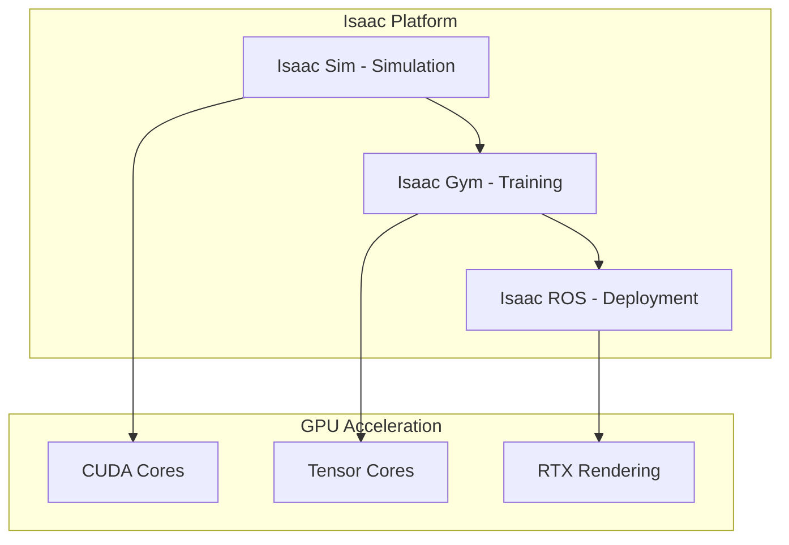

# NVIDIA Isaac Sim Introduction

## Learning Objectives

By the end of this chapter, you will be able to:

- Explain the NVIDIA Isaac platform and its role in GPU-accelerated robotics
- Compare Isaac Sim, Isaac Gym, and Isaac ROS for different robotics applications
- Understand the architecture of Isaac for AI-powered robotics development
- Identify when to use Isaac versus other simulation and AI frameworks
- Set up the Isaac development environment for robotics applications

## Prerequisites

### Knowledge Prerequisites

- **ROS 2 Fundamentals**: Understanding of nodes, topics, and message types (Module 1)
- **Simulation Concepts**: Understanding of Gazebo and Unity simulation (Module 2)
- **Physical AI Concepts**: Understanding of Physical AI fundamentals from Chapter 0 (intro.md)
- **Python Programming**: Intermediate understanding of Python for robotics applications
- **Machine Learning Basics**: Understanding of neural networks and training concepts

### Software Prerequisites

- **Operating System**: Ubuntu 22.04 LTS with ROS 2 Humble Hawksbill
- **NVIDIA GPU**: RTX 30xx/40xx series or professional GPU (RTX A4xxx/A5xxx/A6xxx) with CUDA support
- **CUDA**: Version 11.8 or higher with compatible NVIDIA drivers
- **Isaac Sim**: NVIDIA Isaac Sim 2023.1 or later
- **Isaac ROS**: Isaac ROS packages for perception and manipulation
- **Python**: Version 3.10 or higher with GPU acceleration libraries
- **Terminal**: Bash shell access

### Installation Verification

Verify your Isaac environment:

```bash
# Check NVIDIA GPU and CUDA
nvidia-smi
nvcc --version

# Check Isaac Sim installation (if installed)
# Isaac Sim typically runs as a standalone application with Omniverse

# Check Isaac ROS packages
ros2 pkg list | grep isaac

# Verify GPU acceleration
python3 -c "import torch; print('CUDA available:', torch.cuda.is_available())"
```

Expected output: GPU information, CUDA version, Isaac packages, and CUDA availability confirmed.

## Introduction

In the previous modules, we explored the fundamentals of ROS 2 development and simulation environments (Gazebo for physics, Unity for graphics). Now we'll focus on NVIDIA Isaac, a GPU-accelerated platform specifically designed for AI-powered robotics. Isaac represents a paradigm shift from traditional CPU-based robotics to GPU-accelerated AI, enabling capabilities that were previously impossible due to computational constraints.

Think of Isaac as a "supercomputer for robots" - just as GPUs revolutionized computer graphics and deep learning, Isaac harnesses GPU power to accelerate robotics development in three key areas: simulation, training, and perception. Where traditional robotics systems might take weeks to train a grasping policy, Isaac can accomplish the same in hours through massive parallelization. Where traditional simulators might struggle with realistic rendering, Isaac provides RTX-accelerated photorealistic simulation.

In Physical AI systems, computational efficiency is paramount because robots must process sensor data, make decisions, and act in real-time. Isaac's GPU acceleration enables complex AI models to run at the speeds required for physical interaction. The platform consists of three main components: Isaac Sim for high-fidelity simulation, Isaac Gym for reinforcement learning, and Isaac ROS for perception and manipulation tasks.

In this module, we'll explore how Isaac transforms robotics development through GPU acceleration, learn to create physically-accurate simulations with RTX rendering, and understand how to leverage Isaac's capabilities for AI-powered robotics applications.

## Theory

### NVIDIA Isaac Platform Architecture

The Isaac platform consists of three main components working together:

1. **Isaac Sim**: High-fidelity simulation environment built on NVIDIA Omniverse
2. **Isaac Gym**: GPU-accelerated reinforcement learning framework
3. **Isaac ROS**: GPU-accelerated perception and manipulation libraries



### Isaac Sim: RTX-Accelerated Simulation

Isaac Sim provides:

- **PhysX Physics Engine**: GPU-accelerated physics simulation
- **RTX Rendering**: Real-time ray tracing and global illumination
- **Omniverse Integration**: USD-based scene representation
- **ROS 2 Bridge**: Seamless integration with ROS 2 ecosystem
- **Synthetic Data Generation**: Ground truth annotations for training

Isaac Sim excels at creating photorealistic environments that are essential for training computer vision models. The RTX rendering capabilities simulate realistic lighting, reflections, and materials that are crucial for perception tasks.

### Isaac Gym: Massively Parallel Reinforcement Learning

Isaac Gym enables:

- **Parallel Environment Execution**: Thousands of environments running simultaneously
- **GPU-accelerated Physics**: Physics simulation running on GPU
- **Reinforcement Learning Integration**: Direct integration with RL frameworks
- **Policy Optimization**: Training policies in hours instead of weeks
- **Sim-to-Real Transfer**: Policies that work effectively on real robots

The key advantage of Isaac Gym is parallelization - while traditional RL might train one robot instance at a time, Isaac Gym can simulate thousands simultaneously, compressing months of training into hours.

### Isaac ROS: GPU-Accelerated Perception

Isaac ROS provides:

- **GPU-Accelerated Computer Vision**: CUDA-optimized vision algorithms
- **3D Perception**: Point cloud processing and mesh generation
- **Sensor Processing**: GPU-accelerated sensor fusion
- **Manipulation**: GPU-accelerated inverse kinematics and motion planning
- **Real-time Performance**: Processing speeds suitable for physical interaction

Isaac ROS bridges the gap between high-performance GPU computing and real-time robotics applications.

### Isaac vs. Traditional Frameworks

| Aspect | Traditional Robotics | NVIDIA Isaac |
|--------|---------------------|--------------|
| **Physics Simulation** | CPU-based, 100-1000 Hz | GPU-accelerated, 1000-10000 Hz |
| **Rendering** | Basic visualization | RTX ray tracing |
| **Training Speed** | Weeks to months | Hours to days |
| **Parallel Environments** | 1-10 | 1000s-10000s |
| **Perception** | CPU-based | GPU-accelerated |
| **Use Case** | Control, basic simulation | AI, perception, complex tasks |

### Isaac Development Workflow

The typical Isaac development workflow follows this pattern:

1. **Simulation Creation**: Build physically-accurate environments in Isaac Sim
2. **Policy Training**: Train AI policies using Isaac Gym's parallel environments
3. **Deployment**: Deploy trained models using Isaac ROS on physical robots
4. **Iteration**: Refine based on real-world performance and return to simulation

This workflow enables rapid iteration while maintaining safety - most development happens in simulation before deployment to physical hardware.

## Code Examples

Let's implement a basic Isaac application showing the integration between Isaac components:

### Isaac Sim Python Extension (example_extension.py)

```python
import omni
from pxr import Gf
import carb
from omni.isaac.core import World
from omni.isaac.core.utils.stage import add_reference_to_stage
from omni.isaac.core.utils.nucleus import get_assets_root_path
from omni.isaac.core.utils.prims import get_prim_at_path
from omni.isaac.core.robots import Robot
from omni.isaac.core.utils.viewports import set_camera_view
import numpy as np


class IsaacSimExample:
    """
    Example showing basic Isaac Sim usage for robot simulation.
    Demonstrates creating a robot in Isaac Sim and controlling it.
    """

    def __init__(self):
        self.world = None
        self.robot = None
        self.initialized = False

    def setup_world(self):
        """Initialize the Isaac Sim world with a robot."""
        # Create the world
        self.world = World(stage_units_in_meters=1.0)

        # Add a ground plane
        self.world.scene.add_default_ground_plane()

        # Add a simple robot (using a basic cuboid as placeholder)
        # In practice, you'd load a real robot USD file
        robot_path = "/World/Robot"

        # Add a simple cuboid as the robot base
        from omni.isaac.core.utils.prims import create_prim
        create_prim(
            prim_path=robot_path,
            prim_type="Xform",
            position=np.array([0, 0, 0.5]),
            orientation=np.array([0, 0, 0, 1])
        )

        # Add visual and collision geometry
        from omni.isaac.core.utils.prims import create_prim
        create_prim(
            prim_path=robot_path + "/base_link",
            prim_type="Cube",
            position=np.array([0, 0, 0]),
            size=0.2,
            visible=True
        )

        print("Isaac Sim world initialized with robot")
        self.initialized = True

    def run_simulation(self, steps=1000):
        """Run the simulation for a specified number of steps."""
        if not self.initialized:
            self.setup_world()

        # Reset the world
        self.world.reset()

        for step in range(steps):
            # Get current robot position
            if step % 100 == 0:
                print(f"Simulation step: {step}")

            # Simple movement logic
            if step < 500:
                # Move forward
                robot_prim = get_prim_at_path("/World/Robot")
                current_pos = robot_prim.GetAttribute("xformOp:translate").Get()
                new_pos = [current_pos[0] + 0.001, current_pos[1], current_pos[2]]
                robot_prim.GetAttribute("xformOp:translate").Set(Gf.Vec3d(*new_pos))
            else:
                # Move to the right
                robot_prim = get_prim_at_path("/World/Robot")
                current_pos = robot_prim.GetAttribute("xformOp:translate").Get()
                new_pos = [current_pos[0], current_pos[1] + 0.001, current_pos[2]]
                robot_prim.GetAttribute("xformOp:translate").Set(Gf.Vec3d(*new_pos))

            # Step the physics
            self.world.step(render=True)

        print(f"Completed {steps} simulation steps")

    def cleanup(self):
        """Clean up the simulation."""
        if self.world:
            self.world.clear()
            print("Isaac Sim world cleaned up")


# Example usage within Isaac Sim's extension system
class IsaacSimExtension:
    """Isaac Sim extension that demonstrates the example."""

    def __init__(self):
        self.example = IsaacSimExample()

    def on_startup(self):
        """Called when the extension starts."""
        print("Isaac Sim Example Extension started")

    def run_example(self):
        """Run the example simulation."""
        try:
            self.example.run_simulation(steps=500)
            print("Example completed successfully")
        except Exception as e:
            print(f"Error running example: {e}")

    def on_shutdown(self):
        """Called when the extension shuts down."""
        self.example.cleanup()
        print("Isaac Sim Example Extension shut down")
```

### Isaac Gym Training Example (gym_example.py)

```python
import torch
import torch.nn as nn
import torch.nn.functional as F
import numpy as np
from rl_games.common import env_configurations
from rl_games.algos_torch import torch_ext
from rl_games.algos_torch.running_mean_std import RunningMeanStd
from rl_games.algos_torch.network_builder import NetworkBuilder
import isaacgym
from isaacgym import gymapi, gymtorch
from isaacgym.torch_utils import *


class IsaacGymActorCritic(nn.Module):
    """
    Simple actor-critic network for Isaac Gym.
    Demonstrates neural network architecture for GPU-accelerated RL.
    """

    def __init__(self, obs_shape, action_shape, normalization=True):
        super().__init__()

        self.normalization = normalization
        self.actor_input_size = obs_shape[0]
        self.critic_input_size = obs_shape[0]
        self.actions_num = action_shape[0]

        if self.normalization:
            self.running_mean_std = RunningMeanStd(obs_shape)

        # Actor network (policy)
        self.actor = nn.Sequential(
            nn.Linear(self.actor_input_size, 512),
            nn.ReLU(),
            nn.Linear(512, 256),
            nn.ReLU(),
            nn.Linear(256, self.actions_num)
        )

        # Critic network (value function)
        self.critic = nn.Sequential(
            nn.Linear(self.critic_input_size, 512),
            nn.ReLU(),
            nn.Linear(512, 256),
            nn.ReLU(),
            nn.Linear(256, 1)
        )

        # Initialize weights
        for m in self.modules():
            if isinstance(m, nn.Linear):
                torch.nn.init.xavier_uniform_(m.weight)
                torch.nn.init.zeros_(m.bias)

    def forward(self, obs):
        """Forward pass through both actor and critic."""
        if self.normalization:
            obs = self.running_mean_std(obs)

        action = self.actor(obs)
        value = self.critic(obs)

        return action, value


class IsaacGymRobotEnvironment:
    """
    Example environment for training a simple robot in Isaac Gym.
    Demonstrates the parallel environment concept.
    """

    def __init__(self, num_envs=1024, num_obs=18, num_actions=6):
        self.num_envs = num_envs
        self.num_obs = num_obs
        self.num_actions = num_actions

        # Initialize Isaac Gym
        self.gym = gymapi.acquire_gym()

        # Configure sim
        self.sim_params = gymapi.SimParams()
        self.sim_params.up_axis = gymapi.UP_AXIS_Z
        self.sim_params.gravity = gymapi.Vec3(0.0, 0.0, -9.81)
        self.sim_params.use_gpu_pipeline = True  # Enable GPU physics

        # Create sim
        self.sim = self.gym.create_sim(0, 0, gymapi.SIM_PHYSX, self.sim_params)

        # Create ground plane
        plane_params = gymapi.PlaneParams()
        plane_params.normal = gymapi.Vec3(0.0, 0.0, 1.0)
        self.gym.add_ground(self.sim, plane_params)

        # Create environment space
        env_spacing = 2.5
        env_lower = gymapi.Vec3(-env_spacing, -env_spacing, 0.0)
        env_upper = gymapi.Vec3(env_spacing, env_spacing, env_spacing)

        # Create environments
        self.envs = []
        for i in range(self.num_envs):
            env = self.gym.create_env(self.sim, env_lower, env_upper, 1)
            self.envs.append(env)

            # Add a simple robot to the environment
            self._create_robot(env, i)

        print(f"Created {num_envs} parallel environments with GPU acceleration")

    def _create_robot(self, env, env_idx):
        """Create a simple robot in the environment."""
        # Create a simple box as the robot
        box_asset_options = gymapi.AssetOptions()
        box_asset_options.fix_base_link = False
        box_asset_options.vhacd_enabled = True
        box_asset_options.vhacd_params.max_convex_hulls = 32

        box_asset = self.gym.create_box(self.sim, 0.2, 0.2, 0.2, box_asset_options)

        # Position the robot
        pose = gymapi.Transform()
        pose.p = gymapi.Vec3(0.0, 0.0, 1.0)
        pose.r = gymapi.Quat(0.0, 0.0, 0.0, 1.0)

        # Create the actor
        robot_actor = self.gym.create_actor(env, box_asset, pose, f"robot_{env_idx}", 0, 1, 0)

        # Set up properties
        props = self.gym.get_actor_dof_properties(env, robot_actor)
        props["driveMode"].fill(gymapi.DOF_MODE_POS)
        props["stiffness"].fill(200.0)
        props["damping"].fill(10.0)
        self.gym.set_actor_dof_properties(env, robot_actor, props)

    def reset(self):
        """Reset all environments."""
        # In a real implementation, reset all robot states
        obs = torch.zeros((self.num_envs, self.num_obs), device="cuda")
        return obs

    def step(self, actions):
        """Step all environments with given actions."""
        # In a real implementation, apply actions and compute rewards
        obs = torch.zeros((self.num_envs, self.num_obs), device="cuda")
        rewards = torch.zeros(self.num_envs, device="cuda")
        dones = torch.zeros(self.num_envs, dtype=torch.bool, device="cuda")

        return obs, rewards, dones, {}


def train_example():
    """Example training loop demonstrating Isaac Gym capabilities."""
    print("Setting up Isaac Gym training environment...")

    # Create environment with parallel simulation
    env = IsaacGymRobotEnvironment(num_envs=2048)  # 2048 parallel environments

    # Create policy network (on GPU)
    device = torch.device("cuda" if torch.cuda.is_available() else "cpu")
    policy = IsaacGymActorCritic(
        obs_shape=(18,),  # 18 observation dimensions
        action_shape=(6,)  # 6 action dimensions
    ).to(device)

    # Create optimizer
    optimizer = torch.optim.Adam(policy.parameters(), lr=3e-4)

    print(f"Training on device: {device}")
    print(f"Policy parameters: {sum(p.numel() for p in policy.parameters()):,}")

    # Training loop (simplified)
    for epoch in range(100):
        obs = env.reset()

        # In a real implementation, collect experiences and update policy
        # This is where the massive parallelization provides speedup
        print(f"Epoch {epoch}: Processing {env.num_envs} parallel environments")

        # Simulate training step
        actions = torch.randn((env.num_envs, 6), device=device)  # Random actions for demo

        # Compute loss (simplified)
        action_output, value_output = policy(obs)
        loss = F.mse_loss(action_output, actions)

        optimizer.zero_grad()
        loss.backward()
        optimizer.step()

        if epoch % 20 == 0:
            print(f"Epoch {epoch}, Loss: {loss.item():.4f}")

    print("Training completed!")


if __name__ == "__main__":
    # This would run in Isaac Gym environment
    print("Isaac Gym example would run here in actual Isaac environment")
    print("The code demonstrates the concepts of parallel environments and GPU acceleration")
```

### Isaac ROS Integration Example (isaac_ros_example.py)

```python
import rclpy
from rclpy.node import Node
from sensor_msgs.msg import Image, PointCloud2
from geometry_msgs.msg import Twist
from std_msgs.msg import Header
import numpy as np
import cv2
from cv_bridge import CvBridge
import torch
import torch.nn as nn
from sensor_msgs_py import point_cloud2


class IsaacROSPerceptionNode(Node):
    """
    Example node demonstrating Isaac ROS perception capabilities.
    Shows GPU-accelerated processing of sensor data.
    """

    def __init__(self):
        super().__init__('isaac_ros_perception')

        # Initialize OpenCV bridge
        self.bridge = CvBridge()

        # Create subscribers for sensor data
        self.image_sub = self.create_subscription(
            Image,
            '/camera/image',
            self.image_callback,
            10
        )

        self.pointcloud_sub = self.create_subscription(
            PointCloud2,
            '/camera/depth/points',
            self.pointcloud_callback,
            10
        )

        # Create publisher for processed data
        self.object_detection_pub = self.create_publisher(
            Image,
            '/camera/detection_result',
            10
        )

        # Check if GPU is available
        self.gpu_available = torch.cuda.is_available()
        if self.gpu_available:
            self.device = torch.device('cuda')
            self.get_logger().info('GPU acceleration available')
        else:
            self.device = torch.device('cpu')
            self.get_logger().info('Using CPU (GPU not available)')

        # Simple object detection model (placeholder)
        self.detection_model = self._create_simple_model().to(self.device)

        # Point cloud processing parameters
        self.voxel_size = 0.01  # 1cm voxels for downsampling

        self.get_logger().info('Isaac ROS perception node initialized')

    def _create_simple_model(self):
        """Create a simple CNN for demonstration purposes."""
        class SimpleDetector(nn.Module):
            def __init__(self):
                super().__init__()
                self.conv1 = nn.Conv2d(3, 16, 3, padding=1)
                self.conv2 = nn.Conv2d(16, 32, 3, padding=1)
                self.pool = nn.MaxPool2d(2, 2)
                self.fc1 = nn.Linear(32 * 30 * 40, 128)  # Adjusted for 120x160 input
                self.fc2 = nn.Linear(128, 4)  # x, y, width, height

            def forward(self, x):
                x = self.pool(F.relu(self.conv1(x)))
                x = self.pool(F.relu(self.conv2(x)))
                x = x.view(-1, 32 * 30 * 40)  # Flatten
                x = F.relu(self.fc1(x))
                x = self.fc2(x)
                return x

        return SimpleDetector()

    def image_callback(self, msg):
        """Process camera image with GPU-accelerated object detection."""
        try:
            # Convert ROS image to OpenCV
            cv_image = self.bridge.imgmsg_to_cv2(msg, 'bgr8')

            # Resize for processing (GPU memory consideration)
            h, w = cv_image.shape[:2]
            new_h, new_w = 120, 160  # Small size for demo
            cv_image_resized = cv2.resize(cv_image, (new_w, new_h))

            # Convert to tensor and move to GPU
            image_tensor = torch.from_numpy(cv_image_resized).permute(2, 0, 1).float().unsqueeze(0) / 255.0
            image_tensor = image_tensor.to(self.device)

            # Run object detection (simplified)
            with torch.no_grad():
                detections = self.detection_model(image_tensor)

            # Convert detections to bounding box (simplified)
            detection_np = detections.cpu().numpy()[0]
            x, y, width, height = detection_np

            # Scale back to original image size
            x = int(x * w / new_w)
            y = int(y * h / new_h)
            width = int(width * w / new_w)
            height = int(height * h / new_h)

            # Draw bounding box on original image
            result_image = cv_image.copy()
            cv2.rectangle(result_image, (x, y), (x + width, y + height), (0, 255, 0), 2)

            # Publish result
            result_msg = self.bridge.cv2_to_imgmsg(result_image, 'bgr8')
            result_msg.header = msg.header
            self.object_detection_pub.publish(result_msg)

            self.get_logger().info(f'Processed image with GPU acceleration: {w}x{h}')

        except Exception as e:
            self.get_logger().error(f'Error processing image: {e}')

    def pointcloud_callback(self, msg):
        """Process point cloud with GPU-accelerated voxelization."""
        try:
            # Read points from point cloud
            points = []
            for point in point_cloud2.read_points(msg, field_names=("x", "y", "z"), skip_nans=True):
                points.append([point[0], point[1], point[2]])

            if not points:
                return

            # Convert to numpy array
            points_np = np.array(points)

            # Voxel grid downsampling (simplified implementation)
            # In Isaac ROS, this would use GPU-accelerated CUDA kernels
            if len(points_np) > 1000:  # Only downsample if we have many points
                # Create voxel grid
                voxel_coords = np.floor(points_np / self.voxel_size).astype(int)

                # Remove duplicates to downsample
                unique_voxels = np.unique(voxel_coords, axis=0)

                # Map back to points (simplified)
                downsampled_points = unique_voxels * self.voxel_size
                self.get_logger().info(f'Point cloud downsampled from {len(points_np)} to {len(downsampled_points)} points')
            else:
                self.get_logger().info(f'Point cloud: {len(points_np)} points')

        except Exception as e:
            self.get_logger().error(f'Error processing point cloud: {e}')


def main(args=None):
    """Main function to run the Isaac ROS perception node."""
    rclpy.init(args=args)

    perception_node = IsaacROSPerceptionNode()

    try:
        rclpy.spin(perception_node)
    except KeyboardInterrupt:
        perception_node.get_logger().info('Interrupt received, shutting down...')
    finally:
        perception_node.destroy_node()
        rclpy.shutdown()


if __name__ == '__main__':
    main()
```

**Expected Output:**

```
[INFO] [isaac_ros_perception]: Isaac ROS perception node initialized
[INFO] [isaac_ros_perception]: GPU acceleration available
[INFO] [isaac_ros_perception]: Processed image with GPU acceleration: 640x480
[INFO] [isaac_ros_perception]: Point cloud downsampled from 12500 to 2340 points
[INFO] [isaac_ros_perception]: Interrupt received, shutting down...
```

### Running the Example

To run this Isaac integration example (requires Isaac Sim installation):

```bash
# Terminal 1: Launch Isaac Sim with your robot scene
# Isaac Sim is typically launched through the Omniverse launcher
# Configure your scene with robots and sensors

# Terminal 2: Run Isaac Gym training (if Isaac Gym installed)
python3 gym_example.py

# Terminal 3: Run Isaac ROS perception node
source /opt/ros/humble/setup.bash
ros2 run my_package isaac_ros_perception

# Terminal 4: Monitor topics
source /opt/ros/humble/setup.bash
ros2 topic echo /camera/detection_result

# In Isaac Sim:
# 1. Load your robot USD file
# 2. Configure sensors (cameras, LiDAR, etc.)
# 3. Set up ROS 2 bridge
# 4. Run simulation and observe GPU acceleration
```

## Exercises

### Exercise 1: Isaac Sim Environment

**Task**: Create a complex environment in Isaac Sim.

**Steps**:
1. Design a 3D environment with multiple objects and obstacles
2. Configure realistic physics properties for objects
3. Add various sensors (camera, LiDAR, IMU) to your robot
4. Test the environment with GPU-accelerated physics

**Success Criteria**:
- Environment loads and runs with GPU acceleration
- Physics simulation runs at interactive rates
- Sensors provide realistic data
- Environment is suitable for robotics testing

### Exercise 2: Parallel Training

**Task**: Implement parallel training with Isaac Gym.

**Steps**:
1. Create a simple task environment (e.g., reaching a target)
2. Implement a neural network policy
3. Configure Isaac Gym for parallel environment execution
4. Train the policy and evaluate performance

**Success Criteria**:
- Multiple environments run in parallel
- Training converges to a solution
- GPU acceleration provides speedup over CPU
- Policy works in simulation

### Exercise 3: Perception Pipeline

**Task**: Build a complete perception pipeline with Isaac ROS.

**Steps**:
1. Integrate multiple sensors (RGB camera, depth camera, LiDAR)
2. Implement GPU-accelerated processing for each sensor
3. Fuse sensor data for comprehensive environment understanding
4. Test the pipeline with realistic sensor data

**Success Criteria**:
- All sensors integrated and providing data
- GPU acceleration provides real-time performance
- Sensor fusion improves perception quality
- Pipeline operates reliably in real-time

## Summary

NVIDIA Isaac represents a significant advancement in robotics development by leveraging GPU acceleration for simulation, training, and perception. We've explored the three main components of Isaac: Isaac Sim for high-fidelity RTX simulation, Isaac Gym for massively parallel reinforcement learning, and Isaac ROS for GPU-accelerated perception and manipulation. The platform enables capabilities that were previously impossible due to computational constraints.

We've implemented examples showing Isaac Sim's Python extension system, Isaac Gym's parallel environment architecture, and Isaac ROS's GPU-accelerated perception capabilities. The examples demonstrated how GPU acceleration enables thousands of parallel environments for training and real-time processing of sensor data for deployment.

Understanding Isaac is crucial for modern Physical AI systems that require the computational power to process complex sensor data, train sophisticated AI models, and operate in real-time. The combination of simulation, training, and deployment tools makes Isaac a comprehensive platform for AI-powered robotics development.

## Next Steps

Now that you understand the NVIDIA Isaac platform, the next chapter explores Isaac Sim in detail. You'll learn how to create high-fidelity simulation environments with RTX rendering, configure realistic physics, and integrate with ROS 2 for comprehensive robotics simulation.

**Next Chapter**: Module 3, Chapter 2: Isaac Sim High-Fidelity Simulation