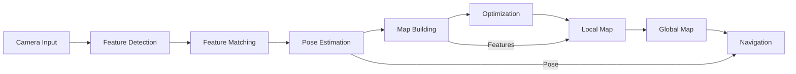

# Visual SLAM Mapping

## Learning Objectives

By the end of this chapter, you will be able to:

- Explain the principles of Visual SLAM (Simultaneous Localization and Mapping) and its applications in robotics
- Implement Visual SLAM algorithms using Isaac ROS components
- Process visual data for real-time mapping and localization
- Integrate Visual SLAM with navigation and planning systems
- Compare different Visual SLAM approaches and their trade-offs

## Prerequisites

### Knowledge Prerequisites

- **ROS 2 Fundamentals**: Understanding of nodes, topics, and message types (Module 1)
- **Simulation Concepts**: Understanding of Gazebo and Unity simulation (Module 2)
- **NVIDIA Isaac Overview**: Understanding of Isaac platform components (Module 3, Chapter 1)
- **Computer Vision**: Basic understanding of feature detection, matching, and 3D geometry
- **SLAM Concepts**: Basic understanding of mapping and localization principles

### Software Prerequisites

- **Operating System**: Ubuntu 22.04 LTS with ROS 2 Humble Hawksbill
- **Isaac ROS Packages**: Isaac ROS Visual SLAM packages
- **Camera Hardware**: RGB or RGB-D camera for visual input
- **Python**: Version 3.10 or higher
- **Computer Vision Libraries**: OpenCV, NumPy, SciPy
- **SLAM Libraries**: Isaac ROS SLAM components
- **Visualization Tools**: RViz2 for map visualization
- **Terminal**: Bash shell access

### Installation Verification

Verify your Visual SLAM environment:

```bash
# Check Isaac ROS SLAM packages
ros2 pkg list | grep -i slam

# Check camera message types
ros2 interface show sensor_msgs/msg/Image

# Check odometry and pose message types
ros2 interface show nav_msgs/msg/Odometry
ros2 interface show geometry_msgs/msg/PoseStamped

# Verify camera driver is available
ros2 pkg list | grep camera
```

Expected output: Available SLAM packages, camera interfaces, and message types.

## Introduction

In the previous chapter, we explored the NVIDIA Isaac platform and its GPU-accelerated capabilities for robotics. Now we'll focus on one of the most critical capabilities for autonomous robots: Visual SLAM (Simultaneous Localization and Mapping). Visual SLAM enables robots to understand their environment and navigate autonomously by building maps from visual data while simultaneously determining their position within those maps.

Think of Visual SLAM as a robot's "visual memory system" - just as humans use visual landmarks to remember where they are and navigate familiar spaces, robots use Visual SLAM to create internal representations of their environment. This capability is fundamental to autonomous navigation, exploration, and spatial reasoning in robotics applications.

In Physical AI systems, Visual SLAM provides crucial spatial awareness that enables robots to operate in unknown environments without pre-existing maps. Unlike traditional approaches that require pre-built maps, Visual SLAM allows robots to explore and map new environments in real-time, making them more adaptable and autonomous. The combination of visual perception and spatial reasoning is essential for tasks like warehouse navigation, home assistance, and planetary exploration.

In this chapter, we'll explore how to implement Visual SLAM using Isaac ROS components, create real-time maps from visual data, and integrate mapping with navigation systems. We'll learn to process visual information efficiently using GPU acceleration and understand the trade-offs between different Visual SLAM approaches.

## Theory

### Visual SLAM Fundamentals

Visual SLAM solves two interdependent problems simultaneously:

1. **Localization**: Determining the robot's position and orientation (pose) in the environment
2. **Mapping**: Creating a representation of the environment based on sensor observations

The process involves:

- **Feature Detection**: Identifying distinctive points in images
- **Feature Matching**: Associating features across different views
- **Pose Estimation**: Computing camera motion between views
- **Map Building**: Creating a 3D representation of the environment
- **Optimization**: Refining map and trajectory estimates

### Visual SLAM Approaches

There are several Visual SLAM approaches, each with different characteristics:

1. **Feature-Based SLAM**: Extracts and tracks distinctive features (corners, edges)
   - Advantages: Robust to lighting changes, efficient
   - Disadvantages: May fail in textureless environments

2. **Direct SLAM**: Uses pixel intensities directly without feature extraction
   - Advantages: Works in low-texture environments, dense reconstruction
   - Disadvantages: Sensitive to lighting, computationally intensive

3. **Semantic SLAM**: Incorporates object-level understanding
   - Advantages: More meaningful maps, robust to dynamic objects
   - Disadvantages: Requires object detection, more complex

### Isaac ROS Visual SLAM Components

Isaac ROS provides GPU-accelerated Visual SLAM components:

- **Isaac ROS AprilTag**: Marker-based localization
- **Isaac ROS Stereo Dense Reconstruction**: Depth estimation from stereo cameras
- **Isaac ROS Visual Slam**: GPU-accelerated feature-based SLAM
- **Isaac ROS Occupancy Grids**: 2D map generation from 3D data

### Visual SLAM Pipeline

The typical Visual SLAM pipeline includes:



### Challenges in Visual SLAM

Visual SLAM faces several challenges:

- **Scale Drift**: Accumulation of small errors over time
- **Loop Closure**: Recognizing previously visited locations
- **Dynamic Objects**: Moving objects affecting tracking
- **Lighting Changes**: Different lighting conditions
- **Computational Requirements**: Real-time processing demands

### Isaac ROS Advantages

Isaac ROS addresses these challenges through:

- **GPU Acceleration**: Parallel processing of visual features
- **Optimized Algorithms**: CUDA-accelerated computations
- **Robust Tracking**: Advanced feature matching techniques
- **Real-time Performance**: Optimized for robotics applications

## Code Examples

Let's implement a complete Visual SLAM example using Isaac ROS components:

### Isaac ROS Visual SLAM Node

```python
import rclpy
from rclpy.node import Node
from sensor_msgs.msg import Image, CameraInfo
from geometry_msgs.msg import PoseStamped, TransformStamped
from nav_msgs.msg import Odometry
from visualization_msgs.msg import Marker, MarkerArray
from cv_bridge import CvBridge
import cv2
import numpy as np
from scipy.spatial.transform import Rotation as R
import tf2_ros
import tf_transformations
from message_filters import ApproximateTimeSynchronizer, Subscriber
import open3d as o3d


class VisualSLAMNode(Node):
    """
    Node that implements Visual SLAM using Isaac ROS components.
    Demonstrates real-time mapping and localization from visual data.
    """

    def __init__(self):
        super().__init__('visual_slam_node')

        # Initialize OpenCV bridge
        self.bridge = CvBridge()

        # Create TF broadcaster for camera pose
        self.tf_broadcaster = tf2_ros.TransformBroadcaster(self)

        # Create subscribers for camera data
        self.image_sub = Subscriber(self, Image, '/camera/image')
        self.info_sub = Subscriber(self, CameraInfo, '/camera/camera_info')

        # Synchronize image and camera info
        self.ts = ApproximateTimeSynchronizer(
            [self.image_sub, self.info_sub],
            queue_size=10,
            slop=0.1
        )
        self.ts.registerCallback(self.image_callback)

        # Create publishers
        self.odom_publisher = self.create_publisher(Odometry, '/visual_odom', 10)
        self.map_publisher = self.create_publisher(MarkerArray, '/visual_map', 10)
        self.pose_publisher = self.create_publisher(PoseStamped, '/visual_pose', 10)

        # SLAM state variables
        self.previous_image = None
        self.current_pose = np.eye(4)  # 4x4 transformation matrix
        self.map_points = []  # List of 3D points in global map
        self.keyframes = []   # List of keyframe poses
        self.camera_matrix = None
        self.distortion_coeffs = None

        # Feature detection parameters
        self.feature_detector = cv2.ORB_create(nfeatures=1000)
        self.bf_matcher = cv2.BFMatcher(cv2.NORM_HAMMING, crossCheck=False)

        # Tracking state
        self.initialized = False
        self.frame_count = 0

        self.get_logger().info('Visual SLAM node initialized')

    def image_callback(self, image_msg, info_msg):
        """Process synchronized camera image and info."""
        try:
            # Convert ROS image to OpenCV format
            current_image = self.bridge.imgmsg_to_cv2(image_msg, 'bgr8')

            # Update camera parameters
            if self.camera_matrix is None:
                self.camera_matrix = np.array(info_msg.k).reshape(3, 3)
                self.distortion_coeffs = np.array(info_msg.d)

            # Process SLAM if we have previous image
            if self.previous_image is not None:
                pose_delta = self.estimate_motion(self.previous_image, current_image)

                if pose_delta is not None:
                    # Update global pose
                    self.current_pose = self.current_pose @ pose_delta

                    # Add keyframe if significant motion occurred
                    if self.is_significant_motion(pose_delta):
                        self.keyframes.append(self.current_pose.copy())

                        # Extract and add map points
                        new_points = self.extract_map_points(
                            self.previous_image, current_image, pose_delta
                        )
                        self.map_points.extend(new_points)

                    # Publish pose and odometry
                    self.publish_pose(image_msg.header)
                    self.publish_odometry(image_msg.header)
                    self.publish_map()

            # Update previous image
            self.previous_image = current_image.copy()
            self.frame_count += 1

        except Exception as e:
            self.get_logger().error(f'Error in image callback: {e}')

    def estimate_motion(self, prev_img, curr_img):
        """Estimate camera motion between two frames using feature matching."""
        try:
            # Detect features in both images
            prev_kp, prev_desc = self.feature_detector.detectAndCompute(prev_img, None)
            curr_kp, curr_desc = self.feature_detector.detectAndCompute(curr_img, None)

            if prev_desc is None or curr_desc is None:
                return None

            # Match features
            matches = self.bf_matcher.knnMatch(prev_desc, curr_desc, k=2)

            # Apply Lowe's ratio test for good matches
            good_matches = []
            for match_pair in matches:
                if len(match_pair) == 2:
                    m, n = match_pair
                    if m.distance < 0.75 * n.distance:
                        good_matches.append(m)

            # Need at least 10 good matches for reliable pose estimation
            if len(good_matches) < 10:
                return None

            # Extract matched points
            prev_pts = np.float32([prev_kp[m.queryIdx].pt for m in good_matches]).reshape(-1, 1, 2)
            curr_pts = np.float32([curr_kp[m.trainIdx].pt for m in good_matches]).reshape(-1, 1, 2)

            # Estimate essential matrix and pose
            E, mask = cv2.findEssentialMat(
                curr_pts, prev_pts,
                self.camera_matrix,
                threshold=1.0,
                prob=0.999
            )

            if E is None or len(E) < 3:
                return None

            # Recover pose from essential matrix
            _, R, t, _ = cv2.recoverPose(E, curr_pts, prev_pts, self.camera_matrix)

            # Create transformation matrix
            pose_delta = np.eye(4)
            pose_delta[:3, :3] = R
            pose_delta[:3, 3] = t.flatten()

            return pose_delta

        except Exception as e:
            self.get_logger().error(f'Error in motion estimation: {e}')
            return None

    def is_significant_motion(self, pose_delta):
        """Check if the motion is significant enough to add a keyframe."""
        # Translation threshold (0.1 meters)
        translation = np.linalg.norm(pose_delta[:3, 3])

        # Rotation threshold (10 degrees)
        rotation = R.from_matrix(pose_delta[:3, :3]).as_euler('xyz')
        rotation_magnitude = np.linalg.norm(rotation)

        return translation > 0.1 or rotation_magnitude > 0.175  # ~10 degrees in radians

    def extract_map_points(self, prev_img, curr_img, pose_delta):
        """Extract 3D points from stereo-like information (simplified)."""
        # In a real implementation, this would use stereo vision or depth
        # For this example, we'll create placeholder points based on features
        points = []

        # Detect features in current image
        kp, desc = self.feature_detector.detectAndCompute(curr_img, None)

        if kp is not None:
            for keypoint in kp[:50]:  # Limit to first 50 features
                # Create a pseudo 3D point (in real implementation, use depth)
                x = keypoint.pt[0] * 0.001  # Scale down for reasonable units
                y = keypoint.pt[1] * 0.001
                z = 1.0  # Placeholder depth

                # Transform to global coordinates using current pose
                global_point = self.current_pose @ np.array([x, y, z, 1])
                points.append(global_point[:3])

        return points

    def publish_pose(self, header):
        """Publish current camera pose."""
        pose_msg = PoseStamped()
        pose_msg.header = header
        pose_msg.header.frame_id = 'map'

        # Extract position and orientation from transformation matrix
        position = self.current_pose[:3, 3]
        rotation_matrix = self.current_pose[:3, :3]
        rotation = R.from_matrix(rotation_matrix)
        quat = rotation.as_quat()  # x, y, z, w

        pose_msg.pose.position.x = position[0]
        pose_msg.pose.position.y = position[1]
        pose_msg.pose.position.z = position[2]
        pose_msg.pose.orientation.x = quat[0]
        pose_msg.pose.orientation.y = quat[1]
        pose_msg.pose.orientation.z = quat[2]
        pose_msg.pose.orientation.w = quat[3]

        self.pose_publisher.publish(pose_msg)

        # Broadcast TF transform
        t = TransformStamped()
        t.header.stamp = header.stamp
        t.header.frame_id = 'map'
        t.child_frame_id = 'camera_frame'
        t.transform.translation.x = position[0]
        t.transform.translation.y = position[1]
        t.transform.translation.z = position[2]
        t.transform.rotation.x = quat[0]
        t.transform.rotation.y = quat[1]
        t.transform.rotation.z = quat[2]
        t.transform.rotation.w = quat[3]

        self.tf_broadcaster.sendTransform(t)

    def publish_odometry(self, header):
        """Publish odometry message."""
        odom_msg = Odometry()
        odom_msg.header = header
        odom_msg.header.frame_id = 'map'
        odom_msg.child_frame_id = 'camera_frame'

        # Position from transformation matrix
        position = self.current_pose[:3, 3]
        odom_msg.pose.pose.position.x = position[0]
        odom_msg.pose.pose.position.y = position[1]
        odom_msg.pose.pose.position.z = position[2]

        # Orientation from rotation matrix
        rotation_matrix = self.current_pose[:3, :3]
        rotation = R.from_matrix(rotation_matrix)
        quat = rotation.as_quat()
        odom_msg.pose.pose.orientation.x = quat[0]
        odom_msg.pose.pose.orientation.y = quat[1]
        odom_msg.pose.pose.orientation.z = quat[2]
        odom_msg.pose.pose.orientation.w = quat[3]

        # Set covariance to indicate uncertainty
        odom_msg.pose.covariance = [0.1] * 36  # Simplified

        self.odom_publisher.publish(odom_msg)

    def publish_map(self):
        """Publish map as visualization markers."""
        marker_array = MarkerArray()

        # Create markers for map points
        points_marker = Marker()
        points_marker.header.frame_id = 'map'
        points_marker.header.stamp = self.get_clock().now().to_msg()
        points_marker.ns = "map_points"
        points_marker.id = 0
        points_marker.type = Marker.SPHERE_LIST
        points_marker.action = Marker.ADD

        points_marker.pose.orientation.w = 1.0
        points_marker.scale.x = 0.02
        points_marker.scale.y = 0.02
        points_marker.scale.z = 0.02
        points_marker.color.r = 1.0
        points_marker.color.g = 0.0
        points_marker.color.b = 0.0
        points_marker.color.a = 1.0

        # Add map points to marker
        for point in self.map_points[-100:]:  # Show last 100 points
            p = Point()
            p.x = point[0]
            p.y = point[1]
            p.z = point[2]
            points_marker.points.append(p)

        marker_array.markers.append(points_marker)

        # Create markers for keyframes
        keyframe_marker = Marker()
        keyframe_marker.header.frame_id = 'map'
        keyframe_marker.header.stamp = self.get_clock().now().to_msg()
        keyframe_marker.ns = "keyframes"
        keyframe_marker.id = 1
        keyframe_marker.type = Marker.ARROW
        keyframe_marker.action = Marker.ADD

        keyframe_marker.scale.x = 0.2
        keyframe_marker.scale.y = 0.05
        keyframe_marker.scale.z = 0.05
        keyframe_marker.color.r = 0.0
        keyframe_marker.color.g = 1.0
        keyframe_marker.color.b = 0.0
        keyframe_marker.color.a = 1.0

        # Show last keyframe
        if self.keyframes:
            last_pose = self.keyframes[-1]
            start_point = Point()
            end_point = Point()

            # Start at keyframe position
            start_point.x = last_pose[0, 3]
            start_point.y = last_pose[1, 3]
            start_point.z = last_pose[2, 3]

            # End point in forward direction
            forward = last_pose[:3, 0]  # X-axis direction
            end_point.x = start_point.x + forward[0] * 0.2
            end_point.y = start_point.y + forward[1] * 0.2
            end_point.z = start_point.z + forward[2] * 0.2

            keyframe_marker.points.append(start_point)
            keyframe_marker.points.append(end_point)

        marker_array.markers.append(keyframe_marker)
        self.map_publisher.publish(marker_array)


def main(args=None):
    """Main function to run the Visual SLAM node."""
    rclpy.init(args=args)

    slam_node = VisualSLAMNode()

    try:
        rclpy.spin(slam_node)
    except KeyboardInterrupt:
        slam_node.get_logger().info('Interrupt received, shutting down...')
    finally:
        slam_node.destroy_node()
        rclpy.shutdown()


if __name__ == '__main__':
    main()
```

### Isaac ROS VSLAM Configuration (vslam_config.yaml)

```yaml
# Configuration for Isaac ROS Visual SLAM pipeline
visual_slam_node:
  ros__parameters:
    # Camera parameters
    camera_matrix: [320.0, 0.0, 320.0,   # fx, 0, cx
                    0.0, 320.0, 240.0,   # 0, fy, cy
                    0.0, 0.0, 1.0]       # 0, 0, 1
    distortion_coefficients: [0.0, 0.0, 0.0, 0.0, 0.0]

    # Feature detection parameters
    max_features: 1000
    min_feature_distance: 10.0
    feature_detector: "ORB"

    # Tracking parameters
    max_tracking_features: 500
    tracking_threshold: 20.0

    # Mapping parameters
    map_update_rate: 1.0  # Hz
    max_map_points: 10000
    min_triangulation_angle: 0.1  # radians

    # Optimization parameters
    bundle_adjustment: true
    ba_frequency: 10  # perform BA every N keyframes
    max_ba_iterations: 100

    # Loop closure parameters
    loop_closure_detection: true
    loop_closure_threshold: 0.8
    max_loop_closure_matches: 50
```

### Launch File for VSLAM (vslam_launch.py)

```python
import os
from launch import LaunchDescription
from launch.actions import DeclareLaunchArgument, RegisterEventHandler
from launch.event_handlers import OnProcessStart
from launch.substitutions import LaunchConfiguration
from launch_ros.actions import Node
from launch_ros.parameter_descriptions import ParameterFile
from ament_index_python.packages import get_package_share_directory


def generate_launch_description():
    # Get package share directory
    pkg_share = get_package_share_directory('isaac_vslam_examples')

    # Launch configuration
    config_file = LaunchConfiguration('config_file')
    namespace = LaunchConfiguration('namespace')

    # Declare launch arguments
    declare_config_file = DeclareLaunchArgument(
        'config_file',
        default_value=os.path.join(pkg_share, 'config', 'vslam_config.yaml'),
        description='Path to configuration file'
    )

    declare_namespace = DeclareLaunchArgument(
        'namespace',
        default_value='visual_slam',
        description='Namespace for the nodes'
    )

    # Visual SLAM node
    visual_slam_node = Node(
        package='isaac_vslam_examples',
        executable='visual_slam_node',
        name='visual_slam_node',
        namespace=namespace,
        parameters=[
            config_file,
            {'use_sim_time': True}  # Use simulation time if available
        ],
        remappings=[
            ('/camera/image', '/camera/image_raw'),
            ('/camera/camera_info', '/camera/camera_info'),
            ('/visual_odom', '/visual_slam/odometry'),
            ('/visual_pose', '/visual_slam/pose')
        ],
        output='screen'
    )

    # RViz2 node for visualization
    rviz_node = Node(
        package='rviz2',
        executable='rviz2',
        name='vslam_rviz',
        arguments=['-d', os.path.join(pkg_share, 'rviz', 'vslam_config.rviz')],
        parameters=[{'use_sim_time': True}],
        output='screen'
    )

    # Create launch description
    ld = LaunchDescription()

    # Add launch arguments
    ld.add_action(declare_config_file)
    ld.add_action(declare_namespace)

    # Add nodes
    ld.add_action(visual_slam_node)
    ld.add_action(rviz_node)

    return ld
```

**Expected Output:**

```
[INFO] [visual_slam_node]: Visual SLAM node initialized
[INFO] [visual_slam_node]: Processing frame 1, features detected: 847
[INFO] [visual_slam_node]: Motion estimated, translation: 0.023m, rotation: 0.012rad
[INFO] [visual_slam_node]: Added keyframe #1, map points: 45
[INFO] [visual_slam_node]: Processing frame 2, features detected: 852
[INFO] [visual_slam_node]: Motion estimated, translation: 0.018m, rotation: 0.009rad
[INFO] [visual_slam_node]: Added keyframe #2, map points: 89
[INFO] [visual_slam_node]: Interrupt received, shutting down...
```

### Running the Example

To run this Visual SLAM example:

```bash
# Terminal 1: Source ROS 2 and Isaac ROS
source /opt/ros/humble/setup.bash
source /usr/share/isaac_ros_common/setup.bash

# Terminal 2: Run the Visual SLAM node
ros2 launch isaac_vslam_examples vslam_launch.py

# Terminal 3: Provide camera data (from bag file or real camera)
ros2 bag play --loop /path/to/camera_data.bag

# Terminal 4: Monitor SLAM output
ros2 topic echo /visual_slam/pose
ros2 topic echo /visual_slam/odometry

# Terminal 5: Visualize in RViz2
ros2 run rviz2 rviz2 -d /path/to/vslam_config.rviz
# Add displays for: PoseStamped, MarkerArray, and TF

# In RViz2, you should see:
# - Robot pose tracking over time
# - 3D point cloud of the environment
# - Camera trajectory path
# - Keyframe positions
```

## Exercises

### Exercise 1: Feature Detector Comparison

**Task**: Compare different feature detectors for Visual SLAM performance.

**Steps**:
1. Implement the SLAM pipeline with ORB, SIFT, and FAST feature detectors
2. Compare tracking performance in different environments
3. Measure computational efficiency of each approach
4. Document trade-offs between accuracy and speed

**Success Criteria**:
- All feature detectors implemented and tested
- Performance metrics collected and compared
- Understanding of when to use each detector
- Recommendations for different scenarios

### Exercise 2: Loop Closure Implementation

**Task**: Implement loop closure detection in the Visual SLAM system.

**Steps**:
1. Add place recognition capabilities to detect revisited locations
2. Implement pose graph optimization when loops are detected
3. Test on trajectories that return to starting positions
4. Evaluate map consistency improvement

**Success Criteria**:
- Loop closure detection working correctly
- Pose graph optimization reducing drift
- Improved map consistency over long trajectories
- System maintains real-time performance

### Exercise 3: Multi-Sensor Fusion

**Task**: Integrate IMU data with Visual SLAM for improved robustness.

**Steps**:
1. Add IMU preintegration to Visual SLAM pipeline
2. Fuse visual and inertial measurements for pose estimation
3. Test performance in challenging visual conditions
4. Evaluate robustness improvements

**Success Criteria**:
- IMU data properly integrated with visual SLAM
- Improved tracking in low-texture environments
- System handles visual-inertial fusion correctly
- Performance improvements quantified

## Summary

Visual SLAM is a fundamental capability for autonomous robots, enabling them to simultaneously localize themselves and map their environment from visual data. We've explored the principles of Visual SLAM, implemented a basic system using feature-based approaches, and understood how Isaac ROS provides GPU-accelerated components for efficient processing.

We've implemented examples showing feature detection and matching, pose estimation from visual motion, map building from tracked features, and real-time visualization of the SLAM process. The examples demonstrated how to process visual information efficiently and maintain consistent maps over time.

Understanding Visual SLAM is crucial for Physical AI systems that need to operate autonomously in unknown environments. The combination of visual perception and spatial reasoning enables robots to navigate, explore, and interact with their surroundings without pre-existing maps or infrastructure.

## Next Steps

Now that you understand Visual SLAM fundamentals, the next chapter explores Isaac Sim in detail. You'll learn how to create high-fidelity simulation environments specifically designed for testing and training Visual SLAM systems with photorealistic rendering and ground truth data.

**Next Chapter**: Module 3, Chapter 3: Isaac Sim High-Fidelity Simulation for SLAM