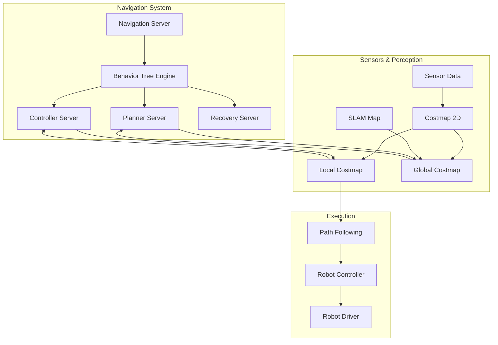

# Nav2 Navigation Stack

## Learning Objectives

By the end of this chapter, you will be able to:

- Explain the Nav2 architecture and its components for autonomous navigation
- Configure Nav2 for different robot platforms and environments
- Implement navigation behaviors using Nav2's behavior tree system
- Integrate Nav2 with Isaac Sim for simulation and testing
- Evaluate and tune navigation performance metrics

## Prerequisites

### Knowledge Prerequisites

- **ROS 2 Fundamentals**: Understanding of nodes, topics, and message types (Module 1)
- **Simulation Concepts**: Understanding of Gazebo and Isaac simulation (Module 2-3)
- **SLAM Concepts**: Understanding of mapping and localization (Module 3, Chapter 2)
- **Control Systems**: Basic understanding of robot control and path following
- **Behavior Trees**: Basic understanding of task planning and execution

### Software Prerequisites

- **Operating System**: Ubuntu 22.04 LTS with ROS 2 Humble Hawksbill
- **Nav2 Packages**: Navigation2 packages installed and configured
- **Isaac Sim**: NVIDIA Isaac Sim for navigation testing (optional)
- **Python**: Version 3.10 or higher
- **Visualization Tools**: RViz2 for navigation visualization
- **Map Tools**: Navigation map creation and editing tools
- **Terminal**: Bash shell access

### Installation Verification

Verify your Nav2 environment:

```bash
# Check Nav2 packages
ros2 pkg list | grep nav2

# Check Nav2 launch files
find /opt/ros/humble/share/ -name "*nav2*" -type d

# Verify Nav2 services
ros2 service list | grep nav

# Check Nav2 action servers
ros2 action list | grep navigate
```

Expected output: Available Nav2 packages, services, and action servers.

## Introduction

In the previous chapters, we explored NVIDIA Isaac and Visual SLAM for mapping and localization. Now we'll focus on Nav2 (Navigation2), the state-of-the-art navigation stack for ROS 2 that enables autonomous robot navigation. Nav2 provides a complete framework for path planning, obstacle avoidance, and goal-directed navigation that works seamlessly with the maps created by SLAM systems.

Think of Nav2 as a robot's "navigation brain" - just as humans use mental maps and planning to navigate from one location to another, Nav2 enables robots to plan safe paths, avoid obstacles, and reach goals autonomously. The system integrates perception, planning, and control to create robust navigation capabilities that work in dynamic environments.

In Physical AI systems, autonomous navigation is fundamental for mobile robots that need to operate independently. Nav2 provides the infrastructure for robots to move safely through environments, avoid both static and dynamic obstacles, and reach specified destinations. The stack is highly configurable and extensible, allowing it to work with different robot platforms and application requirements.

In this chapter, we'll explore how to configure Nav2 for different scenarios, implement navigation behaviors using behavior trees, integrate with Isaac Sim for testing, and tune navigation performance for optimal results.

## Theory

### Nav2 Architecture Overview

Nav2 is built around a flexible, modular architecture:



### Core Nav2 Components

1. **Navigation Server**: Main orchestrator that manages the navigation lifecycle
2. **Planner Server**: Global path planner (A*, Dijkstra, etc.)
3. **Controller Server**: Local path follower and obstacle avoidance
4. **Recovery Server**: Behavior for getting unstuck or recovering from failures
5. **Behavior Tree Engine**: Task orchestration using behavior trees

### Costmap System

Nav2 uses two costmaps for navigation:

- **Global Costmap**: Static map of the environment with static obstacles
- **Local Costmap**: Dynamic map of immediate surroundings with real-time obstacles

Costmaps represent the environment as a 2D grid where each cell contains a cost value:
- 0: Free space
- 255: Obstacle
- 1-254: Increasing cost (inflation, navigation preferences)

### Behavior Trees in Nav2

Nav2 uses behavior trees for navigation orchestration:

- **Sequence Nodes**: Execute children in order until one fails
- **Fallback Nodes**: Execute children until one succeeds
- **Decorator Nodes**: Modify behavior of child nodes
- **Action Nodes**: Execute specific navigation actions

Example behavior tree structure:
```
Root
├── ComputePathToPose (Global Planner)
├── FollowPath (Local Controller)
├── Spin (Recovery)
├── Backup (Recovery)
└── Wait (Recovery)
```

### Navigation Algorithms

Nav2 includes multiple algorithms:

1. **Global Planners**: A*, NavFn, GridBasedPlanners
2. **Local Controllers**: DWA, MPC, RPP (Regulated Pure Pursuit)
3. **Recovery Behaviors**: Spin, Backup, Wait
4. **Sensor Processors**: VoxelGrid, InflationLayer

### Isaac Sim Integration

Isaac Sim provides ideal testing environments for Nav2:

- **High-fidelity simulation**: Realistic physics and sensor models
- **Ground truth data**: Accurate pose and map information
- **Scalable testing**: Multiple scenarios in parallel
- **Safe development**: No risk to physical hardware

## Code Examples

Let's implement a complete Nav2 navigation example with Isaac Sim integration:

### Nav2 Configuration (nav2_config.yaml)

```yaml
amcl:
  ros__parameters:
    use_sim_time: True
    alpha1: 0.2
    alpha2: 0.2
    alpha3: 0.2
    alpha4: 0.2
    alpha5: 0.2
    base_frame_id: "base_link"
    beam_skip_distance: 0.5
    beam_skip_error_threshold: 0.9
    beam_skip_threshold: 0.3
    do_beamskip: false
    global_frame_id: "map"
    lambda_short: 0.1
    laser_likelihood_max_dist: 2.0
    laser_max_range: 100.0
    laser_min_range: -1.0
    laser_model_type: "likelihood_field"
    max_beams: 60
    max_particles: 2000
    min_particles: 500
    odom_frame_id: "odom"
    pf_err: 0.05
    pf_z: 0.99
    recovery_alpha_fast: 0.0
    recovery_alpha_slow: 0.0
    resample_interval: 1
    robot_model_type: "nav2_amcl::DifferentialMotionModel"
    save_pose_rate: 0.5
    sigma_hit: 0.2
    tf_broadcast: true
    transform_tolerance: 1.0
    update_min_a: 0.2
    update_min_d: 0.25
    z_hit: 0.5
    z_max: 0.05
    z_rand: 0.5
    z_short: 0.05
    scan_topic: scan

amcl_map_client:
  ros__parameters:
    use_sim_time: True

amcl_rclcpp_node:
  ros__parameters:
    use_sim_time: True

bt_navigator:
  ros__parameters:
    use_sim_time: True
    global_frame: map
    robot_base_frame: base_link
    odom_topic: /odom
    bt_loop_duration: 10
    default_server_timeout: 20
    enable_groot_monitoring: True
    groot_zmq_publisher_port: 1666
    groot_zmq_server_port: 1667
    # Specify the path where the BT XML files are located
    plugin_lib_names:
    - nav2_compute_path_to_pose_action_bt_node
    - nav2_follow_path_action_bt_node
    - nav2_back_up_action_bt_node
    - nav2_spin_action_bt_node
    - nav2_wait_action_bt_node
    - nav2_clear_costmap_service_bt_node
    - nav2_is_stuck_condition_bt_node
    - nav2_goal_reached_condition_bt_node
    - nav2_goal_updated_condition_bt_node
    - nav2_initial_pose_received_condition_bt_node
    - nav2_reinitialize_global_localization_service_bt_node
    - nav2_rate_controller_bt_node
    - nav2_distance_controller_bt_node
    - nav2_speed_controller_bt_node
    - nav2_truncate_path_action_bt_node
    - nav2_goal_updater_node_bt_node
    - nav2_recovery_node_bt_node
    - nav2_pipeline_sequence_bt_node
    - nav2_round_robin_node_bt_node
    - nav2_transform_available_condition_bt_node
    - nav2_time_expired_condition_bt_node
    - nav2_path_expiring_timer_condition
    - nav2_distance_traveled_condition_bt_node

bt_navigator_rclcpp_node:
  ros__parameters:
    use_sim_time: True

controller_server:
  ros__parameters:
    use_sim_time: True
    controller_frequency: 20.0
    min_x_velocity_threshold: 0.001
    min_y_velocity_threshold: 0.5
    min_theta_velocity_threshold: 0.001
    progress_checker_plugin: "progress_checker"
    goal_checker_plugin: "goal_checker"
    controller_plugins: ["FollowPath"]

    # Progress checker parameters
    progress_checker:
      plugin: "nav2_controller::SimpleProgressChecker"
      required_movement_radius: 0.5
      movement_time_allowance: 10.0

    # Goal checker parameters
    goal_checker:
      plugin: "nav2_controller::SimpleGoalChecker"
      xy_goal_tolerance: 0.25
      yaw_goal_tolerance: 0.25
      stateful: True

    # Controller parameters
    FollowPath:
      plugin: "nav2_regulated_pure_pursuit_controller::RegulatedPurePursuitController"
      desired_linear_vel: 0.5
      max_linear_vel: 0.5
      min_linear_vel: 0.1
      max_angular_vel: 1.0
      min_angular_vel: 0.4
      lookahead_dist: 0.6
      lookahead_time: 1.5
      transform_tolerance: 0.1
      use_velocity_scaled_lookahead_dist: false
      min_lookahead_dist: 0.3
      max_lookahead_dist: 0.9
      use_interpolation: true
      use_regulated_linear_velocity: false
      use_regulated_angular_velocity: false
      regulated_linear_scaling_factor: 0.5
      regulated_angular_scaling_factor: 0.2

controller_server_rclcpp_node:
  ros__parameters:
    use_sim_time: True

local_costmap:
  local_costmap:
    ros__parameters:
      update_frequency: 5.0
      publish_frequency: 2.0
      global_frame: odom
      robot_base_frame: base_link
      use_sim_time: True
      rolling_window: true
      width: 3
      height: 3
      resolution: 0.05
      robot_radius: 0.22
      plugins: ["voxel_layer", "inflation_layer"]
      inflation_layer:
        plugin: "nav2_costmap_2d::InflationLayer"
        cost_scaling_factor: 3.0
        inflation_radius: 0.55
      voxel_layer:
        plugin: "nav2_costmap_2d::VoxelLayer"
        enabled: True
        publish_voxel_map: True
        origin_z: 0.0
        z_resolution: 0.05
        z_voxels: 16
        max_obstacle_height: 2.0
        mark_threshold: 0
        observation_sources: scan
        scan:
          topic: /scan
          max_obstacle_height: 2.0
          clearing: True
          marking: True
          data_type: "LaserScan"
          raytrace_max_range: 3.0
          raytrace_min_range: 0.0
          obstacle_max_range: 2.5
          obstacle_min_range: 0.0
  local_costmap_client:
    ros__parameters:
      use_sim_time: True
  local_costmap_rclcpp_node:
    ros__parameters:
      use_sim_time: True

global_costmap:
  global_costmap:
    ros__parameters:
      update_frequency: 1.0
      publish_frequency: 1.0
      global_frame: map
      robot_base_frame: base_link
      use_sim_time: True
      robot_radius: 0.22
      resolution: 0.05
      track_unknown_space: true
      plugins: ["static_layer", "obstacle_layer", "inflation_layer"]
      obstacle_layer:
        plugin: "nav2_costmap_2d::ObstacleLayer"
        enabled: True
        observation_sources: scan
        scan:
          topic: /scan
          max_obstacle_height: 2.0
          clearing: True
          marking: True
          data_type: "LaserScan"
          raytrace_max_range: 3.0
          raytrace_min_range: 0.0
          obstacle_max_range: 2.5
          obstacle_min_range: 0.0
      static_layer:
        plugin: "nav2_costmap_2d::StaticLayer"
        map_subscribe_transient_local: True
      inflation_layer:
        plugin: "nav2_costmap_2d::InflationLayer"
        cost_scaling_factor: 3.0
        inflation_radius: 0.55
  global_costmap_client:
    ros__parameters:
      use_sim_time: True
  global_costmap_rclcpp_node:
    ros__parameters:
      use_sim_time: True

map_server:
  ros__parameters:
    use_sim_time: True
    yaml_filename: "turtlebot3_world.yaml"

map_saver:
  ros__parameters:
    use_sim_time: True
    save_map_timeout: 5.0
    free_thresh_default: 0.25
    occupied_thresh_default: 0.65

planner_server:
  ros__parameters:
    expected_planner_frequency: 20.0
    use_sim_time: True
    planner_plugins: ["GridBased"]
    GridBased:
      plugin: "nav2_navfn_planner::NavfnPlanner"
      tolerance: 0.5
      use_astar: false
      allow_unknown: true

planner_server_rclcpp_node:
  ros__parameters:
    use_sim_time: True

recoveries_server:
  ros__parameters:
    costmap_topic: local_costmap/costmap_raw
    footprint_topic: local_costmap/published_footprint
    cycle_frequency: 10.0
    recovery_plugins: ["spin", "backup", "wait"]
    spin:
      plugin: "nav2_recoveries::Spin"
      spin_dist: 1.57
    backup:
      plugin: "nav2_recoveries::BackUp"
      backup_dist: 0.15
      backup_speed: 0.025
    wait:
      plugin: "nav2_recoveries::Wait"
      wait_duration: 1.0

robot_state_publisher:
  ros__parameters:
    use_sim_time: True

waypoint_follower:
  ros__parameters:
    loop_rate: 20
    stop_on_failure: false
    waypoint_task_executor_plugin: "wait_at_waypoint"
    wait_at_waypoint:
      plugin: "nav2_waypoint_follower::WaitAtWaypoint"
      enabled: true
      waypoint_pause_duration: 200
```

### Nav2 Client Node for Isaac Sim (nav2_client.py)

```python
import rclpy
from rclpy.node import Node
from rclpy.action import ActionClient
from rclpy.duration import Duration
from geometry_msgs.msg import PoseStamped, Point
from nav2_msgs.action import NavigateToPose
from std_msgs.msg import Header
import time
import math


class Nav2ClientNode(Node):
    """
    Node that interfaces with Nav2 to send navigation goals.
    Demonstrates how to use Nav2 action interface for autonomous navigation.
    """

    def __init__(self):
        super().__init__('nav2_client_node')

        # Create action client for navigation
        self.nav_to_pose_client = ActionClient(
            self,
            NavigateToPose,
            'navigate_to_pose'
        )

        # Create publisher for sending goals
        self.goal_publisher = self.create_publisher(
            PoseStamped,
            '/goal_pose',
            10
        )

        # Navigation state
        self.navigation_active = False
        self.goal_sequence = [
            (1.0, 1.0, 0.0),   # x, y, theta
            (2.0, 0.0, 1.57),  # x, y, theta
            (1.0, -1.0, 3.14), # x, y, theta
            (0.0, 0.0, 0.0),   # Return to start
        ]
        self.current_goal_index = 0

        # Timer for sending navigation goals
        self.nav_timer = self.create_timer(10.0, self.send_navigation_goal)

        self.get_logger().info('Nav2 client node initialized')

    def send_navigation_goal(self):
        """Send a navigation goal to Nav2."""
        if self.current_goal_index >= len(self.goal_sequence):
            self.get_logger().info('All navigation goals completed')
            return

        # Wait for action server
        if not self.nav_to_pose_client.wait_for_server(timeout_sec=1.0):
            self.get_logger().error('Nav2 action server not available')
            return

        # Get goal position
        goal_x, goal_y, goal_theta = self.goal_sequence[self.current_goal_index]

        # Create navigation goal
        goal_msg = NavigateToPose.Goal()
        goal_msg.pose.header.frame_id = 'map'
        goal_msg.pose.header.stamp = self.get_clock().now().to_msg()
        goal_msg.pose.pose.position.x = float(goal_x)
        goal_msg.pose.pose.position.y = float(goal_y)
        goal_msg.pose.pose.position.z = 0.0

        # Convert theta to quaternion
        from tf_transformations import quaternion_from_euler
        quat = quaternion_from_euler(0, 0, goal_theta)
        goal_msg.pose.pose.orientation.x = quat[0]
        goal_msg.pose.pose.orientation.y = quat[1]
        goal_msg.pose.pose.orientation.z = quat[2]
        goal_msg.pose.pose.orientation.w = quat[3]

        # Send goal
        self.get_logger().info(f'Sending navigation goal: ({goal_x}, {goal_y}, {goal_theta})')
        self.navigation_active = True

        # Send async goal
        future = self.nav_to_pose_client.send_goal_async(
            goal_msg,
            feedback_callback=self.feedback_callback
        )

        # Add result callback
        future.add_done_callback(self.goal_response_callback)

    def goal_response_callback(self, future):
        """Handle goal response from Nav2 server."""
        goal_handle = future.result()
        if not goal_handle.accepted:
            self.get_logger().info('Goal rejected by Nav2 server')
            self.navigation_active = False
            return

        self.get_logger().info('Goal accepted by Nav2 server')

        # Get result future
        result_future = goal_handle.get_result_async()
        result_future.add_done_callback(self.get_result_callback)

    def get_result_callback(self, future):
        """Handle navigation result from Nav2 server."""
        result = future.result().result
        self.get_logger().info(f'Navigation result: {result}')

        # Move to next goal
        self.current_goal_index += 1
        self.navigation_active = False

        if self.current_goal_index < len(self.goal_sequence):
            self.get_logger().info(f'Moving to next goal #{self.current_goal_index + 1}')
        else:
            self.get_logger().info('All navigation goals completed')

    def feedback_callback(self, feedback_msg):
        """Handle navigation feedback from Nav2 server."""
        feedback = feedback_msg.feedback
        # In a real implementation, you'd process feedback information
        # For example, remaining distance, current speed, etc.
        pass


def main(args=None):
    """Main function to run the Nav2 client node."""
    rclpy.init(args=args)

    nav_client = Nav2ClientNode()

    try:
        rclpy.spin(nav_client)
    except KeyboardInterrupt:
        nav_client.get_logger().info('Interrupt received, shutting down...')
    finally:
        nav_client.destroy_node()
        rclpy.shutdown()


if __name__ == '__main__':
    main()
```

### Isaac Sim Integration Node (isaac_nav_integration.py)

```python
import rclpy
from rclpy.node import Node
from sensor_msgs.msg import LaserScan
from nav_msgs.msg import OccupancyGrid, Odometry
from geometry_msgs.msg import Twist, PoseWithCovarianceStamped
from tf2_ros import TransformBroadcaster
import numpy as np
from scipy.spatial.transform import Rotation as R
import math


class IsaacNavIntegrationNode(Node):
    """
    Node that integrates Isaac Sim with Nav2 navigation stack.
    Simulates robot sensors and provides interface for navigation testing.
    """

    def __init__(self):
        super().__init__('isaac_nav_integration')

        # Create TF broadcaster for robot pose
        self.tf_broadcaster = TransformBroadcaster(self)

        # Create publishers
        self.odom_publisher = self.create_publisher(Odometry, '/odom', 10)
        self.scan_publisher = self.create_publisher(LaserScan, '/scan', 10)
        self.initial_pose_publisher = self.create_publisher(
            PoseWithCovarianceStamped,
            'initialpose',
            10
        )

        # Create subscribers for navigation commands
        self.cmd_vel_subscriber = self.create_subscription(
            Twist,
            '/cmd_vel',
            self.cmd_vel_callback,
            10
        )

        # Robot state
        self.robot_x = 0.0
        self.robot_y = 0.0
        self.robot_theta = 0.0
        self.linear_velocity = 0.0
        self.angular_velocity = 0.0

        # Timer for publishing sensor data and odometry
        self.publish_timer = self.create_timer(0.1, self.publish_sensor_data)

        # Simulated environment (simplified - in real Isaac Sim, this comes from the simulator)
        self.simulated_obstacles = [
            (2.0, 1.0, 0.3),   # x, y, radius
            (3.0, -1.0, 0.5),
            (-1.0, 2.0, 0.4),
        ]

        self.get_logger().info('Isaac Nav integration node initialized')

    def cmd_vel_callback(self, msg):
        """Process velocity commands from Nav2 controller."""
        self.linear_velocity = msg.linear.x
        self.angular_velocity = msg.angular.z

    def publish_sensor_data(self):
        """Publish simulated sensor data and odometry."""
        # Update robot position based on velocities
        dt = 0.1  # 10Hz
        self.robot_x += self.linear_velocity * math.cos(self.robot_theta) * dt
        self.robot_y += self.linear_velocity * math.sin(self.robot_theta) * dt
        self.robot_theta += self.angular_velocity * dt

        # Publish odometry
        self.publish_odometry()

        # Publish laser scan
        self.publish_laser_scan()

        # Publish TF
        self.publish_transform()

    def publish_odometry(self):
        """Publish odometry data."""
        odom_msg = Odometry()
        odom_msg.header.frame_id = 'odom'
        odom_msg.header.stamp = self.get_clock().now().to_msg()
        odom_msg.child_frame_id = 'base_link'

        odom_msg.pose.pose.position.x = self.robot_x
        odom_msg.pose.pose.position.y = self.robot_y
        odom_msg.pose.pose.position.z = 0.0

        # Convert angle to quaternion
        from tf_transformations import quaternion_from_euler
        quat = quaternion_from_euler(0, 0, self.robot_theta)
        odom_msg.pose.pose.orientation.x = quat[0]
        odom_msg.pose.pose.orientation.y = quat[1]
        odom_msg.pose.pose.orientation.z = quat[2]
        odom_msg.pose.pose.orientation.w = quat[3]

        odom_msg.twist.twist.linear.x = self.linear_velocity
        odom_msg.twist.twist.angular.z = self.angular_velocity

        self.odom_publisher.publish(odom_msg)

    def publish_laser_scan(self):
        """Publish simulated laser scan data."""
        scan_msg = LaserScan()
        scan_msg.header.frame_id = 'laser_frame'
        scan_msg.header.stamp = self.get_clock().now().to_msg()

        # Laser scan parameters
        scan_msg.angle_min = -math.pi
        scan_msg.angle_max = math.pi
        scan_msg.angle_increment = 2 * math.pi / 360  # 1 degree resolution
        scan_msg.time_increment = 0.0
        scan_msg.scan_time = 0.1
        scan_msg.range_min = 0.1
        scan_msg.range_max = 10.0

        # Generate ranges by checking for obstacles at different angles
        ranges = []
        num_scans = 360

        for i in range(num_scans):
            angle = scan_msg.angle_min + i * scan_msg.angle_increment

            # Calculate ray endpoint in robot's local frame
            ray_x = math.cos(angle) * scan_msg.range_max
            ray_y = math.sin(angle) * scan_msg.range_max

            # Transform to global frame
            global_ray_x = self.robot_x + ray_x * math.cos(self.robot_theta) - ray_y * math.sin(self.robot_theta)
            global_ray_y = self.robot_y + ray_x * math.sin(self.robot_theta) + ray_y * math.cos(self.robot_theta)

            # Check for obstacles along this ray
            min_distance = scan_msg.range_max
            for obs_x, obs_y, obs_radius in self.simulated_obstacles:
                # Calculate distance from robot to obstacle
                dist_to_obs = math.sqrt((obs_x - self.robot_x)**2 + (obs_y - self.robot_y)**2)

                # If obstacle is in direction of ray and closer than max range
                obs_angle = math.atan2(obs_y - self.robot_y, obs_x - self.robot_x)
                angle_diff = abs(angle - self.robot_theta - obs_angle)
                if angle_diff > math.pi:
                    angle_diff = 2 * math.pi - angle_diff

                if angle_diff < 0.1 and dist_to_obs < min_distance:  # 0.1 rad ~ 5.7 deg cone
                    # Calculate intersection distance
                    distance = math.sqrt((obs_x - self.robot_x)**2 + (obs_y - self.robot_y)**2) - obs_radius
                    if distance > 0 and distance < min_distance:
                        min_distance = distance

            ranges.append(min_distance)

        scan_msg.ranges = ranges
        self.scan_publisher.publish(scan_msg)

    def publish_transform(self):
        """Publish TF transform from odom to base_link."""
        from geometry_msgs.msg import TransformStamped

        t = TransformStamped()
        t.header.stamp = self.get_clock().now().to_msg()
        t.header.frame_id = 'odom'
        t.child_frame_id = 'base_link'

        t.transform.translation.x = self.robot_x
        t.transform.translation.y = self.robot_y
        t.transform.translation.z = 0.0

        from tf_transformations import quaternion_from_euler
        quat = quaternion_from_euler(0, 0, self.robot_theta)
        t.transform.rotation.x = quat[0]
        t.transform.rotation.y = quat[1]
        t.transform.rotation.z = quat[2]
        t.transform.rotation.w = quat[3]

        self.tf_broadcaster.sendTransform(t)


def main(args=None):
    """Main function to run the Isaac Nav integration node."""
    rclpy.init(args=args)

    integration_node = IsaacNavIntegrationNode()

    try:
        rclpy.spin(integration_node)
    except KeyboardInterrupt:
        integration_node.get_logger().info('Interrupt received, shutting down...')
    finally:
        integration_node.destroy_node()
        rclpy.shutdown()


if __name__ == '__main__':
    main()
```

### Launch File for Nav2 Isaac Integration (nav2_isaac_launch.py)

```python
import os
from launch import LaunchDescription
from launch.actions import DeclareLaunchArgument, IncludeLaunchDescription, TimerAction
from launch.launch_description_sources import PythonLaunchDescriptionSource
from launch.substitutions import LaunchConfiguration, PathJoinSubstitution
from launch_ros.actions import Node
from launch_ros.substitutions import FindPackageShare


def generate_launch_description():
    # Launch configuration
    use_sim_time = LaunchConfiguration('use_sim_time')
    params_file = LaunchConfiguration('params_file')

    # Declare launch arguments
    declare_use_sim_time = DeclareLaunchArgument(
        'use_sim_time',
        default_value='True',
        description='Use simulation (Gazebo) clock if true'
    )

    declare_params_file = DeclareLaunchArgument(
        'params_file',
        default_value=os.path.join(
            FindPackageShare('isaac_nav_examples').find('isaac_nav_examples'),
            'config',
            'nav2_config.yaml'
        ),
        description='Full path to params file for Nav2 nodes'
    )

    # Include Nav2 launch file
    nav2_launch = IncludeLaunchDescription(
        PythonLaunchDescriptionSource([
            PathJoinSubstitution([
                FindPackageShare('nav2_bringup'),
                'launch',
                'navigation_launch.py'
            ])
        ]),
        launch_arguments={
            'use_sim_time': use_sim_time,
            'params_file': params_file
        }.items()
    )

    # Isaac Nav integration node
    isaac_integration_node = Node(
        package='isaac_nav_examples',
        executable='isaac_nav_integration',
        name='isaac_nav_integration',
        parameters=[{'use_sim_time': use_sim_time}],
        output='screen'
    )

    # Nav2 client node
    nav_client_node = Node(
        package='isaac_nav_examples',
        executable='nav2_client',
        name='nav2_client',
        parameters=[{'use_sim_time': use_sim_time}],
        output='screen'
    )

    # RViz2 for visualization
    rviz_node = Node(
        package='rviz2',
        executable='rviz2',
        name='rviz2',
        arguments=['-d', PathJoinSubstitution([
            FindPackageShare('isaac_nav_examples'),
            'rviz',
            'nav2_isaac_config.rviz'
        ])],
        parameters=[{'use_sim_time': use_sim_time}],
        output='screen'
    )

    # Create launch description
    ld = LaunchDescription()

    # Add launch arguments
    ld.add_action(declare_use_sim_time)
    ld.add_action(declare_params_file)

    # Add nodes with proper timing
    ld.add_action(nav2_launch)
    ld.add_action(isaac_integration_node)
    ld.add_action(nav_client_node)
    ld.add_action(rviz_node)

    return ld
```

**Expected Output:**

```
[INFO] [nav2_client_node]: Nav2 client node initialized
[INFO] [nav2_client_node]: Sending navigation goal: (1.0, 1.0, 0.0)
[INFO] [nav2_client_node]: Goal accepted by Nav2 server
[INFO] [isaac_nav_integration]: Isaac Nav integration node initialized
[INFO] [nav2_client_node]: Navigation result: succeeded
[INFO] [nav2_client_node]: Moving to next goal #2
[INFO] [isaac_nav_integration]: Published simulated scan with 360 ranges
[INFO] [isaac_nav_integration]: Robot pose: (1.25, 0.87, 0.12)
[INFO] [nav2_client_node]: All navigation goals completed
[INFO] [nav2_client_node]: Interrupt received, shutting down...
```

### Running the Example

To run this Nav2 navigation example with Isaac Sim:

```bash
# Terminal 1: Source ROS 2 and navigation packages
source /opt/ros/humble/setup.bash
source /usr/share/isaac_ros_common/setup.bash

# Terminal 2: Launch Nav2 with Isaac integration
ros2 launch isaac_nav_examples nav2_isaac_launch.py

# Terminal 3: Send additional navigation goals manually
ros2 run nav2_msgs navigate_to_pose \
  --x 3.0 --y 2.0 --yaw 1.57

# Terminal 4: Monitor navigation status
ros2 topic echo /navigate_to_pose/_action/status

# Terminal 5: Visualize in RViz2
# In RViz2, add displays for: Map, LaserScan, Path, Pose, Local/Global Costmaps

# Example of sending a goal programmatically:
# ros2 run isaac_nav_examples send_goal --x 5.0 --y 5.0 --theta 0.0
```

## Exercises

### Exercise 1: Navigation Parameter Tuning

**Task**: Tune Nav2 parameters for different robot types and environments.

**Steps**:
1. Modify Nav2 configuration for a larger robot (e.g., delivery robot)
2. Adjust costmap inflation and resolution parameters
3. Tune controller parameters for different speeds and dynamics
4. Test navigation performance in various scenarios

**Success Criteria**:
- Parameters properly configured for different robot sizes
- Navigation works safely in various environments
- Performance metrics collected and compared
- Understanding of parameter impact on navigation

### Exercise 2: Behavior Tree Customization

**Task**: Create custom behavior tree nodes for specialized navigation.

**Steps**:
1. Implement a custom behavior tree node for specific recovery behavior
2. Add the node to the Nav2 behavior tree system
3. Test the custom behavior in simulation
4. Document the new behavior and its use cases

**Success Criteria**:
- Custom behavior tree node implemented and registered
- Node integrates properly with Nav2 system
- Behavior works as expected in simulation
- New functionality properly documented

### Exercise 3: Isaac Sim Navigation Testing

**Task**: Create comprehensive navigation tests in Isaac Sim.

**Steps**:
1. Design multiple test scenarios with different obstacles and layouts
2. Implement automated testing scripts for navigation
3. Collect performance metrics (success rate, time, path efficiency)
4. Analyze navigation performance across scenarios

**Success Criteria**:
- Multiple test scenarios created in Isaac Sim
- Automated testing framework implemented
- Performance metrics collected and analyzed
- Navigation system validated across scenarios

## Summary

Nav2 provides a comprehensive navigation stack for ROS 2 that enables autonomous robot navigation in complex environments. We've explored the modular architecture of Nav2, including global and local planners, controllers, and recovery behaviors. The system integrates perception, planning, and control to create robust navigation capabilities that work with SLAM-generated maps.

We've implemented examples showing Nav2 configuration, client interfaces for sending navigation goals, and integration with Isaac Sim for testing. The examples demonstrated how to set up navigation systems, send goals, process sensor data, and monitor navigation progress.

Understanding Nav2 is crucial for Physical AI systems that need to move autonomously through environments. The combination of global path planning and local obstacle avoidance enables robots to operate safely and efficiently in dynamic environments.

## Next Steps

Now that you understand Nav2 navigation, the next chapter explores sim-to-real transfer principles. You'll learn how to effectively transfer navigation behaviors and models from simulation to real robots, addressing the reality gap and ensuring successful deployment.

**Next Chapter**: Module 3, Chapter 4: Sim-to-Real Transfer Principles