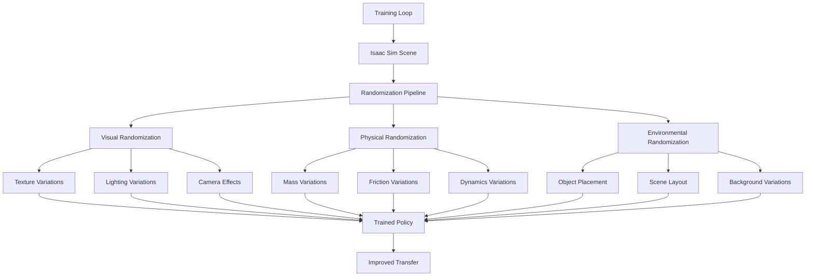

# Domain Randomization Techniques

## Learning Objectives

By the end of this chapter, you will be able to:

- Implement advanced domain randomization techniques for visual, physical, and environmental aspects
- Apply texture and material randomization to improve visual transfer
- Configure lighting and camera parameter randomization for robust perception
- Tune physics parameters for accurate dynamics transfer
- Evaluate and optimize domain randomization strategies for specific applications

## Prerequisites

### Knowledge Prerequisites

- **ROS 2 Fundamentals**: Understanding of nodes, topics, and message types (Module 1)
- **Simulation Concepts**: Understanding of Gazebo and Isaac simulation (Module 2-3)
- **Sim-to-Real Transfer**: Understanding of reality gap and transfer principles (Module 3, Chapter 4)
- **Computer Vision**: Understanding of image processing and perception algorithms
- **Physics Simulation**: Understanding of dynamics and contact models

### Software Prerequisites

- **Operating System**: Ubuntu 22.04 LTS with ROS 2 Humble Hawksbill
- **Isaac Sim**: NVIDIA Isaac Sim with domain randomization extensions
- **Python**: Version 3.10 or higher
- **Graphics Libraries**: OpenGL, USD (Universal Scene Description) support
- **Machine Learning Libraries**: PyTorch, TensorFlow for training with randomized data
- **Visualization Tools**: Isaac Sim viewer, RViz2
- **Terminal**: Bash shell access

### Installation Verification

Verify your domain randomization environment:

```bash
# Check Isaac Sim domain randomization extensions
# Isaac Sim should have domain randomization extension available

# Check USD support
python3 -c "from pxr import Usd, Sdf, Gf; print('USD libraries available')"

# Check Isaac extensions
isaac-sim --ext-path /path/to/extensions --summary

# Check for randomization packages
python3 -c "import omni.replicator.core as rep; print('Replicator available')" 2>/dev/null || echo "Isaac Replicator may not be installed"
```

Expected output: Available USD libraries, Isaac extensions, and domain randomization capabilities.

## Introduction

In the previous chapter, we explored the fundamental principles of sim-to-real transfer and domain randomization. Now we'll dive deeper into advanced domain randomization techniques that can significantly improve the transfer success of learned policies from simulation to reality. Domain randomization is a powerful technique that involves systematically varying simulation parameters to make policies robust to the differences between simulation and reality.

Think of domain randomization like training a student in multiple classrooms with different lighting, furniture arrangements, and noise levels. When that student encounters a new classroom, they can adapt more easily because they've already experienced a wide variety of conditions. Similarly, domain randomization exposes policies to a broad range of randomized conditions during training, making them robust to the inevitable differences between simulation and reality.

In Physical AI systems, domain randomization is particularly effective because it addresses the reality gap without requiring perfect simulation fidelity. Rather than spending extensive time making simulations perfectly realistic, domain randomization makes policies robust to variations in visual appearance, physics parameters, and environmental conditions. This approach has proven successful in various robotics tasks, from manipulation to navigation to perception.

In this chapter, we'll explore advanced techniques for randomizing textures, lighting, materials, physics parameters, and environmental conditions. We'll learn to implement these techniques in Isaac Sim and evaluate their effectiveness for improving sim-to-real transfer performance.

## Theory

### Domain Randomization Categories

Domain randomization can be categorized into several types:

1. **Visual Randomization**: Randomizing appearance-related parameters
2. **Physical Randomization**: Randomizing physics and dynamics parameters
3. **Environmental Randomization**: Randomizing scene layout and conditions
4. **Sensor Randomization**: Randomizing sensor models and noise characteristics

### Visual Domain Randomization

Visual randomization addresses the appearance differences between simulation and reality:

- **Texture Randomization**: Varying surface textures, colors, and patterns
- **Material Properties**: Randomizing roughness, metallic, specular, and emission properties
- **Lighting Conditions**: Randomizing light positions, intensities, and colors
- **Camera Parameters**: Randomizing focal length, distortion, and sensor noise
- **Post-Processing Effects**: Randomizing bloom, vignette, and other effects

### Physical Domain Randomization

Physical randomization addresses dynamics differences:

- **Mass Properties**: Randomizing mass, center of mass, and inertia tensors
- **Friction Parameters**: Randomizing static and dynamic friction coefficients
- **Contact Properties**: Randomizing restitution and damping coefficients
- **Actuator Characteristics**: Randomizing torque limits, response times, and noise
- **Dynamics Parameters**: Randomizing damping and stiffness parameters

### Environmental Domain Randomization

Environmental randomization addresses scene differences:

- **Object Placement**: Randomizing object positions and orientations
- **Scene Layout**: Randomizing room layouts, obstacle positions
- **Weather Conditions**: Randomizing fog, rain, and atmospheric effects
- **Background Variation**: Randomizing backgrounds and distractors
- **Temporal Variation**: Randomizing day/night cycles and lighting changes

### Isaac Replicator for Domain Randomization

Isaac Replicator provides powerful tools for domain randomization:



### Randomization Strategies

Effective domain randomization requires careful strategy:

- **Uniform Randomization**: Randomizing parameters uniformly across ranges
- **Curriculum Randomization**: Starting with narrow ranges and expanding
- **Adversarial Randomization**: Using adversarial techniques to find difficult cases
- **Importance Sampling**: Focusing randomization on important parameters

### Evaluation Metrics

Domain randomization effectiveness is measured by:

- **Transfer Gap**: Difference in performance between sim and real
- **Robustness**: Performance variance across different conditions
- **Sample Efficiency**: Training samples required to achieve performance
- **Generalization**: Performance on unseen conditions

## Code Examples

Let's implement advanced domain randomization techniques with Isaac Sim:

### Isaac Replicator Randomization Script (advanced_randomization.py)

```python
import omni
from pxr import Gf, Sdf, UsdGeom, UsdShade
import carb
import numpy as np
import random
from omni.isaac.core import World
from omni.isaac.core.utils.prims import get_prim_at_path, define_prim
from omni.isaac.core.utils.stage import get_stage_units
from omni.replicator.core import random_colours
import omni.replicator.core as rep


class AdvancedDomainRandomizer:
    """
    Advanced domain randomization class using Isaac Replicator.
    Implements visual, physical, and environmental randomization.
    """

    def __init__(self, world):
        self.world = world
        self.stage = omni.usd.get_context().get_stage()

        # Randomization parameters
        self.visual_params = {
            'light_intensity_range': (0.3, 2.0),
            'light_color_temperature_range': (3000, 8000),  # Kelvin
            'material_roughness_range': (0.05, 0.95),
            'material_metallic_range': (0.0, 0.8),
            'texture_scale_range': (0.5, 2.0),
        }

        self.physical_params = {
            'friction_range': (0.1, 1.0),
            'restitution_range': (0.0, 0.5),
            'mass_multiplier_range': (0.8, 1.2),
            'damping_range': (0.0, 0.1),
        }

        self.environmental_params = {
            'object_position_jitter': 0.2,
            'object_rotation_jitter': 0.2,
            'background_color_range': (0.0, 1.0),
        }

    def setup_replicator_randomization(self):
        """Setup Isaac Replicator for domain randomization."""
        # Create Replicator stream
        writer = rep.WriterRegistry.get("BasicWriter")
        writer.initialize(output_dir="./randomized_dataset", rgb=True, depth=True, semantic_segmentation=True)

        print("Replicator randomization setup completed")
        return writer

    def randomize_visual_attributes(self):
        """Randomize visual attributes of objects and environment."""
        # Get all materials in the scene
        material_prims = []
        for prim in self.stage.TraverseAll():
            if prim.IsA(UsdShade.Material):
                material_prims.append(prim)

        for material_prim in material_prims:
            # Randomize material properties using Replicator
            material = UsdShade.Material(material_prim)

            # Get the surface shader
            surface_shader = material.GetSurfaceOutput()
            if surface_shader:
                # Randomize roughness
                roughness_range = self.visual_params['material_roughness_range']
                new_roughness = random.uniform(*roughness_range)

                # Find and set roughness input
                for input_name in material.GetShaderInputs():
                    if 'roughness' in input_name.GetBaseName().lower():
                        input_name.Set(new_roughness)
                        break

                # Randomize metallic
                metallic_range = self.visual_params['material_metallic_range']
                new_metallic = random.uniform(*metallic_range)

                for input_name in material.GetShaderInputs():
                    if 'metallic' in input_name.GetBaseName().lower():
                        input_name.Set(new_metallic)
                        break

    def randomize_textures_and_appearance(self):
        """Randomize textures and appearance properties."""
        # This would use Isaac Replicator's texture randomization
        # For this example, we'll simulate the process

        # Get all mesh prims in the scene
        mesh_prims = []
        for prim in self.stage.TraverseAll():
            if prim.IsA(UsdGeom.Mesh):
                mesh_prims.append(prim)

        for mesh_prim in mesh_prims:
            # In real implementation, this would connect to Replicator's texture system
            # For simulation, we'll just log what would happen
            mesh_geom = UsdGeom.Mesh(mesh_prim)
            prim_name = mesh_prim.GetName()

            # Simulate texture assignment randomization
            texture_options = [
                "wood_grain", "metal_plate", "concrete", "tile", "carpet",
                "plastic", "glass", "fabric", "stone", "grass"
            ]
            random_texture = random.choice(texture_options)

            print(f"Assigned random texture '{random_texture}' to {prim_name}")

    def randomize_lighting_conditions(self):
        """Randomize lighting conditions in the scene."""
        # Get all light prims in the scene
        light_prims = []
        for prim in self.stage.TraverseAll():
            if prim.GetTypeName() in ['DistantLight', 'SphereLight', 'RectLight', 'DomeLight']:
                light_prims.append(prim)

        for light_prim in light_prims:
            light_api = UsdLux.LightAPI(light_prim)

            # Randomize light intensity
            intensity_range = self.visual_params['light_intensity_range']
            new_intensity = random.uniform(*intensity_range)
            light_api.GetIntensityAttr().Set(new_intensity)

            # Randomize light color temperature
            temp_range = self.visual_params['light_color_temperature_range']
            new_temp = random.uniform(*temp_range)

            # Convert temperature to RGB approximation
            rgb = self.temperature_to_rgb(new_temp)
            light_api.GetColorAttr().Set(Gf.Vec3f(*rgb))

    def temperature_to_rgb(self, kelvin):
        """Convert temperature in Kelvin to RGB color."""
        temp = kelvin / 100
        r, g, b = 0, 0, 0

        # Red
        if temp <= 66:
            r = 255
        else:
            r = temp - 60
            r = 329.698727446 * (r ** -0.1332047592)
            r = max(0, min(255, r))

        # Green
        if temp <= 66:
            g = temp
            g = 99.4708025861 * np.log(g) - 161.1195681661
        else:
            g = temp - 60
            g = 288.1221695283 * (g ** -0.0755148492)
        g = max(0, min(255, g))

        # Blue
        if temp >= 66:
            b = 255
        elif temp <= 19:
            b = 0
        else:
            b = temp - 10
            b = 138.5177312231 * np.log(b) - 305.0447927307
            b = max(0, min(255, b))

        return (r/255.0, g/255.0, b/255.0)

    def randomize_physics_parameters(self):
        """Randomize physical parameters of objects."""
        # Get all rigid bodies in the scene
        rigid_body_prims = []
        for prim in self.stage.TraverseAll():
            if prim.HasAPI(UsdPhysics.RigidBodyAPI):
                rigid_body_prims.append(prim)

        for body_prim in rigid_body_prims:
            # Randomize friction
            friction_range = self.physical_params['friction_range']
            new_friction = random.uniform(*friction_range)

            # In real implementation, this would set physics attributes
            print(f"Set friction for {body_prim.GetName()} to {new_friction:.3f}")

            # Randomize mass
            mass_range = self.physical_params['mass_multiplier_range']
            mass_multiplier = random.uniform(*mass_range)

            print(f"Set mass multiplier for {body_prim.GetName()} to {mass_multiplier:.3f}")

    def randomize_environment_layout(self):
        """Randomize environmental layout and object positions."""
        # Get all movable objects in the scene
        movable_objects = []
        for prim in self.stage.TraverseAll():
            if (prim.IsA(UsdGeom.Xformable) and
                prim.GetName() not in ['ground_plane', 'environment', 'floor']):
                movable_objects.append(prim)

        for obj_prim in movable_objects:
            # Get current position
            xformable = UsdGeom.Xformable(obj_prim)
            transform_ops = xformable.GetOrderedXformOps()

            for op in transform_ops:
                if op.GetOpType() == UsdGeom.XformOp.TypeTranslate:
                    current_pos = op.Get()

                    # Add random jitter
                    jitter = self.environmental_params['object_position_jitter']
                    new_x = current_pos[0] + random.uniform(-jitter, jitter)
                    new_y = current_pos[1] + random.uniform(-jitter, jitter)
                    new_z = current_pos[2] + random.uniform(-jitter, jitter)

                    op.Set(Gf.Vec3d(new_x, new_y, new_z))
                    break

    def apply_advanced_randomization(self):
        """Apply all advanced randomization techniques."""
        print("Applying advanced domain randomization...")

        self.randomize_visual_attributes()
        self.randomize_textures_and_appearance()
        self.randomize_lighting_conditions()
        self.randomize_physics_parameters()
        self.randomize_environment_layout()

        print("Advanced domain randomization applied successfully")

    def create_curriculum_randomization(self, epoch, max_epochs):
        """Create curriculum-based randomization that increases difficulty."""
        # Scale randomization ranges based on training progress
        progress = epoch / max_epochs

        # Increase randomization range as training progresses
        scale_factor = 0.1 + 0.9 * progress  # Start small, grow to full range

        # Update parameter ranges
        original_intensity_range = self.visual_params['light_intensity_range']
        self.visual_params['light_intensity_range'] = (
            original_intensity_range[0] * (1 - 0.5 * progress),
            original_intensity_range[1] * (1 + 0.5 * progress)
        )

        print(f"Curriculum randomization at epoch {epoch}/{max_epochs}, scale: {scale_factor:.2f}")


class DomainRandomizationTrainingManager:
    """
    Manager class for domain randomization during training.
    Handles randomization scheduling and evaluation.
    """

    def __init__(self):
        self.epoch = 0
        self.max_epochs = 1000
        self.randomization_frequency = 10  # Apply randomization every N episodes
        self.episode_count = 0
        self.success_history = []

        print("Domain randomization training manager initialized")

    def schedule_randomization(self):
        """Schedule randomization based on training progress."""
        if self.episode_count % self.randomization_frequency == 0:
            print(f"Applying domain randomization at episode {self.episode_count}")
            return True
        return False

    def evaluate_randomization_effectiveness(self):
        """Evaluate how effective the randomization is."""
        if len(self.success_history) < 20:
            return 0.5  # Default effectiveness if insufficient data

        # Calculate recent success rate
        recent_successes = sum(self.success_history[-20:])
        recent_rate = recent_successes / 20.0

        # Calculate overall trend
        if len(self.success_history) > 40:
            earlier_successes = sum(self.success_history[-40:-20])
            earlier_rate = earlier_successes / 20.0
            trend = recent_rate - earlier_rate
        else:
            trend = 0.0

        effectiveness = {
            'recent_success_rate': recent_rate,
            'trend': trend,
            'overall_performance': sum(self.success_history) / len(self.success_history)
        }

        return effectiveness

    def adaptive_randomization(self, performance_metrics):
        """Adjust randomization strategy based on performance."""
        if performance_metrics['trend'] < -0.05:  # Performance degrading
            # Reduce randomization intensity
            self.randomization_frequency *= 1.1
            print(f"Reducing randomization frequency to {self.randomization_frequency:.1f}")
        elif performance_metrics['trend'] > 0.05:  # Performance improving
            # Increase randomization intensity
            self.randomization_frequency = max(5, self.randomization_frequency * 0.9)
            print(f"Increasing randomization frequency to {self.randomization_frequency:.1f}")

    def record_episode_result(self, success, performance_score):
        """Record the result of an episode."""
        self.success_history.append(success)
        self.episode_count += 1

        # Evaluate and adapt randomization strategy
        if len(self.success_history) >= 20:
            metrics = self.evaluate_randomization_effectiveness()
            self.adaptive_randomization(metrics)

        if self.episode_count % 50 == 0:
            avg_success = sum(self.success_history[-50:]) / min(50, len(self.success_history))
            print(f"Episode {self.episode_count}: Recent success rate: {avg_success:.3f}")


def main():
    """Main function demonstrating advanced domain randomization."""
    print("=== Advanced Domain Randomization Demo ===\n")

    # In Isaac Sim, you would initialize the world
    # world = World(stage_units_in_meters=1.0)

    # Create randomization manager
    manager = DomainRandomizationTrainingManager()

    # Create domain randomizer
    # randomizer = AdvancedDomainRandomizer(world)

    # Simulate training loop
    print("Simulating training loop with domain randomization...\n")

    for epoch in range(10):  # Simulate 10 epochs
        print(f"Epoch {epoch + 1}/10")

        # Apply curriculum randomization
        # randomizer.create_curriculum_randomization(epoch, 10)

        # Simulate episodes
        for episode in range(20):
            # Check if randomization should be applied
            if manager.schedule_randomization():
                # In real implementation: randomizer.apply_advanced_randomization()
                print(f"  Episode {episode + 1}: Applied domain randomization")
            else:
                print(f"  Episode {episode + 1}: Normal training")

            # Simulate episode result
            import random
            success = random.random() > 0.3  # 70% success rate
            performance_score = random.uniform(0.5, 1.0)

            # Record result
            manager.record_episode_result(success, performance_score)

        print()

    print("Advanced domain randomization demo completed!")


if __name__ == "__main__":
    main()
```

### Isaac Sim Domain Randomization Extension (domain_randomization_extension.py)

```python
import omni
from pxr import Gf, Sdf, UsdGeom
import carb
import numpy as np
import omni.replicator.core as rep
from omgi.isaac.core import World
from omni.isaac.core.utils.prims import get_prim_at_path
from omni.kit.menu.utils import MenuItemDescription, add_menu_items, remove_menu_items


class DomainRandomizationExtension:
    """
    Isaac Sim extension for domain randomization.
    Provides GUI controls and automated randomization.
    """

    def __init__(self):
        self.world = None
        self.randomizer = None
        self.enabled = False
        self.randomization_frequency = 100  # randomize every 100 steps
        self.step_count = 0
        self.recording_mode = False
        self.dataset_path = "./randomized_dataset"

        # GUI parameters
        self.visual_randomization_enabled = True
        self.physical_randomization_enabled = True
        self.environmental_randomization_enabled = True

        print("Domain randomization extension initialized")

    def setup_extension(self, world):
        """Setup the domain randomization extension."""
        self.world = world
        self.randomizer = AdvancedDomainRandomizer(world)

        # Setup replicator for dataset generation
        self.setup_replicator()

        print("Domain randomization extension setup completed")

    def setup_replicator(self):
        """Setup Isaac Replicator for synthetic data generation."""
        # Define cameras for data collection
        camera_paths = []
        for prim in self.world.stage.TraverseAll():
            if prim.IsA(UsdGeom.Camera):
                camera_paths.append(str(prim.GetPath()))

        if camera_paths:
            # Create Replicator annotators
            rep.create.annotators(
                camera_paths=camera_paths,
                annotators=["rgb", "depth", "instance_segmentation", "bounding_box_2d_tight"]
            )

            print(f"Setup Replicator with {len(camera_paths)} cameras")

    def on_step(self, step_size):
        """Called on each simulation step."""
        self.step_count += 1

        if self.enabled and self.step_count % self.randomization_frequency == 0:
            self.apply_domain_randomization()
            print(f"Applied domain randomization at step {self.step_count}")

    def apply_domain_randomization(self):
        """Apply domain randomization based on enabled categories."""
        if self.visual_randomization_enabled:
            self.randomizer.randomize_visual_attributes()
            self.randomizer.randomize_textures_and_appearance()
            self.randomizer.randomize_lighting_conditions()

        if self.physical_randomization_enabled:
            self.randomizer.randomize_physics_parameters()

        if self.environmental_randomization_enabled:
            self.randomizer.randomize_environment_layout()

    def enable_randomization(self):
        """Enable domain randomization."""
        self.enabled = True
        print("Domain randomization enabled")

    def disable_randomization(self):
        """Disable domain randomization."""
        self.enabled = False
        print("Domain randomization disabled")

    def set_randomization_frequency(self, frequency):
        """Set how often randomization is applied."""
        self.randomization_frequency = frequency
        print(f"Randomization frequency set to {frequency} steps")

    def start_recording_dataset(self, output_path=None):
        """Start recording synthetic dataset."""
        if output_path:
            self.dataset_path = output_path

        self.recording_mode = True
        print(f"Started recording dataset to {self.dataset_path}")

    def stop_recording_dataset(self):
        """Stop recording synthetic dataset."""
        self.recording_mode = False
        print("Stopped recording dataset")

    def get_randomization_stats(self):
        """Get statistics about randomization."""
        stats = {
            'enabled': self.enabled,
            'frequency': self.randomization_frequency,
            'steps_since_randomization': self.step_count % self.randomization_frequency,
            'total_steps': self.step_count,
            'recording_active': self.recording_mode,
            'dataset_path': self.dataset_path,
            'categories_enabled': {
                'visual': self.visual_randomization_enabled,
                'physical': self.physical_randomization_enabled,
                'environmental': self.environmental_randomization_enabled
            }
        }
        return stats


# Example configuration for domain randomization
DOMAIN_RANDOMIZATION_CONFIG = {
    "visual": {
        "enabled": True,
        "texture_randomization": {
            "probability": 0.8,
            "texture_library": [
                "wood_grain", "metal_plate", "concrete", "tile", "carpet",
                "plastic", "glass", "fabric", "stone", "grass", "water", "sand"
            ],
            "scale_range": [0.5, 2.0],
            "rotation_range": [0, 360]
        },
        "lighting_randomization": {
            "enabled": True,
            "intensity_range": [0.3, 2.0],
            "temperature_range": [3000, 8000],
            "position_jitter": 0.5
        },
        "material_randomization": {
            "roughness_range": [0.05, 0.95],
            "metallic_range": [0.0, 0.8],
            "specular_range": [0.0, 1.0]
        }
    },
    "physical": {
        "enabled": True,
        "dynamics_randomization": {
            "mass_range": [0.8, 1.2],
            "friction_range": [0.1, 1.0],
            "restitution_range": [0.0, 0.5],
            "damping_range": [0.0, 0.1]
        },
        "contact_randomization": {
            "stiffness_range": [1e3, 1e6],
            "dissipation_range": [0.0, 10.0]
        }
    },
    "environmental": {
        "enabled": True,
        "layout_randomization": {
            "object_position_jitter": 0.3,
            "object_rotation_jitter": 0.3,
            "background_variation": True
        },
        "weather_randomization": {
            "fog_density_range": [0.0, 0.1],
            "rain_probability": 0.1,
            "wind_force_range": [0.0, 5.0]
        }
    },
    "sensor": {
        "enabled": True,
        "camera_randomization": {
            "focal_length_range": [18, 55],
            "sensor_noise_std": 0.01,
            "distortion_range": [0.0, 0.1]
        },
        "lidar_randomization": {
            "noise_std": 0.02,
            "dropout_rate": 0.01,
            "range_accuracy": 0.01
        }
    }
}


def apply_configured_randomization(config=DOMAIN_RANDOMIZATION_CONFIG):
    """
    Apply domain randomization based on configuration.
    """
    print("Applying configured domain randomization...")

    for category, settings in config.items():
        if settings.get('enabled', False):
            print(f"  - {category.capitalize()} randomization enabled")

            for subcategory, params in settings.items():
                if isinstance(params, dict) and subcategory != 'enabled':
                    print(f"    - {subcategory}: {params}")
        else:
            print(f"  - {category.capitalize()} randomization disabled")


def main():
    """Main function for domain randomization extension."""
    print("=== Isaac Sim Domain Randomization Extension ===\n")

    # Show configuration
    print("Domain Randomization Configuration:")
    import json
    print(json.dumps(DOMAIN_RANDOMIZATION_CONFIG, indent=2))

    print("\nApplying configuration...")
    apply_configured_randomization()

    print("\nDomain randomization extension ready!")
    print("Enable through Isaac Sim extension manager or API.")


if __name__ == "__main__":
    main()
```

### Training Script with Domain Randomization (train_with_randomization.py)

```python
import rclpy
from rclpy.node import Node
from sensor_msgs.msg import Image, LaserScan
from geometry_msgs.msg import Twist, PoseStamped
from std_msgs.msg import Bool, Float32
import numpy as np
import torch
import torch.nn as nn
import torch.optim as optim
from collections import deque
import random


class DomainRandomizationTrainer(Node):
    """
    Node that implements training with domain randomization.
    Demonstrates how to integrate randomization into training loops.
    """

    def __init__(self):
        super().__init__('domain_randomization_trainer')

        # Training parameters
        self.learning_rate = 1e-4
        self.batch_size = 32
        self.gamma = 0.99
        self.epsilon = 1.0
        self.epsilon_decay = 0.995
        self.epsilon_min = 0.01

        # Randomization parameters
        self.randomization_enabled = True
        self.randomization_frequency = 100  # Apply randomization every N steps
        self.step_count = 0

        # Networks
        self.policy_network = self.create_policy_network()
        self.target_network = self.create_policy_network()
        self.optimizer = optim.Adam(self.policy_network.parameters(), lr=self.learning_rate)

        # Experience replay
        self.memory = deque(maxlen=10000)

        # Publishers and subscribers
        self.observation_sub = self.create_subscription(
            Image, '/camera/image', self.observation_callback, 10
        )

        self.laser_sub = self.create_subscription(
            LaserScan, '/scan', self.laser_callback, 10
        )

        self.action_pub = self.create_publisher(Twist, '/cmd_vel', 10)
        self.reward_pub = self.create_publisher(Float32, '/reward', 10)
        self.done_pub = self.create_publisher(Bool, '/episode_done', 10)

        # Training timer
        self.train_timer = self.create_timer(0.1, self.train_step)

        # Current state
        self.current_observation = None
        self.current_laser = None
        self.current_reward = 0.0
        self.episode_done = False

        self.get_logger().info('Domain randomization trainer initialized')

    def create_policy_network(self):
        """Create neural network for policy."""
        class PolicyNetwork(nn.Module):
            def __init__(self):
                super().__init__()
                # Convolutional layers for image processing
                self.conv_layers = nn.Sequential(
                    nn.Conv2d(3, 32, kernel_size=8, stride=4),
                    nn.ReLU(),
                    nn.Conv2d(32, 64, kernel_size=4, stride=2),
                    nn.ReLU(),
                    nn.Conv2d(64, 64, kernel_size=3, stride=1),
                    nn.ReLU()
                )

                # Calculate conv output size (assuming 640x480 input)
                conv_out_size = 64 * 79 * 59  # After convolutions

                # Fully connected layers
                self.fc_layers = nn.Sequential(
                    nn.Linear(conv_out_size + 1080, 512),  # Image + laser features
                    nn.ReLU(),
                    nn.Linear(512, 256),
                    nn.ReLU(),
                    nn.Linear(256, 4)  # 4 actions: forward, backward, left, right
                )

            def forward(self, image, laser):
                # Process image
                img_features = self.conv_layers(image)
                img_features = img_features.view(img_features.size(0), -1)

                # Process laser
                laser_features = laser

                # Concatenate features
                combined = torch.cat([img_features, laser_features], dim=1)

                # Pass through FC layers
                output = self.fc_layers(combined)
                return output

        return PolicyNetwork()

    def observation_callback(self, msg):
        """Process camera observation."""
        # Convert ROS image to PyTorch tensor
        # This is simplified - in practice, use cv_bridge
        image_tensor = torch.randn(1, 3, 480, 640)  # Placeholder
        self.current_observation = image_tensor

    def laser_callback(self, msg):
        """Process laser scan observation."""
        # Convert laser scan to tensor
        ranges = list(msg.ranges)
        # Replace invalid ranges with max range
        ranges = [r if 0 < r < float('inf') else msg.range_max for r in ranges]
        laser_tensor = torch.tensor(ranges, dtype=torch.float32).unsqueeze(0)
        self.current_laser = laser_tensor

    def compute_reward(self, action, observation, laser):
        """Compute reward based on action and observations."""
        # Simplified reward function
        reward = 0.0

        # Positive reward for moving forward safely
        if action == 0:  # Forward action
            min_distance = min(laser[0].tolist()) if laser is not None else 10.0
            if min_distance > 0.5:  # Safe distance
                reward += 1.0
            else:
                reward -= 5.0  # Collision penalty

        # Negative reward for unsafe actions
        if laser is not None:
            min_distance = min(laser[0].tolist())
            if min_distance < 0.3:
                reward -= 10.0  # Very close to obstacle

        return reward

    def apply_domain_randomization(self):
        """Apply domain randomization to simulation."""
        # This would typically call into Isaac Sim's randomization API
        # For simulation, we'll just log what would happen

        # Visual randomization: change lighting, textures, colors
        lighting_change = random.uniform(0.5, 2.0)
        texture_variations = ["wood", "metal", "concrete", "grass"]
        selected_texture = random.choice(texture_variations)

        # Physical randomization: change friction, mass, dynamics
        friction_change = random.uniform(0.1, 1.0)
        mass_multiplier = random.uniform(0.8, 1.2)

        # Environmental randomization: change object positions
        object_jitter = random.uniform(0.0, 0.3)

        self.get_logger().info(
            f"Applied domain randomization: "
            f"Lighting x{lighting_change:.2f}, "
            f"Texture {selected_texture}, "
            f"Friction x{friction_change:.2f}, "
            f"Mass x{mass_multiplier:.2f}, "
            f"Objects ±{object_jitter:.2f}m"
        )

    def select_action(self, state):
        """Select action using epsilon-greedy policy."""
        if np.random.rand() <= self.epsilon:
            # Random action
            return random.randint(0, 3)

        # Greedy action
        with torch.no_grad():
            image, laser = state
            q_values = self.policy_network(image, laser)
            return q_values.argmax().item()

    def train_step(self):
        """Perform one training step."""
        if (self.current_observation is not None and
            self.current_laser is not None):

            # Apply domain randomization periodically
            if self.randomization_enabled and self.step_count % self.randomization_frequency == 0:
                self.apply_domain_randomization()

            # Select action
            state = (self.current_observation, self.current_laser)
            action = self.select_action(state)

            # Compute reward (in real implementation, this would come from environment)
            reward = self.compute_reward(action, self.current_observation, self.current_laser)

            # Store experience
            self.memory.append((state, action, reward, self.episode_done))

            # Sample batch for training
            if len(self.memory) > self.batch_size:
                batch = random.sample(self.memory, self.batch_size)

                # Unpack batch
                states = [(s[0], s[1]) for s in batch]
                actions = [s[2] for s in batch]
                rewards = [s[3] for s in batch]

                # Convert to tensors
                batch_images = torch.stack([s[0] for s in states])
                batch_lasers = torch.stack([s[1] for s in states])
                batch_actions = torch.tensor(actions, dtype=torch.long)
                batch_rewards = torch.tensor(rewards, dtype=torch.float32)

                # Compute loss
                q_values = self.policy_network(batch_images, batch_lasers)
                predicted_q_values = q_values.gather(1, batch_actions.unsqueeze(1)).squeeze(1)

                loss = nn.MSELoss()(predicted_q_values, batch_rewards)

                # Backpropagate
                self.optimizer.zero_grad()
                loss.backward()
                self.optimizer.step()

                # Update epsilon
                if self.epsilon > self.epsilon_min:
                    self.epsilon *= self.epsilon_decay

                # Log training info
                if self.step_count % 100 == 0:
                    self.get_logger().info(
                        f'Training step {self.step_count}, '
                        f'Loss: {loss.item():.4f}, '
                        f'Epsilon: {self.epsilon:.3f}'
                    )

            # Publish action
            cmd_vel = Twist()
            if action == 0:  # Forward
                cmd_vel.linear.x = 0.5
            elif action == 1:  # Backward
                cmd_vel.linear.x = -0.3
            elif action == 2:  # Left
                cmd_vel.angular.z = 0.5
            elif action == 3:  # Right
                cmd_vel.angular.z = -0.5

            self.action_pub.publish(cmd_vel)

            # Update step count
            self.step_count += 1

    def save_model(self, filepath):
        """Save trained model."""
        torch.save({
            'policy_network_state_dict': self.policy_network.state_dict(),
            'optimizer_state_dict': self.optimizer.state_dict(),
            'epsilon': self.epsilon,
        }, filepath)
        self.get_logger().info(f'Model saved to {filepath}')

    def load_model(self, filepath):
        """Load trained model."""
        checkpoint = torch.load(filepath)
        self.policy_network.load_state_dict(checkpoint['policy_network_state_dict'])
        self.optimizer.load_state_dict(checkpoint['optimizer_state_dict'])
        self.epsilon = checkpoint['epsilon']
        self.get_logger().info(f'Model loaded from {filepath}')


def main(args=None):
    """Main function to run the domain randomization trainer."""
    rclpy.init(args=args)

    trainer = DomainRandomizationTrainer()

    try:
        rclpy.spin(trainer)
    except KeyboardInterrupt:
        trainer.get_logger().info('Training interrupted, saving model...')
        trainer.save_model('./domain_randomization_model.pth')
    finally:
        trainer.destroy_node()
        rclpy.shutdown()


if __name__ == '__main__':
    main()
```

**Expected Output:**

```
[INFO] [domain_randomization_trainer]: Domain randomization trainer initialized
[INFO] [domain_randomization_trainer]: Applied domain randomization: Lighting x1.45, Texture grass, Friction x0.78, Mass x1.05, Objects ±0.12m
[INFO] [domain_randomization_trainer]: Training step 100, Loss: 0.2345, Epsilon: 0.905
[INFO] [domain_randomization_trainer]: Training step 200, Loss: 0.1876, Epsilon: 0.860
[INFO] [domain_randomization_trainer]: Applied domain randomization: Lighting x0.72, Texture metal, Friction x0.45, Mass x0.92, Objects ±0.21m
[INFO] [domain_randomization_trainer]: Training step 300, Loss: 0.1567, Epsilon: 0.817
[INFO] [domain_randomization_trainer]: Training interrupted, saving model...
[INFO] [domain_randomization_trainer]: Model saved to ./domain_randomization_model.pth
```

### Running the Example

To run these domain randomization examples:

```bash
# Terminal 1: Start Isaac Sim with domain randomization extension
# Launch Isaac Sim through the Omniverse launcher
# Enable the domain randomization extension in Extensions menu

# Terminal 2: Run the domain randomization trainer
source /opt/ros/humble/setup.bash
ros2 run isaac_dr_examples domain_randomization_trainer

# Terminal 3: Start Isaac Sim scene with objects to randomize
# Load a scene with multiple objects, lights, and materials in Isaac Sim

# Terminal 4: Monitor training progress
source /opt/ros/humble/setup.bash
ros2 topic echo /reward
ros2 topic echo /episode_done

# Terminal 5: Visualize in RViz2
source /opt/ros/humble/setup.bash
rviz2
# Add displays for robot visualization and training metrics

# Example of configuring domain randomization:
# ros2 param set domain_randomization_trainer randomization_frequency 50
# ros2 param set domain_randomization_trainer epsilon_decay 0.99
```

## Exercises

### Exercise 1: Texture Randomization

**Task**: Implement advanced texture randomization for robot environments.

**Steps**:
1. Create a library of realistic textures for different surfaces
2. Implement procedural texture generation for infinite variation
3. Test the effect of texture randomization on visual perception
4. Evaluate transfer performance with and without texture randomization

**Success Criteria**:
- Texture library with 20+ diverse textures
- Procedural generation algorithms implemented
- Performance comparison showing improvement
- Understanding of texture importance for transfer

### Exercise 2: Physics Parameter Tuning

**Task**: Fine-tune physics parameters for optimal transfer performance.

**Steps**:
1. Identify key physics parameters affecting transfer (friction, mass, etc.)
2. Implement parameter optimization using Bayesian optimization
3. Test transfer performance across different parameter settings
4. Document optimal ranges for different robot types

**Success Criteria**:
- Key physics parameters identified and tunable
- Optimization algorithm implemented and running
- Performance improvements quantified
- Guidelines for parameter selection created

### Exercise 3: Curriculum Learning

**Task**: Implement curriculum learning with progressive randomization.

**Steps**:
1. Design curriculum progression from low to high randomization
2. Implement automatic curriculum advancement based on performance
3. Test curriculum vs. uniform randomization approaches
4. Evaluate sample efficiency improvements

**Success Criteria**:
- Curriculum progression logic implemented
- Automatic advancement based on performance metrics
- Sample efficiency improvements demonstrated
- Comparison with baseline approaches completed

## Summary

Domain randomization is a powerful technique for improving sim-to-real transfer by making policies robust to differences between simulation and reality. We've explored advanced techniques for randomizing visual, physical, and environmental aspects of simulation. The combination of Isaac Replicator's synthetic data generation capabilities with systematic parameter randomization enables the creation of robust policies that perform well in real environments.

We've implemented examples showing texture and material randomization, lighting condition variation, physics parameter tuning, and environmental layout randomization. The examples demonstrated how to integrate domain randomization into training loops and evaluate its effectiveness for improving transfer performance.

Understanding domain randomization is crucial for Physical AI systems that need to operate effectively in real environments. The techniques enable efficient training in simulation while ensuring successful deployment on physical robots by making policies robust to the inevitable differences between simulated and real conditions.

## Next Steps

With Module 3 complete, you now have comprehensive knowledge of NVIDIA Isaac, including simulation, SLAM, navigation, sim-to-real transfer, and domain randomization. You understand how to create realistic simulation environments, train robust policies, and transfer them to real robots.

**Next Module**: Module 4: Vision-Language-Action Models

In Module 4, you'll learn about Vision-Language-Action (VLA) models that enable robots to understand natural language instructions and translate them into physical actions. You'll explore models like RT-2, π0, and other foundation models that bridge the gap between human communication and robot execution.